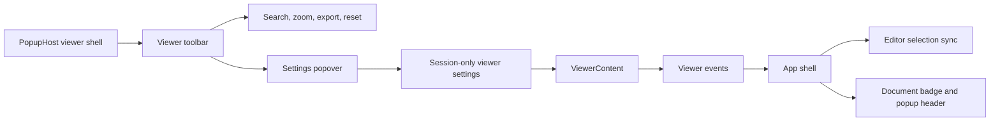
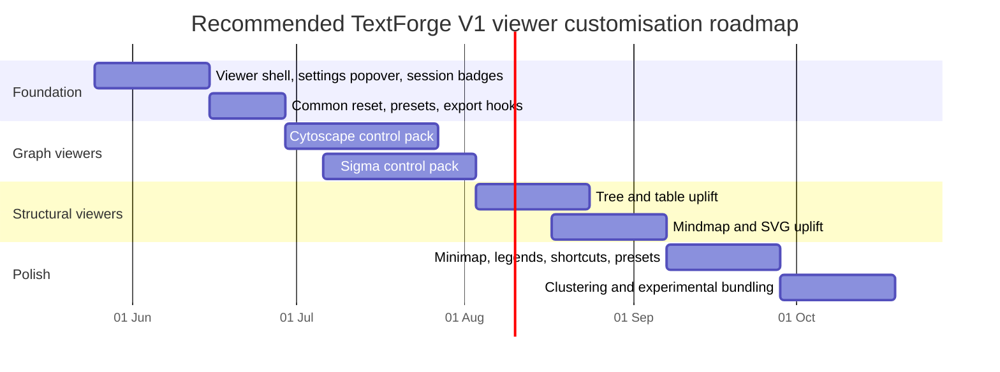

# TextForge V1 Viewer Customisation Research

## Executive summary

TextForge V1 already has the full *family* of viewers you asked about: HTML, SVG, tree, table, mindmap, Cytoscape graph, Sigma/Graphology graph, plus “visual editor” shells. The important finding is that the platform has **real rendering breadth** but a **thin control surface**. The plugin capability model currently exposes only six booleans (`zoom`, `pan`, `search`, `filter`, `fold`, `inspect`), while the popup UI itself only standardises zoom controls and a search box. In practice, HTML and SVG advertise search without consuming the search query, Cytoscape is hard-wired to a single `breadthfirst` layout, Sigma seeds nodes on a circle, tree/table/mindmap are mostly presentational DOM renderers, and the “visual editors” are explicitly read-only skeletons. citeturn23view0turn10view0turn6view3turn7view0turn8view0turn18view0turn19view0

Across leading tools, the common expectations are clear and consistent: users expect **first-class layout controls, visual mapping controls, filtering/search, selection and inspection, export, fit/pan/zoom, and performance toggles**. That pattern appears in Gephi’s appearance and filter workflows, Cytoscape desktop’s styles/layout/export/undo-redo model, Cytoscape.js’ interactive graph + extension ecosystem, Sigma.js’ reducers/hover/label customisation and layout integration via Graphology, Mermaid’s live preview/theming/export workflows and its issue traffic around pan/zoom/export parity, Graphviz’ web UIs and forum requests for better pan/zoom/search, and VS Code viewers that market live preview, zoom/pan/search and export while also receiving feature requests for those same controls. citeturn29search0turn30search9turn34search5turn34search9turn34search1turn31search0turn42search2turn36search16turn37search0turn38search4turn38search0turn39search18turn39search21turn39search1

The strongest recommendation is therefore to **treat viewer customisation as a unified shell problem first, and a renderer problem second**. In practical terms: build an internal per-viewer settings popover/panel, add session-only document colours/badges, store per-popup settings in session state, add a common export/preset/reset API, then prioritise **Cytoscape and Sigma first**, **tree/table/mindmap second**, and **HTML/SVG polish third**. To support that cleanly, TextForge should evolve its graph schema towards a canonical JSON shape closer to Cytoscape.js elements while remaining easy to project into Graphology, and it should add a viewer event API for selection/hover/search/layout changes. Patch/write-back can remain out of scope for now. citeturn10view0turn23view0turn28view0turn42search0turn42search1turn42search2

## Current repository viewer inventory

The current repository has a useful and extensible base. The viewer registry contributes HTML, SVG, tree, table, mindmap, Cytoscape graph, Sigma graph, and visual-editor viewers; the manifest wires them into Markdown, JSON, XML, CSV/TSV, ITT, Mermaid, and Graphviz DOT pipelines; and the main popup host already provides a shared toolbar, zoom state, search field, detach button, and stale/current metadata in the header. citeturn18view0turn17view1turn17view2turn17view3turn17view4turn15view0turn16view0turn10view0

| Viewer | Typical current pipelines | Current V1 control surface | What actually works today | Main gaps for customisation |
|---|---|---|---|---|
| HTML | Markdown → HTML | Capability flags: zoom, search | Renders HTML into the popup and respects shared CSS zoom | Search is UI-only here; no rendered-text search, no TOC, no theme presets |
| SVG | Mermaid → SVG, DOT → SVG | Capability flags: zoom, pan, search | Renders inline SVG; shared CSS zoom works | No semantic pan/fit controls, no query handling, no export controls beyond snapshot behaviour |
| Tree | JSON/XML/Markdown headings/ITT → tree | Capability flags: zoom, search, fold, inspect | Recursive tree, badges, expandable `<details>`, search-based pruning | No expand/collapse-all, no hit navigation, no dedicated inspector panel or source jump UI |
| Table | CSV/TSV → table | Capability flags: zoom, search, filter, inspect | Plain HTML table plus substring row filtering | No sorting, column filters, sticky headers, column visibility, statistics |
| Mindmap | ITT → tree → mindmap | Capability flags: zoom, pan, search, fold, inspect | Recursive flexbox mindmap view; search prunes the visible tree | No semantic pan/zoom, no collapse UI, no layout/orientation presets, no export |
| Cytoscape graph | ITT/DOT → graph → Cytoscape | Capability flags: zoom, pan, search, filter, inspect | Real interactive runtime; node click/pan/zoom from Cytoscape | Layout is fixed to `breadthfirst`; no layout menu, no style mappings, no filters UI, no export UI |
| Sigma graph | ITT/DOT → graph → Sigma | Capability flags: zoom, pan, search, filter, inspect | Real WebGL runtime; camera interaction from Sigma | Only circular seeding; no force layout controls, no density/performance toggles, no export UI |
| Visual editor skeletons | ITT/DOT visual-editor pipelines | Capability flags include inspect | Read-only shell text only | No actual viewer-shell controls, no selection/inspect utility yet |

This table is derived from the current viewer registrations, popup host, runtime renderer code, style sheet, manifest pipelines, and domain types. citeturn18view0turn17view1turn17view2turn17view3turn17view4turn6view3turn7view0turn8view0turn10view0turn27view0turn15view0turn16view0turn23view0

The biggest architectural mismatch is that **declared capability does not equal usable control**. `ViewerCapabilities` only describes six booleans, and `PopupHost` only turns two of them into shared UI: zoom and search. That means `filter`, `fold`, and `inspect` are currently metadata rather than a real cross-viewer interaction contract. A second mismatch is the detach behaviour: current detached windows are not live popup viewers. `PopupHost` calls `window.open()` and fills the child document with `viewerSnapshotHtml()`, which serialises structured results such as tree, table, mindmap and graph into static `<pre>` content rather than preserving the interactive runtime. This matters because it means **true detached, OS-managed interactive viewer windows are not a near-term substitute for richer in-window controls**. citeturn23view0turn10view0turn11view0turn11view1turn11view2turn11view3

A final implementation constraint is the data model. `GraphModel` currently carries only `nodes`, `edges`, `directed` and diagnostics, and the node/edge structures hold IDs, labels, types and arbitrary `data`, but not first-class coordinates, size, colour, width, style classes, visibility or graph-level style metadata. `TableModel` is similarly thin, and `PopupRecord` currently stores only `zoom`, `query`, follow-source and detached state rather than typed viewer settings. That strongly suggests that the next tranche of work should start with **session-only viewer state** and **richer graph/table schemas**, rather than piling more controls onto ad hoc local component state. citeturn22view0turn22view1turn22view2turn22view3turn23view0

## What leading tools show users expect

The external survey points to a very stable pattern: users do **not** just want a rendered picture. They want a **viewer workbench** that lets them re-layout, re-style, filter, inspect, export, and scale the rendering without leaving the source document. That is true in desktop tools, browser runtimes, diagram editors and IDE previews alike. citeturn29search0turn34search5turn31search0turn36search16turn38search4turn39search18

| Control family | Evidence from leading tools | Implication for TextForge |
|---|---|---|
| Layout algorithms and tuning | Gephi exposes layout/appearance as explicit workflows; Cytoscape desktop foregrounds layouts and bundling; Cytoscape.js and Graphology expose multiple layouts; Graphviz Online exposes engine choice; Mermaid users repeatedly request better ELK control and parity | Layout must be a first-class per-viewer setting, especially for graph and diagram renderers |
| Style mappings and labels | Gephi sizes/colours nodes and edges by attributes; Cytoscape styles are searchable/editable; Sigma supports reducers, label and hover renderers; Mermaid and Graphviz expose theming/styling parameters | TextForge needs style presets plus attribute-driven mappings rather than hard-coded colours and font sizes |
| Filter, search, selection, inspect | Gephi has filters; Cytoscape has selection and filter flows; Cytoscape.js supports selectors; VS Code Graphviz preview advertises search and edge tracing | Shared viewer events and selection/inspect panels are worth more than isolated search boxes |
| Export and sharing | Gephi, Cytoscape, Mermaid and VS Code previews all treat export as core workflow | Every viewer should have an explicit export story, not just browser-window snapshots |
| Navigation and overview | Cytoscape desktop documents zoom/pan and keyboard shortcuts; Graphviz Visual Editor makes pan/zoom explicit; Mermaid users ask for pan/zoom as a primary feature; navigator/minimap patterns exist in the Cytoscape ecosystem | Fit/reset, semantic pan/zoom and (for large graphs/mindmaps) minimap/overview are high-value controls |
| Performance and scale | Sigma is explicitly aimed at large graphs and surfaces label/renderer controls; Cytoscape maintainers emphasise that very large graphs need filtering and readable subsets; extensions expose max-edge or density limits | Performance presets must be part of the control model, not a hidden implementation detail |
| Live sync and editor affordances | Mermaid Live Editor, Graphviz Visual Editor and VS Code previews all keep source and preview closely coupled | TextForge should emit selection/search/layout events back to the app shell even before write-back exists |

The strongest evidence concerns **layout**. Gephi treats layout and appearance as separate, user-directed concerns; Cytoscape desktop’s Layout menu includes automatic algorithms and explicit edge bundling tools; Cytoscape.js documents layouts as a first-class part of elements display and has an official `dagre` extension for DAG/tree cases; Graphology’s ForceAtlas2 expects `x`/`y` positions and makes layout settings explicit; Graphviz Online exposes engine switching directly in the UI; Mermaid users keep pushing for better ELK exposure and layout parity because the rendering difference is materially important; and `d3-graphviz` explicitly markets animated transitions between DOT graphs. In short, **layout is not an advanced extra: it is the centre of user-perceived usefulness in graph/diagram viewers**. citeturn29search0turn34search5turn42search4turn42search10turn42search2turn38search2turn36search3turn36search5turn43search0

The same is true for **visual mapping and styling**. Gephi’s quickstart has users resize nodes by degree and recolour by attributes; Cytoscape desktop’s styles are searchable, editable, cloneable and can generate legends; Sigma.js exposes sizes, colours, reducers, label controls and hovered-node rendering as standard customisation points; Mermaid supports `themeVariables` but keeps getting requests for easier theming, CSS-variable support and font control; and Graphviz’ core documentation centres attributes such as colours, fonts, shapes, classes and line styles. For TextForge, that means “change the layout” and “change node/edge appearance” should be treated as sibling controls in the same viewer settings model. citeturn29search0turn29search1turn31search0turn29search12turn37search3turn37search5turn37search10turn37search13turn38search7turn38search13

Navigation, export and live preview are also now baseline expectations. Cytoscape desktop documents toolbar/menu/shortcut/scroll-wheel zoom, plus image/web export and undo-redo; Mermaid Live Editor explicitly offers live edit/preview/share and SVG export, while its users call pan/zoom “the most used feature after render and loading sample diagrams”; Graphviz Visual Editor openly advertises panning, zooming, source editing and visual editing; Graphviz’ own forum has users asking for a convenient pan/zoom/search viewer; the VS Code interactive Graphviz extension markets zoom, pan, search, live preview and edge tracing; Mermaid Lens markets zoom and PNG/SVG export; Microsoft’s own Mermaid preview issue asks for pan, node selection and export; and Mermaid preview extensions add export plus configurable zoom/text/edge limits. The conclusion is straightforward: **a viewer without explicit fit/pan/export/inspect controls now feels underpowered even if the renderer itself is technically correct**. citeturn34search9turn34search5turn36search16turn37search0turn38search4turn38search0turn39search18turn39search9turn39search1turn39search21

At scale, the best tools bias towards **progressive disclosure and performance presets** rather than trying to show everything all the time. Sigma.js positions itself as a library for thousands of nodes and edges, but its issue traffic shows that label density and edge labels can become performance bottlenecks; Cytoscape maintainers explicitly argue that very large graphs must be filtered into subsets that humans can visually parse; Cytoscape.js users ask for edge bundling and attribute thresholds such as degree filters; the Mermaid preview ecosystem exposes maximum text/edge limits; Markmap users still complain about zoom smoothness; and Mind Elixir users ask for minimap support and improved export fidelity. That pattern strongly supports adding **performance modes, label-density switches, and minimap/overview features as “should-have” rather than “nice-to-have”** for graph-heavy viewers. citeturn42search17turn32search3turn32search14turn33search12turn33search1turn33search15turn39search21turn44search0turn44search4

## Prioritised feature sets by viewer

The comparison below translates the repository inventory and external pattern survey into a prioritised TextForge plan. It assumes **session-only viewer state** and **no patch/write-back requirement**. The “effort/dependencies” column is relative, not calendrical. The prioritisation is grounded in the current repo structure and the control expectations evidenced above. citeturn18view0turn6view3turn7view0turn23view0turn28view0turn34search1turn31search0turn42search2turn38search4turn39search18

| Viewer | Must-have | Should-have | Nice-to-have | Value and feasibility | Effort / dependencies |
|---|---|---|---|---|---|
| HTML | Fit-to-width / reset zoom; rendered-text find with hit navigation; light/dark/sepia reading presets | Outline/TOC for heading-rich HTML; print/export snapshot; image scaling controls | Section collapse, DOM-path inspector | High reader value, low engineering risk; query is already in the popup state but currently unused | **Low**; no new dependency required |
| SVG | Semantic pan/zoom/fit-to-screen; export SVG/PNG; background/grid/theme presets | Text search/highlight inside SVG; source-aware rerender controls for Mermaid/DOT outputs when pipeline metadata is available | Source-hover mapping; clickable outline/legend | Very high value for Mermaid/Graphviz users; current SVG viewer is visually correct but interaction-thin | **Medium**; can use native `viewBox` transforms or `d3-zoom` citeturn43search7turn43search4 |
| Tree | Expand/collapse all; depth limit; search highlight + next/previous hit; inspector panel with attributes/details/source jump | Tag/type filters; copy subtree/path; remember fold state per popup | Breadcrumbs, compact/expanded modes, small overview minimap | Excellent ROI because the model already carries rich node metadata and source ranges | **Low–Medium**; reuse current DOM tree and popup shell |
| Table | Sort; column filters; sticky header; row/column counts; export CSV/TSV/JSON | Column visibility/width; type inference; pagination or virtualisation for large tables | Summary stats, conditional formatting, tiny sparkline-style previews | Strong user value and straightforward engineering; current row search/filter is a good seed | **Low–Medium**; likely no new dependency for MVP |
| Mindmap | Semantic pan/zoom/fit; collapse branches; search jump/highlight; node tooltip/inspector | Layout direction presets; theme presets; export SVG/PNG | Minimap, presentation/focus mode, animated reveal | Important, but current custom DOM mindmap is more presentational than interactive | **Medium**; MVP can stay custom; later evaluate Markmap/Mind Elixir for richer controls citeturn44search6turn44search16turn44search4 |
| Cytoscape graph | Layout menu (preset, breadthfirst, circle, concentric, grid, cose, DAG/tree via `dagre`); fit/reset; attribute-driven node/edge size-colour mappings; search/filter/selection inspector; export | Navigator/minimap; keyboard shortcuts; pin/freeze nodes; legends, presets and tooltips | Expand-collapse, clustering/group hulls, edge editing/bends, edge bundling, view-only undo/redo | Highest ROI: TextForge already ships Cytoscape and the ecosystem already solves much of this problem | **Medium–High**; built-ins first, then optional `cytoscape-dagre`, navigator, undo-redo, edge-editing citeturn34search1turn42search10turn35search0turn34search3turn34search8 |
| Sigma / Graphology graph | Layout menu (circular, random, ForceAtlas2); label-density and edge-label toggles; attribute size/colour maps; search/filter/selection inspector; export PNG/JSON; performance presets | Animated camera transitions; hover tooltips; box/lasso select; community colouring; shortcuts | Minimap, timeline/animation views, clustering helpers | Also very high ROI: Sigma is already present and is well suited to bigger graphs if the controls expose the right trade-offs | **Medium–High**; add Graphology layouts and Sigma reducers/export support citeturn42search2turn31search0turn31search4turn42search17 |
| Visual editor skeletons | Replace placeholder text with a read-only “editor shell” built on the same viewer components; show selection, inspector and source jump; display a clear read-only badge | Session-only manual positions/folds/annotations and view-only undo/redo | Patch-preview/write-back later | High leverage because it turns dead-end shells into useful inspection spaces without taking on editing yet | **Low–Medium**; reuse existing viewers and popup infrastructure |

The priority order should be **Cytoscape and Sigma first**, then **tree and table**, then **mindmap and SVG**, with **HTML last**. That is not because HTML is unimportant, but because the graph viewers map most directly onto your stated Gephi-like goals and already have mature runtime libraries in the repository dependencies, while tree/table can be upgraded cheaply from their current structured data models. citeturn28view0turn22view2turn22view3turn34search1turn31search0

## Implementation implications for TextForge

The implementation direction should follow the grain of the existing architecture. `PopupHost` is already the right place to own the viewer chrome, because it centralises the header, toolbar, search box, zoom controls and detach action for all popup viewers. The main change should therefore be to add a **viewer settings popover** inside that shell rather than baking bespoke inline controls into every viewer component. That matches your preference for internal in-window control popups and avoids over-investing in detached OS windows before the control model is mature. citeturn10view0turn11view0turn27view4



A good implementation target is a **typed session settings model**, not loose local component state. At minimum, `PopupRecord` should gain a `settings` payload keyed by viewer type, and the app shell should maintain a session-only `DocumentAppearance` map for document colour/badge identity. That badge should appear in tabs, popup headers and settings popovers. This is low-risk because the header already renders document name, short document ID, version, language and stale/current status, so a colour chip and glyph sit naturally in the same space. citeturn23view0turn10view0

The schema work is most important for graphs. A sensible next-step schema is to evolve `GraphModel` from “nodes + edges + optional `data` blob” into a canonical JSON shape that is **easy to consume as Cytoscape elements** and **easy to export/import as Graphology**. Cytoscape desktop already exports Cytoscape.js-compatible JSON for network+table data, and Graphology natively supports JSON export and ForceAtlas2-style layout workflows that depend on explicit `x` and `y` coordinates. TextForge should therefore promote graph attributes such as coordinates, size, colour, width/weight, parent/group, classes, visibility and source range into first-class optional fields rather than hiding them in opaque `data`. citeturn22view2turn42search0turn42search19turn42search1turn42search2

A concrete sketch would look like this:

```ts
interface GraphModelV2 {
  directed?: boolean;
  graph?: {
    id?: string;
    label?: string;
    attrs?: Record<string, unknown>;
  };
  nodes: Array<{
    id: string;
    label?: string;
    type?: string;
    x?: number;
    y?: number;
    size?: number;
    color?: string;
    parent?: string;
    classes?: string[];
    hidden?: boolean;
    metrics?: Record<string, number>;
    sourceRange?: unknown;
    data?: Record<string, unknown>;
  }>;
  edges: Array<{
    id: string;
    source: string;
    target: string;
    label?: string;
    type?: string;
    weight?: number;
    width?: number;
    color?: string;
    curve?: "straight" | "bezier" | "taxi";
    classes?: string[];
    hidden?: boolean;
    sourceRange?: unknown;
    data?: Record<string, unknown>;
  }>;
  layouts?: Record<string, unknown>;
  diagnostics?: unknown[];
}
```

The viewer capability model should also be widened. Today it only knows about `zoom`, `pan`, `search`, `filter`, `fold` and `inspect`. That is too narrow for the controls users actually expect. I would extend it with at least `select`, `hover`, `export`, `presets`, `animation`, `tooltips`, `legend`, `minimap`, and `shortcuts`. This matters because capability flags are what allow the popup shell to stay generic while still showing the right affordances. citeturn23view0

The same principle applies to `TableModel` and tree/mindmap state. A tables-first scheme should promote column definitions from simple string arrays to objects that can carry type, width, formatting, visibility and summary metadata. Tree and mindmap state should remain **session overlays**: collapsed nodes, depth limit, selected path, layout direction and presentation mode should not mutate the source model. That keeps write-back cleanly out of scope and lets you move faster on customisation. citeturn22view3turn22view1

The event surface is the other missing piece. Viewers should be able to emit common events such as `selectionChanged`, `hoverChanged`, `searchHitChanged`, `layoutChanged`, `exportRequested`, `resetRequested` and `sourceJumpRequested`. Even before write-back exists, these events are enough to support useful “follow source” flows because some models already carry source-linked metadata and the app shell already has popup-level concepts like follow-source and stale/current state. citeturn22view1turn23view0turn10view0

A practical dependency strategy is:

| Area | Recommendation | Why |
|---|---|---|
| Cytoscape layouts | Start with built-in layouts; add `cytoscape-dagre` next | The official extension is a natural fit for DAG/tree-style graphs citeturn42search10 |
| Cytoscape overview | Add navigator/minimap only after base controls land | Official navigator demo shows the pattern, but it is not phase-one critical citeturn35search0 |
| Cytoscape editing | Defer `undo-redo`, edge handles and edge editing until read-only controls are solid | The ecosystem exists, but it pulls TextForge towards editing before needed citeturn34search3turn34search8 |
| Sigma layouts | Add `graphology-layout-forceatlas2` and simple random/circular presets | Graphology already defines the layout contract and Sigma is built on it citeturn42search2turn42search17 |
| SVG pan/zoom | Prefer native SVG/viewBox logic first; use `d3-zoom` if needed | D3’s zoom primitive is mature, but native SVG may keep the footprint smaller citeturn43search7 |
| Mindmap uplift | Keep the current custom viewer for MVP; evaluate Markmap or Mind Elixir only if branch-folding/export/overview needs outgrow it | Both ecosystems surface the controls you are likely to want later, but importing them too early adds unnecessary surface area citeturn44search6turn44search16turn44search4 |

## Roadmap and timeline

The roadmap below assumes that you want to optimise for **user-visible control wins** without taking on source write-back yet. It is deliberately phased so that the platform gets a coherent internal control model before each renderer grows its own ad hoc settings UI.

| Milestone | Priority | Minimal viable features | Main viewers affected |
|---|---|---|---|
| Viewer shell foundation | Highest | Internal settings popover in `PopupHost`; session-only settings store; document colour/badge identity; common reset/preset/export hooks; viewer event bus scaffold | All |
| Graph control packs | Highest | Cytoscape layout/style/filter/export controls; Sigma layout/density/export/performance controls; inspector panel and selection/highlight model | Cytoscape, Sigma |
| Structural viewer uplift | High | Tree fold/search/inspect/source jump; table sort/filter/sticky header/export; mindmap collapse/pan/fit/search; SVG fit/pan/export | Tree, Table, Mindmap, SVG |
| Advanced polish and scale | Medium | Minimap/overview, legends, shortcuts, saved presets, clustering/expand-collapse, experimental bundling, richer read-only editor shells | Graphs first, then mindmap/editor shells |

The sequencing is important. Milestone one should be treated as infrastructure, not as optional polish, because without typed popup-level settings and a viewer event API the rest of the controls will fragment. Milestone two should come next because it directly addresses your highest-value use case: Gephi-light style manipulation across graph viewers. Milestone three upgrades the structural viewers so they feel like equivalent first-class citizens rather than static side views. Milestone four is where the more ambitious “power user” extras belong.



One final design judgement is worth stating explicitly. Because TextForge’s current detached-window behaviour is snapshot-oriented rather than runtime-oriented, **the next meaningful investment should be better in-window visual control, not richer detachment semantics**. Once the internal control model is solid, the same settings/event architecture can later be projected into true detached interactive windows if you still want that behaviour. In the current codebase, doing the reverse would add complexity before it adds real user value. citeturn11view0turn11view1turn11view2turn11view3

## Open questions and limitations

Two areas remain deliberately open. First, I did not recommend a full mindmap-library swap in phase one, because the current evidence is enough to justify **features** like folding, export and minimap, but not enough to prove that importing Markmap or Mind Elixir immediately is better than upgrading your existing custom DOM mindmap. The right answer depends on the scale of your actual mindmap documents and how far you want to move towards editable mindmaps later. citeturn44search6turn44search16turn44search4

Second, I have treated Mermaid- and Graphviz-specific layout/theme controls as **viewer-level rerender parameters** rather than raw SVG post-processing. That is the cleaner design, but it implies a small future extension to pipeline parameter passing so that a popup’s settings can request a rerun of the source transformation. The current report therefore assumes that viewer settings may need to influence the upstream transformation stage for some outputs, especially Mermaid and DOT. citeturn15view0turn16view0turn36search16turn38search2