# A Standardizable Operating Model for Capability Development

## Whitepaper

### Purpose

This whitepaper describes a maintainable model for capability development that can be standardized at an overarching level and then specialized by individual organizations. The intent is to give all participating organizations a shared structure, vocabulary, and information model while still allowing each organization to define its own operating model, internal processes, tooling, roles, and implementation detail.

The central problem is not only how to describe capability development. The harder problem is how to make many organizations cooperate coherently across multiple layers, each with its own responsibilities, constraints, systems, suppliers, and internal ways of working.

The proposed answer is a scalable reference model built from a small number of stable building blocks:

1. A repeated eight-step V-model pattern.
2. Three perspectives applied consistently across every step.
3. ISO lifecycle processes used as the process anchor.
4. Managed information assets connecting the processes.
5. Role and skill profiles required to create, integrate, govern, publish, and automate those information assets.
6. A recursive layer model in which each organization may act as both customer and supplier.

The model should be simple enough to explain on one page, but rigorous enough to support detailed operating models, process design, tool selection, data architecture, maturity assessment, and digital transformation.

**Diagram source — Reference model building blocks**

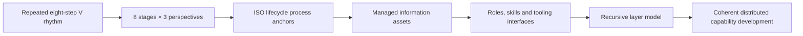


---

# 1. Executive Summary

Capability development often fails to scale because organizations describe their work in incompatible ways. One organization speaks in terms of policy, another in terms of programmes, another in terms of projects, another in terms of contracts, another in terms of system engineering, and another in terms of operations. Each view is valid, but the whole chain becomes difficult to govern when these views are not connected by a common model.

The proposed model creates coherence without forcing every organization to use the same internal process. It defines a shared backbone:

```text
Understand → Model → Specify → Acquire → Verify/Accept → Integrate → Validate → Supply
```

Each step is viewed from three perspectives:

```text
Mission / Operational:  Are we doing the right thing?
Technical:              Are we doing the thing right?
Programmatic:           Can we deliver within constraints?
```

Each step and perspective is anchored to ISO lifecycle processes. This prevents the model from becoming a local invention and makes it easier to compare, audit, improve, and standardize.

However, the model is not primarily a process diagram. Its main value comes from identifying the information that each process creates, consumes, governs, reuses, and publishes. Capability development becomes a managed information supply chain.

The key question is therefore not only:

> Which process happens at this stage?

but also:

> What information asset is produced or changed here, who owns it, who uses it next, how is it governed, and how does it remain traceable across organizational boundaries?

This gives a practical way to define operating models. Each organization can ask:

- Which parts of the reference model are we responsible for?
- Which information assets do we own?
- Which information assets do we consume from others?
- Which processes create or update them?
- Which roles and skills are needed?
- Which interfaces, tools, pipelines, and governance mechanisms are required?
- Which standards must be respected so our outputs remain interoperable with the wider ecosystem?

The result is a reference model that can support both high-level explanation and detailed implementation.

**Diagram source — The core operating model in one picture**

```dot
digraph CoreOperatingModel {
  graph [rankdir=LR, bgcolor="transparent", pad="0.25", nodesep="0.45", ranksep="0.65", splines=ortho];
  node [shape=box, style="rounded,filled", fontname="Arial", fontsize=11, margin="0.10,0.08", color="#1f2937", fillcolor="#f8fafc"];
  edge [fontname="Arial", fontsize=10, color="#475569", arrowsize=0.8];

  subgraph cluster_backbone {
    label="Lifecycle backbone";
    color="#cbd5e1";
    style="rounded";
    understand [label="Understand\nneed + context"];
    model [label="Model\nsolution space"];
    specify [label="Specify\nrequirements + criteria"];
    acquire [label="Acquire\nagreement + work package"];
    verify [label="Verify / Accept\nconformance evidence"];
    integrate [label="Integrate\nconfiguration + interfaces"];
    validate [label="Validate\nfitness for need"];
    supply [label="Supply\nhandover + service"];
    understand -> model -> specify -> acquire -> verify -> integrate -> validate -> supply;
  }

  perspectives [shape=plain, label=<
    <TABLE BORDER="1" CELLBORDER="1" CELLSPACING="0" CELLPADDING="8" COLOR="#cbd5e1">
      <TR><TD BGCOLOR="#dbeafe"><B>Mission / Operational</B><BR/>doing the right thing</TD></TR>
      <TR><TD BGCOLOR="#e0f2fe"><B>Technical</B><BR/>doing the thing right</TD></TR>
      <TR><TD BGCOLOR="#dcfce7"><B>Programmatic</B><BR/>delivering within constraints</TD></TR>
    </TABLE>
  >];

  assets [label="Managed information assets\ncontrolled, traced, reused", fillcolor="#fff7ed", color="#fed7aa"];
  iso [label="ISO process anchors\nstable reference vocabulary", fillcolor="#eef2ff", color="#c7d2fe"];
  governance [label="Governance + configuration\nownership, baselines, change", fillcolor="#fef2f2", color="#fecaca"];

  perspectives -> iso [label="applies to every stage"];
  iso -> assets [label="processes create/use"];
  assets -> governance [label="must be controlled"];
  governance -> understand [label="feeds improvement", style=dashed];
}
```


---

# 2. The Problem: Coherence Across Distributed Capability Development

Capability development is rarely performed by a single organization. It is a distributed chain involving policy authorities, planning bodies, portfolio owners, programme teams, project teams, technical authorities, suppliers, users, operators, maintainers, and many specialist communities.

Each participant may have its own internal processes. That is normal and should not be eliminated. The aim is not to impose one rigid process on everyone.

The aim is to ensure that, when organizations cooperate, their work products remain understandable and reusable across boundaries.


**Diagram source — Failure modes when the information backbone is missing**

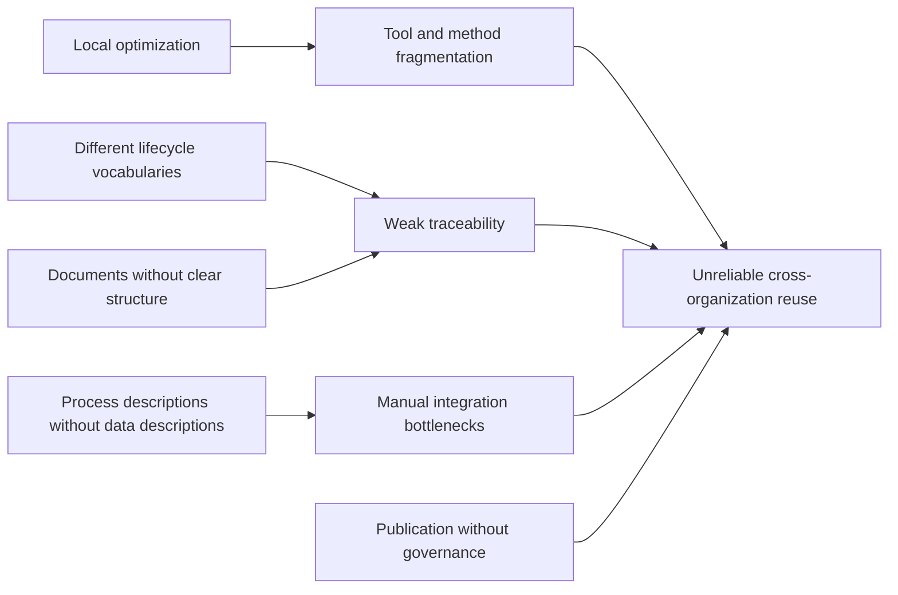

## 2.1 Typical failure modes

Without a shared model, the following problems appear repeatedly:

| Failure mode | Typical consequence |
|---|---|
| Different lifecycle vocabularies | Teams cannot easily compare where they are in the development chain. |
| Documents without clear information structure | Important information is trapped in prose and cannot be reused. |
| Weak traceability | Requirements, architecture decisions, contracts, risks, and evidence become disconnected. |
| Process descriptions without data descriptions | Organizations know what meetings happen but not what information must be controlled. |
| Central bottlenecks | A central team tries to integrate everything manually. |
| Local optimization | Each organization improves its own processes but makes cross-organizational coherence worse. |
| Tool fragmentation | Specialist tools contain valuable information but no common integration logic exists. |
| Publication without governance | Dashboards and reports are produced from unclear or inconsistent sources. |

## 2.2 The core design challenge

The model must satisfy two competing needs.

First, it must be **standard enough** that different organizations can align with it. There must be common stages, concepts, interfaces, information assets, and role expectations.

Second, it must be **flexible enough** that each organization can tailor its own operating model. A political authority, a defence planning organization, a programme office, a project office, a system integrator, and an industrial supplier should not be forced to work in identical ways.

The proposed solution is a layered reference model: stable at the top, tailorable below.

---

# 3. Start Simple: The Eight-Step V Rhythm

The simplest version of the model is an eight-step rhythm.

```text
Descending side of the V:
1. Understand
2. Model
3. Specify
4. Acquire

Ascending side of the V:
5. Verify / Accept
6. Integrate
7. Validate
8. Supply
```

The descending side progressively clarifies what is needed, what could satisfy it, what must be delivered, and who is bound to deliver it.

The ascending side progressively checks delivered outputs, combines them, confirms they satisfy the need, and makes them available for use or for the next layer.

The two sides of the V are intentionally paired. The descending side creates the reference information used by the ascending side:

```text
Understand creates the basis for Validate.
Model creates the basis for Integrate.
Specify creates the basis for Verify / Accept.
Acquire creates the customer/supplier relationship through which lower-layer work is initiated and later supplied.
```


**Diagram source — Canonical eight-step V rhythm**

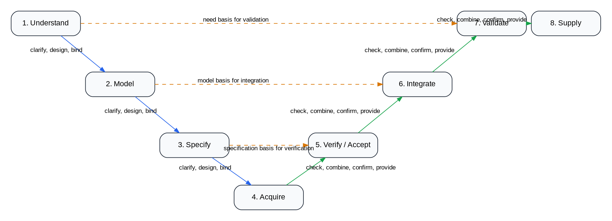

## 3.1 The eight steps in plain language

| Step | Plain-language question | Typical result |
|---|---|---|
| Understand | What problem, need, opportunity, or obligation are we addressing? | A shared understanding of need, context, stakeholders, constraints, and value. |
| Model | What solution space, operating concept, architecture, or system structure could satisfy the need? | Models of the target capability, system, services, components, interfaces, scenarios, and trade-offs. |
| Specify | What exactly must be delivered or provided? | Requirements, acceptance criteria, constraints, interface specifications, performance expectations, and quality attributes. |
| Acquire | Who will deliver what, under which agreement, resources, schedule, and governance? | Projects, programmes, contracts, agreements, supplier commitments, work packages, and delivery baselines. |
| Verify / Accept | Does the delivered element conform to its specification or agreement? | Verification evidence, acceptance decisions, non-conformities, waivers, and corrective actions. |
| Integrate | Can accepted elements be combined into a coherent higher-level system or capability? | Integrated configuration, interface evidence, integration risks, defects, and configuration status. |
| Validate | Does the integrated result satisfy the original need in its intended context? | Validation evidence, operational assessment, benefits assessment, readiness evidence, and stakeholder acceptance. |
| Supply | Is the capability, service, product, or component made available to the next user or customer? | Supplied baseline, handover package, support arrangements, service commitments, and change feedback channels. |

## 3.2 Why eight steps?

The eight steps are few enough to be memorable, but rich enough to cover the essential lifecycle logic.

They also create a useful separation between different kinds of work:

- Understanding the need is not the same as modeling a solution.
- Modeling a solution is not the same as specifying requirements.
- Specifying requirements is not the same as acquiring delivery commitments.
- Accepting a component is not the same as integrating a system.
- Integrating a system is not the same as validating its value.
- Validating a capability is not the same as supplying it reliably to others.

This separation is important because each step produces different information, needs different skills, and creates different governance questions.

---

# 4. Add the Three Perspectives

The V-model alone is still too flat. Capability development has at least three simultaneous concerns.

| Perspective | Core question | Typical concern |
|---|---|---|
| Mission / Operational | Are we doing the right thing? | Need, value, effects, users, operations, benefits, context, acceptance. |
| Technical | Are we doing the thing right? | Architecture, feasibility, interfaces, design integrity, quality, integration, verification. |
| Programmatic | Can we deliver within constraints? | Cost, schedule, resources, risk, dependencies, contracts, plans, governance. |

These perspectives should be present at every stage.

For example, in the **Specify** stage:

- The mission perspective asks whether the requirements still express the stakeholder need and intended operational effect.
- The technical perspective asks whether requirements are clear, feasible, testable, architecturally consistent, and allocated correctly.
- The programmatic perspective asks whether requirements can be delivered within cost, schedule, risk, and contractual constraints.

This avoids the common mistake of treating capability development as either purely operational, purely technical, or purely project-management driven.


**Diagram source — Three perspectives applied to every stage**

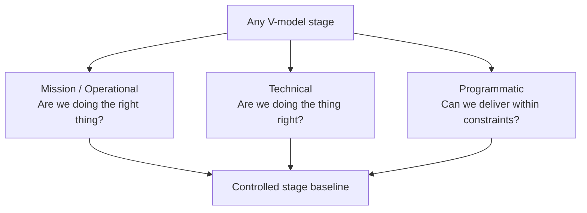

## 4.1 The 8 × 3 grid

The first real model is therefore a grid:

```text
8 lifecycle steps × 3 perspectives = 24 cells
```

Each cell can be used to define:

- relevant ISO processes;
- responsible roles;
- key information assets;
- inputs and outputs;
- governance checks;
- maturity expectations;
- candidate tools or interfaces;
- training and skill needs.

This grid is simple enough to explain, but powerful enough to structure a detailed operating model.


**Diagram source — The 8 × 3 operating-model grid**

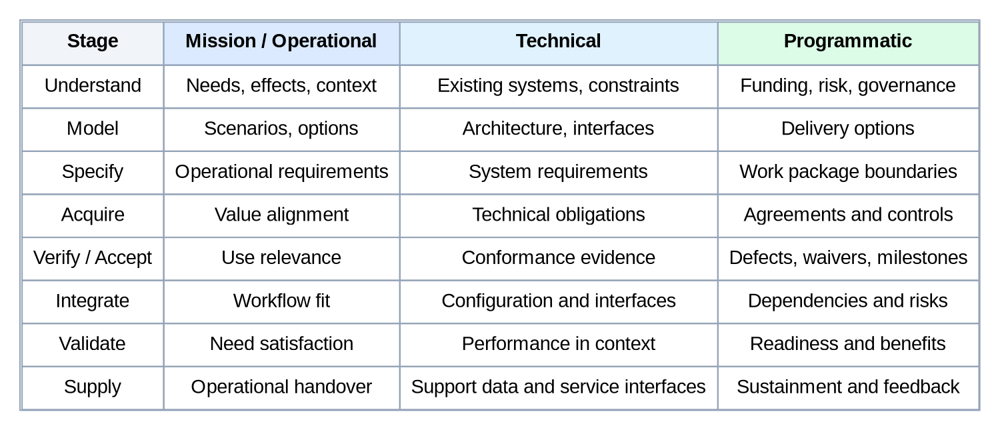

## 4.2 Example: Understand stage across the three perspectives

| Stage | Perspective | Example focus | Example information |
|---|---|---|---|
| Understand | Mission / Operational | Identify stakeholder needs, operational problem, desired effects, constraints, and value. | Stakeholder need statement, operational context, benefit hypothesis. |
| Understand | Technical | Identify existing systems, feasibility constraints, technology opportunities, system-of-systems context. | Existing-system map, technical constraints, interface assumptions. |
| Understand | Programmatic | Identify affordability, schedule pressure, governance route, funding assumptions, strategic dependencies. | Business case assumptions, portfolio fit, risk and dependency register. |

The same stage is therefore not one activity. It is a coordinated set of mission, technical, and programmatic activities that together create a controlled understanding baseline.

---

# 5. Anchor the Model in ISO Lifecycle Processes

The model should not invent a new process taxonomy where a standard one already exists. ISO/IEC/IEEE 15288 provides a widely recognized lifecycle process framework for systems and software engineering contexts.

The purpose of using ISO is not to turn every organization into a standards-compliance exercise. The purpose is to provide a stable reference vocabulary so that different organizations can map their local processes to a shared lifecycle backbone.


**Diagram source — ISO anchors without forcing local process names**

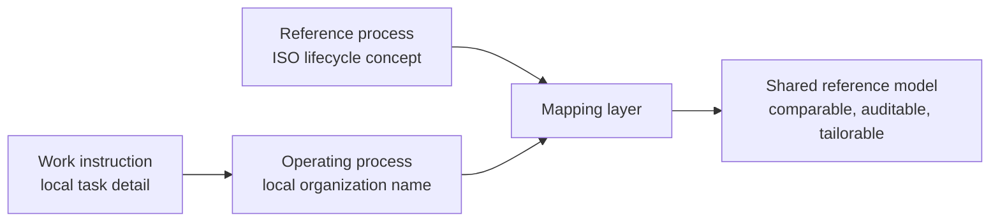

## 5.1 Why ISO anchoring matters

ISO anchoring provides several benefits:

| Benefit | Explanation |
|---|---|
| Shared vocabulary | Different organizations can map their internal processes to recognized lifecycle process names. |
| Auditability | Process coverage and gaps can be assessed against a stable reference. |
| Tailoring discipline | Organizations can tailor intentionally rather than inventing disconnected process language. |
| Interoperability | Outputs can be compared and exchanged more easily across organizational boundaries. |
| Maturity assessment | Digital maturity can be assessed process by process and stage by stage. |
| Training value | Personnel profiles can refer to stable process families and expected competencies. |

## 5.2 The ISO processes as anchors, not cages

The model should distinguish between three layers of description:

| Layer | Meaning |
|---|---|
| Reference process | The standardized ISO process concept. |
| Operating process | The organization-specific process used internally. |
| Work instruction or procedure | The detailed local way of performing a task. |

An organization does not need to rename all internal processes after ISO. Instead, it should map its operating processes to the reference model.

Example:

| Local process name | Reference model mapping |
|---|---|
| Capability Options Analysis | Model stage, mission and technical perspectives; maps to architecture definition, stakeholder needs analysis, system analysis, and decision management. |
| Contract Readiness Review | Acquire stage, programmatic and technical perspectives; maps to acquisition, supply, project planning, risk management, configuration management, and technical assessment. |
| Operational Trial | Validate stage, mission perspective; maps to validation, stakeholder satisfaction, operation, and measurement. |

This lets organizations retain their own language while still participating in a shared model.

---

# 6. Add the Layer Model

Capability development is not a single V. It is a chain of Vs across layers.

Each layer receives needs, constraints, components, services, or binding agreements from above, and supplies something to another layer below or sideways. Each layer may therefore be both customer and supplier.


**Diagram source — How one V-model layer connects to the layer above and below**

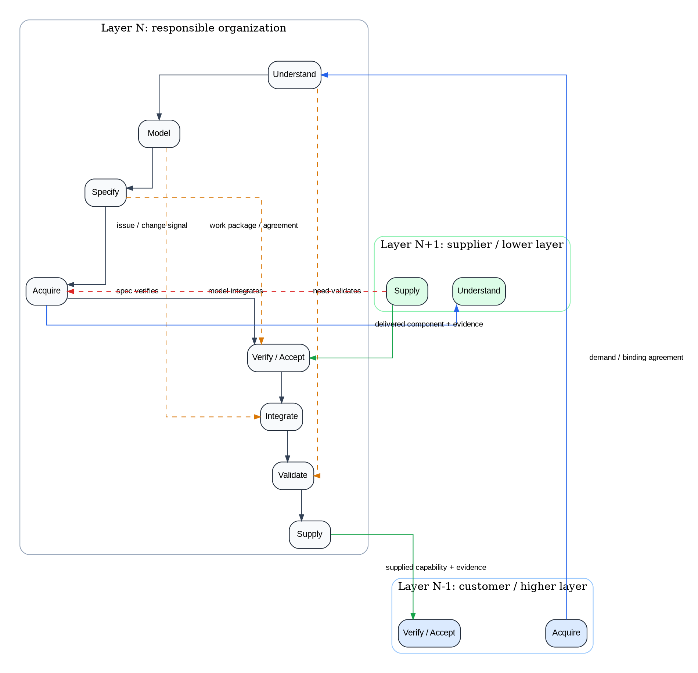

## 6.1 Generic layer pattern

At each layer:

1. The organization receives needs, objectives, constraints, or agreements from one or more higher-level customers.
2. It interprets and integrates these with its own internal needs and constraints.
3. It develops or manages a system, service, product, capability, or portfolio.
4. It decomposes part of the work into components.
5. It acquires or delegates those components from lower-level suppliers.
6. It accepts, integrates, validates, and supplies the result.
7. It provides feedback upward and change information downward.

This is not necessarily a tree. It is usually a directed graph. The same supplier, system, service, or component may support several higher-level needs. The same organization may receive constraints from several portfolios or authorities.


**Diagram source — Example recursive layer stack**

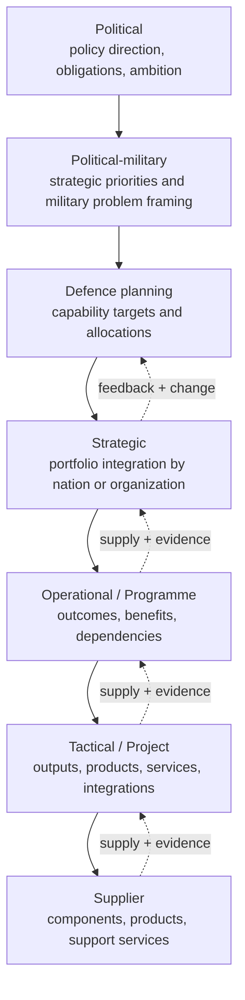

## 6.2 Example layers

A defence-oriented implementation could use layers such as:

| Layer | Typical role in the chain |
|---|---|
| Political | Defines overarching direction, obligations, ambition, and policy-level binding decisions. |
| Political-military | Structures the military problem, strategic priorities, and high-level capability direction. |
| Defence planning | Defines capability targets, allocations, priorities, and planning commitments. |
| Strategic | Integrates external targets with internal needs, resources, portfolios, and national or organizational strategies. |
| Operational / Programme | Orchestrates outcomes, benefits, dependencies, transformations, and complex capability delivery. |
| Tactical / Project | Produces specific outputs, products, services, integrations, or changes. |
| Supplier | Delivers contracted or otherwise agreed components, products, services, or support. |

Different domains may rename these layers, but the pattern remains: each layer translates, integrates, decomposes, acquires, accepts, integrates, validates, and supplies.


**Diagram source — Layers form a directed graph, not a plain tree**

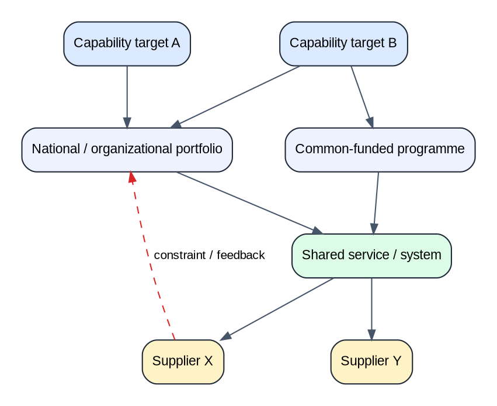

## 6.3 Same-layer and cross-layer V links

The V-model contains two kinds of structural links:

1. **Same-layer links**, which connect the descending leg of the V to the ascending leg inside the same organizational layer.
2. **Cross-layer links**, which connect a customer layer and a supplier layer.

These links are important because the descending leg does not merely produce documentation. It produces the baselines that are used on the ascending leg to accept, integrate, validate, and supply the result.

### Same-layer V links

Within one layer, the main same-layer links are:

```text
Understand → Validate
Model      → Integrate
Specify    → Verify / Accept
```

---


**Diagram source — Top-down and bottom-up change propagation**

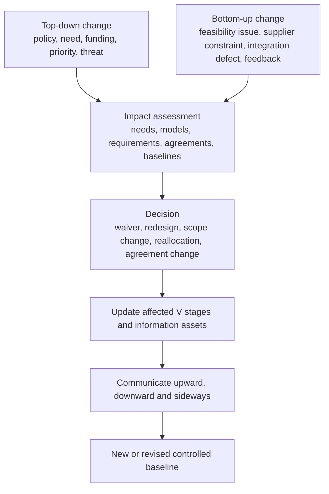

# 7. The Main Shift: From Process Model to Information Asset Network

The model becomes operationally useful when it stops being only a process map and becomes an information asset map.

A process map answers:

> What activities happen?

An information asset map answers:

> What information is created, governed, reused, transformed, published, and traced?

The second question is more important for digital transformation, interoperability, and maintainability.


**Diagram source — From process map to managed information asset network**

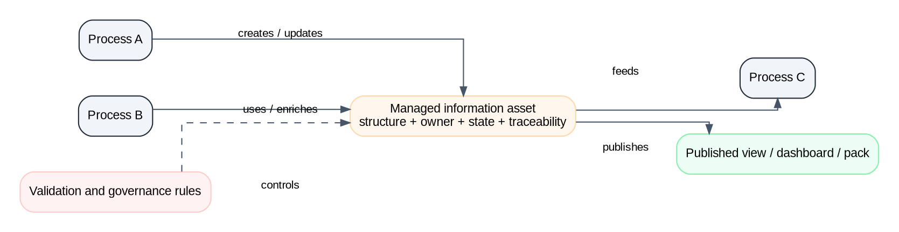

## 7.1 What is a managed information asset?

A managed information asset is any controlled body of information that has a defined purpose, structure, owner, lifecycle state, governance model, and set of relationships to other assets.

It may be implemented as:

- a document;
- a database table or graph;
- a requirements set;
- an architecture model;
- a dashboard;
- a contract package;
- a risk register;
- an interface control document;
- a verification evidence set;
- a configuration baseline;
- a model repository;
- a simulation package;
- a published portal view;
- a machine-readable exchange file.

The implementation may vary. The managed meaning should not.

## 7.2 Asset metadata

Each information asset should have at least the following metadata:

| Attribute | Explanation |
|---|---|
| Name | Stable name used in the reference model. |
| Purpose | Why the asset exists. |
| Owning role | Who is accountable for its coherence and lifecycle state. |
| Creating processes | Which processes create or update it. |
| Consuming processes | Which processes use it. |
| Lifecycle stage | Which V step it primarily belongs to. |
| Perspective | Mission, technical, programmatic, or cross-perspective. |
| Semantic model | Main concepts and relationships contained in the asset. |
| Governance state | Draft, reviewed, approved, baselined, superseded, archived, etc. |
| Version / configuration | Version, baseline, configuration item, or change package. |
| Traceability links | Links to upstream and downstream assets. |
| Publication views | How it is exposed to different audiences. |
| Tooling interfaces | Authoring, integration, publishing, and pipeline interfaces used to maintain it. |


**Diagram source — Minimum structure of a managed information asset**

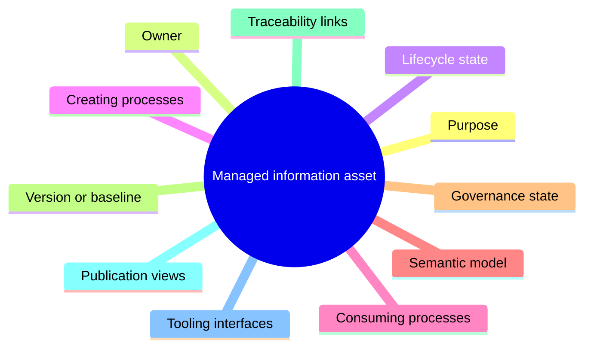

## 7.3 Example information asset: Stakeholder Need Baseline

| Attribute | Example |
|---|---|
| Name | Stakeholder Need Baseline |
| Purpose | Capture the agreed understanding of the problem, opportunity, obligations, stakeholders, operational context, and intended value. |
| Primary stage | Understand |
| Primary perspective | Mission / Operational |
| Feeds | Modeling, specification, validation, business case, prioritization, benefits management. |
| Semantic concepts | Stakeholder, need, problem, effect, constraint, assumption, operational scenario, value measure, priority. |
| Owning role | Capability sponsor or operational needs owner, supported by mission analyst and architect. |
| Governance | Reviewed and approved before major modeling or specification decisions are baselined. |
| Traceability | Links to strategies, policy drivers, capability gaps, risks, system models, requirements, validation criteria, and benefits measures. |

## 7.4 Example information asset: Component Specification Package

| Attribute | Example |
|---|---|
| Name | Component Specification Package |
| Purpose | Define what a component must deliver, how it interfaces with other components, and how it will be accepted. |
| Primary stage | Specify |
| Primary perspective | Technical and programmatic |
| Feeds | Acquisition, supplier delivery, verification, acceptance, integration planning. |
| Semantic concepts | Component, requirement, interface, constraint, performance measure, acceptance criterion, verification method, allocated risk. |
| Owning role | Requirements lead and system architect, supported by acquisition lead and verification lead. |
| Governance | Baselined before acquisition or delegation. Changed through controlled impact assessment. |
| Traceability | Links to stakeholder needs, architecture decisions, model elements, supplier agreements, verification evidence, integration issues, and validation outcomes. |

---

# 8. Information Assets Across the V

A standard implementation should include an information asset catalogue. The catalogue does not need to prescribe every local document or database. It should define the controlled information concepts that must exist in some form.


**Diagram source — Reference information asset chain across the V**

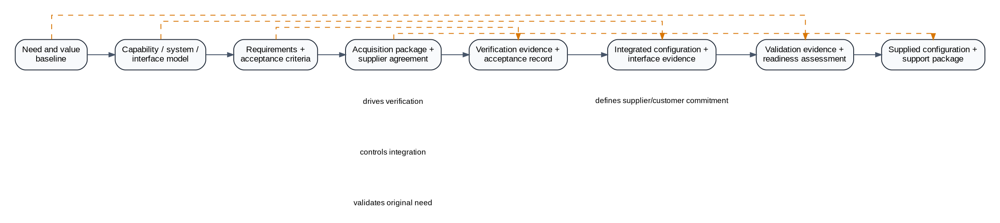

## 8.1 Reference asset chain

| V step | Main question | Example core information assets |
|---|---|---|
| Understand | What is needed and why? | Need and value baseline; stakeholder map; operational context model; assumptions and constraints register; initial risk and opportunity register. |
| Model | What could satisfy the need? | Capability model; operational model; system-of-systems model; architecture decision record; component and interface model; trade-space analysis. |
| Specify | What must be delivered? | Requirements baseline; interface specification; acceptance criteria; quality attribute specification; verification strategy; requirements allocation matrix. |
| Acquire | Who will deliver what? | Acquisition strategy; work package definition; supplier agreement; delivery baseline; programme/project plan; contractual or tasking package. |
| Verify / Accept | Does the element meet its specification? | Verification evidence; acceptance record; non-conformance register; waiver/deviation record; supplier delivery evidence. |
| Integrate | Do accepted elements work together? | Integrated configuration baseline; integration evidence; interface compliance record; defect register; integration risk register. |
| Validate | Does the result satisfy the need? | Validation evidence; operational assessment; benefits realization evidence; stakeholder acceptance record; readiness assessment. |
| Supply | What is handed over or provided? | Supplied configuration; support package; service baseline; operational handover package; change and feedback channel; lessons learned. |


**Diagram source — Descending-leg assets are designed for ascending-leg use**

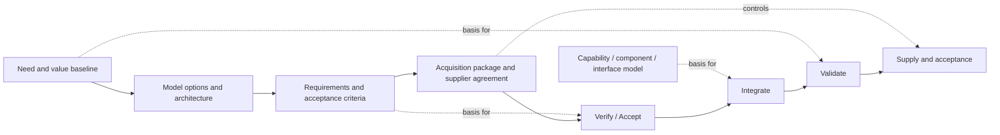

## 8.2 Assets are reused and enriched

Information assets should not be treated as isolated documents.

The most important reuse pattern follows the V-shape itself:

| Asset created or stabilized on descending leg | Used on ascending leg for |
|---|---|
| Need and value baseline | Validation of the integrated result. |
| Operational context and stakeholder model | Validation scenarios and stakeholder acceptance. |
| Capability, system, component, and interface models | Integration planning, integration control, and interface issue resolution. |
| Requirements baseline and acceptance criteria | Verification and acceptance. |
| Acquisition package and supplier agreement | Supplier understanding, delivery control, acceptance, and supplied baseline management. |

Therefore, each descending-leg asset should be designed with its ascending-leg use in mind.

For example, the stakeholder need baseline created during Understand is reused during:

- Model, to check whether architectural options address the actual need;
- Specify, to derive and justify requirements;
- Validate, to confirm that the integrated result satisfies the original need;
- Supply, to define support expectations and feedback mechanisms;
- Change management, to assess whether a proposed change affects the original purpose.

Similarly, the component model created during Model is reused during:

- Specify, to allocate requirements;
- Acquire, to define work packages and supplier boundaries;
- Verify / Accept, to check delivered components;
- Integrate, to plan and control interfaces;
- Validate, to interpret operational performance;
- Supply, to support configuration and service management.

This is the foundation of the digital thread: not a single database, but managed continuity of meaning across information assets.

---

# 9. Semantic Models: What Each Asset Actually Means

To be maintainable and interoperable, each information asset should have a semantic model. This does not need to be complex at first. It can begin as a list of key concepts and relationships, and mature into a graph schema or metamodel.

## 9.1 Why semantic models matter

Without semantic models, two organizations may both say “requirement” but mean different things. One may mean stakeholder requirement. Another may mean system requirement. Another may mean contractual obligation. Another may mean design constraint.

A semantic model clarifies:

- what concepts exist;
- how they relate;
- what identifiers they carry;
- which relationships are mandatory or optional;
- which states are allowed;
- which rules must be enforced;
- how the information maps to standards or local tools.

## 9.2 Example semantic model: Need and Value Baseline

A simple semantic model could be:

```text
Stakeholder
  expresses → Need
Need
  exists in → Operational Context
  motivated by → Driver
  constrained by → Constraint
  measured by → Value Measure
  prioritized by → Priority
  decomposed into → Derived Need
  addressed by → Capability Option
Capability Option
  assessed by → Trade Study
  selected by → Decision
Decision
  justified by → Rationale
  creates → Assumption
  creates → Risk
```


**Diagram source — Semantic core: Need and Value Baseline**

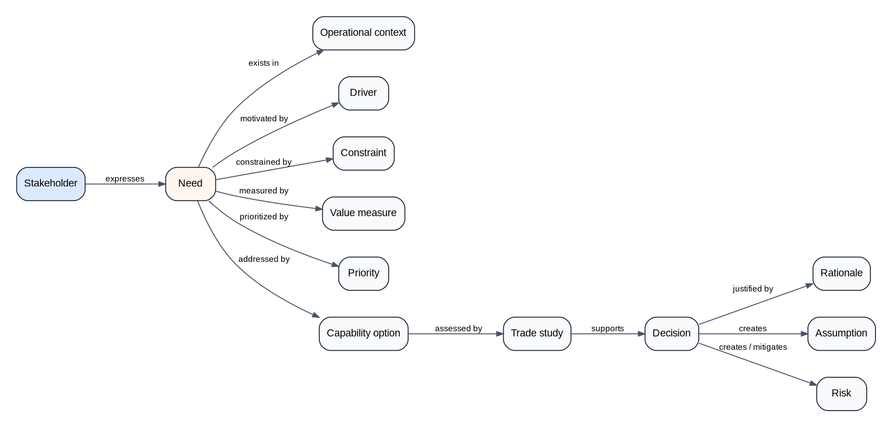

## 9.3 Example semantic model: Requirements Baseline

```text
Requirement
  derives from → Need
  allocated to → System Element
  constrained by → Constraint
  verified by → Verification Method
  accepted by → Acceptance Criterion
  traced to → Interface
  traced to → Architecture Decision
  has state → Requirement State
  has priority → Priority
  has risk → Requirement Risk
System Element
  performs → Function
  exposes → Interface
  participates in → Configuration
Interface
  connects → System Element
  constrained by → Interface Requirement
```


**Diagram source — Semantic core: Requirements Baseline**

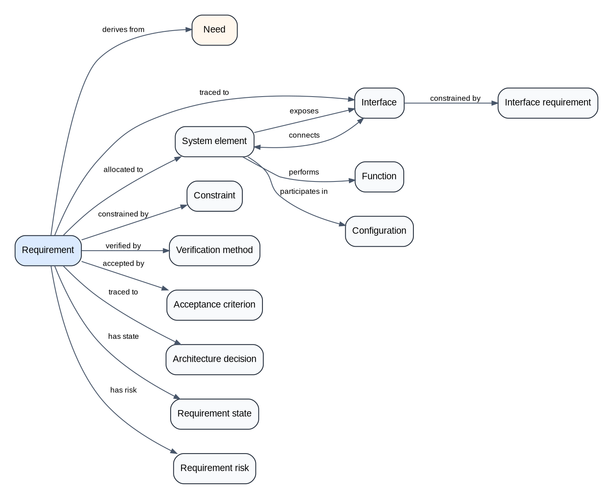

## 9.4 Connected graph principle

Each asset model should form a connected graph. This means the concepts should not be loose lists. Every important concept should connect to the rest of the model through meaningful relationships.

This matters because disconnected concepts are hard to validate, trace, publish, and reuse.

For example, a risk should not just exist as a row in a register. It should connect to:

- the need it threatens;
- the requirement it affects;
- the architecture decision that creates or mitigates it;
- the supplier agreement that carries it;
- the verification or validation evidence that closes it;
- the owner responsible for managing it.

---


**Diagram source — Connected graph principle**

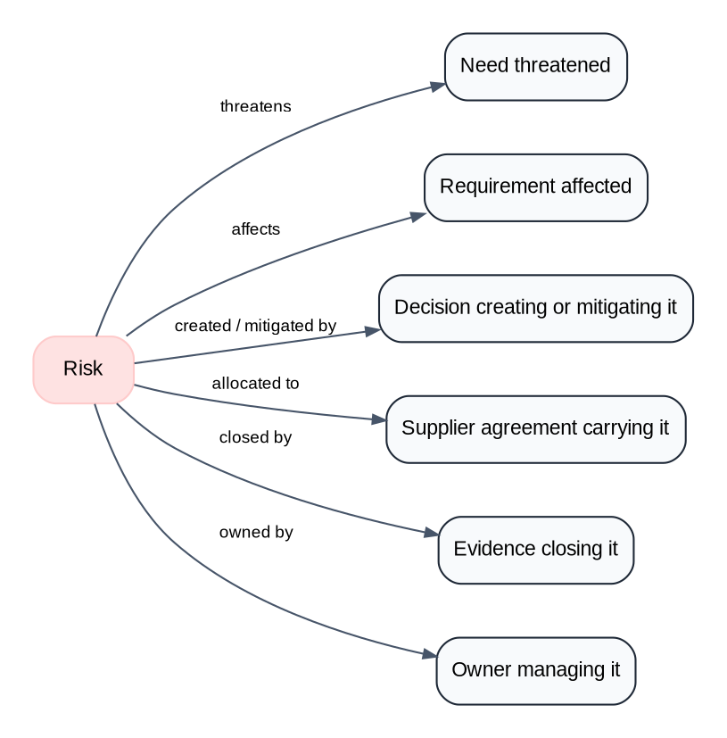

# 10. Roles and Skillsets

The model needs roles because information assets do not maintain themselves. Every asset requires people who create, integrate, govern, publish, and automate it.

A useful role model separates responsibility types rather than relying only on job titles.


**Diagram source — Four information roles around managed assets**

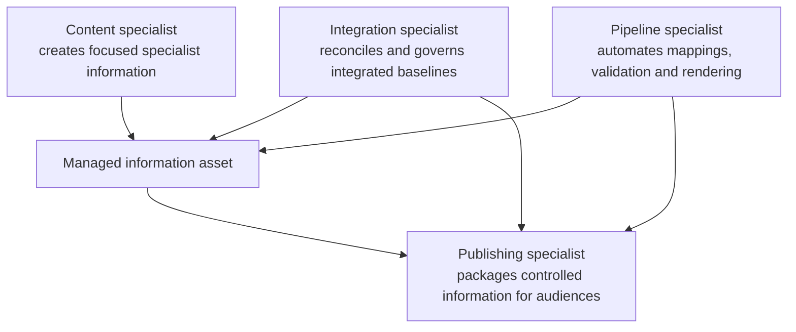

## 10.1 Four core information roles

| Role type | Responsibility |
|---|---|
| Content specialist | Creates and maintains specialist information within a defined interface, template, and rule set. |
| Integration specialist | Curates, reconciles, validates, and governs integrated information assets. |
| Publishing specialist | Packages curated information into consumable documents, portals, dashboards, indexes, views, or reports. |
| Pipeline specialist | Builds and maintains automated flows, transformations, validation rules, mappings, and rendering logic between assets and tools. |

These are not necessarily four different people. A small organization may combine them. A mature organization may separate them clearly.

The key is that the responsibilities must be explicit.

## 10.2 Capability-development role examples

| Role                                 | Core information role played                  | Main contribution                                                                                     |
| ------------------------------------ | --------------------------------------------- | ----------------------------------------------------------------------------------------------------- |
| Capability sponsor                   | Content specialist      | Owns the need, value case, priority, and stakeholder accountability.                                  |
| Operational / mission analyst        | Content specialist                            | Describes operational context, scenarios, effects, users, constraints, and measures of effectiveness. |
| System architect                     | Integration specialist                        | Maintains system models, component structure, interfaces, architecture decisions, and trade-offs.     |
| Requirements engineer                | Content specialist; integration specialist    | Maintains requirements quality, traceability, allocation, and verification alignment.                 |
| Programme manager                    | Integration specialist                        | Owns benefits, dependencies, schedule, resources, risks, governance, and delivery orchestration.      |
| Project manager                      | Integration specialist                        | Owns delivery of specific outputs within agreed constraints.                                          |
| Acquisition / commercial lead        | Content specialist; integration specialist    | Structures agreements, supplier obligations, contractual boundaries, and sourcing routes.             |
| Verification lead                    | Integration specialist                        | Defines and controls evidence that delivered elements satisfy specifications.                         |
| Integration lead                     | Integration specialist                        | Controls integration sequencing, interfaces, defects, and configuration integration.                  |
| Validation lead                      | Integration specialist                        | Confirms that the integrated result satisfies the original need in context.                           |
| Configuration manager                | Integration specialist                        | Maintains baselines, versions, change control, and configuration status accounting.                   |
| Information manager / IKM specialist | Publishing specialist                         | Publishes and packages controlled information for different stakeholder communities.                  |
| Data / pipeline engineer             | Pipeline specialist                           | Maintains transformations, repositories, validation logic, lineage, APIs, and automation.             |
| Method / process owner               | Integration specialist; publishing specialist | Defines process guidance, tailoring rules, maturity expectations, and compliance checks.              |
| Information model owner              | Integration specialist; pipeline specialist   | Governs semantic models, metamodels, templates, controlled vocabularies, and data quality rules.      |

## 10.3 Role-to-asset example

| Information asset | Content specialists | Integration owner | Publishing users | Pipeline support |
|---|---|---|---|---|
| Need and value baseline | Sponsor, mission analyst, users | Capability owner | Senior leaders, portfolio boards | Links to strategy, gaps, benefits, risks. |
| System-of-systems model | Architects, engineers, domain specialists | System architect | Technical boards, integration teams | Model repository, graph export, traceability checks. |
| Requirements baseline | Requirements engineers, SMEs | Requirements lead | Suppliers, verification teams, project boards | Requirements import/export, quality checks, trace matrix. |
| Acquisition package | Commercial lead, programme manager, technical authority | Acquisition lead | Suppliers, governance boards | Contract-data extraction, baseline comparison, obligation tracking. |
| Verification evidence | Test teams, supplier teams | Verification lead | Acceptance authority, project manager | Evidence repository, requirement coverage checks. |
| Validation evidence | Operators, users, analysts | Validation lead | Sponsors, operational authorities | Benefits and effectiveness dashboards. |
| Supplied configuration | Supplier, integration lead, config manager | Configuration manager | Operators, support teams, next-layer customers | Configuration baseline, digital product structure, change status. |


**Diagram source — Role-to-asset operating pattern**

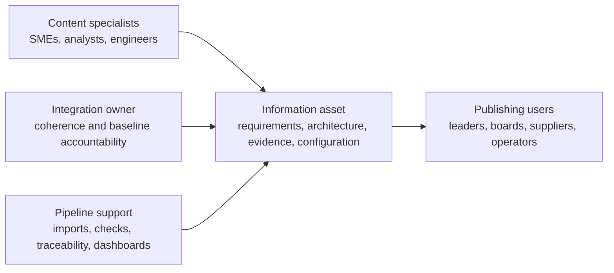

## 10.4 Skill profile structure

For each role, the standard can define a profile with:

| Field | Example |
|---|---|
| Role purpose | Why the role exists in the model. |
| Accountable assets | Which information assets the role owns or governs. |
| Contributing assets | Which assets the role helps maintain. |
| Process coverage | Which V stages and perspectives the role supports. |
| Required knowledge | Standards, domain knowledge, tool knowledge, lifecycle knowledge. |
| Required skills | Modeling, facilitation, analysis, requirements, governance, data handling, stakeholder communication. |
| Typical tools | Requirements tools, architecture tools, registers, dashboards, repositories, workflow systems. |
| Training path | Introductory, practitioner, advanced, authority-level training. |
| Quality criteria | How good performance is recognized. |

---

# 11. Tooling Interfaces

**Diagram source — Four tooling interface types**

```dot
digraph ToolingInterfaces {
  graph [rankdir=LR, bgcolor="transparent", nodesep="0.45", ranksep="0.65", splines=ortho, pad="0.25"];
  node [shape=box, style="rounded,filled", fontname="Arial", fontsize=11, color="#1f2937"];
  edge [fontname="Arial", fontsize=9, arrowsize=0.7, color="#475569"];

  content [label="Content specialist interface\ntemplates, guidance, local rules", fillcolor="#dbeafe"];
  pipeline1 [label="Pipeline interface\nmapping, transformation, validation", fillcolor="#fef3c7"];
  integration [label="Integration interface\nrepository, traceability, baselines", fillcolor="#dcfce7"];
  pipeline2 [label="Pipeline interface\nrendering, aggregation, lineage", fillcolor="#fef3c7"];
  publishing [label="Publishing interface\nportal, dashboard, report, index", fillcolor="#fce7f3"];
  stakeholders [label="Stakeholder consumption\nsearch, filter, understand, decide", fillcolor="#f8fafc"];

  content -> pipeline1 -> integration -> pipeline2 -> publishing -> stakeholders;
}
```


The model should avoid starting with tools. Tools should be selected based on information assets and role needs.

A scalable tooling model separates four interface types.

## 11.1 Content specialist interface

This is where specialists create and maintain focused information.

Examples:

- requirements editor;
- risk register;
- architecture viewpoint editor;
- operational scenario template;
- test evidence capture form;
- supplier delivery portal;
- project schedule interface.

A good content specialist interface provides:

- templates;
- guidance;
- metamodel or schema rules;
- allowed vocabularies;
- validation checks;
- version history;
- review and approval workflow;
- import/export capability;
- links to related assets.

The specialist should not need to understand the whole enterprise model. They should understand their viewpoint and trust the system to preserve structure.

## 11.2 Content integration specialist interface

This is where multiple specialist inputs are fused into a coherent baseline.

Examples:

- integrated capability architecture;
- segment architecture;
- programme information baseline;
- system-of-systems model;
- integrated requirements baseline;
- integrated risk and dependency model.

The interface should provide:

- repository capability;
- cross-asset traceability;
- consistency checks;
- conflict detection;
- review and adjudication;
- configuration control;
- baseline management;
- analytics;
- change impact analysis.

## 11.3 Publishing specialist interface

This is where curated information is packaged for consumption.

Examples:

- leadership dashboard;
- stakeholder portal;
- programme brief;
- architecture publication site;
- validation report;
- acquisition decision pack;
- searchable catalogue;
- controlled document output.

Publishing is not an afterthought. It is how information becomes usable by people who are not model authors.

The interface should support:

- filtering by audience;
- controlled vocabulary translation;
- access control;
- versioned publication;
- search;
- indexes;
- dashboards;
- visualizations;
- explanatory narratives.

## 11.4 Information pipeline specialist interface

This is where automation is built and maintained.

Examples:

- requirements-to-architecture mapping;
- architecture-to-dashboard extraction;
- model-to-document rendering;
- supplier-delivery import;
- evidence coverage calculation;
- change impact analysis;
- validation-rule execution;
- graph export.

The interface should support:

- mappings;
- transformations;
- validation rules;
- lineage capture;
- error reporting;
- repeatable execution;
- versioned pipelines;
- test data;
- monitoring;
- rollback or recovery strategy.

---

# 12. Governance Model

A standardizable operating model needs governance over process, information, technology, and configuration.


**Diagram source — Governance authorities and the assets they control**

```mermaid
flowchart TB
  assets["Managed information assets and baselines"]
  process["Process authority\nlifecycle guidance and tailoring"] --> assets
  info["Information management authority\nasset definitions and semantic models"] --> assets
  platform["Technical / platform authority\ntools, repositories, automation"] --> assets
  config["Configuration authority\nversions, baselines, changes"] --> assets
  portfolio["Capability / portfolio authority\npriorities, resources, benefits"] --> assets
```

## 12.1 Governance authorities

| Authority | Responsibility |
|---|---|
| Process authority | Defines lifecycle process guidance, tailoring rules, reviews, approvals, and escalation paths. |
| Information management authority | Owns information asset definitions, semantic models, templates, mappings, vocabularies, and data quality rules. |
| Technical / platform authority | Maintains tools, repositories, automation, integrations, validation services, and technical interoperability. |
| Configuration authority | Controls versions, baselines, change packages, configuration status, and auditability. |
| Capability / portfolio authority | Prioritizes needs, resources, benefits, dependencies, and cross-capability trade-offs. |

## 12.2 Change propagation

The model must support change in both directions.

### Top-down change

A top-down change may come from:

- new policy direction;
- changed operational need;
- changed funding;
- changed priority;
- new threat or opportunity;
- revised strategic guidance.

It should trigger:

1. impact assessment against needs, models, requirements, agreements, and baselines;
2. update of affected stages;
3. change to lower-level agreements if required;
4. communication to affected suppliers or dependent organizations;
5. update of validation criteria and benefits expectations.

### Bottom-up change

A bottom-up change may come from:

- feasibility issue;
- supplier constraint;
- technology change;
- integration problem;
- verification failure;
- cost or schedule pressure;
- operational feedback.

It should trigger:

1. impact assessment against higher-level needs and commitments;
2. review of architecture and requirements;
3. update of programme or portfolio assumptions;
4. decision on waiver, redesign, scope change, or reallocation;
5. communication upward and sideways to affected stakeholders.

The same-layer and cross-layer links define where change impact must be assessed.

A change in **Understand** affects **Validate** because validation criteria depend on the original need and context.

A change in **Model** affects **Integrate** because integration depends on the architecture, component boundaries, and interface model.

A change in **Specify** affects **Verify / Accept** because verification and acceptance depend on the requirements and acceptance criteria.

A change in a higher-layer **Acquire** package affects the lower-layer **Understand** stage because the supplier must reinterpret the changed demand.

A change in lower-layer **Supply** affects the higher-layer **Acquire** relationship and **Verify / Accept** evidence because the supplied output is judged against the customer’s acquisition intent and specification.

## 12.3 Digital thread governance

A digital thread is not achieved by buying one tool. It is achieved by maintaining reliable, governed links across managed information assets.

Minimum digital thread controls should include:

- stable identifiers;
- traceability rules;
- version and baseline management;
- change impact analysis;
- evidence links;
- configuration status accounting;
- authoritative source declaration;
- publication status;
- role accountability;
- automated validation where possible.

---

# 13. Incremental Complexity Model

The model should be taught and adopted progressively.


**Diagram source — Incremental complexity ladder**

```mermaid
flowchart TB
  l1["Level 1\nEight-step lifecycle rhythm"] --> l2["Level 2\nThree perspectives"]
  l2 --> l3["Level 3\nISO process anchoring"]
  l3 --> l4["Level 4\nInformation assets"]
  l4 --> l5["Level 5\nSemantic models and traceability"]
  l5 --> l6["Level 6\nRoles, skills, interfaces and maturity"]
```

## 13.1 Level 1: The lifecycle rhythm

At the simplest level, teach only the eight steps.

```text
Understand → Model → Specify → Acquire → Verify/Accept → Integrate → Validate → Supply
```

Audience: everyone.

Purpose: establish the common story.

## 13.2 Level 2: The three perspectives

Add the three questions:

```text
Are we doing the right thing?
Are we doing the thing right?
Can we deliver within constraints?
```

Audience: managers, engineers, architects, planners, project teams.

Purpose: prevent single-perspective thinking.

## 13.3 Level 3: ISO process anchoring

Map each cell of the 8 × 3 grid to lifecycle processes.

Audience: process owners, method teams, governance authorities, auditors, maturity assessors.

Purpose: standardize the reference process language.

## 13.4 Level 4: Information assets

Define the assets that connect the processes.

Audience: architects, information managers, requirements leads, programme offices, tool owners.

Purpose: make the model executable and governable.

## 13.5 Level 5: Semantic models and traceability

Define the concepts and relationships inside each information asset.

Audience: model owners, data architects, tool integrators, method designers, validation-rule authors.

Purpose: enable interoperability, validation, automation, analytics, and digital thread continuity.

## 13.6 Level 6: Roles, skills, interfaces, and maturity

Define the people and tooling required to operate the model.

Audience: organizational designers, HR/training leads, programme directors, transformation teams.

Purpose: turn the reference model into an operating capability.

---


**Diagram source — Minimum digital-thread controls**

```mermaid
flowchart LR
  id["Stable identifiers"] --> trace["Traceability rules"]
  trace --> version["Version and baseline management"]
  version --> impact["Change impact analysis"]
  impact --> evidence["Evidence links"]
  evidence --> config["Configuration status accounting"]
  config --> source["Authoritative source declaration"]
  source --> publication["Publication status"]
  publication --> accountability["Role accountability"]
  accountability --> validation["Automated validation"]
```

# 14. Example: Applying the Model to One Stage

This example shows how an organization could define the **Model** stage.


**Diagram source — Applying the model to the Model stage**

```dot
digraph ModelStageExample {
  graph [rankdir=LR, bgcolor="transparent", nodesep="0.45", ranksep="0.65", splines=ortho, pad="0.25"];
  node [shape=box, style="rounded,filled", fontname="Arial", fontsize=11, color="#1f2937"];
  edge [fontname="Arial", fontsize=9, arrowsize=0.7, color="#475569"];

  entry [label="Entry\nNeed and value baseline approved", fillcolor="#f1f5f9"];
  mission [label="Mission / Operational\nscenarios, effects, user journeys", fillcolor="#dbeafe"];
  technical [label="Technical\narchitecture, components, interfaces", fillcolor="#e0f2fe"];
  programmatic [label="Programmatic\ndelivery options, risks, sourcing", fillcolor="#dcfce7"];
  assets [label="Model-stage assets\ncapability model, SoS model, interface model, ADRs, trade-space", fillcolor="#fff7ed"];
  exit [label="Exit\nPreferred solution model approved", fillcolor="#f1f5f9"];

  entry -> mission -> assets;
  entry -> technical -> assets;
  entry -> programmatic -> assets;
  assets -> exit;
}
```

## 14.1 Stage definition

| Field | Example |
|---|---|
| Stage | Model |
| Purpose | Explore and define candidate solutions, operational concepts, system structures, component boundaries, interfaces, and trade-offs that could satisfy the understood need. |
| Entry condition | Need and value baseline sufficiently understood and approved for solution exploration. |
| Exit condition | Preferred architecture or solution model approved for specification and acquisition planning. |

## 14.2 Perspective breakdown

| Perspective | Example activities | Example outputs |
|---|---|---|
| Mission / Operational | Model operational scenarios, user journeys, capability effects, business process changes, measures of effectiveness. | Operational model, scenario model, effect model, capability option assessment. |
| Technical | Model system structure, functions, interfaces, constraints, technologies, trade-offs, system-of-systems dependencies. | Architecture model, component model, interface model, trade study, architecture decision record. |
| Programmatic | Model delivery options, dependency chains, cost drivers, risk exposure, sourcing options, schedule implications. | Delivery option model, dependency model, risk register, affordability assessment, acquisition route assumptions. |

## 14.3 Information assets

| Asset | Description |
|---|---|
| Capability model | Describes the capability, effects, users, scenarios, and value logic. |
| System-of-systems model | Describes relevant systems, services, organizations, dependencies, and external constraints. |
| Component and interface model | Identifies candidate components and their relationships, flows, interfaces, responsibilities, and dependencies. |
| Architecture decision record | Captures major options, decisions, rationale, assumptions, and rejected alternatives. |
| Trade-space analysis | Compares options across mission value, technical feasibility, cost, risk, and schedule. |

## 14.4 Role profile example

| Role | Responsibility in Model stage |
|---|---|
| Mission analyst | Ensures scenarios and effects represent the real operational need. |
| System architect | Owns the coherence of the architecture and component model. |
| Technical specialist | Contributes domain feasibility and constraints. |
| Programme manager | Assesses delivery feasibility, dependencies, and constraints. |
| Information model owner | Ensures modeling outputs conform to the agreed semantic model. |
| Pipeline specialist | Maintains transformations from modeling tools into integrated repositories and published views. |

## 14.5 Example governance checks

- Every modeled component must trace to at least one need, function, or operational scenario.
- Every major interface must have an owner and a known dependency direction.
- Every architecture decision must record rationale and affected assets.
- Every selected option must be assessed against mission, technical, and programmatic criteria.
- Every assumption must have an owner and review date.
- Every component candidate must indicate whether it will be built, bought, reused, supplied by another organization, or deferred.

---

# 15. Example: Applying the Model to One Information Asset

This example shows how to define an asset in the catalogue.

## 15.1 Asset: Integrated Capability Architecture

| Field | Example content |
|---|---|
| Asset name | Integrated Capability Architecture |
| Purpose | Provide the integrated model of how needs, effects, systems, services, organizations, components, interfaces, and dependencies relate. |
| Primary stages | Model, Specify, Integrate, Validate |
| Primary perspectives | Mission and technical, with programmatic dependency overlays. |
| Owner | Capability architect or segment architect. |
| Contributors | Mission analysts, system architects, technical SMEs, programme planners, requirements engineers. |
| Consumers | Requirements teams, acquisition teams, integration teams, validation teams, portfolio boards, suppliers. |
| Governance state | Draft, reviewed, approved, baselined, under change, superseded. |
| Source tools | Architecture repository, requirements tool, risk tool, portfolio tool, modelling environment. |
| Publication views | Leadership capability map, technical interface map, dependency dashboard, supplier boundary view, validation coverage view. |

## 15.2 Semantic core

```text
Capability
  realizes → Effect
  serves → Stakeholder Need
  enabled by → System / Service
System / Service
  composed of → Component
  exposes → Interface
  depends on → External System / Service
Component
  allocated → Requirement
  delivered by → Project / Supplier Agreement
  verified by → Verification Evidence
  integrated into → Configuration Baseline
Interface
  connects → Components
  constrained by → Interface Requirement
  validated in → Scenario
Decision
  selects → Architecture Option
  justified by → Rationale
  creates or mitigates → Risk
```


**Diagram source — Integrated Capability Architecture semantic core**

```dot
digraph IntegratedCapabilityArchitectureCore {
  graph [rankdir=LR, bgcolor="transparent", nodesep="0.4", ranksep="0.55", splines=true, pad="0.25"];
  node [shape=box, style="rounded,filled", fontname="Arial", fontsize=11, color="#1f2937", fillcolor="#f8fafc"];
  edge [fontname="Arial", fontsize=9, arrowsize=0.7, color="#475569"];

  capability [label="Capability", fillcolor="#dbeafe"];
  effect [label="Effect"];
  need [label="Stakeholder need"];
  system [label="System / Service"];
  component [label="Component"];
  interface [label="Interface"];
  external [label="External system / service"];
  requirement [label="Requirement"];
  agreement [label="Project / Supplier agreement"];
  evidence [label="Verification evidence"];
  config [label="Configuration baseline"];
  scenario [label="Scenario"];
  decision [label="Decision"];
  option [label="Architecture option"];
  rationale [label="Rationale"];
  risk [label="Risk"];

  capability -> effect [label="realizes"];
  capability -> need [label="serves"];
  capability -> system [label="enabled by"];
  system -> component [label="composed of"];
  system -> interface [label="exposes"];
  system -> external [label="depends on"];
  component -> requirement [label="allocated"];
  component -> agreement [label="delivered by"];
  component -> evidence [label="verified by"];
  component -> config [label="integrated into"];
  interface -> component [label="connects", dir=both];
  interface -> requirement [label="constrained by"];
  interface -> scenario [label="validated in"];
  decision -> option [label="selects"];
  decision -> rationale [label="justified by"];
  decision -> risk [label="creates / mitigates"];
}
```

## 15.3 Example validation rules

- A capability must trace to at least one stakeholder need or strategic driver.
- A component must have an owning organization or planned acquisition route.
- A component allocated to a supplier must have a corresponding agreement or work package.
- An interface between components owned by different organizations must have an interface owner.
- A requirement allocated to a component must have a verification method.
- A validation scenario must trace back to the need or effect it validates.
- A major decision must have rationale, date, decision owner, and affected assets.

---

# 16. Standardization Package

To make the model reusable, the standard should not be only a narrative. It should include a package of controlled artefacts.


**Diagram source — Standardization package structure**

```mermaid
mindmap
  root((Standardization package))
    Narrative artefacts
      Reference model description
      Stage catalogue
      Perspective guide
      Governance handbook
      Tailoring guide
      Maturity model
    Controlled catalogues
      ISO process mapping
      Information asset catalogue
      Role and skill catalogue
      Interface pattern catalogue
      Conformance rules
    Machine-readable artefacts
      Canonical schema
      Controlled vocabulary
      Validation rules
      Exchange format
      Mapping templates
      Example datasets
      Reference dashboards
```

## 16.1 Core artefacts

| Artefact | Purpose |
|---|---|
| Reference model description | Explains layers, V stages, perspectives, process anchoring, information assets, roles, and governance. |
| Stage catalogue | Defines each V stage, entry/exit criteria, typical outputs, and process mappings. |
| Perspective guide | Defines the mission, technical, and programmatic perspectives and how they apply at each stage. |
| ISO process mapping | Maps reference-model cells to ISO lifecycle processes. |
| Information asset catalogue | Defines standard assets, owners, producers, consumers, semantic models, states, and traceability rules. |
| Role and skill catalogue | Defines role profiles, responsibilities, competencies, and training paths. |
| Interface pattern catalogue | Defines expected capabilities of content, integration, publishing, and pipeline interfaces. |
| Governance handbook | Defines ownership, review, approval, baseline, change, configuration, and audit mechanisms. |
| Tailoring guide | Explains how organizations specialize the model without breaking coherence. |
| Maturity model | Defines maturity levels for processes, information assets, tooling, interfaces, and digital thread capability. |
| Conformance rules | Defines what must be present for an organization to claim alignment with the model. |

## 16.2 Machine-readable artefacts

A mature standard should also provide machine-readable artefacts:

| Artefact | Purpose |
|---|---|
| Canonical schema | Defines the core objects and relationships. |
| Controlled vocabulary | Defines standard terms, states, relationship types, and role names. |
| Validation rules | Defines automatic checks for completeness, consistency, and traceability. |
| Exchange format | Allows organizations to exchange model fragments without sharing internal tools. |
| Mapping templates | Help organizations map local tools and processes to the reference model. |
| Example datasets | Provide testable examples for training, tooling, and validation. |
| Reference dashboards | Show how standard information can be consumed by different audiences. |

This is how the model becomes executable rather than merely descriptive.

---

# 17. Organizational Tailoring

The standard should define what must remain common and what may be tailored.


**Diagram source — Stable reference core versus tailorable implementation**

```mermaid
flowchart LR
  core["Stable core\n8 stages, 3 perspectives, asset meanings, semantic concepts, traceability, governance states"]
  tailor["Tailorable implementation\nlocal process names, tools, templates, roles, approvals, maturity, publication formats"]
  aligned["Aligned organization\nlocal freedom without losing cross-boundary coherence"]

  core --> aligned
  tailor --> aligned
```

## 17.1 Stable core

The following should remain stable across organizations:

- the eight V stages;
- the three perspectives;
- the reference process mappings;
- the core information asset names and meanings;
- the core semantic concepts;
- the required traceability relationships;
- the role responsibility types;
- the governance states;
- the cross-layer supply/acquisition logic;
- the minimum conformance rules.

## 17.2 Tailorable implementation

The following may vary by organization:

- local process names;
- internal approval routes;
- tool choices;
- document templates;
- role combinations;
- organization structure;
- maturity level;
- automation level;
- publication formats;
- local data storage;
- additional domain-specific assets;
- specialized semantic extensions.

## 17.3 Tailoring example

| Reference model concept | Organization A implementation | Organization B implementation |
|---|---|---|
| Requirements baseline | Requirements tool with formal workflow and API export. | Controlled spreadsheet with validation macros and manual approval. |
| Capability model | Enterprise architecture repository. | Structured document plus diagram catalogue. |
| Validation evidence | Operational trial repository. | Benefits dashboard plus acceptance report. |
| Interface specification | Model-based interface repository. | Interface control document set. |
| Publishing product | SharePoint portal and Power BI dashboard. | Static PDF pack and controlled briefing slides. |

Both organizations can be aligned if they preserve the required meaning, governance, and traceability.

---

# 18. Maturity Model

A useful maturity model can describe how each process and information asset evolves from document-centric work to model-based digital engineering.


**Diagram source — Maturity ladder from documents to model-based digital engineering**

```mermaid
flowchart TB
  m1["1. Document-centric\nmanual traceability"] --> m2["2. Digitally enabled\ndigital tools, partial links"]
  m2 --> m3["3. Digitally connected\nkey assets linked, partial automation"]
  m3 --> m4["4. Digital-centric\nstructured repositories and automated checks"]
  m4 --> m5["5. Digital model-based\nmodels, simulations, validation rules and digital thread"]
```

## 18.1 Suggested maturity levels

| Level | Description |
|---|---|
| 1. Document-centric | Information exists mainly in documents, slides, spreadsheets, and emails. Traceability is manual and fragile. |
| 2. Digitally enabled | Information is stored in digital tools, but links are partial and many outputs remain manually synchronized. |
| 3. Digitally connected | Key assets are linked across tools and processes. Traceability and reporting are partly automated. |
| 4. Digital-centric | Authoritative information is managed in structured repositories with controlled publication and automated checks. |
| 5. Digital model-based | Models, simulations, validation rules, configuration control, and digital thread links are central to the operating model. |

## 18.2 Maturity by asset

Each information asset can be assessed separately.

For example, the requirements baseline might be at Level 4 while the validation evidence set remains at Level 2. This helps avoid unrealistic claims that the whole organization is at one maturity level.

## 18.3 Maturity by interface

Each interface can also be assessed:

| Interface | Maturity question |
|---|---|
| Content specialist interface | Do contributors have structured templates, guidance, rules, and versioning? |
| Integration interface | Can multiple inputs be reconciled, traced, checked, and baselined? |
| Publishing interface | Can controlled information be packaged for different audiences without manual reinvention? |
| Pipeline interface | Are transformations, mappings, validations, and lineage automated and governed? |

---

# 19. Adoption Roadmap

The model can be introduced incrementally.


**Diagram source — Adoption roadmap**

```mermaid
flowchart LR
  p1["Phase 1\nShared language"] --> p2["Phase 2\nIdentify information assets"]
  p2 --> p3["Phase 3\nDefine roles and interfaces"]
  p3 --> p4["Phase 4\nBuild integration backbone"]
  p4 --> p5["Phase 5\nMature the digital thread"]
```

## 19.1 Phase 1: Establish the shared language

Deliverables:

- one-page V-model explanation;
- eight-stage definitions;
- three-perspective guide;
- initial ISO process map;
- glossary;
- example walkthrough.

Success criterion:

- stakeholders can explain where their work sits in the model.

## 19.2 Phase 2: Identify information assets

Deliverables:

- information asset catalogue;
- producer/consumer map;
- initial traceability map;
- ownership model;
- current-state tool inventory.

Success criterion:

- the organization can identify which assets it owns, consumes, publishes, and exchanges.

## 19.3 Phase 3: Define roles and interfaces

Deliverables:

- role catalogue;
- skill profiles;
- interface capability requirements;
- governance responsibilities;
- training plan.

Success criterion:

- every critical asset has accountable ownership and supporting roles.

## 19.4 Phase 4: Build the integration backbone

Deliverables:

- canonical schema or metamodel;
- mappings from local tools;
- validation rules;
- baseline and version model;
- initial dashboard or portal view.

Success criterion:

- information can move from specialist sources to integrated assets and published views in a repeatable way.

## 19.5 Phase 5: Mature the digital thread

Deliverables:

- automated traceability checks;
- change impact analysis;
- configuration-status reporting;
- cross-layer exchange packages;
- evidence coverage analytics;
- controlled feedback loops.

Success criterion:

- changes, decisions, evidence, and dependencies can be traced across stages and organizational boundaries.

---

# 20. Worked Mini-Example

This simplified example shows the whole model in action.


**Diagram source — Worked mini-example: deployable medical support**

```dot
digraph MedicalSupportExample {
  graph [layout=neato, bgcolor="transparent", overlap=false, splines=true, pad="0.25"];
  node [shape=box, style="rounded,filled", fontname="Arial", fontsize=11, color="#1f2937", fillcolor="#f8fafc"];
  edge [fontname="Arial", fontsize=9, arrowsize=0.7, color="#475569"];

  understand [label="Understand\nscenarios, stakeholders, effects, constraints", pos="0,4!"];
  model [label="Model\nmedical service chains and SoS architecture", pos="1.7,2.6!"];
  specify [label="Specify\ncomponent requirements, interfaces, acceptance criteria", pos="3.4,1.2!"];
  acquire [label="Acquire\nprojects, contracts, delivery baselines", pos="5.1,0!"];
  verify [label="Verify / Accept\ncomponent evidence and acceptance", pos="6.8,1.2!"];
  integrate [label="Integrate\nshelters, vehicles, data, comms, support", pos="8.5,2.6!"];
  validate [label="Validate\noperational exercise and readiness", pos="10.2,4!"];
  supply [label="Supply\nhandover, support package, service baseline", pos="11.9,4!"];

  understand -> model -> specify -> acquire -> verify -> integrate -> validate -> supply;
  understand -> validate [label="need satisfied?", style=dashed, color="#d97706", constraint=false];
  model -> integrate [label="architecture integrated?", style=dashed, color="#d97706", constraint=false];
  specify -> verify [label="requirements met?", style=dashed, color="#d97706", constraint=false];
}
```

## 20.1 Situation

A strategic organization receives a defence planning target requiring improved deployable medical support.

## 20.2 Understand

Mission perspective:

- identify operational scenarios;
- identify stakeholders;
- define expected effects;
- define success measures.

Technical perspective:

- identify current medical systems;
- map interoperability constraints;
- identify technology options.

Programmatic perspective:

- identify funding assumptions;
- identify schedule pressure;
- identify dependencies with other programmes.

Information assets:

- need and value baseline;
- operational context model;
- initial risk and dependency register.

## 20.3 Model

Mission perspective:

- model deployment scenarios and service chains.

Technical perspective:

- model candidate system-of-systems architecture;
- identify components such as shelters, vehicles, communication systems, logistics, medical devices, data services.

Programmatic perspective:

- compare delivery options;
- identify what can be reused, bought, developed, or supplied by partners.

Information assets:

- capability model;
- component and interface model;
- trade-space analysis;
- architecture decision records.

## 20.4 Specify

Mission perspective:

- specify operational effects and acceptance criteria.

Technical perspective:

- specify component requirements and interfaces.

Programmatic perspective:

- define work package boundaries and delivery constraints.

Information assets:

- requirements baseline;
- interface specification;
- acceptance criteria;
- verification strategy.

## 20.5 Acquire

Mission perspective:

- confirm that acquisition packages still support the intended capability.

Technical perspective:

- ensure technical requirements and interface obligations are included.

Programmatic perspective:

- establish contracts, internal projects, supplier agreements, and delivery baselines.

Information assets:

- acquisition package;
- supplier agreement;
- delivery baseline;
- project plan.

## 20.6 Verify / Accept

Mission perspective:

- confirm delivered components support intended use assumptions.

Technical perspective:

- verify delivered components against specifications.

Programmatic perspective:

- manage acceptance decisions, defects, waivers, and payment or milestone consequences.

Information assets:

- verification evidence;
- acceptance record;
- non-conformance register.

## 20.7 Integrate

Mission perspective:

- confirm integrated workflow supports operational scenarios.

Technical perspective:

- integrate shelters, vehicles, data services, medical systems, communications, and support processes.

Programmatic perspective:

- manage integration schedule, dependencies, defects, and configuration status.

Information assets:

- integrated configuration baseline;
- interface compliance evidence;
- integration defect register.

## 20.8 Validate

Mission perspective:

- test the capability in representative operational exercises.

Technical perspective:

- confirm system performance in operational context.

Programmatic perspective:

- assess benefits, readiness, residual risks, and support burden.

Information assets:

- validation evidence;
- operational assessment;
- benefits assessment;
- readiness decision.

## 20.9 Supply

Mission perspective:

- hand over capability to the operational user.

Technical perspective:

- provide configuration, manuals, support data, maintenance arrangements, and service interfaces.

Programmatic perspective:

- establish sustainment responsibilities, service levels, change routes, and feedback channels.

Information assets:

- supplied configuration;
- support package;
- service baseline;
- lessons learned;
- change feedback register.

This example can be scaled up or down. At a higher layer, the “component” may be a national programme. At a lower layer, the “component” may be a physical device, software module, service contract, or training package.

---

# 21. What Each Organization Should Produce

An organization adopting the model should produce its own local operating-model profile.


**Diagram source — Local operating-model profile contents**

```mermaid
mindmap
  root((Local operating-model profile))
    Scope
    Process mapping
    Information asset ownership
    Role mapping
    Tool mapping
    Governance mapping
    Exchange obligations
    Tailoring decisions
    Maturity assessment
    Improvement roadmap
```

## 21.1 Local profile contents

| Section | Content |
|---|---|
| Scope | Which layers, stages, systems, portfolios, or assets the organization owns. |
| Process mapping | How local processes map to the 8 × 3 reference model and ISO process anchors. |
| Information asset ownership | Which assets the organization creates, integrates, consumes, supplies, or publishes. |
| Role mapping | Which local roles perform the reference responsibilities. |
| Tool mapping | Which systems support authoring, integration, publication, and pipelines. |
| Governance mapping | How reviews, approvals, baselines, changes, and configuration control are performed. |
| Exchange obligations | Which information must be provided to other organizations, in what form, and at what maturity. |
| Tailoring decisions | Which parts of the reference model are tailored and why. |
| Maturity assessment | Current and target maturity by process, asset, and interface. |
| Improvement roadmap | Actions required to close gaps. |

## 21.2 Example local profile statement

```text
Our organization operates primarily at the Programme layer.
We own the Model, Specify, Acquire, Integrate, Validate, and Supply stages for assigned capability increments.
We consume strategic needs and constraints from the portfolio authority.
We supply project work packages to internal project teams and external suppliers.
Our critical information assets are the integrated capability architecture, requirements baseline, acquisition package, dependency model, integration baseline, validation evidence, and supplied service baseline.
Our main maturity gap is the weak digital connection between requirements, supplier agreements, verification evidence, and validation outcomes.
```

This kind of statement is simple, but it immediately clarifies scope, responsibility, and improvement priorities.

---

# 22. Design Principles

The model should be governed by a small number of principles.

## 22.1 Keep the reference model small

The eight steps and three perspectives should remain stable. Complexity should be added through assets, profiles, semantic models, and tailoring packages, not by constantly changing the core lifecycle picture.

## 22.2 Separate reference model from local implementation

The reference model should say what must be coherent. Local organizations decide how they implement it.

## 22.3 Manage information, not only activities

A process that produces no controlled information is hard to govern. Every important process should create, update, consume, validate, or publish a managed information asset.

## 22.4 Make ownership explicit

Every information asset needs an owner. Every integration point needs an accountable role. Every publication product needs someone responsible for its accuracy and audience fit.

## 22.5 Treat publication as part of the operating model

Information that cannot be found, understood, filtered, or consumed will not influence decisions. Publishing and BI are not cosmetic outputs; they are part of the knowledge supply chain.

## 22.6 Automate where structure is stable

Automation should focus first on repeatable mappings, validation rules, traceability checks, publication generation, and lineage capture.

## 22.7 Allow maturity variation

Not every organization, process, or asset will reach the same maturity at the same time. The model should support partial adoption and progressive improvement.

## 22.8 Preserve cross-layer coherence

Tailoring is acceptable only if the organization can still exchange, trace, and interpret information across boundaries.

---

# 23. Conclusion

The proposed model is a way to make capability development understandable, governable, and scalable across multiple organizations.

Its strength comes from combining a simple explanatory structure with a rigorous implementation structure.

The simple structure is:

```text
8 V-model steps × 3 perspectives
```

The rigorous implementation structure is:

```text
ISO process anchors
+ managed information assets
+ semantic models
+ role and skill profiles
+ tooling interfaces
+ governance and configuration control
+ cross-layer exchange rules
```

This lets the model serve several audiences at once.

Senior leaders can understand the lifecycle and accountability logic.

Process owners can map local processes to a shared reference.

Architects and engineers can define models, requirements, interfaces, and evidence consistently.

Programme and project managers can connect delivery constraints to technical and mission value.

Information managers can publish controlled knowledge products.

Data and pipeline engineers can automate transformations and validation.

Organizations can preserve their own operating models while maintaining coherence with other organizations in the wider capability-development ecosystem.

That is the central aim: not a single imposed process, but a shared operating language and information backbone that allows distributed capability development to remain coherent over time.

---


**Diagram source — One operating language, many local implementations**

```mermaid
flowchart LR
  reference["Shared reference model\n8 stages × 3 perspectives"] --> localA["Organization A\nlocal processes and tools"]
  reference --> localB["Organization B\nlocal processes and tools"]
  reference --> localC["Organization C\nlocal processes and tools"]
  localA --> exchange["Interoperable exchange\nassets, baselines, evidence, change signals"]
  localB --> exchange
  localC --> exchange
  exchange --> coherent["Coherent distributed capability development"]
```

# Appendix A — Compact Reference Model

## A.1 Eight steps

```text
Understand
Model
Specify
Acquire
Verify / Accept
Integrate
Validate
Supply
```

## A.2 Three perspectives

```text
Mission / Operational — doing the right thing
Technical — doing the thing right
Programmatic — delivering within constraints
```

## A.3 Four information roles

```text
Content specialist
Integration specialist
Publishing specialist
Pipeline specialist
```

## A.4 Four interface types

```text
Content specialist interface
Content integration specialist interface
Publishing specialist interface
Information pipeline specialist interface
```

## A.5 Core governance authorities

```text
Process authority
Information management authority
Technical / platform authority
Configuration authority
Capability / portfolio authority
```

---

# Appendix B — Example 8 × 3 Operating Model Skeleton

| Stage | Mission / Operational | Technical | Programmatic |
|---|---|---|---|
| Understand | Needs, stakeholders, effects, context, value. | Existing systems, feasibility, constraints, technical context. | Funding, schedule, governance, portfolio fit, risk. |
| Model | Operational scenarios, capability options, benefits logic. | Architecture, components, interfaces, trade-offs. | Delivery options, dependencies, affordability, sourcing assumptions. |
| Specify | Operational requirements, acceptance expectations. | System requirements, interface requirements, quality attributes. | Work package boundaries, contractual constraints, planning assumptions. |
| Acquire | Confirm acquisition route supports intended value. | Ensure technical obligations are complete and testable. | Establish agreements, contracts, plans, resources, and controls. |
| Verify / Accept | Confirm component remains relevant to intended use. | Verify conformance to requirements and specifications. | Manage acceptance decisions, defects, waivers, milestones. |
| Integrate | Confirm integrated workflow supports user scenarios. | Integrate components, interfaces, configurations. | Manage integration plan, dependencies, risks, defects. |
| Validate | Confirm capability satisfies the need in context. | Confirm system performance in operational environment. | Confirm benefits, readiness, residual risks, supportability. |
| Supply | Hand over capability or service to user/customer. | Provide configuration, support data, service interfaces. | Establish sustainment, service levels, feedback, change channels. |

The table should be read together with the V-link rules:

```text
Understand → Validate
Model      → Integrate
Specify    → Verify / Accept

Acquire above → Understand below
Supply below  → Acquire above
Supply below  → Verify / Accept above
```

---

# Appendix C — Example Information Asset Catalogue Entry Template

```text
Asset name:
Purpose:
Primary stage:
Primary perspective:
Owner:
Contributors:
Consumers:
Creating processes:
Consuming processes:
Semantic concepts:
Mandatory relationships:
Governance states:
Versioning / baseline rule:
Traceability links:
Publication views:
Tooling interfaces:
Validation rules:
Maturity target:
Exchange obligations:
```

---

# Appendix D — Example Role Profile Template

```text
Role name:
Role type:
Purpose:
Accountable assets:
Contributing assets:
Supported stages:
Supported perspectives:
Reference processes:
Required knowledge:
Required skills:
Typical tools:
Governance responsibilities:
Interfaces used:
Training path:
Quality criteria:
Common failure modes:
```

---

# Appendix E — Example Conformance Questions

An organization aligned with the model should be able to answer:

1. Which layer or layers do we operate in?
2. Which V stages do we own or support?
3. Which of the three perspectives are covered by our processes?
4. Which ISO lifecycle processes do our local processes map to?
5. Which information assets do we create, consume, integrate, publish, or supply?
6. Who owns each critical information asset?
7. Which semantic model or schema defines each asset?
8. Which assets are exchanged with other organizations?
9. Which tools support specialist authoring, integration, publishing, and pipelines?
10. Which traceability links are mandatory?
11. How are baselines and changes controlled?
12. How is evidence linked to requirements and validation needs?
13. How do we publish controlled information for different stakeholders?
14. Which maturity level are we targeting for each process and asset?
15. What gaps prevent cross-organizational coherence today?
