# Proof-of-Concept Tooling for a Standardizable Capability Development Operating Model

## How secure local-first web apps, ITM, ITM-in-Markdown, and TextForge test the feasibility of specialized information-asset interfaces

**Version:** 2.0  
**Date:** 2026-05-22  
**Status:** Whitepaper / concept integration note — V2  
**Primary audience:** operating-model owners, digital engineering leads, information managers, pipeline engineers, method owners, and accreditor / DevSecOps stakeholders

---

## Purpose

This whitepaper explains the relationship between five related bodies of work:

1. the **standardizable capability development operating model**;
2. the **secure local-first web application accreditation concept**;
3. the **Indented Text Model format**, or **ITM**;
4. the **ITM-in-Markdown publication pattern**;
5. the **TextForge** concept demonstrator.

These developments should not be interpreted as a proposed mandatory implementation stack for the operating model. They are better understood as **proof-of-concept work**: practical experiments used to study, stress, and reinforce the conceptual framework before committing to focused MVPs aimed at real customer value.

The core question is:

> Can the operating model be supported by lightweight, specialized, secure, configurable, pipeline-friendly interfaces that help people create, integrate, publish, and automate managed information assets?

The answer suggested by the proof-of-concept work is: **yes, at least in principle**.

The secure webapp idea tests whether specialized interfaces can be deployed in a controlled security envelope. ITM tests whether plain-text model formats can simplify authoring, validation, configuration control, and pipeline creation. ITM-in-Markdown tests whether model content can be embedded into normal narrative documents while keeping publication deterministic and source-controlled. TextForge tests whether these ideas can be brought together in a working local-first workbench.

The work therefore supports the operating model not by prescribing a final tool, but by demonstrating that the model can be made executable through practical interface and pipeline patterns.

Appendix A gives a high-level summary of every supplied source file and explains how each one was used in this synthesis.

---

## Top-level motivation

This proof-of-concept body of work was created to build confidence in the operating model before moving into customer-facing MVP implementation. The intent was to study whether the conceptual framework is internally coherent, technically plausible, and practically supportable by real authoring, integration, publication, security, and pipeline patterns. In that sense, the work belongs to the **discovery and confidence-building phase**: it turns the operating model from a conceptual proposal into something that can be exercised through demonstrators. Future MVPs should no longer be broad discovery vehicles. They should target specific customer-value use cases, but remain aligned to the same overarching idea: managed information assets, role-specialized interfaces, controlled pipelines, governed publication, and secure deployability.

---

# 1. Executive Summary

The operating model defines capability development as a **managed information supply chain** rather than only a process map. Its stable backbone is:

```text
Understand → Model → Specify → Acquire → Verify/Accept → Integrate → Validate → Supply
```

Every stage is considered through three perspectives:

```text
Mission / Operational — are we doing the right thing?
Technical — are we doing the thing right?
Programmatic — can we deliver within constraints?
```

The model then adds managed information assets, semantic models, roles, interfaces, pipelines, governance, configuration control, and cross-layer exchange rules.

This creates a practical implementation challenge. If the operating model depends on managed information assets, then organizations need effective ways for different roles to work with those assets:

| Information-asset role | Main need |
|---|---|
| Content specialist | Simple focused authoring of specialist information. |
| Integration specialist | Coherent baselines, traceability, reconciliation, and governance. |
| Publishing specialist | Controlled stakeholder-facing views, documents, portals, dashboards, and reports. |
| Pipeline specialist | Repeatable transformations, validation, diagnostics, lineage, and automation. |

The proof-of-concept work explores one possible answer:

- **Secure local-first web apps** provide a way to deploy specialized interfaces without broad network or filesystem authority.
- **ITM** provides a human-readable model format that is Git-friendly, CI/CD-friendly, progressively adoptable, and pipeline-ready.
- **ITM-in-Markdown** provides a publication pattern in which narrative documents can render controlled diagrams, inject tables, and include model-derived text while remaining ordinary Markdown.
- **TextForge** provides a working demonstration of a local-first, text-first workbench that can edit, visualize, transform, validate, and publish structured text and model artifacts.

This creates a useful feasibility argument:

> If a small proof-of-concept can connect secure deployment, text-first modeling, model-backed Markdown publication, local pipelines, visualization, diagnostics, Lua automation, and multiple derived views, then the broader operating-model idea of specialized interfaces and managed information-asset pipelines is technically credible.

However, the conclusion is deliberately limited:

> The proof-of-concept shows that the ideas are feasible. It does not show that ITM must become the standard exchange format, that TextForge must become the standard tool, or that all implementations must be browser-based.

The correct standardization target remains the operating model: stages, perspectives, information assets, semantic meanings, governance rules, role responsibilities, and interface patterns. The proof-of-concept stack is evidence that these targets can be implemented in lightweight, maintainable ways.

---

# 2. The One-Page Relationship

At the highest level, the relationship is simple.

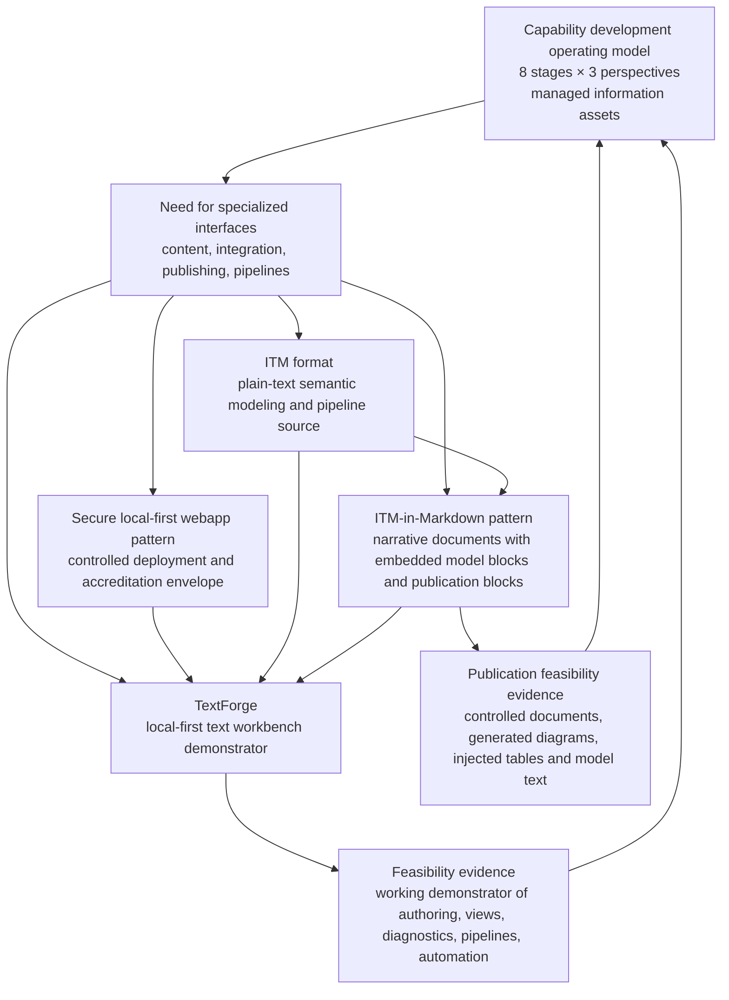

The operating model defines the **problem and target architecture of work**. The proof-of-concept developments test whether parts of that target architecture can be implemented practically.

The proof-of-concept stack should be read as:

```text
Operating model asks: what must be managed?
Secure webapp asks: how can specialized tools be deployed safely?
ITM asks: what kind of model format would be easy to author, diff, validate, and transform?
ITM-in-Markdown asks: how can model-backed views and text be published inside normal readable documents?
TextForge asks: can these ideas operate together in a usable workbench?
```

The added Markdown integration layer matters because the operating model is not only about authoring models. It is also about communicating controlled information to audiences who will consume reports, whitepapers, architecture definitions, decision packs, and publication portals.

---

# 3. Incremental Complexity

This paper follows the same incremental pattern as the operating-model work.

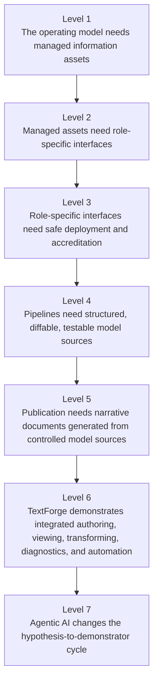

A reader can stop after the first three levels and still understand the basic point: the operating model requires managed information assets, and those assets require usable interfaces. Later sections explain how the proof-of-concept work tests that assumption.

---

# 4. The Operating Model Creates an Interface Requirement

The operating model is not only a lifecycle diagram. Its distinctive shift is from process description to **information asset governance**.

A process-centric model asks:

```text
What activities happen?
```

An information-centric operating model asks:

```text
What information asset is produced, updated, governed, reused, validated, published, and exchanged?
```

This shift creates a tooling and interface requirement.

If each information asset has an owner, semantic structure, lifecycle state, traceability links, validation rules, publication views, and pipeline dependencies, then users need interfaces that support those responsibilities.

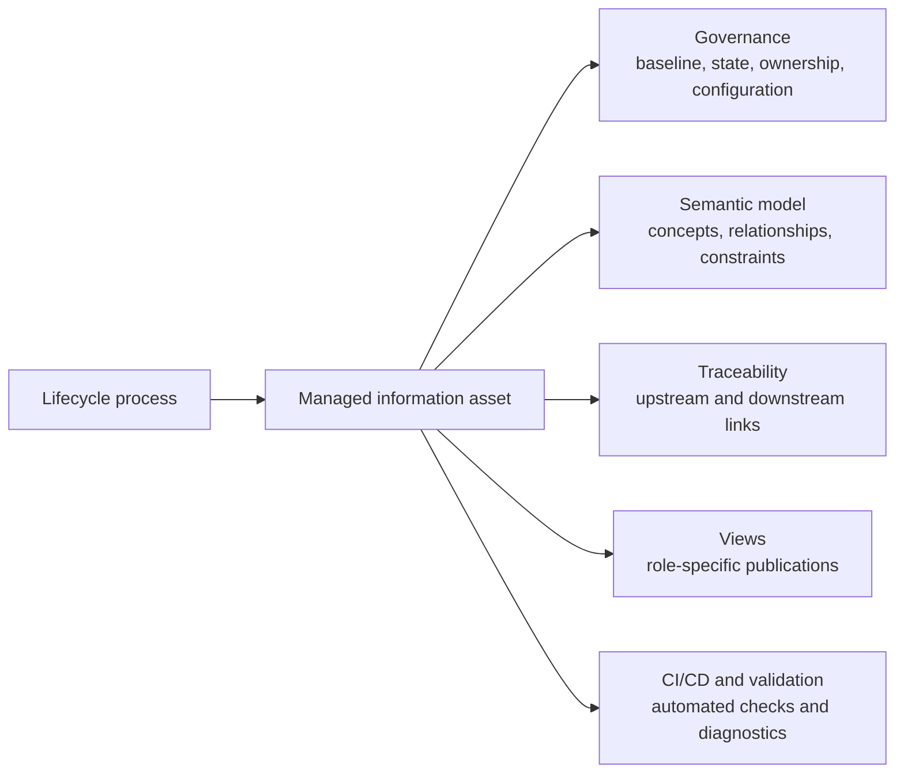

The operating model therefore implies four broad interface families.

| Interface family | Purpose | Example operating-model use |
|---|---|---|
| Content specialist interface | Let a domain contributor create structured information without needing to understand the whole repository. | A mission analyst captures scenarios, effects, stakeholders, or measures. |
| Integration specialist interface | Let an accountable integrator reconcile multiple sources into a coherent baseline. | A system architect maintains the integrated capability architecture. |
| Publishing specialist interface | Let controlled information be packaged for different audiences. | An information manager publishes stakeholder views, dashboards, or decision packs. |
| Pipeline specialist interface | Let transformations, validation, mappings, rendering, and lineage be automated. | A data / pipeline engineer maintains traceability checks and generated views. |

The proof-of-concept work was conceived to test whether lightweight web interfaces could support these interface families without becoming a heavy, centralized, proprietary platform.

---

# 5. Why Specialized Interfaces Matter

The operating model separates role responsibilities because one generic interface rarely serves all users well.

A capability sponsor, mission analyst, system architect, requirements engineer, configuration manager, publishing specialist, and pipeline engineer all need to interact with related information, but they do not need the same interface.

A content specialist needs simplicity:

```text
Show me the part I own.
Guide me through required fields.
Validate my input.
Let me see the immediate effect of my changes.
Do not expose me to unnecessary repository complexity.
```

An integration specialist needs coherence:

```text
Show me conflicts.
Show me traceability gaps.
Show me what changed.
Show me how local assets affect baselines.
Let me govern the integrated model.
```

A publishing specialist needs audience control:

```text
Show me which information is approved.
Let me generate different views for different audiences.
Preserve lineage and publication status.
Do not make me manually recreate content in slides and reports.
```

A pipeline specialist needs automation:

```text
Let me define transformations.
Let me test validation rules.
Let me inspect intermediate artifacts.
Let me version the pipeline.
Let me integrate the pipeline with CI/CD.
```

This is the practical reason the secure webapp, ITM, ITM-in-Markdown, and TextForge work matters. It explores whether these specialized experiences can be built quickly, safely, and repeatably.

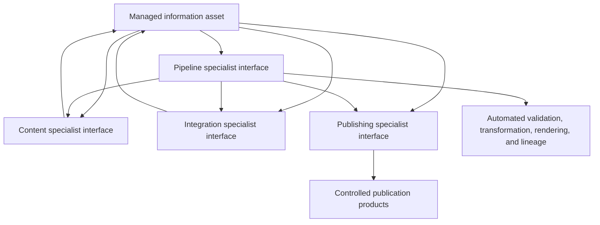

---

# 6. Secure Local-First Web Apps as an Accreditation Pattern

The secure webapp concept responds to a practical deployment problem.

If the operating model encourages specialized interfaces, an organization may need many small tools:

- a requirements authoring helper;
- a stakeholder need capture form;
- a validation evidence pack generator;
- an architecture view editor;
- a dependency graph explorer;
- a traceability checker;
- a model-to-document renderer;
- a supplier delivery package validator.

Accrediting each of these as a full custom application can become slow. The secure local-first webapp idea proposes a different approach: accredit a reusable **security envelope** and then verify that each application stays within it.

Core claims include:

```text
No unapproved network access.
No remote scripts, plugins, or CDN runtime dependencies.
No silent local file read.
No silent local file modification.
Only explicit user-mediated upload/open/import and download/export.
Optional application-private workspace through approved browser storage.
No File System Access API, persistent file handles, or real directory handles.
Verification by an accreditor-trusted checker, not by developer self-attestation.
```

This is directly relevant to specialized operating-model interfaces.

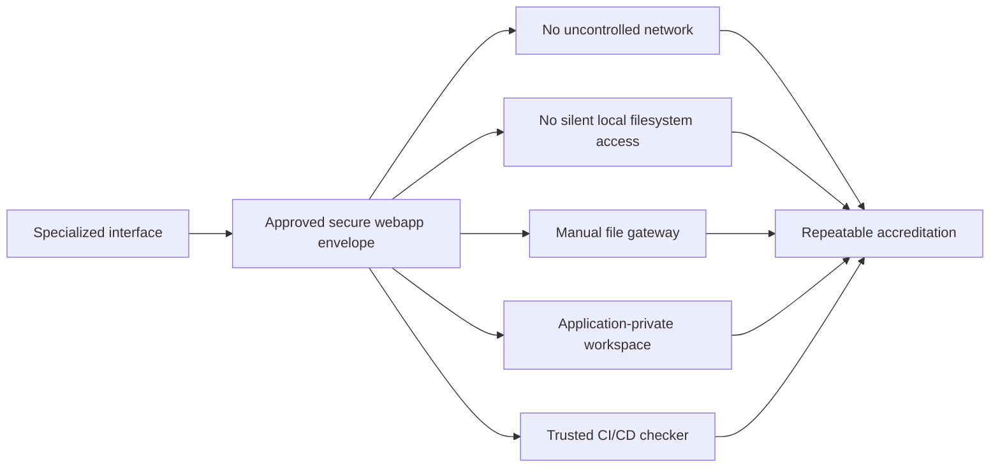

The security idea is not that browser apps are automatically safe. The idea is narrower and more useful:

> A class of local-first tools can be made easier to accredit if their security-relevant behavior is constrained by a reusable profile, enforced by build and artifact checks, and kept separate from application business logic.

For the operating model, this means that specialized interfaces do not have to imply uncontrolled software proliferation. They can be treated as constrained instances of an approved deployment pattern.

---

# 7. ITM as a Proof-of-Concept Information-Asset Format

The ITM format was created to test a different hypothesis:

> Could a simple, human-readable, plain-text model format make specialized authoring interfaces, pipelines, validation, version control, and publication easier to implement?

ITM starts with one line equals one thing. It then grows incrementally into hierarchy, stable identifiers, typed links, attributes, Markdown descriptions, namespaces, validation rules, plugins, styles, viewpoints, views, overlays, packages, and repositories.

This makes it relevant to the operating model because managed information assets need several properties:

| Operating-model need | ITM proof-of-concept response |
|---|---|
| Human-readable information assets | ITM remains inspectable in a plain text editor. |
| Configuration control | ITM is diffable, mergeable, and Git-friendly. |
| Semantic models | ITM can express entities, types, relationships, attributes, and rules. |
| Traceability | ITM uses stable ids and explicit links. |
| Validation | ITM includes validation rules and diagnostics. |
| Publication | ITM can define viewpoints and views. |
| Pipeline automation | ITM can declare required plugins and pipeline steps. |
| Extensibility | ITM can use namespaces, packages, and repositories. |

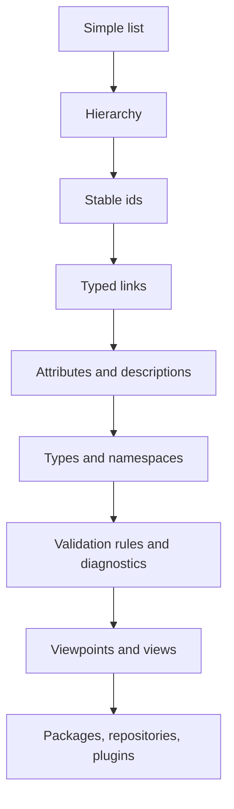

ITM is not proposed as the inevitable final standard format. It is a useful experimental vehicle because it makes the operating-model data problem visible in a low-friction way.

The most important lesson is not the exact syntax. The important lesson is that operating-model assets benefit from a format or repository pattern that is:

```text
structured enough for automation,
human enough for review,
plain enough for configuration control,
extensible enough for domain profiles,
and deterministic enough for CI/CD validation.
```

That lesson applies whether the final implementation uses ITM, SysML, ArchiMate exchange files, BPMN XML, JSON, YAML, GraphML, a graph database, a requirements tool API, or a hybrid of several formats.

---

# 8. TextForge as the Demonstrator

TextForge brings the previous ideas together as a local-first, text-first workbench.

Its README describes it as a workbench for editing, visualizing, and transforming structured text. Its current feature set includes:

- multi-document CodeMirror workspace;
- broad language support, including Markdown, ITM, Lua, JSON, XML, BPMN XML, CSV/TSV, Mermaid, Graphviz DOT, JavaScript, and Python;
- local-only execution with no app-code network APIs and an extension CSP with `connect-src 'none'`;
- popup-hosted viewers with search, zoom, export, detach, follow-source refresh, and window layout controls;
- diagnostics, pipeline traces, Lua console, Lua script manager, plugin manager, and bundled resource browser;
- IndexedDB persistence with localStorage fallback for workspace state;
- viewers for Markdown, BPMN, SVG, trees, mind maps, Cytoscape, Sigma/Graphology graphs, syntax-highlighted source, and tables;
- restricted Lua runtime for user extensibility without granting browser, DOM, network, filesystem, or unrestricted JavaScript interop.

In operating-model terms, TextForge is not just an editor. It is a demonstration of an **information-asset workbench pattern**.

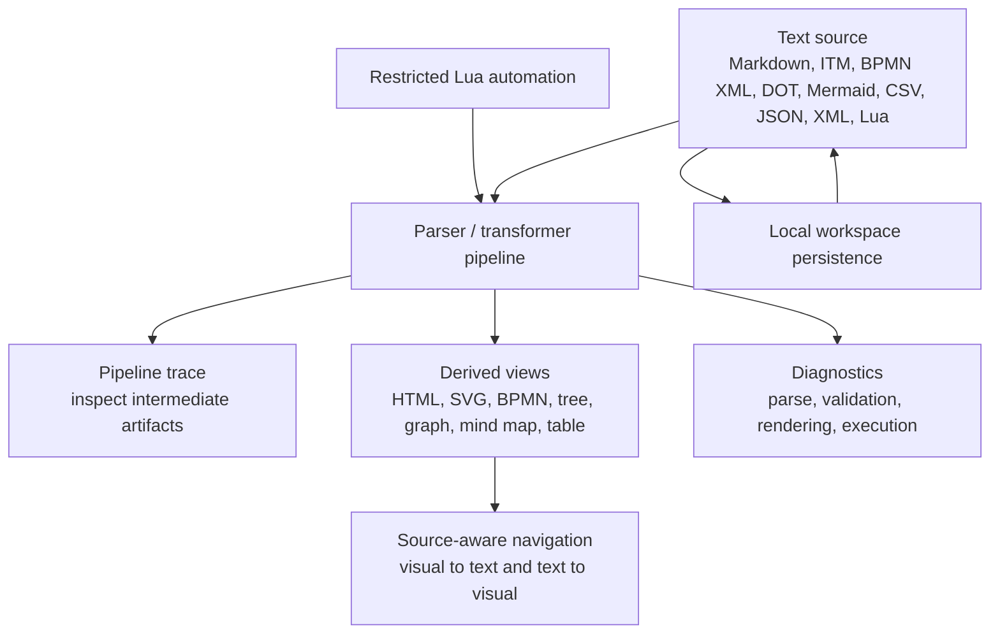

This pattern is directly aligned with the operating model's information-asset roles.

| Operating-model role | TextForge demonstration |
|---|---|
| Content specialist | Edit plain text / structured text with immediate previews and diagnostics. |
| Integration specialist | Inspect trees, graphs, BPMN, source ranges, pipeline traces, and intermediate model artifacts. |
| Publishing specialist | Generate rendered Markdown, SVG, BPMN, graph, tree, and table views from controlled sources. |
| Pipeline specialist | Build and test transformations, Lua actions, validation logic, and pipeline bridges locally. |

TextForge does not prove that all future tools should look like TextForge. It proves that a relatively lightweight local-first web workbench can combine many of the capabilities implied by the operating model.

---

# 9. How the Proofs of Concept Fit the Operating Model

The proof-of-concept work fits the operating model at three levels.

## 10.1 Level 1: It supports the information-asset concept

The operating model depends on managed information assets. ITM and TextForge show that assets can be represented as structured, inspectable, transformable text while still producing rich visual and document views.

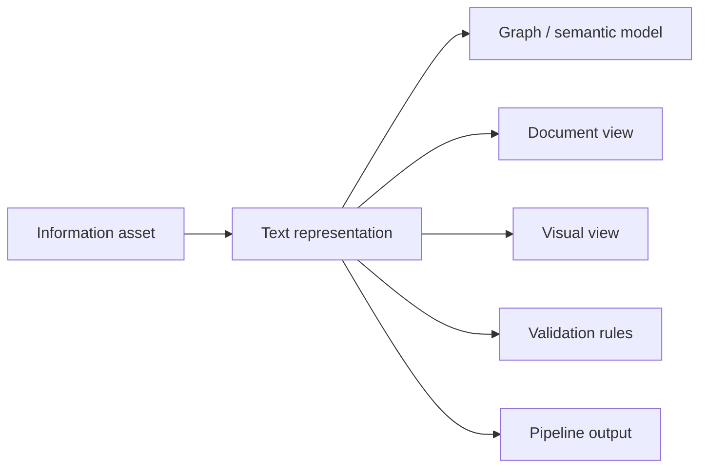

This supports the idea that information assets should be designed for reuse, validation, and publication, not only for manual reading.

## 10.2 Level 2: It supports role-specialized interfaces

The operating model's four information roles imply different interaction patterns. TextForge demonstrates that a single underlying workbench can expose multiple interaction surfaces:

```text
editor surface,
viewer surface,
pipeline trace surface,
script console,
resource browser,
diagnostics surface,
plugin/action surface.
```

This suggests that specialized interfaces can be built by composing smaller role-oriented surfaces rather than building a single monolithic enterprise application.

## 10.3 Level 3: It supports controlled automation

The secure webapp concept and TextForge's local-only / restricted-runtime approach both support controlled automation.

Automation is essential for the operating model because validation, publication, transformation, and traceability cannot scale manually. But automation must be governable.

The proof-of-concept pattern is:


This aligns with the operating model's view of pipelines as governed infrastructure, not ad hoc scripts.

---

# 10. What the Proof-of-Concept Work Demonstrates

The proof-of-concept work demonstrates feasibility in several important areas.

| Feasibility question | Evidence from proof-of-concept work |
|---|---|
| Can structured capability-development information remain human-readable? | ITM shows how models can begin as simple text and grow into typed, linked, validated structures. |
| Can such information be placed under configuration control? | Plain-text ITM and Markdown sources are compatible with Git, diff, review, CI/CD, and repeatable validation. |
| Can rich views remain derived rather than becoming uncontrolled manual artifacts? | TextForge generates rendered Markdown, SVG, BPMN, tree, mind map, graph, and table views from source documents. |
| Can model-backed publications remain readable and source-controlled? | ITM-in-Markdown shows how ordinary Markdown can contain named ITM model blocks and `itm-pub` publication blocks for rendered diagrams, injected descriptions, and generated tables. |
| Can pipelines be inspectable? | TextForge pipeline trace windows and intermediate artifact reopening demonstrate a traceable transformation pattern. |
| Can user extensibility be constrained? | TextForge's restricted Lua runtime demonstrates extensibility without exposing DOM, network, filesystem, or arbitrary JavaScript access. |
| Can local-first tools support accreditation-friendly claims? | The secure webapp pattern defines narrow claims around network, local files, workspace storage, CSP, extension permissions, and trusted CI/CD checking. |
| Can documentation and demonstrators co-evolve? | The commit history shows documentation, hardening, ITM integration, Lua runtime, pipeline controls, viewer improvements, and resource packaging evolving together over a short period. |

The last point matters because the operating model itself is complex. A practical development method needs to support rapid cycles of:

```text
concept → hypothesis → demonstrator → documentation → review → refinement
```

The proof-of-concept work demonstrates that this cycle can be much faster than traditional specification-first software development, especially when agentic AI is used under expert direction.

---

# 11. What the Proof-of-Concept Work Does Not Demonstrate

The conclusions must remain disciplined.

The proof-of-concept work does **not** demonstrate that:

- ITM should become the mandatory standard format for the operating model;
- TextForge should become the standard enterprise tool;
- browser-based interfaces are the only valid implementation pattern;
- local-first tools replace enterprise repositories;
- a secure webapp profile proves full application correctness;
- restricted Lua is the only safe extensibility mechanism;
- generated diagrams can replace formal model repositories where those are needed;
- a fast demonstrator is automatically production-ready;
- agentic AI removes the need for architecture, governance, testing, accreditation, or expert review.

The correct interpretation is narrower:

> The proof-of-concept work demonstrates that the operating model's ideas are implementable enough to be tested in working software.

This distinction is important for standardization.

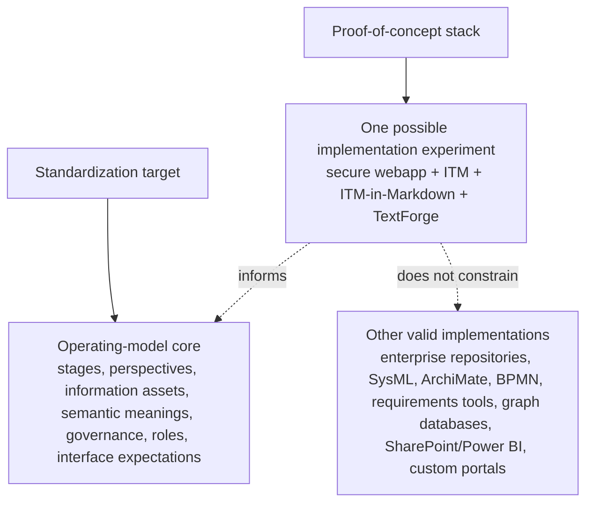

The operating model should standardize meanings and interfaces, not prematurely standardize one toolchain.

---

# 12. Relationship to CI/CD and Configuration Control

A recurring theme across the proof-of-concept elements is compatibility with CI/CD and configuration control.

The operating model needs controlled baselines. The secure webapp idea needs automated conformance checks. ITM needs deterministic parsing and validation. ITM-in-Markdown needs deterministic publication from named model sources. TextForge needs repeatable transformations and diagnostics.

These ideas reinforce each other.

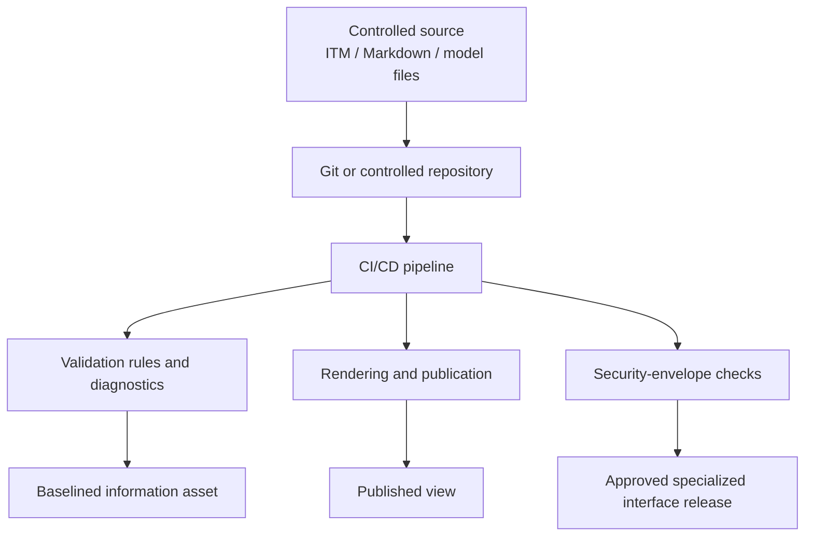

This is significant for the operating model because it suggests a practical way to make information assets executable:

- store canonical sources in controlled repositories;
- validate them automatically;
- generate publication views;
- verify tool security envelopes;
- package outputs as controlled baselines;
- route exceptions to human review.

The resulting pattern is close to DevSecOps, but applied to information assets and model-based capability development rather than only to software delivery.

---

# 13. The TextForge Commit Log as Development Evidence

The public TextForge commit history shows an unusually dense development period between **May 16 and May 22, 2026**.

Observed commit themes include:

| Date | Observed themes |
|---|---|
| 2026-05-16 | Initial commit, initial concepts baseline, core plugins for CSV/JSON/XML/Markdown/diagram processing, local access fix, first and second viewer improvement rounds. |
| 2026-05-17 | Lua pivot dependencies, sandboxed Lua runtime foundation, Lua actions and console UI, startup smoke gate, documentation and examples, bundled resources, source viewer selection bridge, file build verification hardening. |
| 2026-05-18 | Transformation pipeline behavior, source range selection, tab indentation support, graph layout controls. |
| 2026-05-19 | BPMN viewer and BPMN-to-SVG pipeline, SVG and Mermaid fixes, ITT-to-ITM rename, ITM version bump, model.itm pipeline, ITM pivot whitepaper, ITM tree/mind map/graph rendering, ITM serializer. |
| 2026-05-20 | ITM submodule and package version updates. |
| 2026-05-21 | ITM style parsing, removal of ITT, ITM submodule update, effective ITM parsing and pipeline controls, further Lua pivot improvements. |
| 2026-05-22 | Viewer renderer registry, app shell refactor, markdown layout and diagram pan/zoom, direct HTML resource view, documentation update. |

A simple timeline is useful.

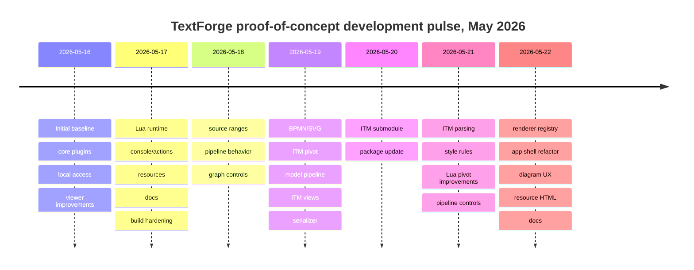

The commit log does not prove, by itself, that agentic AI caused the speed of development. A commit history shows pace and content, not causation.

However, read in context, it is strong evidence of a useful working method:

```text
formulate a conceptual hypothesis,
produce a whitepaper to make the hypothesis explicit,
implement a small demonstrator,
observe implementation friction,
revise the concept,
update the documentation,
repeat.
```

This is exactly the kind of method that agentic AI can accelerate when guided by a knowledgeable human operator.

The important point is not that the AI replaces expertise. It is that agentic AI can compress the time between:

```text
architectural idea → code experiment → observable behavior → refined documentation → next hypothesis
```

For an operating model that is itself about managed information flows, that is strategically important.

---

# 14. Agentic AI and the Hypothesis-to-Demonstrator Cycle

The operating model is abstract. It defines layers, stages, perspectives, assets, semantic models, roles, interfaces, and governance rules. Abstract models are necessary, but they can remain speculative unless they are tested.

Agentic AI changes the economics of testing.

Previously, a method owner might need to choose between two expensive paths:

1. document the concept in detail but leave it untested;
2. start a conventional software project and wait weeks or months for a working demonstrator.

The proof-of-concept pattern suggests a third path:

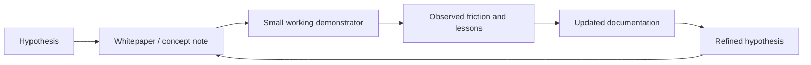

Agentic AI can help at multiple points:

| Cycle step | AI-enabled acceleration |
|---|---|
| Hypothesis articulation | Drafts concept papers, option analyses, and implementation notes quickly. |
| Architecture sketching | Produces candidate data models, diagrams, code structures, and interface patterns. |
| Implementation | Generates scaffolding, adapters, viewers, parsers, tests, and examples under human direction. |
| Debugging | Helps interpret errors, propose fixes, and refactor rapidly. |
| Documentation | Keeps README, user guides, whitepapers, examples, and architecture notes aligned with implementation. |
| Review preparation | Produces summaries, traceability tables, and decision records for human review. |

This is particularly valuable for operating-model development because the goal is not only to build software. The goal is to learn whether certain ways of organizing work, information, roles, and tools are practical.

A fast demonstrator can invalidate weak ideas early. It can also reveal hidden requirements that pure process modelling would miss.

Examples include:

- the need for source-aware navigation between text and rendered views;
- the importance of pipeline trace inspection;
- the value of diagnostics as a shared service;
- the security need to separate user extensibility from arbitrary JavaScript;
- the usability need for bundled resources and examples;
- the need to keep derived views inspectable and reproducible;
- the accreditation value of explicit local-file and network boundaries.

These lessons are directly relevant to the operating model.

---

# 15. How the Proofs of Concept Map to the Four Information Roles

The operating model identifies four core information roles. The proof-of-concept work can be mapped directly to them.

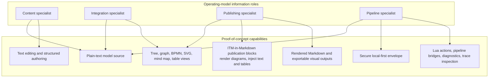

## 16.1 Content specialist

A content specialist benefits from:

- plain text sources;
- immediate previews;
- validation diagnostics;
- local examples;
- simple authoring patterns;
- ability to work without understanding the full repository or toolchain.

ITM and TextForge both support this pattern.

## 16.2 Integration specialist

An integration specialist benefits from:

- stable identifiers;
- typed links;
- graph views;
- tree views;
- source-aware navigation;
- intermediate pipeline inspection;
- diagnostics and validation rules.

TextForge's graph and pipeline features demonstrate this need.

## 16.3 Publishing specialist

A publishing specialist benefits from:

- generated Markdown views;
- model-backed Markdown documents with `itm-pub` render and inject blocks;
- rendered diagrams;
- exportable SVG and HTML-like outputs;
- bundled publication resources;
- separation between canonical sources and audience-facing views.

This supports the operating model's principle that publication is part of the knowledge supply chain, not a cosmetic afterthought.

## 16.4 Pipeline specialist

A pipeline specialist benefits from:

- scriptable transformations;
- restricted extensibility;
- pipeline bridges;
- trace inspection;
- validation rules;
- deterministic source formats;
- CI/CD compatibility.

The Lua pivot in TextForge demonstrates one way to support this role without giving untrusted scripts full browser or filesystem authority.

---

# 16. The Deeper Architectural Pattern

The deeper pattern is more general than TextForge or ITM.

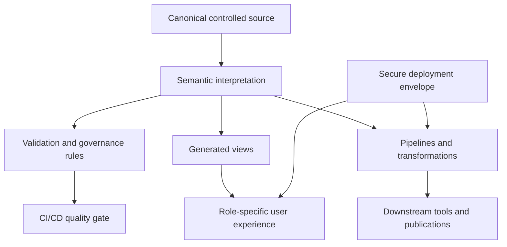

This pattern can be implemented in many ways.

| Architectural concern | Proof-of-concept implementation | Other possible implementations |
|---|---|---|
| Canonical source | ITM / Markdown / structured text | SysML repository, ArchiMate model, BPMN XML, graph database, requirements tool, controlled spreadsheet. |
| User workbench | TextForge | SharePoint portal, custom React app, desktop tool, Sparx add-in, Power BI-backed portal, VS Code extension. |
| Security envelope | Secure local-first webapp profile | Managed desktop package, enterprise web app, VDI-hosted tool, controlled plugin framework. |
| Automation | Lua actions and pipeline bridges | Python, TypeScript, CI/CD jobs, PowerShell, server-side services, model repository APIs. |
| Views and publications | Markdown, ITM-in-Markdown, SVG, BPMN, trees, graphs, mind maps | Power BI, Graphviz, Mermaid, Cytoscape, Gephi, web portals, PDFs, slide decks. |

The standard should define the architectural concerns and conformance expectations, not one mandatory technology choice.

---

# 17. Practical Implications for the Operating Model

The proof-of-concept work suggests several practical implications.

## 18.1 Define interface capability requirements

The operating model should define what each interface family must support.

For example, a content specialist interface should support:

```text
structured authoring,
field guidance,
validation feedback,
version awareness,
links to related assets,
local preview,
and safe export or submission.
```

An integration specialist interface should support:

```text
cross-asset traceability,
conflict detection,
change impact analysis,
baseline status,
graph exploration,
and issue diagnostics.
```

A publishing specialist interface should support:

```text
audience-specific views,
controlled source references,
publication status,
repeatable generation,
and traceable outputs.
```

A pipeline specialist interface should support:

```text
pipeline definition,
execution tracing,
validation rules,
plugin management,
configuration control,
and CI/CD integration.
```

## 18.2 Treat security profiles as reusable infrastructure

If specialized interfaces proliferate, their accreditation cannot be one-off. The secure webapp concept suggests a reusable accreditation pattern:

```text
approved profile + trusted checker + controlled templates + artifact verification
```

This pattern should be considered part of the operating-model platform architecture.

## 18.3 Require canonical source and generated views to be distinguishable

The proof-of-concept work reinforces an important governance principle:

```text
Canonical information should be distinguishable from derived views.
```

A rendered graph, dashboard, or document view may be authoritative as a publication product, but it should remain traceable to its source asset and generation rules.

## 18.4 Make diagnostics a first-class concept

Diagnostics should not be an afterthought. Parsers, validators, renderers, transformers, exporters, and visual editors should all be able to emit diagnostics.

This matters because operating-model adoption will involve imperfect models, partial maturity, and incremental migration. Diagnostics allow progressive improvement without requiring everything to be perfect at the start.

## 18.5 Encourage experimental demonstrators

The operating model should encourage small demonstrators that test specific assumptions:

- a needs-baseline authoring interface;
- a requirements-to-verification coverage checker;
- a model-to-brief generator;
- a supplier package validator;
- an integration dependency graph viewer;
- a validation evidence publication pipeline.

The TextForge work shows that demonstrators can be useful even before they are production tools.

---

# 18. Possible Future Experiments

The next proof-of-concept experiments should not try to make TextForge the standard tool. They should test specific operating-model hypotheses.

| Experiment | Hypothesis tested |
|---|---|
| Need baseline authoring pack | Content specialists can capture stakeholder needs, drivers, constraints, value measures, and assumptions in a structured but readable way. |
| Requirements-to-evidence pipeline | Requirements, acceptance criteria, verification methods, and evidence can be checked automatically for coverage gaps. |
| Architecture-to-publication pipeline | An integrated capability architecture can generate different views for leadership, technical boards, suppliers, and validation teams. |
| Model-backed Markdown publication pack | Architecture documents and decision packs can combine readable narrative with generated diagrams, injected model descriptions, and traceable tables from controlled model sources. |
| Supplier package validator | Acquisition and supply packages can be checked for required metadata, interfaces, obligations, and evidence links. |
| Local secure workspace profile | Sensitive multi-file work can be handled locally without silent filesystem access or network egress. |
| CI/CD model governance pipeline | Information assets can be validated, rendered, packaged, and baselined through automated gates. |
| Role-specific front ends | Different operating-model roles can use simplified interfaces over the same underlying asset model. |

These experiments should produce:

```text
working demonstrator,
example source assets,
validation rules,
generated views,
lessons learned,
updated operating-model guidance.
```

---

# 19. Adoption Guidance

Organizations interested in this pattern should avoid jumping straight to tool selection.

A better adoption sequence is:

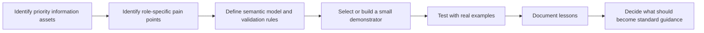

## 20.1 Start with an information asset

Choose one asset that matters, such as:

- need and value baseline;
- integrated capability architecture;
- requirements baseline;
- acquisition package;
- verification evidence set;
- validation evidence set;
- supplied configuration package.

## 20.2 Define the semantic core

Before choosing tools, define the concepts and relationships that must be controlled.

For example:

```text
Requirement derives from Need.
Requirement is allocated to System Element.
Requirement is verified by Verification Method.
Verification Method produces Evidence.
Evidence supports Acceptance Decision.
```

## 20.3 Build the smallest useful interface

Do not build an enterprise platform first. Build a role-specific interface or pipeline that tests one concrete use case.

## 20.4 Keep the implementation replaceable

Use the proof-of-concept as evidence and learning, not as a lock-in mechanism.

The standard should capture:

```text
required meanings,
required traceability,
required governance states,
required validation behavior,
required publication lineage,
required interface capabilities.
```

The implementation should remain replaceable.

---

# 20. Conclusion

The secure webapp, ITM, ITM-in-Markdown, and TextForge work should be understood as proof-of-concept evidence for the capability development operating model.

The operating model says that capability development should be governed through:

```text
8 V-model stages,
3 perspectives,
ISO-aligned process anchors,
managed information assets,
semantic models,
role responsibilities,
interface patterns,
pipelines,
governance,
configuration control,
and cross-layer exchange.
```

The proof-of-concept work asks whether some of that can be made practical:

```text
Can specialized interfaces be secure enough to accredit repeatedly?
Can structured model information remain plain-text and CI/CD-friendly?
Can model-backed Markdown documents connect narrative, generated diagrams, injected tables, and controlled source annexes?
Can a local-first workbench connect editing, viewing, transformation, diagnostics, scripts, and publication?
Can agentic AI accelerate the cycle from hypothesis to demonstrator to documentation?
```

The evidence suggests yes.

But the standardization lesson is not to standardize the proof-of-concept stack. The lesson is to standardize the operating-model semantics and interface expectations, while allowing multiple implementation routes.

TextForge, ITM, ITM-in-Markdown, and the secure local-first webapp pattern are therefore best described as:

```text
feasibility probes,
implementation laboratories,
and communication artifacts
for exploring how the operating model could become executable.
```

They make the operating model more credible because they show that its abstract ideas can be tested in working software, reviewed in documentation, and evolved quickly through a disciplined hypothesis-to-demonstrator cycle.

---

# Appendix A — High-Level Summary of Source Files

This appendix is included so the reader can understand the source base behind the synthesis without reading every input document first.

| Source | High-level summary | Role in this V2 whitepaper |
|---|---|---|
| `capability-model.md` | Defines the overarching operating model for capability development. It frames capability development as a recursive, multi-layer information supply chain built around eight V-model stages, three perspectives, ISO process anchors, managed information assets, semantic models, governance, tailoring, roles, interfaces, maturity, and cross-layer supply/acquisition relationships. | Provides the conceptual framework that the proof-of-concept work is intended to study, reinforce, and make more credible before focused MVP implementation. |
| `secure-web-apps.md` | Defines a secure local-first web application accreditation pattern. Its core claims include no unapproved network access, no remote code loading, no silent user-visible local file access or modification, manual import/export boundaries, an application-private workspace, strict deployment profiles, trusted checkers, and DevSecOps enforcement. | Provides the security and accreditation pattern for deploying specialized operating-model interfaces without turning every small tool into a broad bespoke accreditation problem. |
| `itm-format.md` | Defines ITM as a progressively adoptable plain-text model format. It starts with simple lists and grows into hierarchy, identifiers, typed links, attributes, descriptions, directives, namespaces, types, selectors, validation rules, diagnostics, plugins, styles, viewpoints, views, overlays, packages, and repositories. | Provides the proof-of-concept format for model-backed information assets that are human-readable, diffable, Git-friendly, pipeline-friendly, and suitable for CI/CD validation. |
| `markdown-itm.md` | Defines how ITM can be embedded in Markdown using named model blocks and `itm-pub` publication blocks. Markdown remains the narrative container; ITM blocks hold model content; publication blocks render diagrams or inject model-derived text and tables. Block order does not define semantics; named imports and default models do. | Provides the missing publication bridge: controlled model-backed documents that remain ordinary Markdown while supporting repeatable diagrams, generated tables, source annexes, and traceable narrative publication. |
| `README.md` from TextForge | Describes TextForge as a local-first, text-first workbench for editing, visualizing, and transforming structured text. It supports multiple languages and viewers, source-aware navigation, diagnostics, pipeline traces, restricted Lua automation, local-only behavior, IndexedDB workspace persistence, and bundled resources. | Provides the working demonstrator showing that secure local-first deployment, structured text, multi-view rendering, pipelines, diagnostics, scripting, and documentation can be brought together in one experimental workbench. |
| Public TextForge commit history on GitHub, reviewed 2026-05-22 | Shows a dense development pulse from initial baseline through core plugins, Lua runtime, viewer improvements, source ranges, BPMN, SVG, ITM pivot, ITM style parsing, renderer registry, app-shell refactoring, documentation, and resource updates. | Supports the discussion about development speed and the way agentic AI-enabled development can compress the hypothesis-to-demonstrator-to-documentation cycle, while acknowledging that commit history shows pace and content rather than proving causation. |

These sources collectively show a layered discovery path:

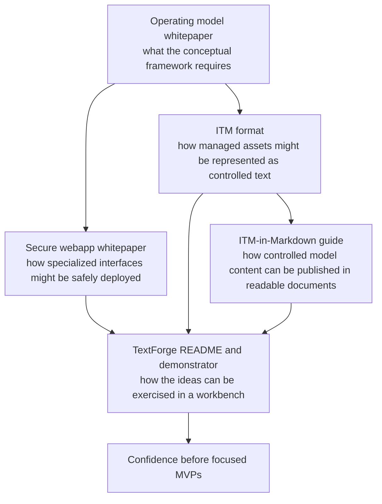

The intended interpretation is cumulative. The source set does not define a mandatory future stack. It defines a body of discovery evidence showing that the operating model's abstract ideas can be explored in concrete, reviewable, and rapidly evolving artifacts.

---

# Appendix B — Compact Message for Stakeholders

The operating model requires managed information assets. Managed information assets require good role-specific interfaces. The secure webapp idea tests whether such interfaces can be deployed safely and accredited continuously. ITM tests whether plain-text semantic models can make those assets easier to author, validate, version, transform, and publish. ITM-in-Markdown tests whether controlled model content can be embedded into ordinary narrative documents and regenerated as diagrams, tables, and injected text. TextForge tests whether these ideas can work together in a local-first demonstrator.

The demonstrator is not the standard. It is evidence that the standard's ideas are technically feasible.

---

# Appendix C — Recommended Standardization Boundary

| Should be standardized | Should remain implementation choice |
|---|---|
| V-model stages | Specific software tool. |
| Three perspectives | Specific UI framework. |
| Information asset definitions | Specific storage format. |
| Semantic concepts and mandatory relationships | ITM versus other model formats. |
| Governance states and baseline rules | Browser app versus desktop app versus enterprise platform. |
| Role responsibilities | Lua versus Python versus TypeScript automation. |
| Interface capability requirements | Specific renderer or diagram engine. |
| Validation expectations | Exact parser implementation. |
| Publication lineage requirements | Exact publication tool or Markdown integration syntax. |
| Security claims for approved tool classes | Exact packaging strategy, unless selected by local accreditation. |

---

# Appendix D — Example Conformance Questions for Future Demonstrators

A future demonstrator should be evaluated with questions such as:

1. Which operating-model information asset does it support?
2. Which information role does it primarily serve?
3. Which part of the semantic model does it make explicit?
4. Which validation rules does it enforce?
5. Which diagnostics does it emit?
6. Which source information is canonical?
7. Which views are derived?
8. How are generated outputs traced back to sources?
9. How does it preserve configuration control?
10. How does it fit CI/CD?
11. What security profile does it require?
12. What assumptions did the demonstrator confirm?
13. What assumptions did it weaken or disprove?
14. What should be added to the operating-model guidance as a result?

---

# Appendix E — Example Implementation Pattern

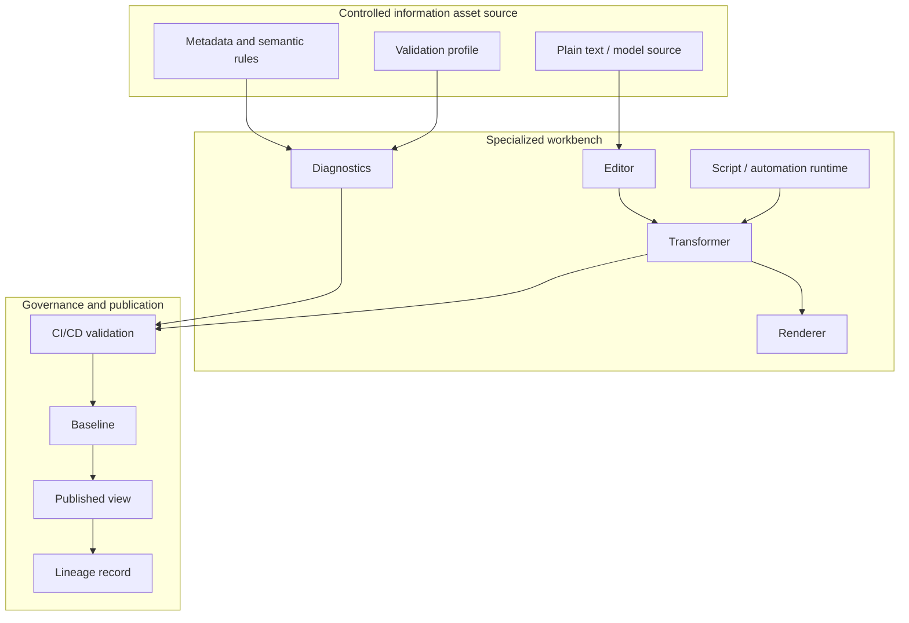

This pattern can be realized with TextForge and ITM, but it can also be realized through other tools and repositories. The standard should preserve the pattern, not freeze the prototype.
