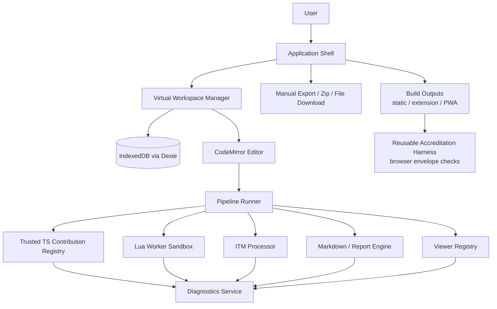
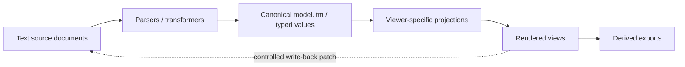
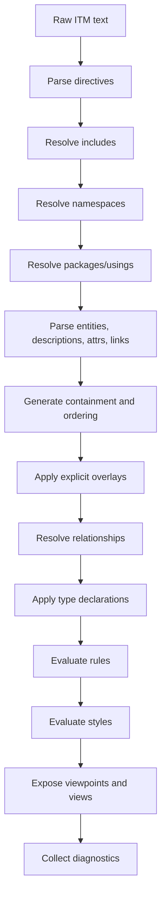
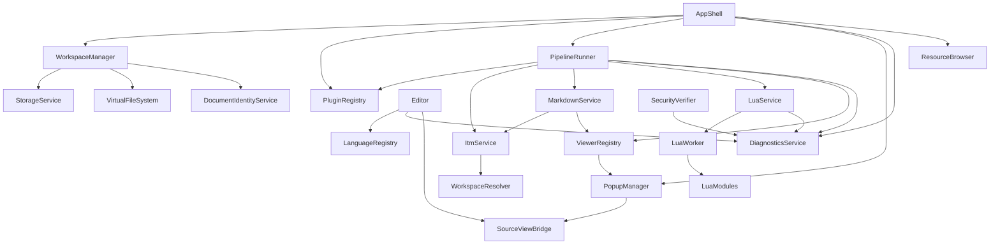

# TextForge Rebuild Whitepaper

**Version:** 5.0  
**Purpose:** Implementation blueprint for rebuilding TextForge from scratch as a React-based local-first, text-first workbench while preserving the security posture, Lua pivot, virtual workspace concept, ITM source-of-truth model, and Markdown/report generation approach.

**Major V2 baseline retained:**

- Select **React** rather than Preact because compatibility, agentic coding, and ecosystem leverage are more important than minimum bundle size.
- Revise the reusable component selection around React-native libraries and coding-agent-friendly implementation patterns.
- Do not carry ITT compatibility into the rewrite; ITM is the only canonical indented model format.

**Major V5 change:**

- Integrate the secure local-first web application accreditation concept while keeping the accreditation harness **reusable and browser-envelope focused**.
- The harness verifies that browser-enforced safeguards are present: CSP, extension/PWA manifests, service-worker pattern, remote asset policy, network policy, and forbidden privileged browser APIs.
- The harness does **not** attempt to prove internal TextForge architecture discipline such as whether only one internal gateway touches IndexedDB. That is an implementation-quality concern, not the reusable accreditation boundary.
- TextForge may still use internal gateways for maintainability, but the accreditation claim should rest primarily on browser security controls and deployment packaging.

---

## 1. Executive summary

TextForge should be rebuilt as a **React-based, local-first, text-first structured-text workbench**. Its central promise is that plain text remains the canonical source while diagrams, graphs, rendered Markdown, BPMN views, SVGs, uploaded images, PDFs, tables, reports, and transformed outputs remain derived, inspectable, and disposable artifacts.

The rebuild should not start as a generic web IDE. It should start as a deterministic local document workbench with four pillars:

1. **A virtual workspace** backed by IndexedDB, with explicit manual upload/download as the only file boundary.
2. **A canonical ITM object model** used as the internal structural representation for trees, graphs, diagrams, views, report fragments, and model-driven transformations.
3. **A pipeline-based contribution architecture** where trusted internal TypeScript contributions parse, transform, render, validate, and export content.
4. **A restricted Lua automation layer** for user-defined transformations and actions, replacing unsafe user-provided JavaScript plugins.
5. **A reusable browser-envelope accreditation profile** that demonstrates TextForge is packaged with the expected browser safeguards: no unapproved network egress, no remote code loading, no privileged local filesystem APIs, no broad extension permissions, and no unsafe service-worker escape path.

The recommended rebuild should use React as the UI foundation and reuse proven libraries where they do not compromise the product model:

| Area | Selected component |
|---|---|
| UI runtime | React 19.x + TypeScript |
| Build tool | Vite React TypeScript app |
| Editor | CodeMirror 6 |
| Workspace tree UI | React Arborist |
| IndexedDB persistence | Dexie.js |
| Zip import/export | fflate |
| Markdown preview | markdown-it |
| Markdown/report AST pipeline | unified / remark / rehype |
| Mermaid diagrams | Mermaid |
| Graphviz rendering | Viz.js or equivalent local Graphviz WASM |
| Image/PDF preview | browser-native image elements and PDF embedding |
| Graph viewer | Cytoscape.js |
| Large graph viewer | Sigma.js + Graphology |
| Mind map viewer | jsMind |
| BPMN viewer/modeler | bpmn-js + bpmn-moddle |
| Future visual graph editing | React Flow, behind controlled write-back only |
| Lua runtime | Fengari |
| Lua console | xterm.js, optional but aligned with current direction |
| Popovers/menus | Floating UI, with Radix UI/shadcn-style primitives where useful |
| Panels/layout | react-resizable-panels |
| Drag/drop outside tree | dnd-kit |
| Tabular inspectors | TanStack Table where complex table state is needed |
| App state | Zustand or small custom stores, not Redux by default |
| Accreditation harness | reusable scripts checking CSP, manifests, service workers, remote assets, and forbidden browser APIs |

The key custom components should be: virtual workspace model, ITM integration, pipeline runner, diagnostics model, source/view bridge, report generation orchestration, Lua sandbox policy, controlled write-back, and a reusable browser-envelope accreditation configuration/harness.

---

## 2. Product doctrine

The rebuild should preserve the following invariants.

```text
1. Text is canonical.
2. The workspace is virtual and local.
3. ITM is the canonical structural object model.
4. Viewers are projections, not source owners.
5. Pipelines are explicit, traceable, and diagnosable.
6. User automation is Lua, not JavaScript.
7. No network, no server, no telemetry, no silent filesystem access in the accredited local profile.
8. Diagnostics are universal and first-class.
9. Source/view links are first-class.
10. Reports are generated from Markdown + ITM, not hand-maintained derived artifacts.
```

These invariants should be treated as architectural tests. A new feature that violates one of them should be rejected or redesigned.
### 2.1 V2 scope decision: no ITT compatibility

The rebuild should not include ITT as a supported compatibility format. Earlier ITT material remains useful as historical design input, but the new application should simplify around ITM only.

Rationale:

- ITM already subsumes the relevant indented hierarchy use cases;
- maintaining both ITT and ITM risks duplicate parsers, duplicate style subsets, and duplicate viewer adapters;
- coding agents will implement faster and more consistently against one canonical model;
- documentation, examples, validation, and report generation should converge on ITM;
- removing ITT compatibility reduces migration ambiguity and makes the rebuild cleaner.

Consequences:

- no `itt` language ID in the default rebuild;
- no ITT parser module;
- no ITT examples as first-class bundled examples;
- no ITT style-support documents as maintained target docs;
- existing useful ITT examples should be manually converted to ITM examples if still valuable.


---

## 3. System context

TextForge is intended to run as:

1. a local/static web app where feasible;
2. a packaged browser extension;
3. optionally, a PWA-like local web app if served from a controlled origin.

All accredited local targets must preserve the same security claim:

> TextForge cannot silently access or modify user-visible local files. Local files enter through explicit user upload/import or ZIP import. Local files leave through explicit user download/export, ZIP export, copy, or print. The accredited local profile performs no unapproved network access and loads no remote code, remote plugins, or CDN assets.

This is stronger than “offline-capable.” It is a deliberate accreditation posture.

The security claim should be understood as a **browser-envelope claim**, not a proof of every internal implementation detail. The accreditation harness should verify that the browser and deployment safeguards are present and correctly configured. The browser then enforces the core boundary through CSP, extension permissions, service-worker restrictions, same-origin packaging, and the absence of privileged filesystem APIs.

TextForge-specific architectural discipline remains important, but it should not be confused with reusable accreditation. For example, TextForge should still use a `WorkspaceStorageGateway`, `FileGateway`, and `ExportGateway` because they make the code easier to reason about. However, the reusable accreditation harness should not attempt to prove that only those gateway modules ever touch IndexedDB or user-mediated file input. IndexedDB and ordinary file input are allowed browser capabilities inside the app. The accreditation boundary is about preventing unapproved network egress, remote code loading, broad extension permissions, service-worker escape paths, and privileged silent filesystem access.

### 3.1 Browser-envelope accreditation profile

The default TextForge target should conform to a reusable profile similar to:

```yaml
profile: local-only-manual-file-workspace-webapp
network:
  mode: none
remoteCode:
  scripts: forbidden
  plugins: forbidden
  cdnRuntimeAssets: forbidden
localFiles:
  silentRead: forbidden
  silentWrite: forbidden
  fileSystemAccessApi: forbidden
  directoryHandles: forbidden
  persistentFileHandles: forbidden
  manualFileInput: allowed
  manualDownloadExport: allowed
  zipImportExport: allowed
workspace:
  applicationPrivateWorkspace: allowed
  persistence: indexedDB
  liveLocalDirectoryMirror: forbidden
extension:
  broadHostPermissions: forbidden
  fileAccess: forbidden
  nativeMessaging: forbidden
pwa:
  serviceWorkerArbitraryProxy: forbidden
```

This profile is intentionally application-independent. It can apply to TextForge, another local Markdown tool, a PDF utility, a modelling workbench, or a browser-based document processor.

### 3.2 What the accreditation harness should verify

The reusable harness should check the deployment envelope:

- CSP for the static/PWA target;
- extension manifest permissions for the extension target;
- PWA manifest and service-worker pattern for the PWA target;
- final built HTML and bundles for remote scripts, remote workers, remote imports, CDN assets, and external origins;
- final artifacts for forbidden privileged local filesystem APIs such as `showOpenFilePicker`, `showSaveFilePicker`, `showDirectoryPicker`, `FileSystemFileHandle`, and `FileSystemDirectoryHandle`;
- absence of broad extension permissions such as `<all_urls>`, `file://` access, or `nativeMessaging`;
- no service-worker code that acts as an arbitrary network proxy;
- no runtime network policy that contradicts the declared profile.

The harness should not become a TextForge architecture verifier. It should not need to know the TextForge workspace model, ITM processor, viewer registry, Lua module layout, or whether all storage writes pass through a particular class. Those checks can exist as ordinary project tests, but they are not the reusable accreditation core.

### 3.3 Internal architecture rules versus accreditation rules

The distinction should be explicit:

| Concern | Belongs to | Example |
|---|---|---|
| Browser-enforced no-network posture | Accreditation harness | CSP `connect-src 'none'`, no external origins, no WebSocket to remote host |
| No privileged local filesystem authority | Accreditation harness | no File System Access API, no directory handles, no extension `file://` access |
| No remote code loading | Accreditation harness | no remote scripts, workers, modules, or CDN runtime dependencies |
| Workspace maintainability | TextForge architecture | use `WorkspaceManager` and Dexie consistently |
| Gateway discipline | TextForge architecture | route imports through `FileGateway` for clarity |
| ITM correctness | TextForge tests | parser/resolver/serializer tests |
| Lua API quality | TextForge tests | capability tests for `tf.*` APIs |

This keeps the accreditation harness reusable across applications and prevents it from becoming an overfitted static-analysis project.

---

## 4. Target architecture overview



The accreditation harness is intentionally shown outside the runtime application. It verifies the packaging and browser security envelope. It is not an internal runtime service and should not be coupled to TextForge-specific domain modules.

The important separation is between **source**, **model**, **view**, and **export**.



---

## 5. Selected reusable components and rationale

### 5.0 React 19 and Vite as the UI foundation

**Decision:** Use React 19.x with TypeScript and Vite.

**Rationale:**

- compatibility and coding-agent support matter more than minimum bundle size;
- React is the default target for most reusable UI components and examples;
- React Arborist, React Flow, react-resizable-panels, dnd-kit, TanStack Table, Radix/shadcn-style primitives, and many testing examples are React-first;
- future coding agents are more likely to generate correct React code than Preact compatibility code;
- avoiding `preact/compat` removes a layer of ambiguity from library integration;
- the app is local-first, so a moderately larger bundle is acceptable if runtime behavior remains offline and auditable.

**Non-goal:** Do not adopt server-first React patterns. TextForge should remain a static browser application. React Server Components, Next.js server routes, telemetry, hosted services, and runtime network dependencies are out of scope for the accredited local build.

Recommended baseline:

```text
React 19.x
TypeScript
Vite React TypeScript template
Vitest
Playwright
ESLint
Prettier or equivalent formatting
```

### 5.1 CodeMirror 6 for editing

**Decision:** Preserve CodeMirror 6.

**Rationale:**

- modular extension model;
- good fit for custom languages and DSLs;
- supports linting, folding, decorations, diagnostics, and source ranges;
- lighter and more composable than Monaco;
- already aligned with TextForge’s text-first model.

**Do not use Monaco by default.** Monaco is excellent for a browser IDE, but TextForge is not primarily a clone of VS Code. It is a structured-text workbench with custom model and viewer pipelines.

### 5.2 React Arborist for workspace explorer

**Decision:** Use React Arborist as the virtual workspace tree UI.

**Rationale:**

- tree virtualization;
- file-explorer-like UX;
- drag/drop support;
- rename/select/open patterns;
- allows TextForge to own the underlying workspace model.

React Arborist must be treated as a **view component only**. It must not own persistence, paths, language IDs, include resolution, document identity, or security decisions.

Recommended adapter model:

```ts
export interface WorkspaceTreeNode {
  id: string;
  kind: "folder" | "file";
  name: string;
  parentId: string | null;
  path: string;
  documentId?: string;
  children?: WorkspaceTreeNode[];
}
```

### 5.3 Dexie.js for IndexedDB

**Decision:** Use Dexie.js for persistence.

**Rationale:**

- more maintainable than direct IndexedDB for multi-store workspace state;
- supports versioned schemas and migrations;
- useful for documents, folders, pipeline preferences, Lua scripts, resource metadata, and persisted UI state.

Minimum stores:

```ts
export interface TextForgeDbSchema {
  documents: PersistedDocument;
  workspaceNodes: PersistedWorkspaceNode;
  settings: PersistedSetting;
  pluginPreferences: PersistedPluginPreferences;
  luaScripts: PersistedLuaScript;
  recentViews: PersistedViewState;
}
```

### 5.4 fflate for zip import/export

**Decision:** Use fflate.

**Rationale:**

- small and fast;
- browser-compatible;
- supports folder/workspace import/export through explicit user action;
- avoids requiring File System Access API.

Required use cases:

- import zip into current folder;
- import zip as new workspace;
- export selected folder;
- export workspace root;
- preserve relative paths;
- reject dangerous paths such as `../`, absolute paths, drive roots, or hidden system paths when appropriate.

### 5.5 markdown-it plus unified/remark/rehype

**Decision:** Use both, for different jobs.

```text
Interactive preview: markdown-it
Report/document pipeline: unified + remark + rehype
```

**Rationale:**

- markdown-it is fast and practical for preview;
- unified/remark/rehype is better for AST-level document transformation;
- ITM-in-Markdown report generation needs structural extraction and reconstruction, not just HTML preview.

### 5.6 Cytoscape.js, Sigma.js/Graphology, jsMind

**Decision:** Preserve multiple model viewers.

```text
ITM -> Cytoscape.js      rich interactive graph
ITM -> Sigma/Graphology  large graph exploration
ITM -> jsMind            mind map
ITM -> Tree viewer       hierarchy/source navigation
```

**Rationale:**

No single graph/mindmap library covers all use cases well. TextForge should allow the same ITM source to be projected into multiple derived views.

### 5.7 bpmn-js and bpmn-moddle

**Decision:** Use bpmn-js for BPMN rendering and future controlled editing.

**Rationale:**

- BPMN XML is complex;
- rebuilding BPMN visualization is wasteful;
- bpmn-moddle provides BPMN XML parsing/serialization;
- bpmn-js provides the rendering/modeling surface.

TextForge must still preserve the source-of-truth rule:

```text
BPMN XML source -> bpmn-js viewer/modeler -> reviewed write-back patch -> XML source
```

### 5.8 Fengari for Lua

**Decision:** Use Fengari as Lua VM only.

**Rationale:**

- browser-compatible Lua execution;
- good basis for the Lua pivot;
- allows user-defined transformations without user-provided JavaScript.

TextForge must own the sandbox policy, worker isolation, module whitelist, limits, bridge API, and diagnostics.

---

## 6. Core modules

### 6.1 Application shell

Responsibilities:

- initialize services;
- host layout;
- host top-level menus/actions;
- coordinate editor, workspace, popups, diagnostics, plugins, and resource browser;
- remain thin.

Suggested folder:

```text
src/app/
  App.tsx
  AppShell.tsx
  useAppServices.ts
  useWorkspacePersistence.ts
  usePipelineActions.ts
  usePopupManager.ts
  useSourceSelectionBridge.ts
  useAttentionState.ts
```

The rebuild should explicitly prevent `App.tsx` becoming the central orchestration module.

### 6.2 Workspace manager

Responsibilities:

- own documents;
- own folders;
- own virtual paths;
- own tabs;
- own current document;
- track dirty/current/stale state;
- increment document version on all content, filename, language, metadata, and identity changes;
- provide include resolution for ITM and Markdown/report pipelines;
- persist through Dexie.

Interfaces:

```ts
export interface TextDocument {
  id: string;
  fileName: string;
  languageId: string;
  text: string;
  version: number;
  dirty: boolean;
  identity: DocumentIdentity;
  folderPath?: string;
  createdAt: string;
  updatedAt: string;
}

export interface WorkspaceNode {
  id: string;
  kind: "folder" | "file";
  name: string;
  parentId: string | null;
  path: string;
  documentId?: string;
  createdAt: string;
  updatedAt: string;
}

export interface WorkspaceManager {
  listDocuments(): TextDocument[];
  getDocument(id: string): TextDocument | undefined;
  createDocument(input: CreateDocumentInput): TextDocument;
  updateText(id: string, text: string): TextDocument;
  updateLanguage(id: string, languageId: string): TextDocument;
  renameDocument(id: string, fileName: string): TextDocument;
  moveNode(nodeId: string, newParentId: string | null, newName?: string): void;
  deleteNode(nodeId: string): void;
  resolveVirtualPath(path: string, fromDocumentId?: string): TextDocument | undefined;
}
```

### 6.3 Virtual file system

The virtual file system is not a filesystem API wrapper. It is an application model.

Responsibilities:

- normalize workspace paths;
- prevent path traversal;
- support folder import/export;
- support folder rename/move/delete;
- maintain stable document IDs independent of display path;
- expose read-only resolver functions to parser/report pipelines;
- prevent direct local filesystem persistence.

Forbidden:

- File System Access API;
- directory handles;
- automatic sync to local folders;
- silent file writes;
- network repository resolution unless explicitly introduced in a separately accredited mode.

### 6.4 Storage service

Responsibilities:

- Dexie schema definition;
- migrations;
- workspace load/save;
- localStorage fallback only for emergency/minimal state;
- backup/export state;
- uniqueness repair for document identities/badges after restore or batch upload.

Suggested Dexie schema:

```ts
class TextForgeDb extends Dexie {
  documents!: Table<PersistedDocument, string>;
  workspaceNodes!: Table<PersistedWorkspaceNode, string>;
  settings!: Table<PersistedSetting, string>;
  pluginPreferences!: Table<PersistedPluginPreferences, string>;
  luaScripts!: Table<PersistedLuaScript, string>;
  recentViews!: Table<PersistedViewState, string>;
}
```

### 6.5 Language registry

Responsibilities:

- identify language from filename/content/user choice;
- expose CodeMirror language extensions;
- expose lint providers;
- expose available pipelines;
- maintain language hierarchy.

Language IDs should include at least:

```text
text
markdown
itm
lua
json
xml
bpmn-xml
csv
tsv
mermaid
graphviz-dot
svg
html
javascript
python
```

### 6.6 Plugin and contribution registry

Internal TypeScript contributions should remain trusted and packaged.

Contribution kinds:

```ts
export type ContributionKind =
  | "language"
  | "editorExtension"
  | "linter"
  | "parser"
  | "transformer"
  | "viewer"
  | "exporter"
  | "pipeline"
  | "diagnosticsProvider"
  | "luaBridge";
```

Pipeline conflicts must be errors, not override points.

```ts
export interface RegisteredPipeline {
  pipeline: PipelineContribution;
  pluginId: string;
  enabled: boolean;
  disabledReason?: "user" | "conflict";
  conflictWith?: Array<{
    pluginId: string;
    pipelineId: string;
    pipelineName: string;
  }>;
}
```

Registry API:

```ts
export interface PluginRegistry {
  registerManifest(manifest: PluginManifest): PluginRegistrationResult;
  loadPlugin(pluginId: string): Promise<void>;
  listPipelinesForLanguage(languageId: string): PipelineContribution[];
  listRegisteredPipelines(): RegisteredPipeline[];
  setPipelineEnabled(pluginId: string, pipelineId: string, enabled: boolean): void;
  listPluginDiagnostics(): Diagnostic[];
  hasUnacknowledgedPluginDiagnostics(): boolean;
}
```

### 6.7 Pipeline runner

Responsibilities:

- execute ordered steps;
- connect contributions by ID;
- collect trace;
- collect diagnostics;
- expose intermediate values;
- allow intermediate results to open as editable documents;
- distinguish viewer, exporter, transformer, linter, and write-back steps.

Pipeline value model:

```ts
export type PipelineValueKind =
  | "text"
  | "html"
  | "svg"
  | "json"
  | "table"
  | "itm-document"
  | "graph-projection"
  | "tree-projection"
  | "bpmn-xml"
  | "diagnostics"
  | "viewer-result";

export interface PipelineValue<T = unknown> {
  kind: PipelineValueKind;
  value: T;
  mediaType?: string;
  languageId?: string;
  sourceDocumentId?: string;
  sourceVersion?: number;
  sourceMap?: SourceMapIndex;
  diagnostics?: Diagnostic[];
}
```

Trace model:

```ts
export interface PipelineTraceStep {
  stepId: string;
  contributionId: string;
  inputKind: PipelineValueKind;
  outputKind: PipelineValueKind;
  startedAt: string;
  finishedAt: string;
  diagnostics: Diagnostic[];
  serializablePreview?: string;
}
```

### 6.8 ITM integration module

The ITM module is one of the highest-risk and highest-value parts.

Responsibilities:

- call `@textforge/itm` for parsing/resolution;
- provide TextForge workspace resolver functions;
- map ITM diagnostics into TextForge diagnostics;
- expose ITM document value to pipelines;
- project ITM to viewer-specific forms;
- serialize ITM where supported;
- support strict/tolerant modes.

TextForge-side include resolver:

```ts
export function createWorkspaceItmResolver(workspace: WorkspaceManager): ItmIncludeResolver {
  return {
    async resolveInclude(request) {
      const doc = workspace.resolveVirtualPath(request.target, request.fromUri);
      if (!doc) return undefined;
      return {
        uri: doc.fileName,
        text: doc.text,
        metadata: {
          documentId: doc.id,
          languageId: doc.languageId,
          version: doc.version
        }
      };
    }
  };
}
```

ITM processing sequence:



### 6.9 Viewer registry

Responsibilities:

- register viewer renderers;
- choose renderer by `ViewerResult.kind`;
- remove central `viewers.tsx` branching;
- support viewer-specific toolbars;
- provide common popup controls;
- support non-editable workspace image and PDF viewers.

Interface:

```ts
export interface ViewerRenderer<T = unknown> {
  kind: string;
  canRender(result: ViewerResult): boolean;
  render(props: ViewerRendererProps<T>): JSX.Element;
}

export interface ViewerRendererProps<T = unknown> {
  result: ViewerResult<T>;
  popupId: string;
  sourceDocument?: TextDocument;
  onJumpToSource?: (range: SourceRange) => void;
  onOpenAsDocument?: (value: PipelineValue) => void;
  onDiagnostics?: (diagnostics: Diagnostic[]) => void;
}
```

Suggested structure:

```text
src/viewers/
  registry.ts
  types.ts
  popupHost.tsx
  html/
  svg/
  table/
  source/
  tree/
  itm/
    tree/
    mindmap/
    cytoscape/
    sigma/
    inspector/
  bpmn/
```

### 6.10 Popup manager

Responsibilities:

- create popup windows/panels;
- track source document ID and version;
- track stale/current status;
- support refresh/follow-source;
- support detach/snapshot;
- support tiling/maximize/minimize;
- expose search/zoom/export controls where applicable.

Popup metadata:

```ts
export interface PopupState {
  id: string;
  title: string;
  viewerKind: string;
  sourceDocumentId?: string;
  sourceVersion?: number;
  pipelineId?: string;
  result: ViewerResult;
  isStale: boolean;
  followSource: boolean;
  createdAt: string;
  updatedAt: string;
}
```

### 6.11 Source/view bridge

Responsibilities:

- map source ranges to model elements;
- map model elements to visual nodes/edges;
- support visual click to source;
- support editor cursor to viewer selection;
- support source-aware diagnostics;
- support Markdown embedded diagram/code block mapping;
- support Markdown image references that resolve against workspace-relative paths.

Core types:

```ts
export interface SourceRange {
  documentId: string;
  version: number;
  from: number;
  to: number;
  line?: number;
  column?: number;
}

export interface ModelElementRef {
  modelKind: "itm-node" | "itm-relationship" | "directive" | "markdown-block" | "bpmn-element" | "svg-element";
  id: string;
}

export interface SourceMapIndex {
  byElement: Map<string, SourceRange[]>;
  byRange: Array<{ range: SourceRange; element: ModelElementRef }>;
}
```

### 6.12 Diagnostics service

Diagnostics should be universal.

```ts
export type DiagnosticSeverity = "error" | "warning" | "information" | "observation";

export interface Diagnostic {
  id: string;
  source: string;
  severity: DiagnosticSeverity;
  message: string;
  documentId?: string;
  range?: SourceRange;
  nodeId?: string;
  relationshipId?: string;
  ruleId?: string;
  pipelineId?: string;
  pipelineStep?: string;
  pluginId?: string;
  createdAt: string;
  acknowledged?: boolean;
}
```

Sources:

- parser;
- ITM resolver;
- Markdown/report engine;
- Lua runtime;
- pipeline runner;
- plugin registry;
- viewer renderer;
- exporter;
- security checker;
- workspace importer.

### 6.13 Markdown preview and report engine

Two paths should coexist.

#### Preview path

```text
Markdown source -> markdown-it -> HTML viewer
```

Supports:

- syntax highlighting;
- Mermaid fences;
- Graphviz/DOT fences;
- KaTeX;
- SVG popout/export;
- source-aware embedded blocks;
- workspace-relative image embedding for bundled and uploaded assets.

Markdown preview should resolve image sources through the virtual workspace rather than the host filesystem. Standard Markdown image syntax such as `` or `` should therefore work for bundled resources and user-uploaded workspace assets while remaining offline-friendly.

Uploaded images and PDFs should also be first-class workspace files in the rebuild. They should appear in the workspace tree, open into dedicated view-only viewers, remain exportable, and never acquire silent editing behavior unless a future explicit asset editor is added.

#### Report path

```text
Markdown source
  -> remark AST
  -> extract ITM blocks
  -> resolve/import model cells
  -> run ITM viewpoints
  -> generate sections/tables/diagrams/annexes
  -> rehype/HTML or Markdown output
```

This report path is central to the “ITM becomes the source for report generation through embedding into Markdown” concept.

Recommended embedded block patterns:

````markdown
```itm name=core-model
&capability [Capability] Deployable C2
  &function [Function] Plan operation
```

```itm-pub view=capability-map import=core-model
%view capability_map
{
  viewpoint: dependency_graph
}
```
````

Key rules:

- Markdown is the narrative envelope;
- ITM blocks are semantic model sources;
- rendered diagrams/tables are derived;
- duplicate named model blocks should be rejected unless the syntax explicitly defines overlays/imports;
- block order should not create hidden semantics except inside a single publishing cell that explicitly imports conflicting inputs.

### 6.14 Lua runtime service

Responsibilities:

- run Lua snippets/documents/selections;
- discover named Lua actions;
- expose safe `tf.*` modules;
- run in Worker where possible;
- enforce limits;
- return structured diagnostics and outputs;
- integrate with pipeline/action surface.

Suggested files:

```text
src/lua/
  luaRuntime.ts
  luaBridge.ts
  luaWorker.ts
  luaModules.ts
  luaTransformService.ts
  luaScriptRegistry.ts
  luaActionRegistry.ts
  luaConsoleService.ts
  libs/
    tf.lua
    tf_tree.lua
    tf_graph.lua
    tf_table.lua
    tf_itm.lua
    tf_markdown.lua
```

Lua safety rules:

```text
No DOM.
No browser globals.
No fetch/XMLHttpRequest/WebSocket.
No localStorage/indexedDB access from Lua.
No io/os/debug libraries.
No unrestricted package searchers.
No loadfile/dofile.
No user-controlled dynamic import.
No filesystem.
No network.
```

### 6.15 Reusable accreditation harness

The security accreditation harness should be a **reusable browser-envelope checker**, not a TextForge-specific architectural static analyzer.

Purpose:

- verify that the delivered app remains inside the approved secure local-first deployment profile;
- check the safeguards that the browser or extension platform enforces;
- produce an accreditation evidence package that can be reused for similar local-first web applications;
- avoid coupling the harness to TextForge internals such as ITM, Lua action names, viewer implementations, or the exact workspace class structure.

The harness should check:

```text
Deployment envelope:
  CSP for static/PWA targets
  extension manifest permissions
  PWA manifest
  service-worker pattern
  final HTML entry points
  final JavaScript bundles
  final worker bundles

Network and remote code posture:
  no external runtime script URLs
  no remote module imports
  no remote workers
  no CDN runtime assets
  no unapproved external origins
  connect-src none, or only the explicitly approved origin for non-local profiles

Local filesystem authority:
  no File System Access API
  no showOpenFilePicker
  no showSaveFilePicker
  no showDirectoryPicker
  no FileSystemFileHandle
  no FileSystemDirectoryHandle
  no extension file:// access
  no nativeMessaging
  no broad host permissions

Service-worker posture:
  no arbitrary fetch proxy
  no remote importScripts
  no cache population from unapproved origins
  no service-worker weakening of the declared network profile
```

The harness should **not** check:

```text
Whether only WorkspaceStorageGateway touches IndexedDB.
Whether only FileGateway uses ordinary user-mediated file input.
Whether every TextForge module follows ideal layering.
Whether all ITM references are semantically correct.
Whether each viewer uses the preferred internal adapter.
Whether Lua APIs are pleasant or well-designed.
```

Those are important engineering and test concerns, but they are not the reusable accreditation boundary. IndexedDB is an allowed browser storage mechanism for the application-private workspace. Ordinary user-mediated file input is allowed. The accreditation claim is that TextForge does not gain silent local filesystem authority or unapproved network/remote-code authority.

Suggested files:

```text
tools/accreditation/
  profile.schema.json
  profiles/
    local-only-manual-file-workspace-webapp.yml
    one-backend-manual-file-workspace-webapp.yml
  check.ts
  checks/
    checkCsp.ts
    checkStaticHtml.ts
    checkFinalBundles.ts
    checkExtensionManifest.ts
    checkPwaManifest.ts
    checkServiceWorker.ts
    checkForbiddenBrowserApis.ts
    checkRemoteAssets.ts
    checkExternalOrigins.ts
  reports/
    writeAccreditationReport.ts
```

Recommended npm scripts:

```json
{
  "scripts": {
    "verify:envelope": "tsx tools/accreditation/check.ts --profile security/security-profile.yml --target dist",
    "verify:release": "npm run test && npm run build && npm run verify:envelope"
  }
}
```

The harness may include lightweight source checks as a convenience, but its authoritative role should be artifact and deployment-envelope verification. A release should be assessed against what the browser will actually load: final HTML, final JavaScript bundles, extension manifest, PWA manifest, service worker, and CSP.

### 6.16 Resource browser

Responsibilities:

- expose bundled docs/examples;
- preview resources;
- open resources as editable copies;
- copy resource text;
- render Markdown resources directly;
- include manual test plans and future-feature docs.

Resource groups:

```text
README
User manual
Security whitepapers
ITM specification
Lua scripting tutorial
Lua console tutorial
Markdown examples
Mermaid examples
Graphviz examples
ITM examples
BPMN examples
Manual test plan
Future features
```

### 6.17 Export/import subsystem

Responsibilities:

- explicit user-triggered import;
- explicit user-triggered export;
- zip import/export;
- SVG export;
- PNG export from SVG;
- HTML export;
- Markdown export;
- report export;
- open intermediate as editable document.

Security rules:

- never export automatically;
- never overwrite local files silently;
- never sync to a local folder;
- never preserve absolute host paths in zip exports;
- sanitize zip paths on import.

---

## 7. UI requirements

The UI should be React-native, not React-through-compat. Components should be selected for good TypeScript types, documented examples, accessibility where practical, and predictable testability. Bundle size is secondary to maintainability, agentic implementation reliability, and integration confidence.

Recommended React UI support stack:

```text
React Arborist        workspace tree
react-resizable-panels main layout panes
Floating UI / Radix   menus, popovers, dialogs
dnd-kit               tabs and custom drag/drop outside the workspace tree
TanStack Table        complex inspectors and diagnostics tables
React Flow            future controlled visual graph editing only
Zustand/custom stores app state slices
```

### 7.1 Security-visible workspace boundary

The UI should make the workspace boundary understandable without turning security into noise. TextForge should say, in user-facing wording, that workspace files are stored inside the browser-managed TextForge workspace and that exporting is required to create a copy outside the app.

Required UI cues:

- workspace root clearly labelled as an application workspace, not a live local folder;
- import actions labelled as manual import/open/ZIP import;
- export actions labelled as manual download/export/ZIP export;
- optional warning that clearing browser storage may remove workspace contents;
- generated artifacts visually distinguishable from source files where practical;
- no UI implication that TextForge is synchronizing a real local directory.

This is a product requirement, not an accreditation-harness static-analysis requirement.

### 7.2 Main layout

Recommended default layout:

```text
+--------------------------------------------------------------------------------+
| Top bar: New | Open | Import Zip | Export | Actions | View | Plugins | Diagnostics |
+----------------------+---------------------------------------------------------+
| Workspace Explorer   | Editor tabs                                             |
|                      +---------------------------------------------------------+
| folders/files        | CodeMirror editor                                       |
| resources shortcut   |                                                         |
+----------------------+---------------------------------------------------------+
| Status bar: language | version | dirty | diagnostics | pipeline/plugin attention |
+--------------------------------------------------------------------------------+
```

Popup-hosted viewers should open over or beside this layout, not replace the source editor.

### 7.3 Workspace explorer UI

Use React Arborist for:

- folders/files;
- expand/collapse;
- rename;
- drag/drop move;
- context menu;
- multi-select if needed;
- open on click/double click;
- dirty indicators;
- language icons;
- document badges.

Required context menu actions:

```text
New File
New Folder
Rename
Duplicate
Move
Delete
Import Files
Import Zip Here
Export Folder as Zip
Download File
Copy Path
```

### 7.4 Tabs

Tabs should show:

- document badge;
- filename;
- dirty marker;
- language marker if useful;
- close button;
- stale viewer indicator if relevant.

Tab reorder can be implemented with a small drag library or custom pointer handling.

### 7.5 Viewer popups

Common controls:

```text
Refresh
Follow source
Search
Zoom/Fit, where applicable
Export
Open intermediate/source
Detach snapshot
Tile/Maximize/Close
```

Each popup must display stale/current state based on source document version.

### 7.6 Diagnostics UI

Diagnostics button should indicate attention when any of these exist:

- document diagnostics;
- plugin conflicts;
- security verification failures;
- pipeline failures;
- Lua runtime errors;
- workspace import warnings.

Diagnostics view should support grouping by:

```text
Document
Severity
Source
Pipeline
Plugin
Security check
```

### 7.7 Plugin manager UI

Must show:

- packaged plugins;
- loaded/failed status;
- contribution list;
- pipelines;
- enabled/disabled pipeline state;
- conflicts;
- user override selection;
- persisted preferences.

Pipeline conflicts must be visible and resolvable by the user.

### 7.8 Lua console UI

Can use xterm.js if a terminal-like interaction is desired.

Required actions:

- run current Lua document;
- run selection;
- run snippet;
- list actions;
- inspect last result;
- open last result as document;
- show diagnostics.

---

## 8. Relationships between modules



---

## 9. Incremental implementation path

### Phase 0 — Repository foundation and accreditation profile

Deliverables:

- new Vite/TypeScript/React app;
- strict TypeScript config;
- test runner;
- linting;
- local/static production build target;
- browser extension packaging target;
- initial PWA/static packaging target if desired;
- `security/security-profile.yml`;
- reusable accreditation harness skeleton;
- initial CSP/manifest/service-worker templates where applicable.

Acceptance criteria:

- app runs from dev server;
- app builds as static/local target;
- extension manifest is generated/copied if the extension target is enabled;
- the accreditation harness can parse the declared profile;
- the harness can inspect built artifacts and report pass/fail;
- the first envelope check verifies no remote runtime assets, no broad extension permissions, no File System Access API, and no unapproved external origins in built artifacts.

### Phase 1 — Workspace and editor skeleton

Deliverables:

- WorkspaceManager;
- Dexie storage;
- CodeMirror editor;
- tabs;
- document versions;
- basic file import/download;
- React Arborist workspace tree.

Acceptance criteria:

- create/rename/delete/move files and folders;
- edit documents;
- reload and restore workspace;
- rename increments document version;
- no File System Access API usage.

### Phase 2 — Zip workspace import/export

Deliverables:

- fflate zip import;
- fflate zip export;
- folder import/export;
- root workspace import/export;
- zip path sanitizer.

Acceptance criteria:

- import nested folder zip;
- export selected folder with subfolders;
- export full workspace;
- reject path traversal entries;
- no silent filesystem write.

### Phase 3 — Plugin registry and pipeline runner

Deliverables:

- contribution types;
- packaged plugin manifests;
- pipeline registry;
- conflict detection;
- plugin diagnostics;
- pipeline trace.

Acceptance criteria:

- duplicate pipeline IDs are not silently overwritten;
- conflicting pipeline is disabled and surfaced;
- user can choose active pipeline;
- pipeline choices persist.

### Phase 4 — Viewer registry and popup host

Deliverables:

- viewer registry;
- popup manager;
- HTML viewer;
- SVG viewer;
- image viewer;
- PDF viewer;
- source viewer;
- table viewer;
- common toolbar controls.

Acceptance criteria:

- adding a viewer does not require modifying a central viewer branch;
- popups know source document/version;
- stale state is shown after source changes.

### Phase 5 — Markdown preview

Deliverables:

- markdown-it renderer;
- syntax highlighting;
- Mermaid fenced block rendering;
- Graphviz/DOT fenced block rendering;
- KaTeX;
- SVG popout/export from embedded diagrams;
- workspace-relative Markdown image resolution.

Acceptance criteria:

- Markdown preview works offline;
- embedded diagrams render without network;
- diagram source blocks have source ranges captured;
- workspace images referenced from Markdown render correctly.

### Phase 6 — ITM integration

Deliverables:

- `@textforge/itm` dependency;
- TextForge workspace include resolver;
- ITM parse pipeline;
- ITM diagnostics mapping;
- ITM inspector viewer;
- ITM tree projection;
- ITM folding support in CodeMirror.

Acceptance criteria:

- `%include` resolves from virtual workspace documents;
- missing/circular includes produce diagnostics;
- ITM multiline directives are covered;
- directive/detail blocks fold in editor.

### Phase 7 — ITM visual projections

Deliverables:

- ITM -> jsMind;
- ITM -> Cytoscape;
- ITM -> Sigma/Graphology;
- style projection;
- source/view navigation.

Acceptance criteria:

- visual click jumps to source;
- source cursor can highlight viewer node/edge where possible;
- style attributes and `%style` are respected according to supported viewer subsets;
- viewer stale state works.

### Phase 8 — Lua pivot

Deliverables:

- Fengari runtime;
- worker-backed Lua execution;
- `tf.*` modules;
- Lua console;
- Lua action discovery;
- pipeline bridge;
- limits and diagnostics.

Acceptance criteria:

- Lua cannot access DOM/network/filesystem/browser globals;
- forbidden library attempts produce diagnostics;
- time/output/model limits work;
- Lua actions appear in the action/pipeline surface.

### Phase 9 — Markdown + ITM report generation

Deliverables:

- remark AST parser path;
- ITM block extractor;
- named ITM cells;
- default imported model cell;
- `itm-pub` block handling;
- report section/table/diagram generation;
- report preview/export.

Acceptance criteria:

- Markdown narrative plus ITM blocks generates report output;
- duplicate named blocks are diagnosed;
- explicit imports are deterministic;
- generated report artifacts are derived, not hidden source.

### Phase 10 — BPMN support

Deliverables:

- BPMN XML language;
- bpmn-js viewer;
- bpmn-moddle parse diagnostics;
- SVG export;
- future controlled edit mode scaffolding.

Acceptance criteria:

- `.bpmn` opens as text and rendered diagram;
- malformed BPMN produces diagnostics;
- no visual edit writes source without explicit patch review.

### Phase 11 — Controlled visual editing

Deliverables:

- edit mode state machine;
- source freeze;
- proposed change model;
- write-back patch preview;
- apply/discard;
- ITM view-level deltas;
- model-level semantic changes.

Acceptance criteria:

- source cannot be edited concurrently during visual edit mode;
- presentation changes write to `%view` deltas;
- semantic changes write to model source;
- user reviews patch before applying.

### Phase 12 — Release-envelope verification and accreditation evidence

Deliverables:

- finalized reusable accreditation harness configuration;
- CSP verification for static/PWA targets;
- extension manifest verification for extension target;
- PWA service-worker verification where applicable;
- final built artifact scan for remote assets, external origins, forbidden privileged browser APIs, and remote code-loading patterns;
- no-network browser smoke test where feasible;
- accreditation evidence report generated from the trusted harness;
- manual accreditation checklist focused on browser safeguards and deployment profile conformance.

Acceptance criteria:

- `npm run verify:release` performs a clean build and then runs reusable envelope checks;
- the report describes the declared profile, checked targets, effective CSP/manifest/service-worker posture, and final artifact findings;
- the report does not claim to prove TextForge internal architecture layering;
- static/local, extension, and PWA targets, if emitted, pass the same high-level security claims through their respective browser-enforced safeguards.

---

## 10. Testing strategy

### 10.1 Unit tests

Required:

- workspace path normalization;
- document versioning;
- Dexie migrations;
- zip path sanitizer;
- plugin conflict handling;
- pipeline runner sequencing;
- diagnostics merge/grouping;
- ITM resolver adapter;
- Markdown block extraction;
- Lua bridge serialization;
- source range mapping.

### 10.2 Parser/model tests

Required:

- ITM include resolution from workspace;
- missing include diagnostics;
- circular include diagnostics;
- duplicate ID / overlay behavior;
- namespaces with `::` and typed links with `:`;
- multiline directives;
- descriptions and attribute blocks;
- selectors;
- styles;
- view/viewpoint deltas.

### 10.3 UI tests

Required:

- create/rename/delete/move in workspace tree;
- tab reorder;
- stale popup state;
- diagnostics attention indicators;
- plugin conflict UI;
- viewer popup controls;
- Markdown embedded diagram popout;
- source/view click navigation.

### 10.4 Security and accreditation tests

Security tests should be split into two groups.

#### 10.4.1 Reusable accreditation-envelope checks

These are application-independent checks that can be reused across secure local-first web apps:

```text
CSP/static target:
  no unapproved connect-src
  no remote scripts/modules/workers
  no CDN runtime assets
  no object/embed escape path

Extension target:
  no broad host permissions
  no <all_urls>
  no file:// access
  no nativeMessaging
  no arbitrary content script injection

PWA target:
  service worker is same-origin constrained
  no arbitrary fetch proxy
  no remote importScripts
  no unapproved external cache population

Built artifacts:
  no showOpenFilePicker
  no showSaveFilePicker
  no showDirectoryPicker
  no FileSystemFileHandle
  no FileSystemDirectoryHandle
  no remote code-loading patterns
  no external origins inconsistent with the declared profile
```

These checks support accreditation because they verify browser-enforced safeguards and privileged browser API absence.

#### 10.4.2 TextForge project security tests

These are ordinary project tests. They are useful, but they should not be confused with the reusable accreditation harness:

```text
Lua cannot access DOM/network/filesystem/browser globals.
Lua cannot use forbidden libraries such as io/os/debug/loadfile/dofile.
Zip import rejects path traversal and absolute paths.
Workspace import/export roundtrips preserve virtual paths.
Markdown/SVG rendering does not execute active content unexpectedly.
Reference resolution stays inside the virtual workspace for local-only profiles.
```

The distinction matters. The reusable harness verifies the accredited browser envelope. TextForge tests verify that TextForge's own features are implemented well.

### 10.5 Golden-output tests

Required:

- Markdown preview fixtures;
- ITM parse fixtures;
- ITM-to-graph fixtures;
- ITM-to-report fixtures;
- Graphviz/Mermaid SVG smoke fixtures;
- BPMN XML render smoke fixtures;
- zip import/export roundtrip fixtures.

---

## 11. Files and documents to preserve or migrate from the previous version

The rebuild should maintain the following source-of-truth documents or their updated equivalents.

### 11.1 Product and architecture documents

| File | Preserve as | Reason |
|---|---|---|
| `README.md` | top-level product README | Captures current user-facing scope, local-first posture, supported formats, Lua pivot, resource browser, and build targets. |
| `Still to do.md` | backlog / migration checklist | Identifies unfinished items that must not be lost. |
| `textforge_update_implementation_guide.md` | implementation guidance | Contains concrete decisions on plugin conflicts, ITM dependency, renderer registry, versioning, and no-network checks. |
| `textforge_lua_pivot_whitepaper.md` | security and scripting architecture | Defines the Lua pivot and sandbox posture. |
| `textforge_itm_single_object_model_whitepaper.md` | canonical model architecture | Defines ITM as the single structural object model. |
| secure webapp whitepaper, latest version | accreditation/security rationale | Defines the security claim, especially no network and no silent local file access/modification. |
| workspace/security whitepaper with virtual workspace update | workspace rationale | Defines IndexedDB workspace, folder zip import/export, and no File System Access API. |

### 11.2 Format specifications

| File | Preserve as | Reason |
|---|---|---|
| `indented_text_model_format_description_updated.md` | ITM specification | Required canonical model spec. |
| `docs/reference/specs/tree-styles.md` | viewer style support reference | Required if tree styles are preserved. |
| `docs/reference/specs/mindmap-styles.md` | viewer style support reference | Required for mindmap styling. |
| `docs/reference/specs/graph-styles.md` | viewer style support reference | Required for graph styling. |

### 11.3 User-facing resources

| File/group | Preserve as | Reason |
|---|---|---|
| User manual | bundled resource | Required for offline documentation. |
| Lua scripting tutorial | bundled resource | Required for user automation. |
| Lua console tutorial | new bundled resource | Missing/needed. |
| Manual test plan | bundled resource | Already mostly done; should be maintained. |
| Future features docs | bundled resource | Already mostly done; should be maintained. |
| Markdown examples | bundled examples | Needed for preview/report workflows. |
| Mermaid examples | bundled examples | Needed for diagram rendering. |
| Graphviz examples | bundled examples | Needed for DOT workflows. |
| ITM examples | bundled examples | Needed for model workflows. |
| BPMN examples | bundled examples | Needed for BPMN workflows. |

### 11.4 Code assets to preserve conceptually

Even if rewritten, preserve these conceptual assets:

| Existing asset | Preserve concept |
|---|---|
| CodeMirror setup | editor extension model, language switching, lint surface |
| popup host | source-aware, stale-aware viewer windows |
| plugin registry | trusted contribution registry, but with conflict-safe pipeline registration |
| pipeline trace | inspectable intermediate values |
| Lua runtime | restricted Fengari-based user automation |
| resource browser | bundled local documentation and examples |
| Shapez-style document badges | deterministic document identity, with tests and uniqueness repair |
| ITM viewers | tree, mindmap, Cytoscape, Sigma, inspector |
| Markdown embedded artifact rendering | Mermaid, Graphviz, KaTeX, code highlighting, SVG popout/export |
| security verification scripts | extend into browser no-network smoke and accreditation checks |

---

## 11.5 Security whitepaper integration notes

When maintaining this rebuild document, preserve the distinction from the secure webapp accreditation whitepaper:

- the application-private workspace is allowed and can be persisted in IndexedDB;
- the workspace is not a live local filesystem mirror;
- local file exchange is manual import/export, including ZIP import/export for folders and workspace root;
- the File System Access API, persistent handles, real directory handles, broad extension permissions, native messaging, and remote code loading remain forbidden in the accredited local profile;
- the accreditation harness verifies browser-enforced safeguards and deployment artifacts;
- the harness should remain reusable across apps and should not attempt to prove every internal TextForge gateway or layering rule.

## 12. Coding-agent implementation guidance

### 12.1 General rules for the coding agent

1. Do not introduce app-code network access.
2. Do not introduce File System Access API.
3. Do not introduce user-provided JavaScript plugin execution.
4. Do not make viewers own canonical models.
5. Do not silently override duplicate pipeline IDs.
6. Do not mutate source from visual viewers without explicit write-back review.
7. Do not create a central viewer god module.
8. Do not parse ITM locally if `@textforge/itm` should own the behavior.
9. Do not store derived outputs as hidden source of truth.
10. Do not add dependencies that require remote assets at runtime.

### 12.2 Preferred folder structure

```text
src/
  app/
  workspace/
  storage/
  security/
  domain/
  languages/
  plugins/
  pipelines/
  itm/
  markdown/
  lua/
  viewers/
  resources/
  export/
  tests/
```

### 12.3 First implementation milestone

A useful first coding-agent milestone is:

```text
Milestone 1: Local workspace editor skeleton

Scope:
- App shell
- CodeMirror editor
- React Arborist workspace explorer
- Dexie persistence
- create/rename/delete/move documents and folders
- document versions
- manual file import/download
- no-network/no-filesystem-access scan

Out of scope:
- ITM parser
- Lua
- Markdown diagrams
- graph viewers
- BPMN
```

This provides the base on which all model and viewer work can be added.

### 12.4 Second implementation milestone

```text
Milestone 2: Pipeline and viewer foundation

Scope:
- Plugin registry
- Pipeline runner
- Pipeline trace
- Viewer registry
- Popup host
- HTML/SVG/source/table viewers
- diagnostics service
- plugin conflict handling
```

### 12.5 Third implementation milestone

```text
Milestone 3: ITM and Markdown foundation

Scope:
- @textforge/itm integration
- workspace include resolver
- ITM diagnostics
- ITM inspector/tree views
- markdown-it preview
- Mermaid/Graphviz/KaTeX fenced blocks
```

### 12.6 Fourth implementation milestone

```text
Milestone 4: Advanced structured workflows

Scope:
- ITM graph/mindmap viewers
- source/view bridge
- Lua runtime
- Markdown + ITM report generation
- BPMN viewer
```

### 12.7 Fifth implementation milestone

```text
Milestone 5: Accreditation hardening

Scope:
- exhaustive Lua security tests
- browser no-network smoke
- extension CSP verification
- build artifact scan
- zip import/export hardening
- manual accreditation package
```

---

## 13. Definition of done

The rebuild is successful when:

1. A user can maintain a multi-folder virtual workspace entirely in the browser.
2. The workspace persists in IndexedDB and can be manually imported/exported as zip.
3. No feature silently reads or writes local files.
4. No application code uses network APIs.
5. CodeMirror is the primary editing surface.
6. Pipelines are explicit, traceable, and conflict-safe.
7. ITM is the canonical structural model for tree/graph/report workflows.
8. Markdown can render local diagrams, math, and code.
9. Markdown can embed/import ITM blocks for report generation.
10. Lua automation works without exposing browser, DOM, network, or filesystem APIs.
11. Viewer popups are stale-aware and source-aware.
12. Diagnostics are common across parsers, plugins, pipelines, viewers, Lua, workspace, and security checks.
13. Reusable browser-envelope accreditation verification is part of the release check path.
14. The app runs as a static local build and as a browser extension under the same security posture.

---

## 14. Final architectural position

The rebuilt TextForge should be deliberately narrow in its security claim, React-based in its implementation posture, and deliberately broad in its structured-text usefulness.

It should not claim to protect users from every malicious transformation. A Lua script or built-in transformation can still damage the text the user chooses to process. The stronger and more defensible claim is:

> TextForge runs inside a browser-enforced local-first security envelope: no unapproved network egress, no remote code loading, no privileged silent local filesystem access, an application-private workspace, and manual user-mediated file import/export. The reusable accreditation harness verifies that envelope rather than attempting to prove all internal implementation layering.

That claim is compatible with powerful local authoring, model transformation, graph visualization, Markdown publishing, Lua automation, and controlled visual editing.

The result is not just an editor. It is a local, inspectable, accreditation-friendly workbench for text-based digital engineering artifacts.