# Continuous Accreditation of Secure Local-First Web Applications

## A white paper for accreditor, DevSecOps, and secure local-workbench communities

**Version:** 3.0  
**Date:** 2026-05-22  
**Scope:** File-based web apps, Microsoft Edge extensions, Progressive Web Apps, local-first editors, modelling workbenches, browser-based document processors, and similar applications  
**Major v2 change retained:** The accredited security claim explicitly includes **no silent local file access or modification**. Local files may enter or leave the application only through deliberate, user-mediated upload/open and download/export actions.  
**Major v3 change:** The security model now includes an **application-private workspace**: a sandboxed project area, persisted through IndexedDB where approved, that can contain files, folders, generated artifacts, binary assets, and references between them. The workspace is separate from both the open web and the user's local filesystem. The File System Access API, persistent file handles, and real directory handles remain flatly forbidden.

---

## Executive summary

Many useful internal tools are now implemented as web applications even when their intended security posture is deliberately narrow: run locally, avoid exfiltration, avoid uncontrolled backends, avoid remote plugins, and avoid privileged access to the workstation. Traditional application accreditation can struggle with this model because every release appears to require a broad review of a changing codebase.

This white paper proposes a different approach: **continuous accreditation by conformance to an approved secure deployment profile**.

The core idea is simple:

1. Accredit a reusable **secure deployment pattern** once.
2. Capture that pattern in a trusted **reference repository** containing locked manifests, CSP templates, service-worker patterns, build rules, local-file-access rules, workspace-storage rules, and verification logic.
3. Allow applications to vary only within explicitly approved parameters, such as app name, icon, deployment target, and optionally one approved backend origin.
4. Use a DevSecOps pipeline to verify every application release against the accredited pattern.
5. Automatically pass releases that remain inside the approved security envelope, and escalate only when the envelope changes.

The approach does not claim to prove that an application is free of all bugs. Instead, it makes a narrower and more auditable set of claims:

- the application has no external network access; or
- the application can reach only one approved backend origin;
- the application does not load remote scripts, remote plugins, or CDN assets;
- the application cannot silently read local files;
- the application cannot silently modify local files;
- local file input is possible only through explicit user upload/open/import actions;
- local file output is possible only through explicit user download/export actions;
- bulk folder import/export is mediated through explicit archive operations such as ZIP import/export, not through local directory handles;
- the application may maintain an application-private workspace, persisted through approved browser storage such as IndexedDB;
- the application-private workspace is not a live view of the user's local filesystem;
- the application can read and write its own workspace but cannot enumerate or synchronize arbitrary local folders;
- the browser extension does not request broad host, file, download, or native messaging permissions;
- the PWA service worker cannot become a proxy to arbitrary destinations or local resources;
- the final built artifacts still match the approved security profile.

This is particularly suitable for local-first editors, modelling tools, document processing tools, architecture workbenches, PDF utilities, Markdown/diagram tools, ITM/ITT workbenches, Lua-script workbenches, and other internal utilities that handle sensitive information but do not need broad network access or privileged local filesystem access.

---

## 1. The problem being solved

### 1.1 Modern internal tools are often web-based

Many internal applications are now built using browser technologies:

- single-page applications;
- local-first editors;
- static web apps;
- installed Progressive Web Apps;
- browser extensions;
- WebView-based desktop wrappers;
- offline-capable document and modelling tools;
- project workbenches that manipulate several related files at once.

These applications can be productive, portable, and easy to deploy. However, they create recurring accreditation questions:

> How can an accreditor know that the app will not exfiltrate data?

> How can an accreditor know that the app will not silently read or modify local files?

> How can an accreditor reason about a browser app that keeps a local project workspace in memory or IndexedDB?

All three questions matter. A local-first editor that cannot call the network may still be unacceptable if it can silently crawl local folders, modify files without review, persist unapproved file handles, invoke privileged native helpers, or synchronize a local project directory without user awareness.

### 1.2 Traditional review does not scale well

A full manual review of every application release is expensive and slow. It is also often misaligned with the actual risk. For many local-first tools, the main accreditation concern is not the full business logic of the editor. It is whether the deployment envelope enforces the agreed constraints:

- no network access, or access only to one approved backend;
- no unapproved remote destination;
- no remote code loading;
- no uncontrolled browser extension permissions;
- no service-worker bypass;
- no weakening of Content Security Policy;
- no privileged local filesystem access;
- no persistent local file handles;
- no native host bridge capable of reading or writing files silently;
- no real local directory handles;
- no unapproved storage of sensitive project data outside the approved application workspace;
- no unreviewed build pipeline changes.

If those claims can be checked automatically and repeatably, accreditation can become faster and more predictable.

### 1.3 Why the workspace concept matters

Many useful tools are not naturally single-file editors. A realistic local-first workbench often needs to keep a set of related files together:

- a Markdown file and its images;
- an ITM model and included profile files;
- a Lua script and local libraries;
- a PDF workspace containing source PDFs, extracted pages, generated PDFs, and notes;
- a generated SVG and the source model that produced it;
- a documentation package containing diagrams, scripts, model files, and generated outputs.

If the application has no workspace concept, it tends to grow unsafe workarounds: repeated uploads, hidden file references, local folder handles, user confusion about which file is open, or pressure to use the File System Access API.

A better architecture is to introduce a **sandboxed application-private workspace**. The user deliberately imports files, folders-as-ZIP, or a full workspace-as-ZIP. The application works freely inside that workspace. The user deliberately exports individual files, selected virtual folders, or the whole workspace as a ZIP.

This preserves the local file security boundary while making the application practical for multi-file work.

---

## 2. The core idea in one page

The proposed model separates the **application code**, the **application-private workspace**, and the **security envelope**.

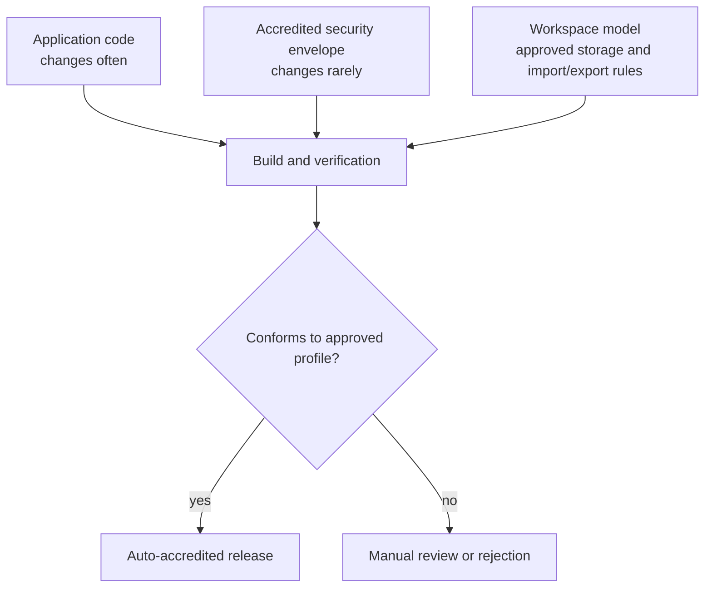

The security envelope is defined by an accredited reference kit. The application is allowed to change, but every release must prove that it remains inside the envelope.

The security envelope contains three equally important boundaries:

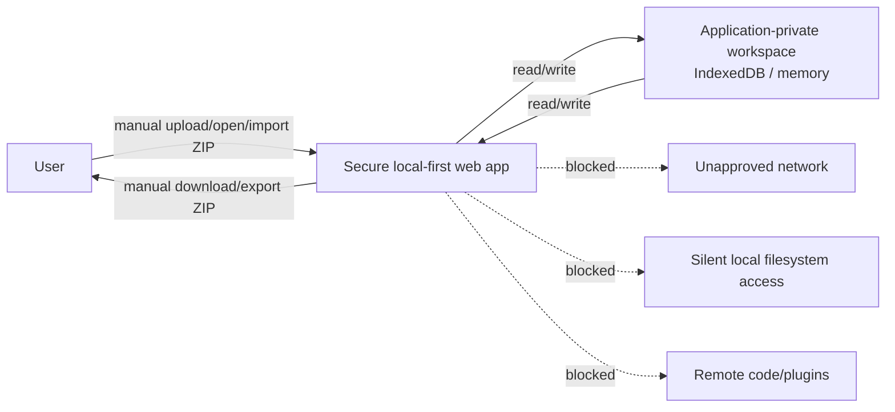

The accreditor does not need to trust a report emitted by the application repository itself. Instead, the accreditor or enterprise CI/CD environment runs a trusted checker from the approved reference kit.

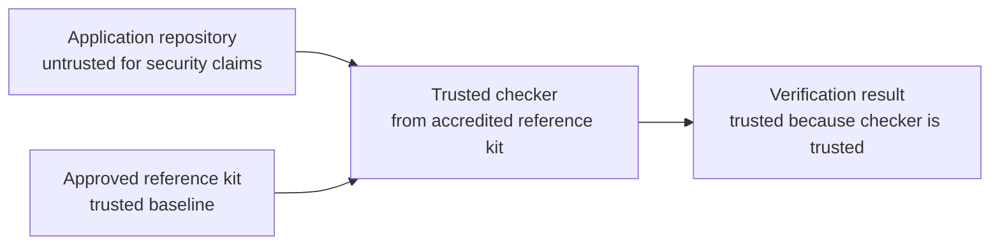

The result is not self-attestation. It is external conformance verification.

---

## 3. Incremental understanding of the model

### 3.1 Level 1: A locked deployment envelope

At the simplest level, an app is accredited because it runs inside a locked envelope:

```text
No unapproved network access
No remote scripts
No remote plugins
No broad extension permissions
No arbitrary service-worker fetch proxy
No silent local file read
No silent local file write
No File System Access API
No real directory handles
Strict CSP
```

The app can still edit user-provided documents, render diagrams, print documents, run local transformations, maintain a sandboxed workspace, and export outputs, but it cannot silently talk to the internet and cannot silently access the workstation filesystem.

### 3.2 Level 2: Manual file transfer only

The local file boundary is intentionally simple:

```text
Allowed:
  user selects explicit files through an upload/open control
  user imports an explicit ZIP archive containing a folder or workspace
  app reads only those selected files or archive contents
  user explicitly triggers export/download of a file, folder ZIP, or workspace ZIP
  browser presents its normal download/save behavior

Not allowed:
  app enumerates local folders
  app silently reads arbitrary paths
  app persists filesystem handles for later reuse
  app silently overwrites files
  app uses native messaging or host bridges for filesystem access
  app asks for broad file:// or host permissions
  app uses real directory handles
```

For accreditation, this is stronger and easier to reason about than trying to authorize a complex local filesystem API.

### 3.3 Level 3: Application-private workspace

The application may maintain a sandboxed workspace:

```text
Workspace:
  virtual folders
  text files
  binary files
  generated artifacts
  metadata
  dependency graph
  editor/viewer bindings
  dirty state
  references between files
  optional IndexedDB persistence
```

The workspace is **not** the local filesystem. It is application-private state. The app may read and write its own workspace, but it may not read or write outside it unless the user explicitly imports or exports through the approved file gateway.

This creates a clean rule:

```text
Inside the workspace: application-controlled read/write is allowed.
Across the local filesystem boundary: only user-mediated import/export is allowed.
Across the network boundary: only the approved profile permits access, if any.
```

### 3.4 Level 4: Reusable secure profiles

Instead of reviewing the same controls repeatedly, the organization defines reusable profiles.

Example profiles:

```text
local-only-manual-file-workspace-webapp
  No external network access.
  Local files only via manual upload/download/import/export.
  Workspace persisted through approved IndexedDB gateway.

one-backend-manual-file-workspace-webapp
  Network access allowed only to one approved backend origin.
  Local files only via manual upload/download/import/export.
  Workspace persisted through approved IndexedDB gateway.

local-extension-editor
  Edge extension with strict extension CSP.
  No host permissions, no file access, no native messaging.
  Workspace storage only through approved extension/browser storage gateway.

secure-pwa-workbench
  Installed PWA with strict HTTP CSP.
  Same-origin service worker.
  IndexedDB workspace allowed.
  No File System Access API.
  No directory handles.
```

The profile becomes the accreditation unit.

### 3.5 Level 5: Approved substitutions only

Applications are not identical. They need names, icons, titles, storage namespace names, and sometimes one backend URL. These values can be allowed as controlled substitutions.

Example:

```yaml
allowedSubstitutions:
  appName: TextForge
  appShortName: TextForge
  appId: org.example.textforge
  workspaceDatabaseName: textforge-workspace
  icons: ./icons
  themeColor: "#111827"
  allowedBackend: none
```

Everything else remains locked.

### 3.6 Level 6: DevSecOps enforcement

The profile is enforced in CI/CD. The application repository does not get to define the security rules. The enterprise pipeline pulls an approved checker and runs it against the app source and built output.

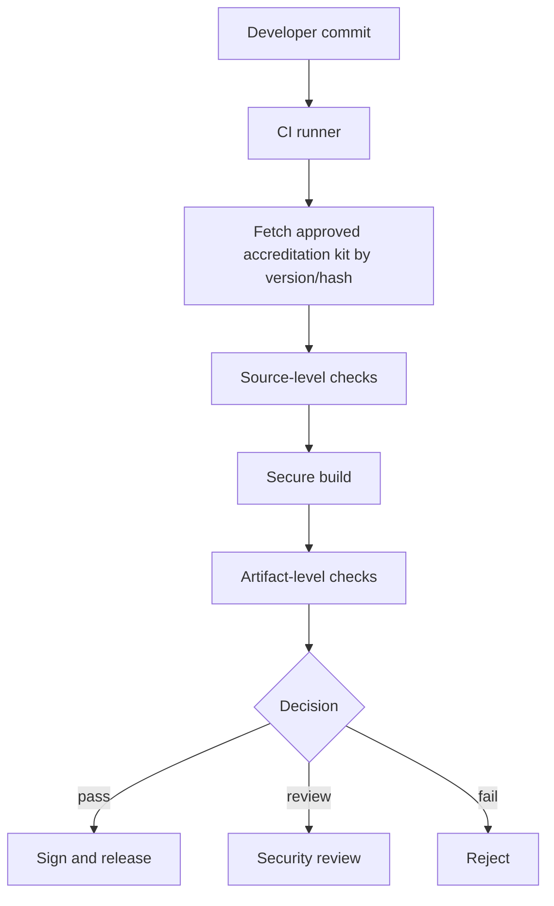

---

## 4. Security claims deliberately kept narrow

This model is valuable because it avoids overclaiming.

It does **not** prove:

- the application has no bugs;
- the application implements correct business logic;
- the user cannot intentionally copy sensitive data manually;
- the user cannot intentionally upload a sensitive file to an approved backend if that workflow is allowed;
- the browser or operating system has no vulnerabilities;
- all dependencies are defect-free;
- the application cannot corrupt an in-memory or workspace document before the user exports it;
- the application cannot generate incorrect output;
- browser storage will never be cleared by browser policy, user action, or quota management;
- application-private workspace persistence is equivalent to enterprise records management.

It is designed to prove narrower, high-value claims:

| Claim | Meaning |
|---|---|
| No external network access | The app cannot use ordinary browser mechanisms to connect outward. |
| One approved backend only | The app can connect only to a declared origin. |
| No remote code loading | The app does not load scripts, modules, plugins, or workers from remote locations. |
| No CDN dependency | Runtime assets are bundled locally or served from the approved app origin. |
| No silent local file read | The app can read only files deliberately selected or imported by the user. |
| No silent local file write | The app cannot overwrite or create local files without a user-mediated browser download/export action. |
| No File System Access API | APIs such as file pickers, directory pickers, and persistent handles are forbidden. |
| No real directory handles | Folder import/export is represented through ZIP archives, not live local folders. |
| Application-private workspace allowed | The app may store and update its own workspace through approved browser storage, such as IndexedDB. |
| Workspace is not local filesystem authority | Workspace storage does not grant enumeration, synchronization, or modification of user-visible folders. |
| No persistent local file handles | The app cannot store handles that allow later access to local files without a new user action. |
| Strict CSP | Browser-enforced policy blocks disallowed resource loading. |
| Locked extension permissions | Extension manifests do not request broad host, file, download, or native messaging permissions. |
| Safe service worker pattern | The PWA service worker cannot fetch arbitrary external or local resources. |
| Build integrity | Final artifacts are checked, not only source templates. |
| Configuration integrity | Manifests, CSP, service worker logic, file-access rules, and workspace rules match approved templates except for allowed substitutions. |

These claims are sufficient for many local-first internal tools where the primary accreditation concerns are data exfiltration, uncontrolled connectivity, unauthorized local filesystem access, and uncontrolled persistence.

---

## 5. The local file boundary

### 5.1 Why this must be explicit

A browser-based editor often feels like a desktop application. Users may drag files into it, open local documents, export transformed files, and print results. That convenience can create confusion for accreditation unless the file boundary is stated clearly.

The proposed accredited profile should not claim general local filesystem safety unless it explicitly blocks privileged filesystem interfaces.

The intended claim is narrower and clearer:

> The application cannot silently read or modify local files. It can only process files that the user manually provides, and it can only return files through manual download/export.

### 5.2 Allowed file interactions

Allowed interactions are user-mediated:

```text
Input:
  <input type="file"> for explicit file selection
  drag-and-drop of explicit files, if approved
  paste of user-provided content, if approved
  explicit ZIP import of a virtual folder, selected folder subtree, or full workspace

Output:
  explicit export/download button
  explicit ZIP export of a file set, virtual folder subtree, or full workspace
  print dialog
  copy to clipboard, if approved
```

The app may parse, transform, render, validate, and store files once the user has provided them. The app may create output in memory or in the application-private workspace and offer it to the user. The browser remains the mediator for local file selection and download behavior.

### 5.3 Disallowed file interactions

The accredited profile should reject these outright:

```text
File System Access API:
  showOpenFilePicker
  showSaveFilePicker
  showDirectoryPicker
  FileSystemFileHandle
  FileSystemDirectoryHandle
  persistent file or directory handles

Legacy or browser-specific directory access:
  webkitdirectory
  directory upload patterns that expose local folder structure directly
  recursive local folder import outside explicit archive import

Extension and host privileges:
  file:// host permissions
  <all_urls> host permissions
  nativeMessaging
  downloads permission unless a narrow approved exception exists
  externally_connectable bridges that expose file operations
  content scripts injected into arbitrary pages for file capture

Programmatic silent file behavior:
  auto-download on page load
  hidden export triggers without user action
  periodic local export loops
  persisted handles for later read/write
```

Some of these APIs can be safe in other application models, but they complicate the accreditation claim. The proposed profile deliberately avoids them.

### 5.4 Approved file gateway pattern

For maintainability, applications should route file operations through a small approved module rather than scattering file APIs across the codebase.

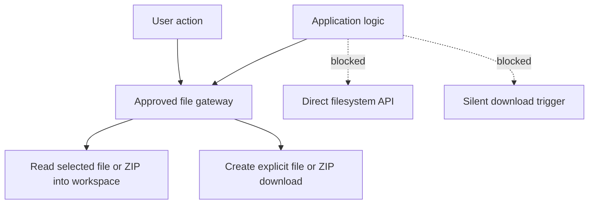

The checker can then enforce two things:

1. only the approved file gateway uses allowed browser file primitives;
2. the rest of the codebase does not directly call disallowed file APIs.

This makes the claim auditable.

---

## 6. The application-private workspace boundary

### 6.1 Definition

An **application-private workspace** is a sandboxed in-browser project area managed by the application. It may contain files and folders previously supplied by the user, created by the user inside the app, or generated by the app.

The workspace may include:

- text documents;
- binary files;
- PDFs;
- images;
- generated SVG, HTML, JSON, XML, Mermaid, Graphviz, or other outputs;
- Markdown and ITM/ITT source files;
- Lua scripts and local libraries;
- virtual folders;
- file metadata;
- dependency references;
- editor/viewer state;
- diagnostics;
- generated indexes;
- workspace manifest information.

The workspace is not a live local directory. It does not provide authority to read or write the user-visible local filesystem.

### 6.2 Core workspace rule

The rule should be stated explicitly in the accredited profile:

```text
The application may read and write its own workspace.
The application may not read or write outside its workspace.
The only way for files to enter the workspace is explicit user import/open/upload.
The only way for files to leave the workspace is explicit user export/download/copy/print.
```

This is the key distinction that allows the application to be useful while preserving the local-file security claim.

### 6.3 IndexedDB as the approved persistence mechanism

For TextForge and similar applications, IndexedDB should remain the approved persistence mechanism. This allows the workspace to survive reloads and PWA restarts without requiring local filesystem handles.

Recommended profile statement:

```yaml
workspace:
  enabled: true
  persistence: indexedDB
  storageAuthority: application-private
  directLocalFilesystemAccess: false
  fileSystemAccessApi: forbidden
  directoryHandles: forbidden
  persistentFileHandles: forbidden
```

The application may store workspace content in IndexedDB, but direct IndexedDB use should be centralized through an approved **Workspace Storage Gateway**.

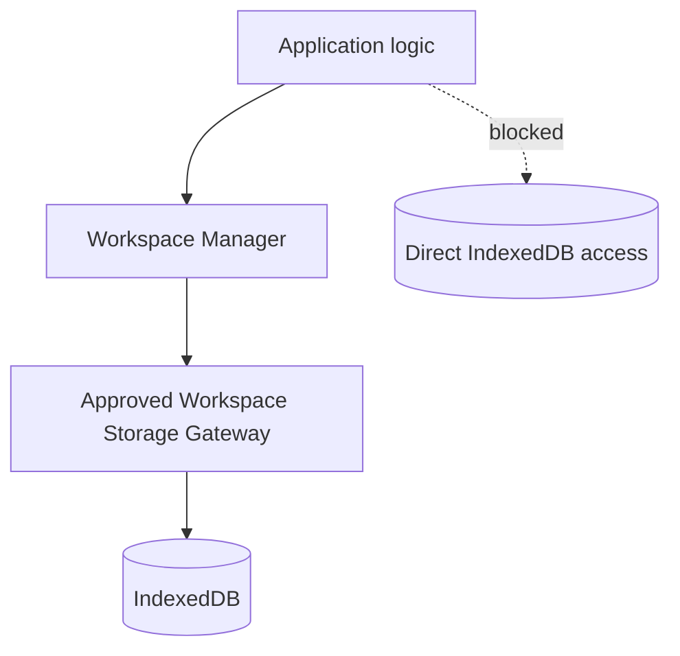

This enables checker rules such as:

```text
Allow indexedDB usage only in approved workspace storage modules.
Reject arbitrary IndexedDB access from plugin code, renderers, or dependencies unless explicitly approved.
Reject storage of external file handles or local filesystem paths as authority-bearing references.
```

### 6.4 Workspace is persistent but not a filesystem bypass

IndexedDB persistence is silent persistence, but it is not silent local filesystem access. The distinction matters:

```text
Allowed:
  silently update application-private workspace state in IndexedDB
  persist a user-imported project inside the app sandbox
  keep virtual folders, generated artifacts, and metadata

Forbidden:
  silently read a local file path
  silently overwrite a local file
  persist a handle to a local file or directory
  synchronize a local folder
  treat the workspace as a mirror of a user-visible directory
```

The profile should therefore avoid saying simply “no silent file writes” without explanation. The precise claim is:

> The application cannot silently read or modify arbitrary user-visible local files. It may persist and update its own application-private workspace through approved browser storage.

### 6.5 Workspace lifetime and user expectations

The workspace is durable enough for application continuity, but it should not be presented as a substitute for formal storage unless the organization accepts that risk.

The UI should make the boundary visible:

```text
Workspace files are stored inside TextForge's browser workspace.
Export a file, folder, or full workspace ZIP to save a copy outside the app.
Clearing browser storage may remove local workspace contents.
```

This is a usability control as much as a security control.

---

## 7. ZIP-based folder and workspace import/export

### 7.1 Why ZIP is the preferred bulk pattern

The secure profile should allow users to move related files in and out of the workspace without granting live folder access. ZIP archives provide that pattern.

```text
Allowed:
  import a ZIP containing one virtual folder subtree
  import a ZIP containing a whole workspace
  export one selected virtual folder as a ZIP
  export the workspace root as a ZIP
  export selected files as a ZIP

Forbidden:
  showDirectoryPicker
  webkitdirectory
  persistent directory handles
  background folder synchronization
```

A ZIP archive is just a user-selected file. It does not grant ongoing access to the original folder.

### 7.2 Folder import semantics

A user should be able to upload a folder with subfolders by uploading a ZIP archive representing that folder.

Example:

```text
User action:
  Import ZIP into /projects/order-model

ZIP contents:
  order-model/
    README.md
    model/
      architecture.itm
      bpmn-profile.itm
    assets/
      context-diagram.svg
    lua/
      lib/
        helpers.lua
      validate.lua

Workspace result:
  /projects/order-model/README.md
  /projects/order-model/model/architecture.itm
  /projects/order-model/model/bpmn-profile.itm
  /projects/order-model/assets/context-diagram.svg
  /projects/order-model/lua/lib/helpers.lua
  /projects/order-model/lua/validate.lua
```

The import operation should be explicit about conflict handling:

```text
On path conflict:
  replace
  rename
  skip
  merge with warning
```

A strict secure profile may require conflict review before overwriting existing workspace files.

### 7.3 Folder export semantics

A user should be able to download any virtual folder with all its subfolders.

Example:

```text
User action:
  Export /projects/order-model/model as ZIP

Downloaded archive:
  model/
    architecture.itm
    bpmn-profile.itm
```

Exporting the root folder is simply whole-workspace export:

```text
User action:
  Export / as ZIP

Downloaded archive:
  workspace.zip
```

### 7.4 ZIP security requirements

ZIP import must be treated as untrusted input.

Required checks:

```text
Reject absolute paths.
Reject ../ path traversal.
Reject backslash tricks and mixed separator ambiguity.
Normalize Unicode and path separators consistently.
Reject or rewrite reserved system names where relevant.
Apply maximum archive size.
Apply maximum expanded size.
Apply maximum file count.
Apply maximum path length.
Apply per-file size limits where useful.
Reject nested archive expansion unless explicitly approved.
Detect zip bombs as far as practical.
Require explicit confirmation for conflicts.
Assign safe media type and language detection after import.
```

The workspace importer should never blindly trust ZIP paths.

### 7.5 Workspace manifest

A full workspace export may include an optional manifest.

Example:

```text
.textforge/
  workspace.json
README.md
models/
  architecture.itm
assets/
  diagram.svg
```

Example `workspace.json`:

```json
{
  "format": "textforge-workspace",
  "version": "1.0",
  "exportedAt": "2026-05-22T00:00:00Z",
  "root": "/",
  "files": [
    {
      "path": "models/architecture.itm",
      "mediaType": "text/plain",
      "languageId": "itm",
      "role": "source"
    },
    {
      "path": "assets/diagram.svg",
      "mediaType": "image/svg+xml",
      "role": "asset"
    }
  ]
}
```

The manifest is useful for language IDs, generated-file markers, diagnostics, and relationship metadata. It should not contain local absolute paths, persistent file handles, or credentials.

---

## 8. TextForge-oriented workspace architecture

### 8.1 From single-document editor to workspace workbench

TextForge should be treated as a secure local workbench, not merely as an editor for one open file.

Recommended conceptual model:

```text
Workspace
  contains virtual folders and files

Files
  may be text or binary
  may be opened by zero or more editors
  may be rendered by zero or more viewers
  may be used as dependencies by transformers
  may be generated outputs

Editors
  edit workspace files
  do not directly own the canonical file identity

Viewers
  render a workspace file or derived view
  must show which file/view they are displaying

Transformers/exporters
  read from workspace
  write generated files back into workspace
  export through the approved file gateway
```

### 8.2 Proposed modules

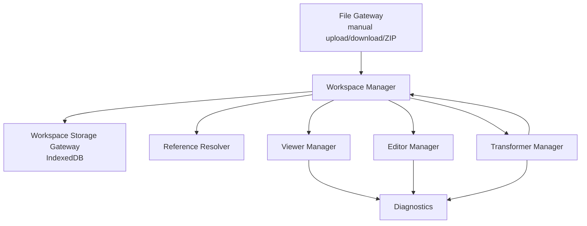

Recommended modules:

| Module | Responsibility |
|---|---|
| File Gateway | User-mediated file import/export, ZIP import/export, download creation. |
| Workspace Manager | Virtual file tree, file IDs, metadata, dirty state, conflict handling. |
| Workspace Storage Gateway | IndexedDB persistence and schema migration. |
| Reference Resolver | Resolve relative references, includes, local libraries, and assets within the workspace. |
| Editor Manager | Open workspace files in editors and bind editor state to workspace file identity. |
| Viewer Manager | Render files or derived views and show source binding clearly. |
| Transformer Manager | Run local transformations and write outputs into workspace. |
| Diagnostics Service | Report parse, validation, rendering, transformation, storage, and security diagnostics. |

### 8.3 Workspace file model

A practical model may look like this:

```ts
type WorkspaceFile = {
  id: string;
  path: string;
  kind: "text" | "binary";
  mediaType?: string;
  languageId?: string;
  role?: "source" | "asset" | "dependency" | "generated";
  contentRef: string;
  dirty: boolean;
  origin: "uploaded" | "created" | "generated" | "imported-zip" | "restored";
  createdAt?: string;
  modifiedAt?: string;
  openedIn?: string[];
};
```

The `contentRef` points to content stored through the Workspace Storage Gateway. Large binary data should not be duplicated in multiple UI states.

### 8.4 References between files

Relative references should resolve inside the workspace.

Examples:

```text
Markdown:
  

ITM:
  %include ../profiles/bpmn-profile.itm

Lua:
  require("lib.helpers")

PDF workspace:
  source-pdfs/report.pdf
  generated/extracted-pages.pdf
```

The Reference Resolver should never fetch arbitrary external URLs unless the selected profile explicitly allows network access to an approved origin.

### 8.5 Viewer binding

Every viewer should make its source binding visible:

```text
Viewing: /projects/order-model/model/architecture.itm
View: dependency_graph
Generated from: workspace file, current dirty version
```

This reduces confusion in multi-document work, especially when the same file can be opened in several editors or when a generated view is derived from multiple files.

---

## 9. Use cases

### 9.1 Local-first text and model editors

Examples:

- structured text editors;
- architecture model editors;
- Markdown/diagram workbenches;
- BPMN or ArchiMate lightweight editors;
- transformation tools for internal documents.

Security objective:

```text
The user manually imports files or a ZIP into the workspace.
The app processes them locally.
The app persists workspace state in IndexedDB if approved.
The user manually exports files, folders, or the full workspace.
No network egress occurs.
No arbitrary local files are accessed.
No original file is overwritten silently.
```

### 9.2 Multi-file Markdown projects

A Markdown document may refer to local images, diagrams, and generated assets.

```text
/project
  index.md
  assets/
    architecture.svg
    screenshot.png
  diagrams/
    view.mmd
```

The workspace allows those references to resolve without granting local folder access.

### 9.3 ITM/ITT model workbenches

ITM and ITT models often benefit from includes, profiles, styles, generated views, and validation rules.

```text
/model
  architecture.itm
  profiles/
    archimate.itm
    bpmn.itm
  views/
    dependency-view.itm
  generated/
    dependency.svg
```

The workspace provides a natural project boundary for these related files.

### 9.4 Lua and script libraries

A local script workbench may use several libraries.

```text
/lua
  main.lua
  lib/
    graph.lua
    validation.lua
```

The script engine should resolve imports only within the workspace or approved built-in libraries. It should not read local paths.

### 9.5 PDF processing workspace

A PDF utility may need several input and generated files.

```text
/pdf
  source/
    report-a.pdf
    report-b.pdf
  extracted/
    appendix.pdf
  merged/
    final-pack.pdf
```

The workspace supports merge, extract, reorder, and generated outputs without requiring filesystem authority.

### 9.6 Internal editor with one backend

Some applications may need one approved backend, for example for authentication, controlled storage, validation, or internal publication.

Security objective:

```text
The app can connect only to https://approved-backend.example.
No other network egress is possible.
Local files are still user-mediated.
Workspace data is not automatically synchronized unless the profile explicitly allows it.
The app cannot scan or synchronize local folders.
```

### 9.7 Offline review or disconnected work

A local review tool may be used in a disconnected or restricted environment.

Security objective:

```text
No external network dependency.
No CDN dependency.
No remote plugin dependency.
No silent local file access.
All inputs and outputs are user-mediated.
Workspace persistence is local to the browser application.
```

### 9.8 Browser-integrated internal tools

Some tools benefit from browser extension deployment because extensions are easy to distribute and can have strong packaging controls.

Security objective:

```text
The extension runs only its own editor pages.
The extension has no broad host permissions.
The extension does not request file:// access.
The extension does not use native messaging.
The extension does not use the downloads permission unless a narrow approved exception exists.
The extension does not inject content scripts into arbitrary pages.
The extension workspace remains application-private.
```

### 9.9 Enterprise-installed PWA workbenches

An installed PWA can give users an app-like experience without a custom desktop wrapper.

Security objective:

```text
The PWA is force-installed by enterprise policy.
User-installed PWAs may be blocked.
The PWA has strict HTTP CSP.
The service worker is same-origin only.
The app uses manual file upload/download/import/export only.
The workspace is persisted in IndexedDB.
The service worker does not cache user workspace contents unless explicitly profiled.
```

---

## 10. Deployment targets

A single source application can emit multiple secure deployment targets, each conforming to the same core profile.

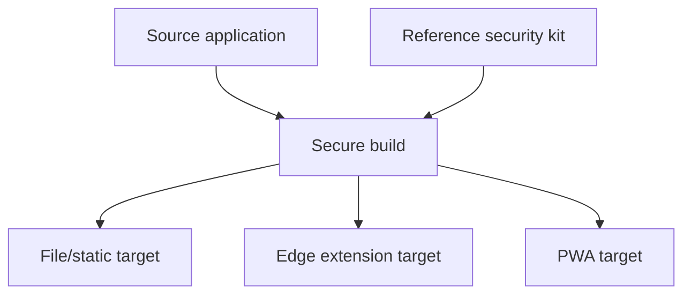

### 10.1 File/static build

A file/static build is a browser-loadable application bundle. It may be opened locally or served from a controlled static location.

Strengths:

- simple distribution;
- no server logic required;
- easy to inspect as static files;
- suitable for disconnected environments.

Required controls:

- no remote scripts or assets;
- no remote plugin loading;
- no network primitives unless profile allows one backend;
- no File System Access API;
- no directory upload or directory handles;
- no silent download triggers;
- all file input through explicit user file selection or ZIP import;
- all file output through explicit export/download or ZIP export;
- workspace persistence only through approved browser storage gateway, if supported by the deployment context.

Special caution:

- `file://` behavior can vary between browsers and settings;
- static local files may not receive HTTP CSP headers;
- IndexedDB persistence behavior may depend on origin handling;
- for stronger assurance, the same app may be served from a local approved origin or packaged as an extension/PWA.

### 10.2 Microsoft Edge extension

An Edge extension can package the editor as a controlled browser application.

Strengths:

- manifest-based permissions;
- extension CSP;
- enterprise force-install possible;
- predictable packaging;
- good for local-first tools.

Required controls:

- no broad `host_permissions`;
- no `<all_urls>`;
- no `file://` access;
- no `nativeMessaging`;
- no arbitrary `downloads` authority;
- no content scripts on arbitrary pages;
- no external script loading;
- no remote plugin loading;
- no extension API that grants silent filesystem access;
- file input/output only through approved user-mediated browser mechanisms;
- workspace persistence only through approved storage gateway.

### 10.3 Progressive Web App

A PWA is an installable web app served over HTTPS or another approved origin.

Strengths:

- lightweight deployment;
- app-like user experience;
- enterprise force-install possible;
- normal browser printing and download behavior;
- IndexedDB workspace persistence;
- no custom native wrapper.

Required controls:

- strict HTTP CSP;
- same-origin service worker;
- no arbitrary fetch proxy;
- no remote code loading;
- no File System Access API;
- no directory handles;
- no silent download behavior;
- file input/output only through explicit user actions;
- workspace read/write only through approved IndexedDB gateway;
- service worker must not cache user workspace content unless explicitly approved.

Special caution:

- a PWA is still browser content;
- its security envelope depends heavily on CSP, service worker correctness, storage controls, and enterprise deployment controls;
- it should not be treated as a native sandbox;
- user workspace content may be lost if browser storage is cleared, so explicit export remains necessary.

---

## 11. Reference repository concept

The organization should maintain a trusted reference repository, for example:

```text
secure-webapp-accreditation-kit/
  profiles/
    local-only-manual-file-webapp.yml
    local-only-manual-file-workspace-webapp.yml
    one-backend-manual-file-webapp.yml
    one-backend-manual-file-workspace-webapp.yml
  templates/
    extension.manifest.template.json
    pwa.app.webmanifest.template
    sw.local-only.template.js
    sw.one-backend.template.js
    csp.local-only.txt
    csp.one-backend.txt
  file-gateway/
    approved-file-gateway.ts
    approved-download-gateway.ts
    approved-zip-importer.ts
    approved-zip-exporter.ts
  workspace/
    approved-workspace-manager.ts
    approved-workspace-storage-indexeddb.ts
    approved-reference-resolver.ts
    approved-workspace-manifest.ts
  checker/
    secure-check
    rules/
      network-rules.yml
      file-access-rules.yml
      workspace-rules.yml
      zip-rules.yml
      storage-rules.yml
      extension-rules.yml
      pwa-rules.yml
      service-worker-rules.yml
  build/
    secure-build
  docs/
    accreditation-checklist.md
    threat-model.md
    profile-authoring-guide.md
    workspace-boundary-guide.md
```

The reference repository is the accredited baseline. Individual applications should not redefine these controls. They should consume them by immutable version, hash, or signed package.

The reference kit should be treated as a controlled security artifact:

```text
Changing the kit changes the accreditation baseline.
Changing an application within the kit constraints may remain auto-accreditable.
```

---

## 12. Application repository pattern

An application repository should declare its intended profile, not define the rules itself.

Example:

```text
app-repo/
  src/
  public/
  security/
    security-profile.yml
    allowed-substitutions.yml
    approved-kit-version.txt
  package.json
  package-lock.json
```

Example `security-profile.yml`:

```yaml
profile: local-only-manual-file-workspace-webapp
profileVersion: 1.0
targets:
  - file
  - edge-extension
  - pwa

network:
  mode: none

localFiles:
  mode: manual-upload-download-import-export-only
  allowFileInput: true
  allowDragDropFiles: true
  allowZipImport: true
  allowZipExport: true
  allowDirectoryInput: false
  allowFileSystemAccessApi: false
  allowPersistentFileHandles: false
  allowDirectoryHandles: false
  allowSilentDownload: false
  allowNativeFileBridge: false

workspace:
  enabled: true
  persistence: indexedDB
  virtualFolders: true
  folderImportExport: zip-only
  rootImportExport: zip-only
  directIndexedDbAccess: approved-gateway-only
  serviceWorkerMayCacheWorkspaceContent: false
  externalFileHandles: false

plugins:
  remotePlugins: false
  localPluginsOnly: true
```

Example `allowed-substitutions.yml`:

```yaml
appName: TextForge
appShortName: TextForge
appId: org.example.textforge
workspaceDatabaseName: textforge-workspace
workspaceManifestFolder: .textforge
icons: ./public/icons
themeColor: "#111827"
allowedBackend: null
```

The app repository can contain normal source code, but the checker verifies that the code does not step outside the declared profile.

---

## 13. Automated enforcement

Automated enforcement should happen at multiple levels.

### 13.1 Source-level checks

Source checks inspect the repository before and during build.

Network checks:

```text
Reject direct use of:
  fetch
  XMLHttpRequest
  WebSocket
  EventSource
  navigator.sendBeacon
  remote import()
  external script URLs
  CDN references

Allow only:
  approved wrapper APIs, if profile permits one backend
```

Local file checks:

```text
Reject direct use of:
  showOpenFilePicker
  showSaveFilePicker
  showDirectoryPicker
  FileSystemFileHandle
  FileSystemDirectoryHandle
  webkitdirectory
  directory upload recursion
  chrome.fileSystem or equivalent privileged APIs
  nativeMessaging
  file:// host permissions
  auto-click download patterns outside approved gateway

Allow only:
  approved file gateway
  explicit file input
  explicit ZIP import gateway
  explicit export/download gateway
  explicit ZIP export gateway
```

Workspace and storage checks:

```text
Reject:
  arbitrary IndexedDB access outside approved workspace storage gateway
  direct localStorage/sessionStorage use for workspace content unless approved
  storage of FileSystemFileHandle or FileSystemDirectoryHandle
  storage of authority-bearing local file references
  service worker caching of user workspace content unless explicitly approved
  plugin direct access to workspace storage internals

Allow:
  IndexedDB use through approved workspace storage gateway
  workspace metadata through approved workspace manager
  generated artifacts stored through approved workspace manager
```

ZIP checks:

```text
Require:
  path normalization
  traversal rejection
  absolute path rejection
  archive size limits
  expanded size limits
  file count limits
  conflict handling
  safe media/language detection
```

Extension checks:

```text
Reject:
  <all_urls>
  broad host_permissions
  file:// access
  nativeMessaging
  downloads permission without approved exception
  arbitrary content_scripts matches
  externally_connectable unless explicitly approved
```

PWA/service-worker checks:

```text
Reject:
  service worker fetch handlers that proxy arbitrary URLs
  cache population from external origins
  remote importScripts
  service worker network fallbacks outside approved origin
  service worker caching of user workspace content unless profile permits it
```

Dependency checks:

```text
Require:
  lockfile present
  deterministic install mode
  dependency allowlist or risk policy
  no unexpected postinstall scripts without review
```

### 13.2 Build-level checks

The build should be performed by the trusted pipeline, not by accepting developer-supplied artifacts blindly.

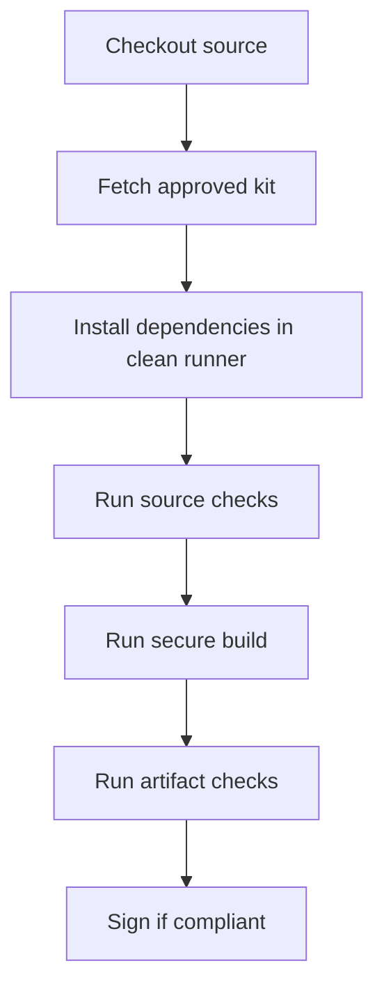

Build checks should verify:

- the secure build tool comes from the approved kit;
- manifests are generated from approved templates;
- CSP is generated from approved templates;
- service worker is generated from approved templates;
- file gateway modules match approved versions or pass strict rule checks;
- workspace gateway modules match approved versions or pass strict rule checks;
- ZIP import/export modules match approved versions or pass strict rule checks;
- no unapproved build scripts alter the security envelope.

### 13.3 Artifact-level checks

Artifact checks inspect the final output because source templates alone are not enough.

```text
Check final extension manifest.
Check final PWA manifest.
Check final service worker.
Check final CSP configuration.
Scan bundles for external URLs.
Scan bundles for network primitives.
Scan bundles for disallowed file APIs.
Scan bundles for disallowed directory APIs.
Scan bundles for native bridge hooks.
Scan bundles for direct IndexedDB calls outside approved gateway.
Scan generated HTML for remote scripts/assets.
Scan generated worker files.
```

This catches drift introduced by bundlers, plugins, dependencies, or custom build steps.

### 13.4 Runtime guardrails

Static checks should be complemented by runtime guardrails where practical:

```text
Central file gateway refuses non-user-triggered export.
Workspace manager normalizes every path.
Reference resolver blocks remote URLs unless profile allows them.
Plugin API exposes workspace services but not storage internals.
Viewer/exporter APIs receive scoped workspace capabilities.
ZIP importer enforces limits before expanding content into the workspace.
```

### 13.5 Decision logic

A simple policy decision model is useful:

| Outcome | Meaning |
|---|---|
| Auto-accredited | Security envelope unchanged and all checks pass. |
| Needs review | Potentially acceptable, but security-relevant change detected. |
| Rejected | Profile violation or hard-fail condition. |

Manual review should be required when:

- the security profile changes;
- the accreditation kit version changes;
- the allowed backend changes;
- network mode changes;
- file access mode changes;
- workspace persistence mode changes;
- service worker workspace caching changes;
- an app requests File System Access API;
- an app requests directory upload or directory handles;
- an extension requests new permissions;
- a service worker changes behavior;
- build logic changes;
- dependency behavior introduces network, file access, directory access, or unapproved storage primitives.

---

## 14. DevSecOps integration

This pattern fits naturally into DevSecOps because the security claims are structural, repeatable, and automatable.

The pipeline should answer one question:

> Does this release still conform to the approved secure deployment profile?

It should not rely on developer self-attestation.

Recommended CI/CD structure:

```text
Developer commit
  ↓
Static repo checks
  ↓
Dependency and lockfile checks
  ↓
Trusted secure build
  ↓
Artifact checks
  ↓
Policy-as-code decision
  ↓
Signed release or rejection
```

Workspace support does not weaken the DevSecOps model. It gives the checker more specific things to verify:

```text
Which storage APIs are used?
Which modules may write workspace content?
Can workspace content leave only through approved export paths?
Can workspace content be cached by the service worker?
Can plugins access workspace storage directly?
Can ZIP import escape the virtual workspace root?
```

The accreditor community can then accredit the profile and the checker rather than manually reaccrediting every ordinary application change.

---

## 15. Example profiles

### 15.1 Local-only manual-file workspace web app profile

```yaml
profile: local-only-manual-file-workspace-webapp
version: 1.0

network:
  mode: none
  allowedOrigins: []

localFiles:
  mode: manual-upload-download-import-export-only
  read:
    allowedVia:
      - file-input
      - approved-drag-drop-file
      - approved-zip-import
    disallowed:
      - filesystem-access-api
      - file-picker-handles
      - directory-picker
      - directory-handles
      - persistent-file-handles
      - file-url-fetch
      - native-file-bridge
      - webkitdirectory
  write:
    allowedVia:
      - approved-download-export
      - approved-zip-export
      - print-dialog
    disallowed:
      - filesystem-access-api
      - persistent-file-handles
      - directory-handles
      - silent-download
      - native-file-bridge

workspace:
  enabled: true
  persistence: indexedDB
  storageAuthority: application-private
  virtualFolders: true
  folderImportExport: zip-only
  wholeWorkspaceImportExport: zip-only
  directIndexedDbAccess: approved-gateway-only
  serviceWorkerMayCacheWorkspaceContent: false
  externalFileHandles: false

plugins:
  remotePlugins: false
  localPluginsOnly: true

csp:
  defaultSrc: none
  connectSrc: none
  frameSrc: none
  objectSrc: none
  formAction: none

extension:
  hostPermissions: []
  fileAccess: false
  nativeMessaging: false

pwa:
  serviceWorker: same-origin-only
  remoteCachePopulation: false
```

### 15.2 One-backend manual-file workspace web app profile

```yaml
profile: one-backend-manual-file-workspace-webapp
version: 1.0

network:
  mode: one-origin
  allowedOrigins:
    - https://approved-backend.example.org

localFiles:
  mode: manual-upload-download-import-export-only
  allowFileSystemAccessApi: false
  allowPersistentFileHandles: false
  allowDirectoryInput: false
  allowDirectoryHandles: false
  allowNativeFileBridge: false
  allowSilentDownload: false
  allowZipImport: true
  allowZipExport: true

workspace:
  enabled: true
  persistence: indexedDB
  directIndexedDbAccess: approved-gateway-only
  serviceWorkerMayCacheWorkspaceContent: false
  externalFileHandles: false

plugins:
  remotePlugins: false
  localPluginsOnly: true

csp:
  connectSrc:
    - https://approved-backend.example.org
  frameSrc: none
  objectSrc: none
  formAction: none
```

### 15.3 Extension profile

```yaml
profile: edge-extension-local-workspace-editor
version: 1.0

extension:
  manifestVersion: 3
  allowedPermissions:
    - storage
  disallowedPermissions:
    - nativeMessaging
    - tabs
    - webRequest
    - downloads
  hostPermissions: []
  fileAccess: false
  contentScripts: none

localFiles:
  mode: manual-upload-download-import-export-only
  allowZipImport: true
  allowZipExport: true
  allowFileSystemAccessApi: false
  allowDirectoryHandles: false

workspace:
  enabled: true
  persistence: approved-browser-storage
  storageAuthority: application-private

network:
  mode: none
```

The exact permission list should be tuned per app family. The important principle is that the extension cannot gain filesystem or web-surface authority beyond the accredited profile.

### 15.4 Secure PWA workspace profile

```yaml
profile: secure-pwa-workspace-editor
version: 1.0

pwa:
  installable: true
  enterpriseInstallable: true
  serviceWorker: same-origin-only
  serviceWorkerMayCacheWorkspaceContent: false
  remoteCachePopulation: false

workspace:
  enabled: true
  persistence: indexedDB
  virtualFolders: true
  folderImportExport: zip-only

localFiles:
  mode: manual-upload-download-import-export-only
  allowFileSystemAccessApi: false
  allowDirectoryHandles: false

network:
  mode: none
```

---

## 16. Why developer-emitted reports are not enough

A report generated by the application repository is not trustworthy by itself. A malicious or careless developer could change the report generator while preserving the appearance of compliance.

Therefore:

```text
Untrusted:
  report emitted by app repo alone

Trusted:
  report emitted by accreditor-controlled checker
  running in enterprise CI/CD
  using approved reference kit version/hash
```

The report can still be useful, but only when generated by the trusted checker.

The better model is:

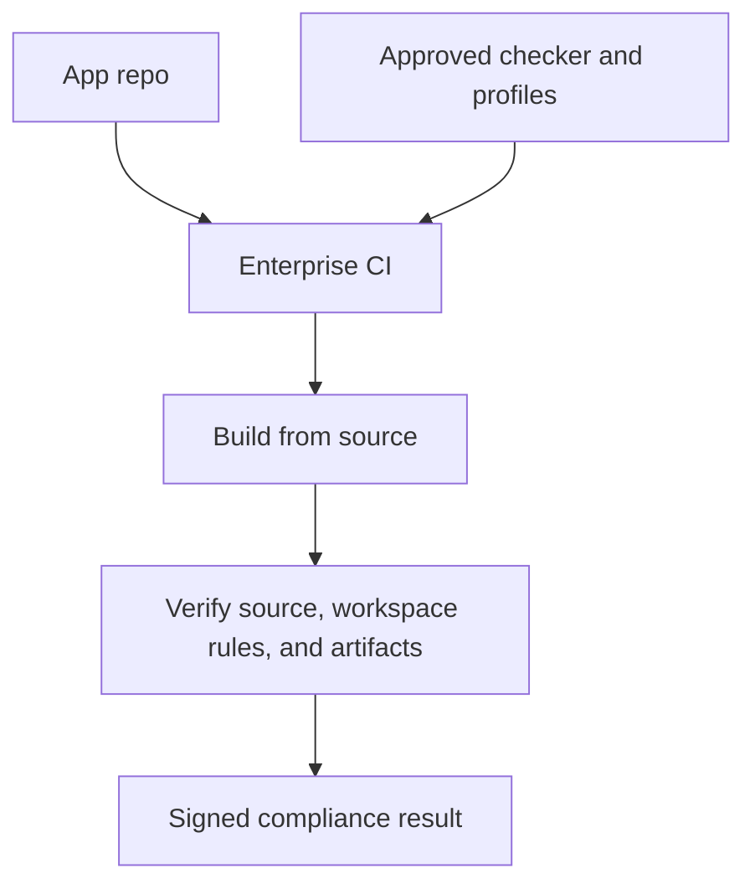

---

## 17. Practical implementation roadmap

### Phase 1: Define the security baseline

Agree the first accredited profiles:

```text
local-only-manual-file-webapp
local-only-manual-file-workspace-webapp
one-backend-manual-file-webapp
one-backend-manual-file-workspace-webapp
edge-extension-local-editor
secure-pwa-workspace-editor
```

For each profile, define:

- network mode;
- local file mode;
- allowed file input mechanisms;
- allowed export mechanisms;
- ZIP folder import/export rules;
- workspace persistence mode;
- IndexedDB gateway rules;
- disallowed APIs;
- allowed CSP;
- extension permissions;
- service-worker pattern;
- allowed substitutions;
- hard-fail conditions.

### Phase 2: Implement the reference kit

Create the controlled reference repository containing:

- profiles;
- templates;
- approved file gateway;
- approved download/export gateway;
- approved ZIP import/export gateway;
- approved workspace manager;
- approved IndexedDB storage gateway;
- approved reference resolver;
- secure build logic;
- static checks;
- artifact checks;
- sample apps;
- accreditation checklist.

### Phase 3: Integrate one pilot application

Choose one local-first editor and make it emit three targets:

```text
dist/file
dist/extension
dist/pwa
```

Ensure all three targets pass the same core claims:

```text
No unapproved network access.
No remote code loading.
No silent local file access.
Manual upload/download/import/export only.
Application-private workspace only.
No File System Access API.
No directory handles.
```

### Phase 4: Add workspace-specific functionality

Implement the workspace features in stages:

```text
1. Workspace Manager with virtual folders and file IDs.
2. IndexedDB Workspace Storage Gateway.
3. Editor/viewer binding to workspace files.
4. ZIP import/export for whole workspace.
5. ZIP import/export for selected virtual folders.
6. Reference resolver for relative links and includes.
7. Dependency graph and diagnostics.
8. Optional workspace manifest.
```

### Phase 5: Accredit the pattern

The accreditor reviews:

- reference kit source;
- checker logic;
- approved templates;
- profile semantics;
- generated sample outputs;
- workspace storage boundary;
- ZIP import/export behavior;
- CI/CD integration;
- hard-fail behavior.

The pattern is accredited once.

### Phase 6: Scale to more applications

Other applications consume the same kit. Routine changes are auto-accredited when they remain inside the approved envelope. Security-envelope changes trigger review.

---

## 18. Governance model

### 18.1 Roles

| Role | Responsibility |
|---|---|
| Accreditor | Approves profiles, reference kit, workspace rules, and manual exceptions. |
| Security engineering | Maintains checker rules, threat model, and hard-fail conditions. |
| Platform team | Operates CI/CD and signing pipeline. |
| App team | Builds application inside approved profile. |
| Workspace component owner | Maintains approved workspace, storage, and ZIP gateway modules. |
| Release manager | Releases only signed compliant artifacts. |

### 18.2 Versioning

Profiles and kits should be versioned independently.

```text
Profile version:
  local-only-manual-file-workspace-webapp@1.0

Kit version:
  secure-webapp-accreditation-kit@1.1.0

Workspace schema version:
  textforge-workspace@1.0

App version:
  textforge@2.4.0
```

A profile change is security-significant. A kit patch may be operational or security-significant depending on what changed. A workspace schema migration may be security-significant if it changes storage authority, export behavior, reference resolution, or service-worker interaction. An app patch may be auto-accreditable if the envelope remains unchanged.

### 18.3 Exceptions

Exceptions should be explicit and narrow.

Bad exception:

```text
Allow filesystem access.
```

Better exception:

```text
Allow one approved export gateway to create a user-triggered download of generated Markdown files.
```

Bad exception:

```text
Allow directory access.
```

Better exception:

```text
Allow explicit ZIP import/export of selected virtual workspace folders, with path normalization and size limits.
```

Bad exception:

```text
Allow network.
```

Better exception:

```text
Allow HTTPS POST to https://approved-validator.example.org/api/validate only.
```

---

## 19. Residual risks and limitations

This pattern is useful, but it is not magic.

Residual risks include:

- browser or OS vulnerabilities;
- malicious dependencies that pass static checks but behave unexpectedly;
- logic bugs that corrupt in-memory or workspace content;
- user-driven data disclosure;
- approved backend misuse;
- clipboard misuse if clipboard access is allowed;
- print-to-file behavior controlled by the user or OS;
- local browser settings that auto-save downloads without prompting;
- browser storage being cleared by user action, policy, private browsing behavior, or quota management;
- sensitive data remaining in IndexedDB longer than the user expects;
- incomplete static analysis coverage;
- ZIP parser bugs or missed archive edge cases;
- deliberate bypasses in unreviewed native wrappers.

The local file claim should therefore be stated carefully:

```text
The app cannot silently read or modify arbitrary user-visible local files using browser-visible APIs permitted by the approved profile.
The app can process only user-provided files and can emit files only through user-mediated export/download or print actions.
The app may persist and modify its own application-private workspace through approved browser storage, such as IndexedDB.
```

This is still a strong and useful claim, especially when combined with no network egress.

---

## 20. Recommended accreditation checklist

For each application release, the accreditor or trusted CI/CD pipeline should verify:

```text
Profile and kit
  [ ] Approved profile declared
  [ ] Approved kit version/hash used
  [ ] Allowed substitutions only

Network
  [ ] No network primitives, or only approved backend wrapper
  [ ] CSP connect-src matches profile
  [ ] No remote scripts, workers, plugins, or CDN assets

Local file access
  [ ] No File System Access API
  [ ] No showOpenFilePicker
  [ ] No showSaveFilePicker
  [ ] No showDirectoryPicker
  [ ] No FileSystemFileHandle or FileSystemDirectoryHandle
  [ ] No webkitdirectory or recursive local folder upload
  [ ] No persistent file or directory handles
  [ ] No native file bridge
  [ ] No file:// host permissions
  [ ] File reads only through approved user-mediated file gateway
  [ ] File writes only through approved export/download gateway
  [ ] No silent auto-download patterns

Workspace
  [ ] Workspace is enabled only through approved profile
  [ ] Workspace persistence mode is approved
  [ ] IndexedDB use is centralized through approved Workspace Storage Gateway
  [ ] No direct workspace storage access by plugins/renderers unless approved
  [ ] No local filesystem handles stored in workspace
  [ ] No local absolute paths treated as authority-bearing references
  [ ] Workspace UI explains import/export boundary

ZIP import/export
  [ ] ZIP import is explicit user action
  [ ] ZIP export is explicit user action
  [ ] Selected virtual folders can be exported as ZIP
  [ ] Workspace root can be exported as ZIP
  [ ] ZIP import rejects traversal and absolute paths
  [ ] ZIP import enforces size and file-count limits
  [ ] ZIP import has explicit conflict handling

Extension target
  [ ] Manifest generated from approved template
  [ ] No broad host permissions
  [ ] No file access
  [ ] No native messaging
  [ ] No arbitrary content scripts
  [ ] No downloads permission unless specifically approved

PWA target
  [ ] PWA manifest generated from approved template
  [ ] Service worker is same-origin only
  [ ] Service worker cannot proxy arbitrary URLs
  [ ] Service worker does not cache workspace content unless explicitly approved
  [ ] CSP header/config matches profile

Build and artifact integrity
  [ ] Clean build performed by trusted pipeline
  [ ] Lockfile present and checked
  [ ] Final bundles scanned
  [ ] Final manifests scanned
  [ ] Final service worker scanned
  [ ] Final HTML scanned
  [ ] Compliant artifacts signed
```

---

## 21. Summary

The proposed model enables **continuous accreditation by conformance to an approved secure deployment profile**.

Version 2 refined the security claim so that the envelope covers not only network egress, but also local file authority.

Version 3 adds the missing architectural concept needed by real local-first workbenches: the **application-private workspace**.

The intended accredited claim is:

```text
The application cannot silently communicate with unapproved network destinations.
The application cannot silently read or modify user-visible local files.
Files enter only through deliberate user upload/open/import actions.
Files leave only through deliberate user download/export or print actions.
The application may maintain an application-private workspace, persisted through approved IndexedDB storage.
The workspace is not a live local directory and does not provide local filesystem authority.
Folder-level import/export is supported through explicit ZIP operations, including selected virtual folders and the whole workspace root.
File System Access API, persistent file handles, and directory handles are forbidden.
The build and deployment artifacts are verified by an accreditor-trusted checker.
```

This creates a practical middle ground between full manual reaccreditation of every release and blind trust in developers. It allows fast iteration on local-first web applications while keeping the security boundary stable, reviewable, and automatable.

The accreditor community can accredit the pattern once, then continuously verify individual applications as constrained instances of that pattern.

---

## Appendix A: Example CI/CD flow

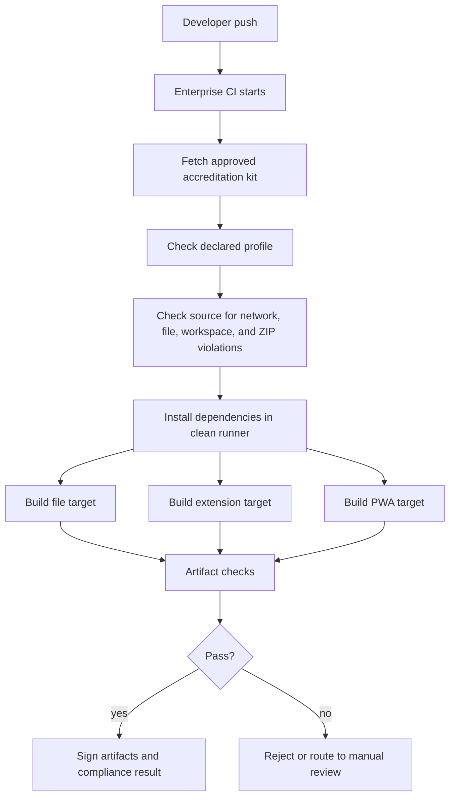

---

## Appendix B: Example output layout for a three-target build

```text
dist/
  file/
    index.html
    assets/

  extension/
    manifest.json
    index.html
    assets/

  pwa/
    index.html
    app.webmanifest
    sw.js
    assets/

  accreditation/
    source-checks.json
    artifact-checks.json
    workspace-checks.json
    zip-checks.json
    effective-profile.yml
    hashes.json
    result.json
```

The `accreditation` folder is useful only if generated by the trusted pipeline. It should not be accepted as evidence when supplied by an untrusted developer environment.

---

## Appendix C: Example hard-fail conditions

```text
Network hard fails:
  connect-src *
  remote script URL
  remote module import
  CDN runtime dependency
  WebSocket to unapproved origin

Local file hard fails:
  showOpenFilePicker
  showSaveFilePicker
  showDirectoryPicker
  FileSystemFileHandle
  FileSystemDirectoryHandle
  persistent FileSystemFileHandle
  persistent FileSystemDirectoryHandle
  webkitdirectory
  nativeMessaging
  file:// host permission
  <all_urls> host permission
  auto-triggered download outside approved gateway

Workspace hard fails:
  direct IndexedDB workspace writes outside approved gateway
  storing FileSystemFileHandle or FileSystemDirectoryHandle
  storing local filesystem authority as workspace metadata
  service worker caching workspace data without approved profile
  plugin direct access to workspace storage internals

ZIP hard fails:
  archive path traversal
  absolute archive paths
  unbounded archive expansion
  archive expansion outside selected virtual target folder
  conflict overwrite without approved policy

Service worker hard fails:
  importScripts from remote URL
  fetch handler proxies arbitrary request.url
  cache.addAll includes external origin
  cache population of workspace content without approved profile

Extension hard fails:
  broad host permissions
  arbitrary content script injection
  native messaging
  downloads permission without approved exception
```

---

## Appendix D: Suggested terminology

| Term | Meaning |
|---|---|
| Secure deployment profile | Accredited set of constraints for a class of apps. |
| Security envelope | The manifests, CSP, service worker, build rules, file-access rules, workspace rules, and permission model around the app. |
| Manual file gateway | Approved code path for user-selected file input and explicit export/download. |
| Application-private workspace | Sandboxed in-browser project area managed by the app, separate from local filesystem authority. |
| Workspace Storage Gateway | Approved module through which workspace content is persisted, for example in IndexedDB. |
| Virtual folder | Folder-like path inside the workspace, not a live local directory. |
| Folder ZIP import/export | User-mediated archive operation that transfers a virtual folder subtree across the local file boundary. |
| Local-only app | App with no network egress and no silent local filesystem access. |
| One-backend app | App that can reach only one approved backend origin and still has no silent local filesystem access. |
| Reference kit | Trusted repository containing templates, rules, and checker. |
| Trusted checker | Accreditor-approved verification tool run outside the app repo. |
| Auto-accreditation | Release approval when checks prove continued conformance. |
| Envelope drift | Any change that weakens or alters the accredited security boundary. |
| Hard fail | Violation that automatically blocks release. |

---

## Appendix E: Example TextForge workspace ZIP layout

```text
textforge-workspace.zip
  .textforge/
    workspace.json
  docs/
    index.md
    overview.md
  models/
    architecture.itm
    profiles/
      bpmn.itm
      archimate.itm
  scripts/
    main.lua
    lib/
      helpers.lua
  assets/
    context-diagram.svg
    source.pdf
  generated/
    architecture-view.svg
    extracted-pages.pdf
```

Exporting `/models` would produce:

```text
models.zip
  models/
    architecture.itm
    profiles/
      bpmn.itm
      archimate.itm
```

Importing `models.zip` into `/projects/example` would produce:

```text
/projects/example/models/architecture.itm
/projects/example/models/profiles/bpmn.itm
/projects/example/models/profiles/archimate.itm
```

The operation transfers content into the application-private workspace. It does not create a persistent link to the user's local folder.
