# V18 Workpackage Dependency Map

```mermaid
flowchart TD
  FOUNDATION[Foundation history\nPhases -1 to 4.1] --> WP_05A[WP-05A\nContribution manifest and registry model]
  WP_05A[WP-05A\nContribution manifest and registry model] --> WP_05B[WP-05B\nCapability activation and resolver context]
  WP_05A[WP-05A\nContribution manifest and registry model] --> WP_05C[WP-05C\nPipeline/contribution execution integration]
  WP_05B[WP-05B\nCapability activation and resolver context] --> WP_05C[WP-05C\nPipeline/contribution execution integration]
  WP_05A[WP-05A\nContribution manifest and registry model] --> WP_05D[WP-05D\nMinimal package/capability inspector]
  WP_05B[WP-05B\nCapability activation and resolver context] --> WP_05D[WP-05D\nMinimal package/capability inspector]
  FOUNDATION[Foundation history\nPhases -1 to 4.1] --> WP_SET_01[WP-SET-01\nUser settings core and local persistence]
  WP_05C[WP-05C\nPipeline/contribution execution integration] --> WP_LUA[WP-LUA\nLua automation]
  WP_LUA[WP-LUA\nLua automation] --> WP_LUA_POWER_SESSION[WP-LUA-POWER-SESSION\nLua self-escalation session and one-click recovery]
  FOUNDATION[Foundation history\nPhases -1 to 4.1] --> WP_RES_01[WP-RES-01\nProvider-aware resource descriptors]
  WP_RES_01[WP-RES-01\nProvider-aware resource descriptors] --> WP_RES_02[WP-RES-02\nRevisions, dirty state, and conflict diagnostics]
  WP_RES_02[WP-RES-02\nRevisions, dirty state, and conflict diagnostics] --> WP_RES_03[WP-RES-03\nMulti-resource changesets and provider allowlists]
  WP_RES_01[WP-RES-01\nProvider-aware resource descriptors] --> WP_REPO_01[WP-REPO-01\nRepository reference and include resolver]
  WP_ITM_01[WP-ITM-01\nITM parser/model foundation] --> WP_REPO_01[WP-REPO-01\nRepository reference and include resolver]
  WP_ITM_01[WP-ITM-01\nITM parser/model foundation] --> WP_ITM_02[WP-ITM-02\nITM directives, packages, validation, diagnostics]
  WP_05B[WP-05B\nCapability activation and resolver context] --> WP_ITM_02[WP-ITM-02\nITM directives, packages, validation, diagnostics]
  WP_ITM_01[WP-ITM-01\nITM parser/model foundation] --> WP_MD_REPORT[WP-MD-REPORT\nMarkdown + ITM report generation]
  WP_REPO_01[WP-REPO-01\nRepository reference and include resolver] --> WP_MD_REPORT[WP-MD-REPORT\nMarkdown + ITM report generation]
  FOUNDATION[Foundation history\nPhases -1 to 4.1] --> WP_ID_01[WP-ID-01\nIdentity contract]
  WP_ID_01[WP-ID-01\nIdentity contract] --> WP_ID_DEV[WP-ID-DEV\nDevelopment identity fixture provider]
  WP_ID_01[WP-ID-01\nIdentity contract] --> WP_POLICY_01[WP-POLICY-01\nProvider-neutral server policy engine]
  WP_ID_DEV[WP-ID-DEV\nDevelopment identity fixture provider] --> WP_POLICY_01[WP-POLICY-01\nProvider-neutral server policy engine]
  WP_BE_HOST[WP-BE-HOST\nEnterprise container and app host] --> WP_POLICY_01[WP-POLICY-01\nProvider-neutral server policy engine]
  WP_BE_PERSIST[WP-BE-PERSIST\nReference persistence server] --> WP_POLICY_01[WP-POLICY-01\nProvider-neutral server policy engine]
  WP_RES_03[WP-RES-03\nMulti-resource changesets and provider allowlists] --> WP_BE_API[WP-BE-API\nBackend API contract and frontend provider]
  WP_BE_API[WP-BE-API\nBackend API contract and frontend provider] --> WP_BE_PERSIST[WP-BE-PERSIST\nReference persistence server]
  WP_ID_DEV[WP-ID-DEV\nDevelopment identity fixture provider] --> WP_BE_PERSIST[WP-BE-PERSIST\nReference persistence server]
  WP_ID_01[WP-ID-01\nIdentity contract] --> WP_SSO_ENTRA[WP-SSO-ENTRA\nMicrosoft Entra SSO adapter]
  WP_POLICY_01[WP-POLICY-01\nProvider-neutral server policy engine] --> WP_SSO_ENTRA[WP-SSO-ENTRA\nMicrosoft Entra SSO adapter]
  WP_BE_HOST[WP-BE-HOST\nEnterprise container and app host] --> WP_SSO_ENTRA[WP-SSO-ENTRA\nMicrosoft Entra SSO adapter]
  WP_ID_01[WP-ID-01\nIdentity contract] --> WP_SSO_OIDC[WP-SSO-OIDC\nGeneric OIDC / Keycloak adapter]
  WP_POLICY_01[WP-POLICY-01\nProvider-neutral server policy engine] --> WP_SSO_OIDC[WP-SSO-OIDC\nGeneric OIDC / Keycloak adapter]
  WP_ID_01[WP-ID-01\nIdentity contract] --> WP_SSO_SAML[WP-SSO-SAML\nGeneric SAML / enterprise IdP adapter]
  WP_POLICY_01[WP-POLICY-01\nProvider-neutral server policy engine] --> WP_SSO_SAML[WP-SSO-SAML\nGeneric SAML / enterprise IdP adapter]
  WP_BE_PERSIST[WP-BE-PERSIST\nReference persistence server] --> WP_PRIVATE_SERVER[WP-PRIVATE-SERVER\nPrivate/group spaces server]
  WP_POLICY_01[WP-POLICY-01\nProvider-neutral server policy engine] --> WP_PRIVATE_SERVER[WP-PRIVATE-SERVER\nPrivate/group spaces server]
  WP_SET_01[WP-SET-01\nUser settings core and local persistence] --> WP_SET_SYNC[WP-SET-SYNC\nRoaming user settings]
  WP_BE_PERSIST[WP-BE-PERSIST\nReference persistence server] --> WP_SET_SYNC[WP-SET-SYNC\nRoaming user settings]
  WP_POLICY_01[WP-POLICY-01\nProvider-neutral server policy engine] --> WP_SET_SYNC[WP-SET-SYNC\nRoaming user settings]
  WP_BE_PERSIST[WP-BE-PERSIST\nReference persistence server] --> WP_GITLAB[WP-GITLAB\nGitLab persistence adapter]
  WP_RES_03[WP-RES-03\nMulti-resource changesets and provider allowlists] --> WP_GITLAB[WP-GITLAB\nGitLab persistence adapter]
  WP_POLICY_01[WP-POLICY-01\nProvider-neutral server policy engine] --> WP_GITLAB[WP-GITLAB\nGitLab persistence adapter]
  WP_BE_PERSIST[WP-BE-PERSIST\nReference persistence server] --> WP_SERVICES_BE[WP-SERVICES-BE\nBackend-backed service folders]
  WP_POLICY_01[WP-POLICY-01\nProvider-neutral server policy engine] --> WP_SERVICES_BE[WP-SERVICES-BE\nBackend-backed service folders]
  WP_BE_PERSIST[WP-BE-PERSIST\nReference persistence server] --> WP_COLLAB_LEASES[WP-COLLAB-LEASES\nSoft collaboration leases]
  WP_RES_02[WP-RES-02\nRevisions, dirty state, and conflict diagnostics] --> WP_COLLAB_LEASES[WP-COLLAB-LEASES\nSoft collaboration leases]
  WP_POLICY_01[WP-POLICY-01\nProvider-neutral server policy engine] --> WP_COLLAB_LEASES[WP-COLLAB-LEASES\nSoft collaboration leases]
  WP_BE_PERSIST[WP-BE-PERSIST\nReference persistence server] --> WP_AI_MEDIATOR[WP-AI-MEDIATOR\nAI contract and backend mediator]
  WP_POLICY_01[WP-POLICY-01\nProvider-neutral server policy engine] --> WP_AI_MEDIATOR[WP-AI-MEDIATOR\nAI contract and backend mediator]
  WP_AI_MEDIATOR[WP-AI-MEDIATOR\nAI contract and backend mediator] --> WP_AI_CHAT[WP-AI-CHAT\nAI client and chat surface]
  WP_AI_CHAT[WP-AI-CHAT\nAI client and chat surface] --> WP_AI_PREF[WP-AI-PREF\nAI preference integration]
  WP_SET_01[WP-SET-01\nUser settings core and local persistence] --> WP_AI_PREF[WP-AI-PREF\nAI preference integration]
  WP_ITM_02[WP-ITM-02\nITM directives, packages, validation, diagnostics] --> WP_BPMN_SEM[WP-BPMN-SEM\nBPMN semantic profile and validation]
  WP_BPMN_SEM[WP-BPMN-SEM\nBPMN semantic profile and validation] --> WP_BPMN_VISUAL[WP-BPMN-VISUAL\nBPMN viewer/editor surface]
  WP_ITM_VISUALS[WP-ITM-VISUALS\nITM visual projections] --> WP_BPMN_VISUAL[WP-BPMN-VISUAL\nBPMN viewer/editor surface]
  WP_ITM_02[WP-ITM-02\nITM directives, packages, validation, diagnostics] --> WP_ARCHIMATE_SEM[WP-ARCHIMATE-SEM\nArchiMate semantic profile]
  WP_ARCHIMATE_SEM[WP-ARCHIMATE-SEM\nArchiMate semantic profile] --> WP_ARCHIMATE_VISUAL[WP-ARCHIMATE-VISUAL\nArchiMate visual editing investigation]
  WP_GRAPH_EDIT[WP-GRAPH-EDIT\nControlled visual edit/write-back infrastructure] --> WP_ARCHIMATE_VISUAL[WP-ARCHIMATE-VISUAL\nArchiMate visual editing investigation]
  WP_ITM_01[WP-ITM-01\nITM parser/model foundation] --> WP_TABLES[WP-TABLES\nTables, catalogues, and matrices]
  WP_ITM_01[WP-ITM-01\nITM parser/model foundation] --> WP_ITM_VISUALS[WP-ITM-VISUALS\nITM visual projections]
  WP_05C[WP-05C\nPipeline/contribution execution integration] --> WP_ITM_VISUALS[WP-ITM-VISUALS\nITM visual projections]
  WP_ITM_VISUALS[WP-ITM-VISUALS\nITM visual projections] --> WP_GRAPH_EDIT[WP-GRAPH-EDIT\nControlled visual edit/write-back infrastructure]
  WP_GRAPH_EDIT[WP-GRAPH-EDIT\nControlled visual edit/write-back infrastructure] --> WP_PIPELINE_EDITOR[WP-PIPELINE-EDITOR\nPipeline/diagram editor surfaces]
  WP_05C[WP-05C\nPipeline/contribution execution integration] --> WP_PIPELINE_EDITOR[WP-PIPELINE-EDITOR\nPipeline/diagram editor surfaces]
  WP_MD_REPORT[WP-MD-REPORT\nMarkdown + ITM report generation] --> WP_PDF_EXPORT[WP-PDF-EXPORT\nPDF generation/export]
  WP_PDF_EXPORT[WP-PDF-EXPORT\nPDF generation/export] --> WP_PDF_ANNOTATE[WP-PDF-ANNOTATE\nPDF annotation]
  WP_RES_01[WP-RES-01\nProvider-aware resource descriptors] --> WP_SKETCH[WP-SKETCH\nSketch and annotation resources]

  classDef done fill:#2e7d32,stroke:#1b5e20,color:#ffffff,stroke-width:2px;
  classDef startable fill:#1565c0,stroke:#0d47a1,color:#ffffff,stroke-width:2px;

  class FOUNDATION,WP_05A,WP_05B,WP_05C,WP_05D,WP_ITM_01,WP_LUA,WP_LUA_POWER_SESSION done;
  class WP_SET_01,WP_RES_01,WP_ITM_02,WP_ID_01,WP_TABLES,WP_ITM_VISUALS startable;

  linkStyle 6 stroke:#1565c0,stroke-width:2px;
  linkStyle 9 stroke:#1565c0,stroke-width:2px;
  linkStyle 14 stroke:#1565c0,stroke-width:2px;
  linkStyle 15 stroke:#1565c0,stroke-width:2px;
  linkStyle 18 stroke:#1565c0,stroke-width:2px;
  linkStyle 58 stroke:#1565c0,stroke-width:2px;
  linkStyle 59 stroke:#1565c0,stroke-width:2px;
  linkStyle 60 stroke:#1565c0,stroke-width:2px;
```

<!-- Generated by roadmap/scripts/generate-dependency-map.mjs from workpackage-register.md and implementation-status.md. Do not edit by hand. -->

## Reading rule

The graph shows dependency direction only. It is not a mandatory calendar sequence. Optional adapters should be scheduled only when a release profile needs them.

## Status coloring guidance

- Green nodes are completed or validated workpackages in the current roadmap baseline.
- Blue nodes can be started now according to the current implementation baseline.
- Candidate workpackages with satisfied dependencies should still appear as blue/startable when they are included in the current dependency view; sequencing remains a manual per-slice decision.
- Blue edges indicate a direct dependency path from completed work to a startable node.
- Nodes without explicit styling are not currently startable or not yet marked as completed.
