# Graphviz DOT examples — 02 Clusters, subgraphs, and layout constraints

Clustered diagrams, subgraphs, ranks, process-like layouts, state-layout examples, and layout-shape stress cases.

## Documentation links

- [DOT language](https://graphviz.org/doc/info/lang.html)
- [Attributes](https://graphviz.org/docs/attrs/)
- [Node shapes](https://graphviz.org/doc/info/shapes.html)
- [Arrow shapes](https://graphviz.org/doc/info/arrows.html)
- [HTML-like labels](https://graphviz.org/doc/info/shapes.html#html)
- [Command-line tools/layout engines](https://graphviz.org/docs/layouts/)

## Examples

### 1. `clust.gv`
Source: [graphs/directed/clust.gv](https://github.com/mhansen/graphviz/blob/a03c5201b7aa2942ce994cb8d072abb3202bec2a/graphs/directed/clust.gv)

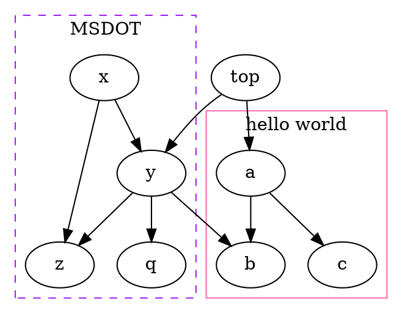

### 2. `clust1.gv`
Source: [graphs/directed/clust1.gv](https://github.com/mhansen/graphviz/blob/a03c5201b7aa2942ce994cb8d072abb3202bec2a/graphs/directed/clust1.gv)

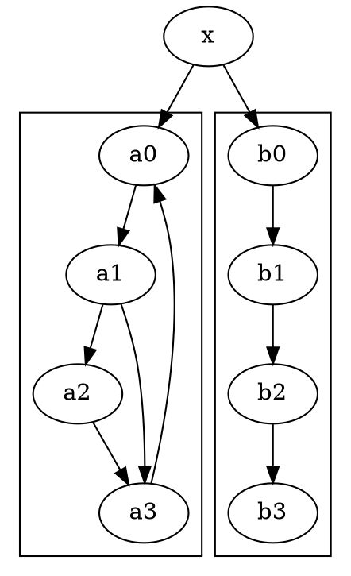

### 3. `clust2.gv`
Source: [graphs/directed/clust2.gv](https://github.com/mhansen/graphviz/blob/a03c5201b7aa2942ce994cb8d072abb3202bec2a/graphs/directed/clust2.gv)

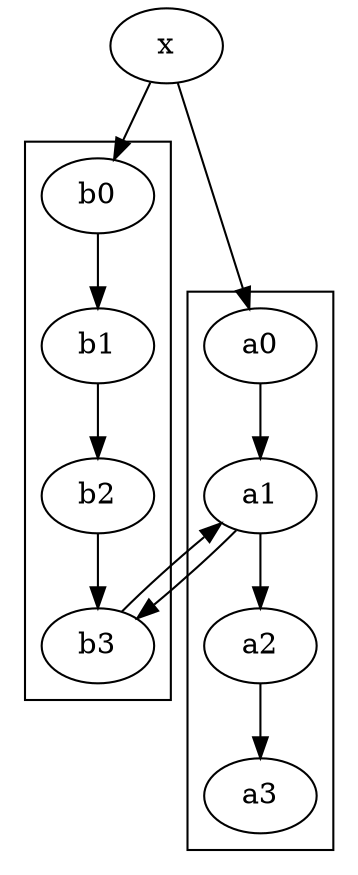

### 4. `clust3.gv`
Source: [graphs/directed/clust3.gv](https://github.com/mhansen/graphviz/blob/a03c5201b7aa2942ce994cb8d072abb3202bec2a/graphs/directed/clust3.gv)

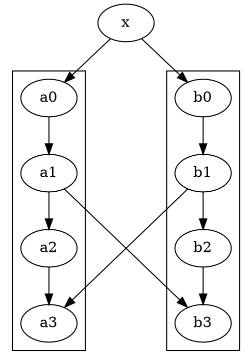

### 5. `clust4.gv`
Source: [graphs/directed/clust4.gv](https://github.com/mhansen/graphviz/blob/a03c5201b7aa2942ce994cb8d072abb3202bec2a/graphs/directed/clust4.gv)

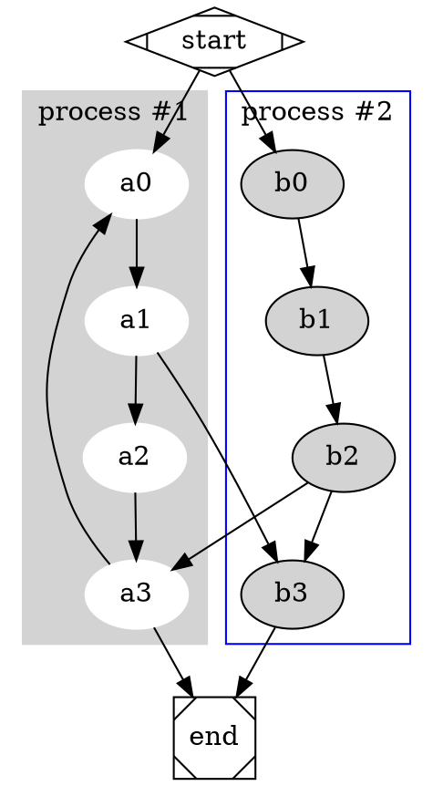

### 6. `clust5.gv`
Source: [graphs/directed/clust5.gv](https://github.com/mhansen/graphviz/blob/a03c5201b7aa2942ce994cb8d072abb3202bec2a/graphs/directed/clust5.gv)

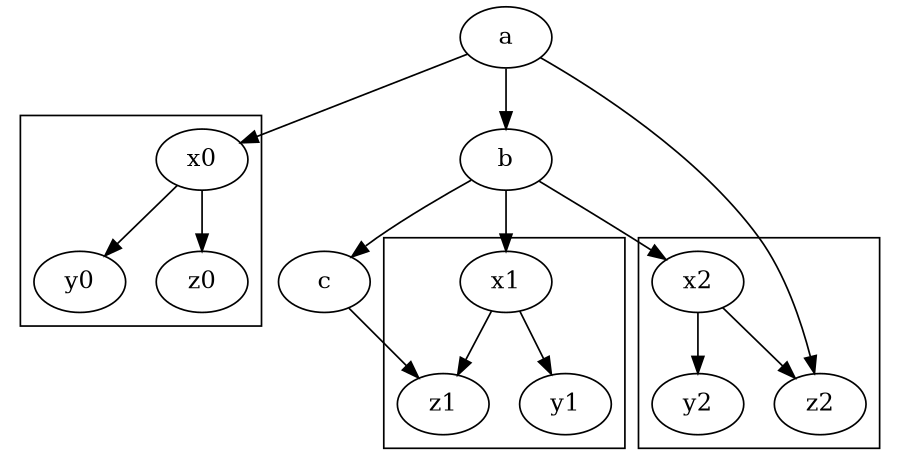

### 7. `proc3d.gv`
Source: [graphs/directed/proc3d.gv](https://github.com/mhansen/graphviz/blob/a03c5201b7aa2942ce994cb8d072abb3202bec2a/graphs/directed/proc3d.gv)

```dot
digraph g {
graph [
fontname=Courier,
fontsize=24,
ranksep = 1.0,
size="10,7.5",
orientation=land,
style="setlinewidth(8)"
page = "8.5,11",
center=true
];
node [
shape = "box"
width = "0.5"
];
edge [
];
subgraph cluster_0 {
label="gryphon"
"22342"
"22343"
"22346"
"22347"
"22351"
"22344"
"22345"
"22348"
"22350"
"22357"
}
subgraph cluster_1 {
label=toucan
"22349"
"22352"
"22356"
"22361"
"22369"
"22353"
"22355"
"22360"
"22365"
"22374"
}
subgraph cluster_2 {
label=parker
"22354"
"22359"
"22375"
}
subgraph cluster_3 {
label=condor
"22358"
"22362"
"22367"
"22373"
"22378"
}
subgraph cluster_4 {
label=kite
"22363"
"22366"
"22371"
"22376"
"22380"
}
subgraph cluster_5 {
label=coot
"22368"
"22372"
"22377"
"22379"
"22381"
}
"22316" [
label = "22316\nksh"
pname = "ksh"
kind = "proc"
];
"22324" [
label = "22324\nnmake"
pname = "nmake"
kind = "proc"
];
"22337" [
label = "22337\nksh"
pname = "ksh"
kind = "proc"
];
"22342" [
label = "22342\nksh"
pname = "ksh"
kind = "proc"
];
"22343" [
label = "22343\ngcc"
pname = "gcc"
kind = "proc"
];
"22344" [
label = "22344\nksh"
pname = "ksh"
kind = "proc"
];
"22345" [
label = "22345\ngcc"
pname = "gcc"
kind = "proc"
];
"22346" [
label = "22346\ncpp"
pname = "cpp"
kind = "proc"
];
"22347" [
label = "22347\ncc1"
pname = "cc1"
kind = "proc"
];
"22348" [
label = "22348\ncpp"
pname = "cpp"
kind = "proc"
];
"93736-32246" [
label = "93736-32246\n/home/ek/work/src/lefty/lefty.c"
fname = "/home/ek/work/src/lefty/lefty.c"
shape = "ellipse"
kind = "file"
];
"22349" [
label = "22349\nksh"
pname = "ksh"
kind = "proc"
];
"22350" [
label = "22350\ncc1"
pname = "cc1"
kind = "proc"
];
"93627-32246" [
label = "93627-32246\n/home/ek/work/src/lefty/gfxview.c"
fname = "/home/ek/work/src/lefty/gfxview.c"
shape = "ellipse"
kind = "file"
];
"22351" [
label = "22351\nas"
pname = "as"
kind = "proc"
];
"22352" [
label = "22352\ngcc"
pname = "gcc"
kind = "proc"
];
"22353" [
label = "22353\nksh"
pname = "ksh"
kind = "proc"
];
"22354" [
label = "22354\nksh"
pname = "ksh"
kind = "proc"
];
"22355" [
label = "22355\ngcc"
pname = "gcc"
kind = "proc"
];
"22356" [
label = "22356\ncpp"
pname = "cpp"
kind = "proc"
];
"22357" [
label = "22357\nas"
pname = "as"
kind = "proc"
];
"22358" [
label = "22358\nksh"
pname = "ksh"
kind = "proc"
];
"22359" [
label = "22359\ngcc"
pname = "gcc"
kind = "proc"
];
"22360" [
label = "22360\ncpp"
pname = "cpp"
kind = "proc"
];
"22361" [
label = "22361\ncc1"
pname = "cc1"
kind = "proc"
];
"93645-32246" [
label = "93645-32246\n/home/ek/work/src/lefty/txtview.c"
fname = "/home/ek/work/src/lefty/txtview.c"
shape = "ellipse"
kind = "file"
];
"22362" [
label = "22362\ngcc"
pname = "gcc"
kind = "proc"
];
"22363" [
label = "22363\nksh"
pname = "ksh"
kind = "proc"
];
"22365" [
label = "22365\ncc1"
pname = "cc1"
kind = "proc"
];
"22366" [
label = "22366\ngcc"
pname = "gcc"
kind = "proc"
];
"93638-32246" [
label = "93638-32246\n/home/ek/work/src/lefty/internal.c"
fname = "/home/ek/work/src/lefty/internal.c"
shape = "ellipse"
kind = "file"
];
"22367" [
label = "22367\ncpp"
pname = "cpp"
kind = "proc"
];
"22368" [
label = "22368\nksh"
pname = "ksh"
kind = "proc"
];
"22369" [
label = "22369\nas"
pname = "as"
kind = "proc"
];
"93642-32246" [
label = "93642-32246\n/home/ek/work/src/lefty/lex.c"
fname = "/home/ek/work/src/lefty/lex.c"
shape = "ellipse"
kind = "file"
];
"22371" [
label = "22371\ncpp"
pname = "cpp"
kind = "proc"
];
"22372" [
label = "22372\ngcc"
pname = "gcc"
kind = "proc"
];
"22373" [
label = "22373\ncc1"
pname = "cc1"
kind = "proc"
];
"88860-32246" [
label = "88860-32246\n/home/ek/dev/src/lefty/stringify.c"
fname = "/home/ek/dev/src/lefty/stringify.c"
shape = "ellipse"
kind = "file"
];
"22374" [
label = "22374\nas"
pname = "as"
kind = "proc"
];
"22375" [
label = "22375\nas"
pname = "as"
kind = "proc"
];
"22376" [
label = "22376\ncc1"
pname = "cc1"
kind = "proc"
];
"93626-32246" [
label = "93626-32246\n/home/ek/work/src/lefty/exec.c"
fname = "/home/ek/work/src/lefty/exec.c"
shape = "ellipse"
kind = "file"
];
"22377" [
label = "22377\ncpp"
pname = "cpp"
kind = "proc"
];
"22378" [
label = "22378\nas"
pname = "as"
kind = "proc"
];
"22379" [
label = "22379\ncc1"
pname = "cc1"
kind = "proc"
];
"93643-32246" [
label = "93643-32246\n/home/ek/work/src/lefty/parse.c"
fname = "/home/ek/work/src/lefty/parse.c"
shape = "ellipse"
kind = "file"
];
"22380" [
label = "22380\nas"
pname = "as"
kind = "proc"
];
"22381" [
label = "22381\nas"
pname = "as"
kind = "proc"
];
"37592-32246" [
label = "37592-32246\n/home/ek/dev/src/lefty/exec.h"
fname = "/home/ek/dev/src/lefty/exec.h"
shape = "ellipse"
kind = "file"
];
"135504-32246" [
label = "135504-32246\n/home/ek/work/sun4/lefty/display.o"
fname = "/home/ek/work/sun4/lefty/display.o"
shape = "ellipse"
kind = "file"
];
"22316" -> "22324" [
];
"22324" -> "22337" [
];
"22337" -> "22342" [
];
"22342" -> "22343" [
];
"22337" -> "22344" [
];
"22344" -> "22345" [
];
"22343" -> "22346" [
];
"22343" -> "22347" [
];
"22345" -> "22348" [
];
"22346" -> "93736-32246" [
];
"22337" -> "22349" [
];
"22345" -> "22350" [
];
"22348" -> "93627-32246" [
];
"22343" -> "22351" [
];
"22349" -> "22352" [
];
"22337" -> "22353" [
];
"22337" -> "22354" [
];
"22353" -> "22355" [
];
"22352" -> "22356" [
];
"22345" -> "22357" [
];
"22337" -> "22358" [
];
"22354" -> "22359" [
];
"22355" -> "22360" [
];
"22352" -> "22361" [
];
"22356" -> "93645-32246" [
];
"22358" -> "22362" [
];
"22337" -> "22363" [
];
"22355" -> "22365" [
];
"22363" -> "22366" [
];
"22360" -> "93638-32246" [
];
"22362" -> "22367" [
];
"22337" -> "22368" [
];
"22352" -> "22369" [
];
"22324" -> "93642-32246" [
];
"22366" -> "22371" [
];
"22368" -> "22372" [
];
"22362" -> "22373" [
];
"22367" -> "88860-32246" [
];
"22355" -> "22374" [
];
"22359" -> "22375" [
];
"22366" -> "22376" [
];
"22371" -> "93626-32246" [
];
"22372" -> "22377" [
];
"22362" -> "22378" [
];
"22372" -> "22379" [
];
"22377" -> "93643-32246" [
];
"22366" -> "22380" [
];
"22372" -> "22381" [
];
"22371" -> "37592-32246" [
];
"22375" -> "135504-32246" [
];

/* hack to increase node separation */
{	rank = same; "22337" -> "93642-32246" [style=invis,minlen=10]; }

}
```

### 8. `sdh.gv`
Source: [graphs/directed/sdh.gv](https://github.com/mhansen/graphviz/blob/a03c5201b7aa2942ce994cb8d072abb3202bec2a/graphs/directed/sdh.gv)

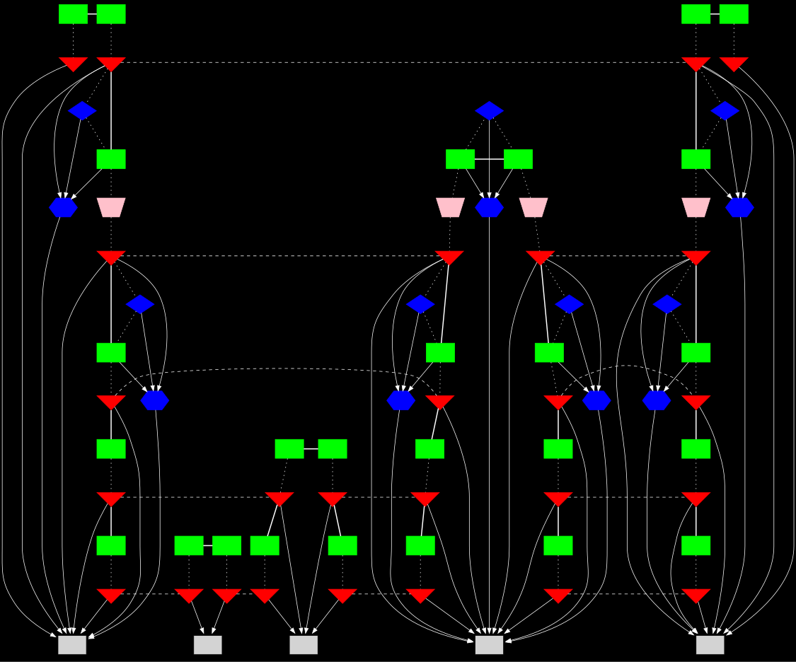

### 9. `shells.gv`
Source: [graphs/directed/shells.gv](https://github.com/mhansen/graphviz/blob/a03c5201b7aa2942ce994cb8d072abb3202bec2a/graphs/directed/shells.gv)

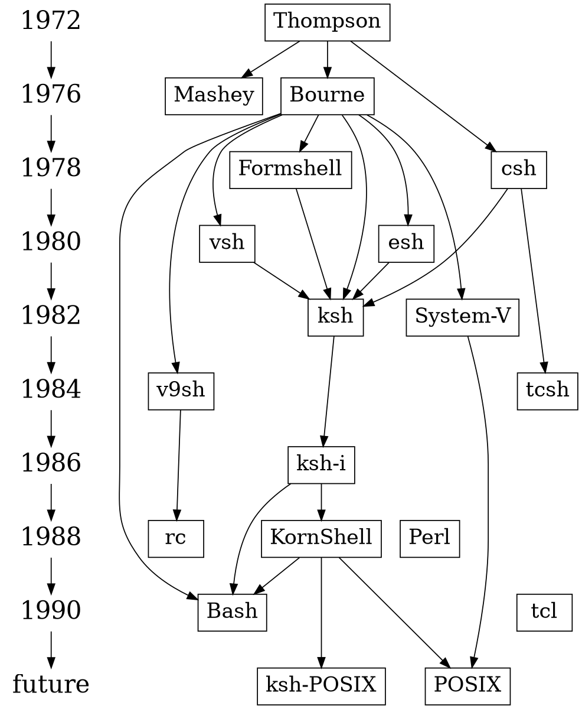

### 10. `states.gv`
Source: [graphs/directed/states.gv](https://github.com/mhansen/graphviz/blob/a03c5201b7aa2942ce994cb8d072abb3202bec2a/graphs/directed/states.gv)

```dot
/*
The command line is

  dot -Tps -Grankdir=LR states.gv > states.ps

and the file is:
*/
digraph states {
    size="3,2";
	rankdir=LR;
    node [shape=ellipse];
    empty [label = "Empty"];
    stolen [label = "Stolen"];
    waiting [label = "Waiting"];
    full [label = "Full"];
    empty -> full [label = "return"]
    empty -> stolen [label = "dispatch", wt=28]
    stolen -> full [label = "return"];
    stolen -> waiting [label = "touch"];
    waiting -> full [label = "return"];
  }
```

### 11. `train11.gv`
Source: [graphs/directed/train11.gv](https://github.com/mhansen/graphviz/blob/a03c5201b7aa2942ce994cb8d072abb3202bec2a/graphs/directed/train11.gv)

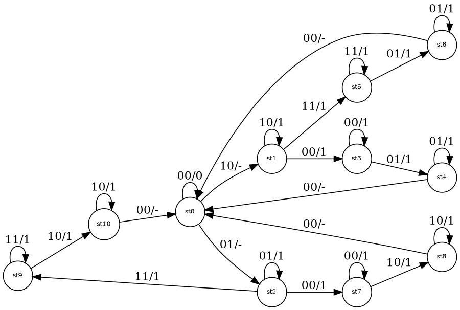

### 12. `trapeziumlr.gv`
Source: [graphs/directed/trapeziumlr.gv](https://github.com/mhansen/graphviz/blob/a03c5201b7aa2942ce994cb8d072abb3202bec2a/graphs/directed/trapeziumlr.gv)

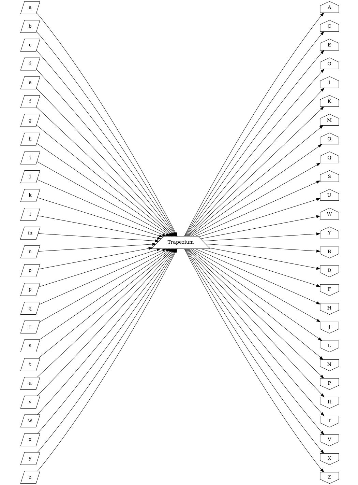
