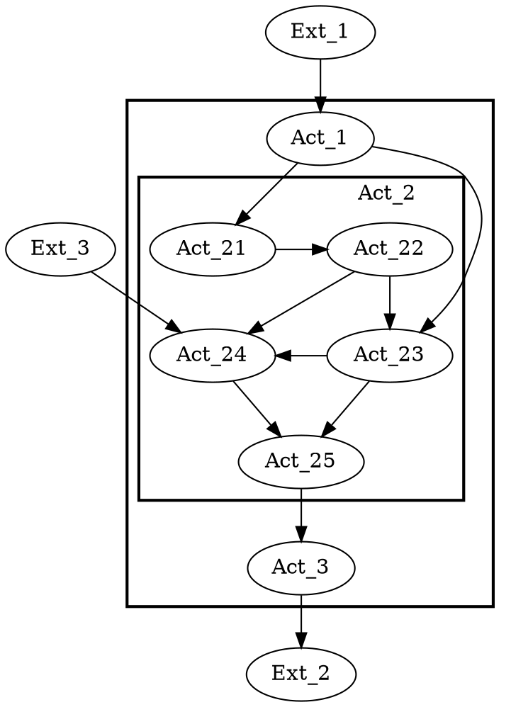
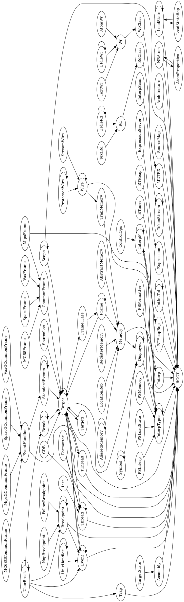
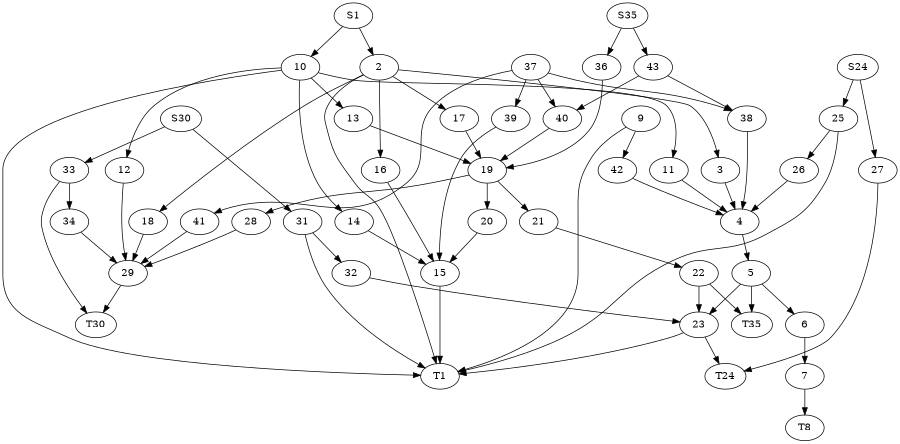
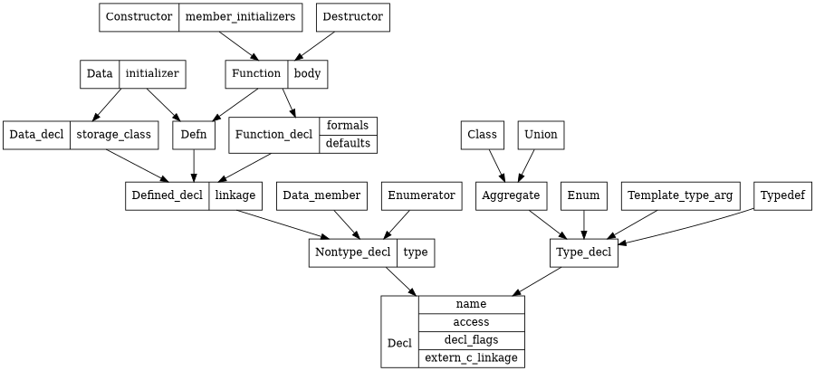
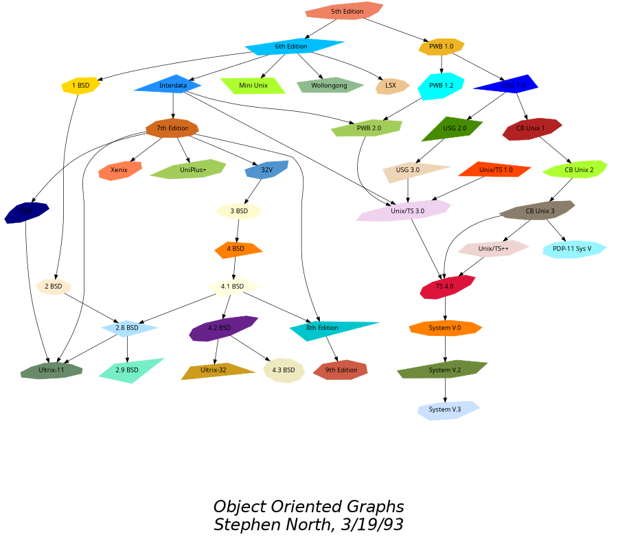
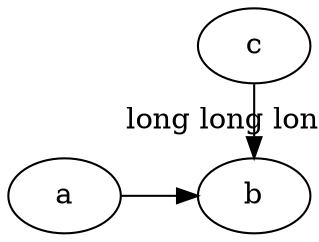
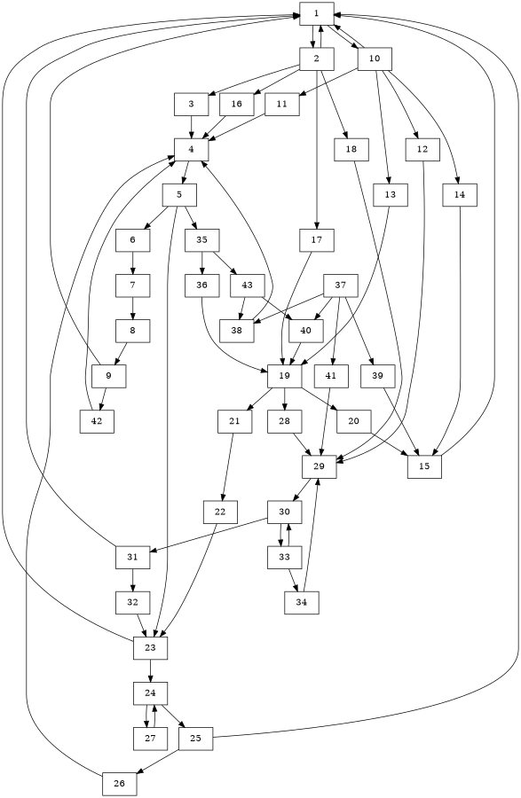
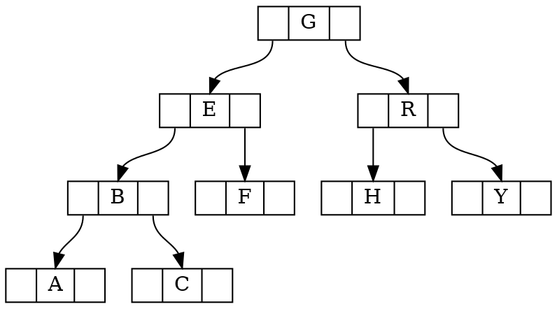
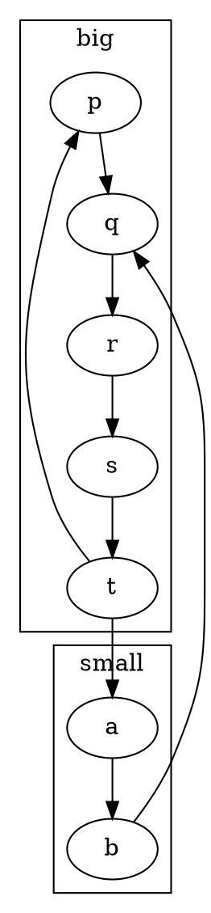
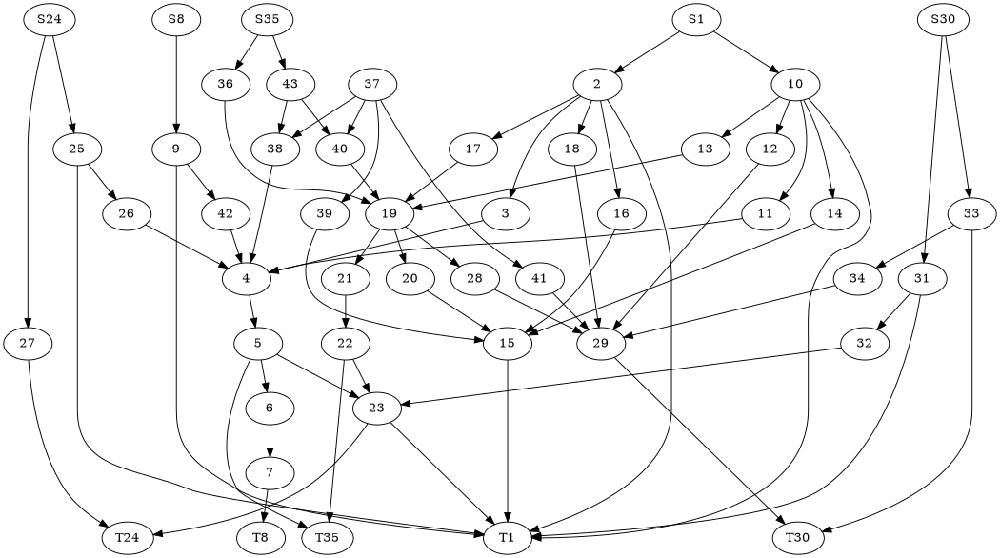

# Graphviz DOT examples — 01 Core directed layout

Basic directed graphs, layered layout stress tests, compact examples, and general graph topology tests.

## Documentation links

- [DOT language](https://graphviz.org/doc/info/lang.html)
- [Attributes](https://graphviz.org/docs/attrs/)
- [Node shapes](https://graphviz.org/doc/info/shapes.html)
- [Arrow shapes](https://graphviz.org/doc/info/arrows.html)
- [HTML-like labels](https://graphviz.org/doc/info/shapes.html#html)
- [Command-line tools/layout engines](https://graphviz.org/docs/layouts/)

## Examples

### 1. `KW91.gv`
Source: [graphs/directed/KW91.gv](https://github.com/mhansen/graphviz/blob/a03c5201b7aa2942ce994cb8d072abb3202bec2a/graphs/directed/KW91.gv)

### 2. `NaN.gv`
Source: [graphs/directed/NaN.gv](https://github.com/mhansen/graphviz/blob/a03c5201b7aa2942ce994cb8d072abb3202bec2a/graphs/directed/NaN.gv)

### 3. `abstract.gv`
Source: [graphs/directed/abstract.gv](https://github.com/mhansen/graphviz/blob/a03c5201b7aa2942ce994cb8d072abb3202bec2a/graphs/directed/abstract.gv)

### 4. `alf.gv`
Source: [graphs/directed/alf.gv](https://github.com/mhansen/graphviz/blob/a03c5201b7aa2942ce994cb8d072abb3202bec2a/graphs/directed/alf.gv)

### 5. `crazy.gv`
Source: [graphs/directed/crazy.gv](https://github.com/mhansen/graphviz/blob/a03c5201b7aa2942ce994cb8d072abb3202bec2a/graphs/directed/crazy.gv)

### 6. `longflat.gv`
Source: [graphs/directed/longflat.gv](https://github.com/mhansen/graphviz/blob/a03c5201b7aa2942ce994cb8d072abb3202bec2a/graphs/directed/longflat.gv)

### 7. `rowe.gv`
Source: [graphs/directed/rowe.gv](https://github.com/mhansen/graphviz/blob/a03c5201b7aa2942ce994cb8d072abb3202bec2a/graphs/directed/rowe.gv)

### 8. `tree.gv`
Source: [graphs/directed/tree.gv](https://github.com/mhansen/graphviz/blob/a03c5201b7aa2942ce994cb8d072abb3202bec2a/graphs/directed/tree.gv)

### 9. `try.gv`
Source: [graphs/directed/try.gv](https://github.com/mhansen/graphviz/blob/a03c5201b7aa2942ce994cb8d072abb3202bec2a/graphs/directed/try.gv)

### 10. `world.gv`
Source: [graphs/directed/world.gv](https://github.com/mhansen/graphviz/blob/a03c5201b7aa2942ce994cb8d072abb3202bec2a/graphs/directed/world.gv)

