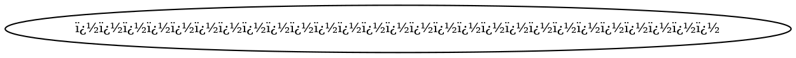
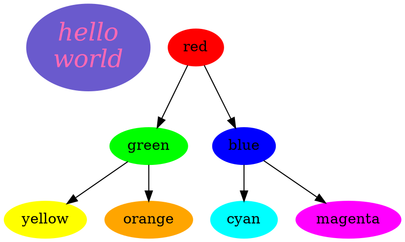
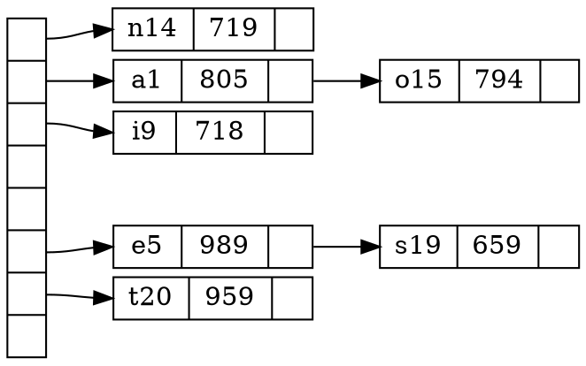
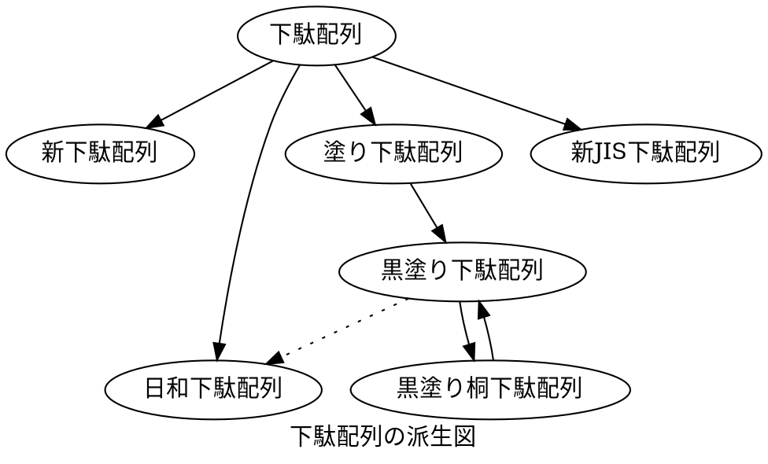
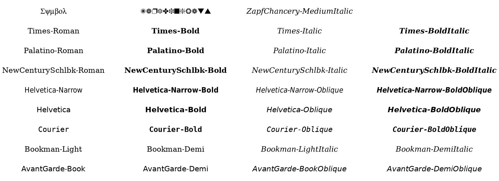
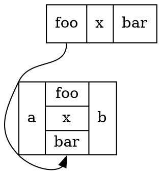
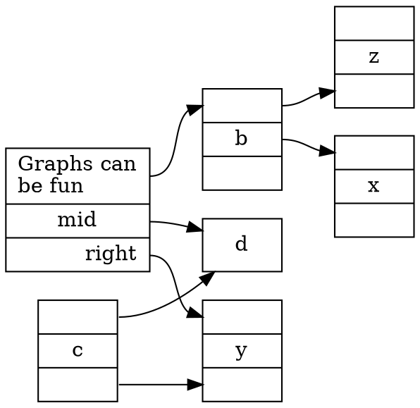
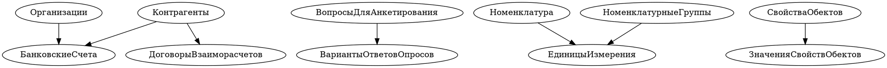
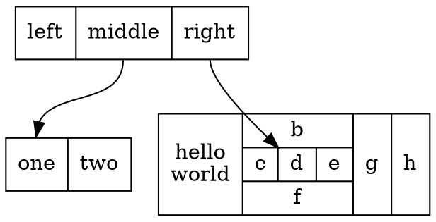
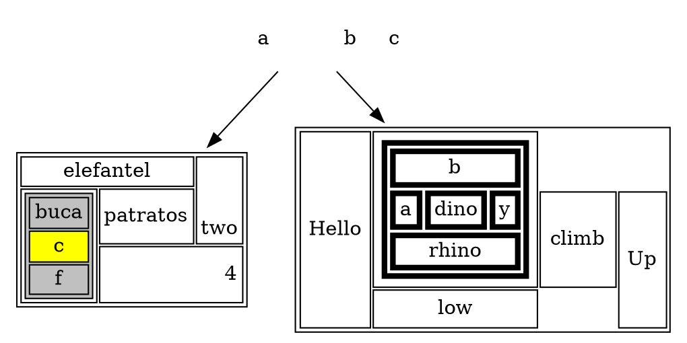

# Graphviz DOT examples — 03 Records, tables, text, fonts, and i18n

Record nodes, HTML-like tables, labels, fonts, C-style text, Latin-1, Japanese, and Russian text examples.

## Documentation links

- [DOT language](https://graphviz.org/doc/info/lang.html)
- [Attributes](https://graphviz.org/docs/attrs/)
- [Node shapes](https://graphviz.org/doc/info/shapes.html)
- [Arrow shapes](https://graphviz.org/doc/info/arrows.html)
- [HTML-like labels](https://graphviz.org/doc/info/shapes.html#html)
- [Command-line tools/layout engines](https://graphviz.org/docs/layouts/)

## Examples

### 1. `Latin1.gv`
Source: [graphs/directed/Latin1.gv](https://github.com/mhansen/graphviz/blob/a03c5201b7aa2942ce994cb8d072abb3202bec2a/graphs/directed/Latin1.gv)

### 2. `ctext.gv`
Source: [graphs/directed/ctext.gv](https://github.com/mhansen/graphviz/blob/a03c5201b7aa2942ce994cb8d072abb3202bec2a/graphs/directed/ctext.gv)

### 3. `hashtable.gv`
Source: [graphs/directed/hashtable.gv](https://github.com/mhansen/graphviz/blob/a03c5201b7aa2942ce994cb8d072abb3202bec2a/graphs/directed/hashtable.gv)

### 4. `japanese.gv`
Source: [graphs/directed/japanese.gv](https://github.com/mhansen/graphviz/blob/a03c5201b7aa2942ce994cb8d072abb3202bec2a/graphs/directed/japanese.gv)

### 5. `psfonttest.gv`
Source: [graphs/directed/psfonttest.gv](https://github.com/mhansen/graphviz/blob/a03c5201b7aa2942ce994cb8d072abb3202bec2a/graphs/directed/psfonttest.gv)

### 6. `record2.gv`
Source: [graphs/directed/record2.gv](https://github.com/mhansen/graphviz/blob/a03c5201b7aa2942ce994cb8d072abb3202bec2a/graphs/directed/record2.gv)

### 7. `records.gv`
Source: [graphs/directed/records.gv](https://github.com/mhansen/graphviz/blob/a03c5201b7aa2942ce994cb8d072abb3202bec2a/graphs/directed/records.gv)

### 8. `russian.gv`
Source: [graphs/directed/russian.gv](https://github.com/mhansen/graphviz/blob/a03c5201b7aa2942ce994cb8d072abb3202bec2a/graphs/directed/russian.gv)

### 9. `structs.gv`
Source: [graphs/directed/structs.gv](https://github.com/mhansen/graphviz/blob/a03c5201b7aa2942ce994cb8d072abb3202bec2a/graphs/directed/structs.gv)

### 10. `table.gv`
Source: [graphs/directed/table.gv](https://github.com/mhansen/graphviz/blob/a03c5201b7aa2942ce994cb8d072abb3202bec2a/graphs/directed/table.gv)

