# Graphviz DOT examples — 04 Automata, programs, and data structures

Finite-state machines, grammars, tries, program/data-flow examples, Unix graph examples, and larger structural test graphs.

## Documentation links

- [DOT language](https://graphviz.org/doc/info/lang.html)
- [Attributes](https://graphviz.org/docs/attrs/)
- [Node shapes](https://graphviz.org/doc/info/shapes.html)
- [Arrow shapes](https://graphviz.org/doc/info/arrows.html)
- [HTML-like labels](https://graphviz.org/doc/info/shapes.html#html)
- [Command-line tools/layout engines](https://graphviz.org/docs/layouts/)

## Examples

### 1. `dfa.gv`
Source: [graphs/directed/dfa.gv](https://github.com/mhansen/graphviz/blob/a03c5201b7aa2942ce994cb8d072abb3202bec2a/graphs/directed/dfa.gv)

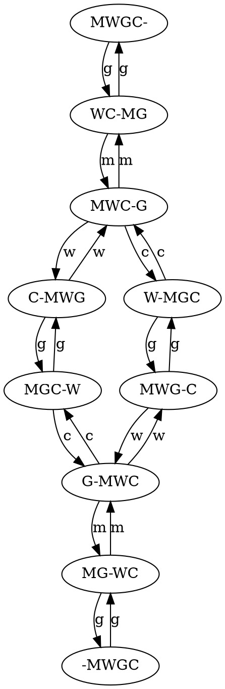

### 2. `fsm.gv`
Source: [graphs/directed/fsm.gv](https://github.com/mhansen/graphviz/blob/a03c5201b7aa2942ce994cb8d072abb3202bec2a/graphs/directed/fsm.gv)

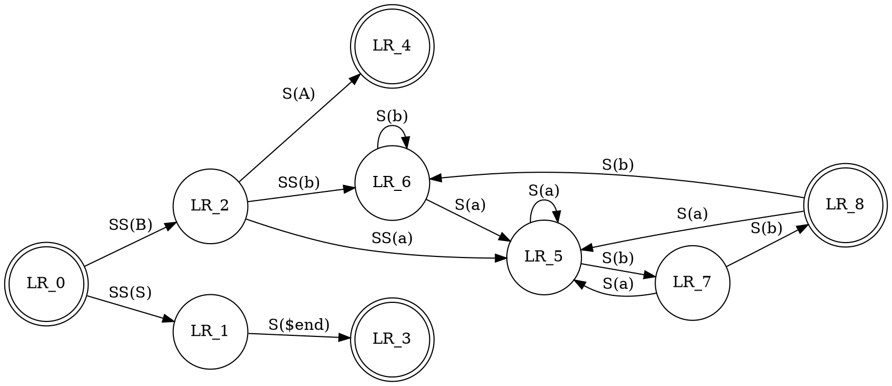

### 3. `grammar.gv`
Source: [graphs/directed/grammar.gv](https://github.com/mhansen/graphviz/blob/a03c5201b7aa2942ce994cb8d072abb3202bec2a/graphs/directed/grammar.gv)

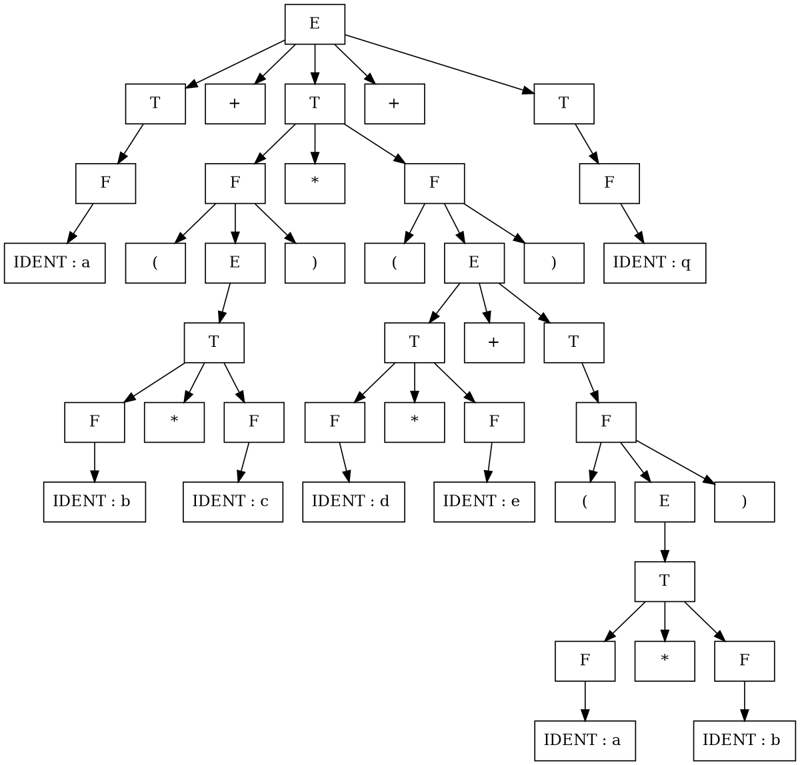

### 4. `jcctree.gv`
Source: [graphs/directed/jcctree.gv](https://github.com/mhansen/graphviz/blob/a03c5201b7aa2942ce994cb8d072abb3202bec2a/graphs/directed/jcctree.gv)

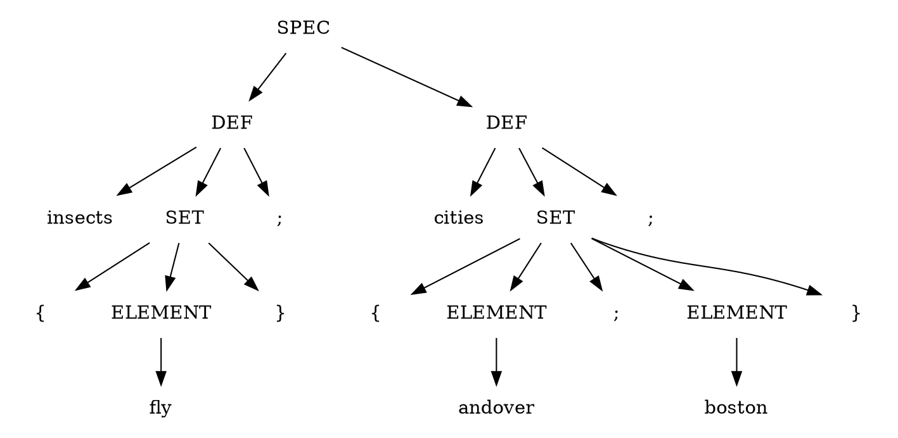

### 5. `jsort.gv`
Source: [graphs/directed/jsort.gv](https://github.com/mhansen/graphviz/blob/a03c5201b7aa2942ce994cb8d072abb3202bec2a/graphs/directed/jsort.gv)

```dot
digraph prof {
	size="6,4"; ratio = fill;
	node [style=filled];
	start -> main [color="0.002 0.999 0.999"];
	start -> on_exit [color="0.649 0.701 0.701"];
	main -> sort [color="0.348 0.839 0.839"];
	main -> merge [color="0.515 0.762 0.762"];
	main -> term [color="0.647 0.702 0.702"];
	main -> signal [color="0.650 0.700 0.700"];
	main -> sbrk [color="0.650 0.700 0.700"];
	main -> unlink [color="0.650 0.700 0.700"];
	main -> newfile [color="0.650 0.700 0.700"];
	main -> fclose [color="0.650 0.700 0.700"];
	main -> close [color="0.650 0.700 0.700"];
	main -> brk [color="0.650 0.700 0.700"];
	main -> setbuf [color="0.650 0.700 0.700"];
	main -> copyproto [color="0.650 0.700 0.700"];
	main -> initree [color="0.650 0.700 0.700"];
	main -> safeoutfil [color="0.650 0.700 0.700"];
	main -> getpid [color="0.650 0.700 0.700"];
	main -> sprintf [color="0.650 0.700 0.700"];
	main -> creat [color="0.650 0.700 0.700"];
	main -> rem [color="0.650 0.700 0.700"];
	main -> oldfile [color="0.650 0.700 0.700"];
	sort -> msort [color="0.619 0.714 0.714"];
	sort -> filbuf [color="0.650 0.700 0.700"];
	sort -> newfile [color="0.650 0.700 0.700"];
	sort -> fclose [color="0.650 0.700 0.700"];
	sort -> setbuf [color="0.650 0.700 0.700"];
	sort -> setfil [color="0.650 0.700 0.700"];
	msort -> qsort [color="0.650 0.700 0.700"];
	msort -> insert [color="0.650 0.700 0.700"];
	msort -> wline [color="0.650 0.700 0.700"];
	msort -> div [color="0.650 0.700 0.700"];
	msort -> cmpsave [color="0.650 0.700 0.700"];
	merge -> insert [color="0.650 0.700 0.700"];
	merge -> rline [color="0.650 0.700 0.700"];
	merge -> wline [color="0.650 0.700 0.700"];
	merge -> unlink [color="0.650 0.700 0.700"];
	merge -> fopen [color="0.650 0.700 0.700"];
	merge -> fclose [color="0.650 0.700 0.700"];
	merge -> setfil [color="0.650 0.700 0.700"];
	merge -> mul [color="0.650 0.700 0.700"];
	merge -> setbuf [color="0.650 0.700 0.700"];
	merge -> cmpsave [color="0.650 0.700 0.700"];
	insert -> cmpa [color="0.650 0.700 0.700"];
	wline -> flsbuf [color="0.649 0.700 0.700"];
	qsort -> cmpa [color="0.650 0.700 0.700"];
	rline -> filbuf [color="0.649 0.700 0.700"];
	xflsbuf -> write [color="0.650 0.700 0.700"];
	flsbuf -> xflsbuf [color="0.649 0.700 0.700"];
	filbuf -> read [color="0.650 0.700 0.700"];
	term -> unlink [color="0.650 0.700 0.700"];
	term -> signal [color="0.650 0.700 0.700"];
	term -> setfil [color="0.650 0.700 0.700"];
	term -> exit [color="0.650 0.700 0.700"];
	endopen -> open [color="0.650 0.700 0.700"];
	fopen -> endopen [color="0.639 0.705 0.705"];
	fopen -> findiop [color="0.650 0.700 0.700"];
	newfile -> fopen [color="0.634 0.707 0.707"];
	newfile -> setfil [color="0.650 0.700 0.700"];
	fclose -> fflush [color="0.642 0.704 0.704"];
	fclose -> close [color="0.650 0.700 0.700"];
	fflush -> xflsbuf [color="0.635 0.707 0.707"];
	malloc -> morecore [color="0.325 0.850 0.850"];
	malloc -> demote [color="0.650 0.700 0.700"];
	morecore -> sbrk [color="0.650 0.700 0.700"];
	morecore -> getfreehdr [color="0.650 0.700 0.700"];
	morecore -> free [color="0.650 0.700 0.700"];
	morecore -> getpagesize [color="0.650 0.700 0.700"];
	morecore -> putfreehdr [color="0.650 0.700 0.700"];
	morecore -> udiv [color="0.650 0.700 0.700"];
	morecore -> umul [color="0.650 0.700 0.700"];
	on_exit -> malloc [color="0.325 0.850 0.850"];
	signal -> sigvec [color="0.650 0.700 0.700"];
	moncontrol -> profil [color="0.650 0.700 0.700"];
	getfreehdr -> sbrk [color="0.650 0.700 0.700"];
	free -> insert [color="0.650 0.700 0.700"];
	insert -> getfreehdr [color="0.650 0.700 0.700"];
	setfil -> div [color="0.650 0.700 0.700"];
	setfil -> rem [color="0.650 0.700 0.700"];
	sigvec -> sigblock [color="0.650 0.700 0.700"];
	sigvec -> sigsetmask [color="0.650 0.700 0.700"];
	doprnt -> urem [color="0.650 0.700 0.700"];
	doprnt -> udiv [color="0.650 0.700 0.700"];
	doprnt -> strlen [color="0.650 0.700 0.700"];
	doprnt -> localeconv [color="0.650 0.700 0.700"];
	sprintf -> doprnt [color="0.650 0.700 0.700"];
cmpa [color="0.000 1.000 1.000"];
wline [color="0.201 0.753 1.000"];
insert [color="0.305 0.625 1.000"];
rline [color="0.355 0.563 1.000"];
sort [color="0.408 0.498 1.000"];
qsort [color="0.449 0.447 1.000"];
write [color="0.499 0.386 1.000"];
read [color="0.578 0.289 1.000"];
msort [color="0.590 0.273 1.000"];
merge [color="0.603 0.258 1.000"];
unlink [color="0.628 0.227 1.000"];
filbuf [color="0.641 0.212 1.000"];
open [color="0.641 0.212 1.000"];
sbrk [color="0.647 0.204 1.000"];
signal [color="0.647 0.204 1.000"];
moncontrol [color="0.647 0.204 1.000"];
xflsbuf [color="0.650 0.200 1.000"];
flsbuf [color="0.650 0.200 1.000"];
div [color="0.650 0.200 1.000"];
cmpsave [color="0.650 0.200 1.000"];
rem [color="0.650 0.200 1.000"];
setfil [color="0.650 0.200 1.000"];
close [color="0.650 0.200 1.000"];
fclose [color="0.650 0.200 1.000"];
fflush [color="0.650 0.200 1.000"];
setbuf [color="0.650 0.200 1.000"];
endopen [color="0.650 0.200 1.000"];
findiop [color="0.650 0.200 1.000"];
fopen [color="0.650 0.200 1.000"];
mul [color="0.650 0.200 1.000"];
newfile [color="0.650 0.200 1.000"];
sigblock [color="0.650 0.200 1.000"];
sigsetmask [color="0.650 0.200 1.000"];
sigvec [color="0.650 0.200 1.000"];
udiv [color="0.650 0.200 1.000"];
urem [color="0.650 0.200 1.000"];
brk [color="0.650 0.200 1.000"];
getfreehdr [color="0.650 0.200 1.000"];
strlen [color="0.650 0.200 1.000"];
umul [color="0.650 0.200 1.000"];
doprnt [color="0.650 0.200 1.000"];
copyproto [color="0.650 0.200 1.000"];
creat [color="0.650 0.200 1.000"];
demote [color="0.650 0.200 1.000"];
exit [color="0.650 0.200 1.000"];
free [color="0.650 0.200 1.000"];
getpagesize [color="0.650 0.200 1.000"];
getpid [color="0.650 0.200 1.000"];
initree [color="0.650 0.200 1.000"];
insert [color="0.650 0.200 1.000"];
localeconv [color="0.650 0.200 1.000"];
main [color="0.650 0.200 1.000"];
malloc [color="0.650 0.200 1.000"];
morecore [color="0.650 0.200 1.000"];
oldfile [color="0.650 0.200 1.000"];
on_exit [color="0.650 0.200 1.000"];
profil [color="0.650 0.200 1.000"];
putfreehdr [color="0.650 0.200 1.000"];
safeoutfil [color="0.650 0.200 1.000"];
sprintf [color="0.650 0.200 1.000"];
term [color="0.650 0.200 1.000"];
}
```

### 6. `ldbxtried.gv`
Source: [graphs/directed/ldbxtried.gv](https://github.com/mhansen/graphviz/blob/a03c5201b7aa2942ce994cb8d072abb3202bec2a/graphs/directed/ldbxtried.gv)

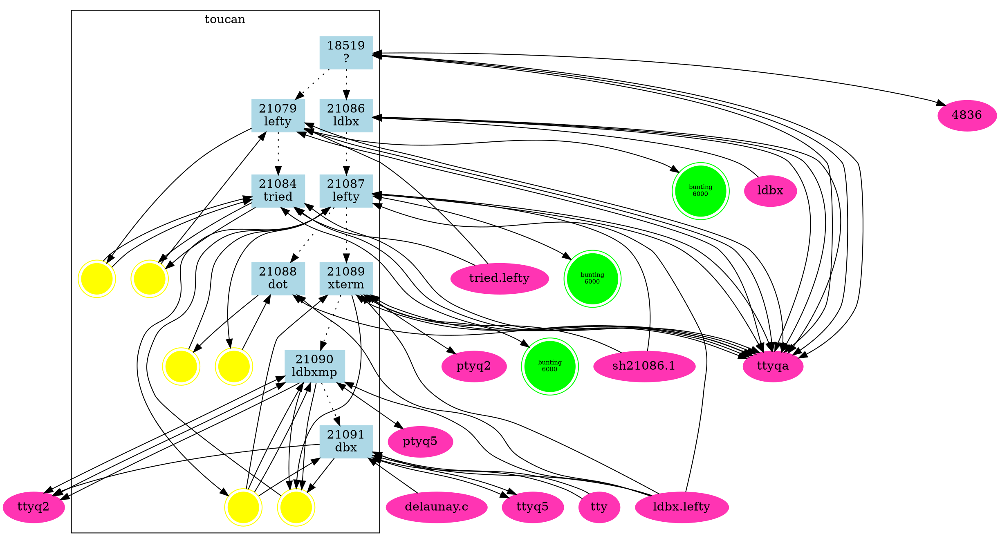

### 7. `mike.gv`
Source: [graphs/directed/mike.gv](https://github.com/mhansen/graphviz/blob/a03c5201b7aa2942ce994cb8d072abb3202bec2a/graphs/directed/mike.gv)

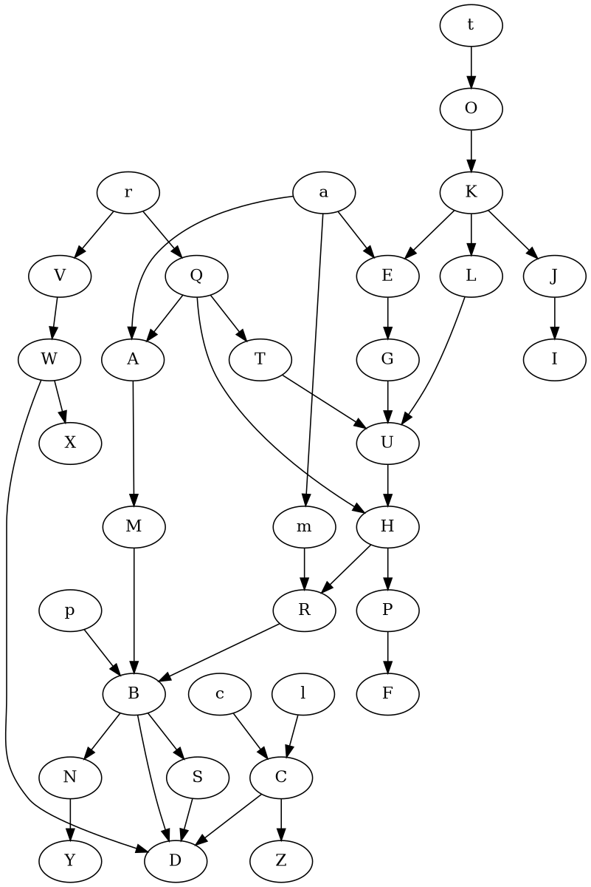

### 8. `nhg.gv`
Source: [graphs/directed/nhg.gv](https://github.com/mhansen/graphviz/blob/a03c5201b7aa2942ce994cb8d072abb3202bec2a/graphs/directed/nhg.gv)

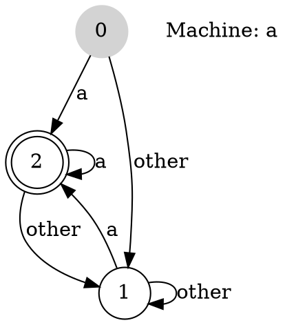

### 9. `pgram.gv`
Source: [graphs/directed/pgram.gv](https://github.com/mhansen/graphviz/blob/a03c5201b7aa2942ce994cb8d072abb3202bec2a/graphs/directed/pgram.gv)

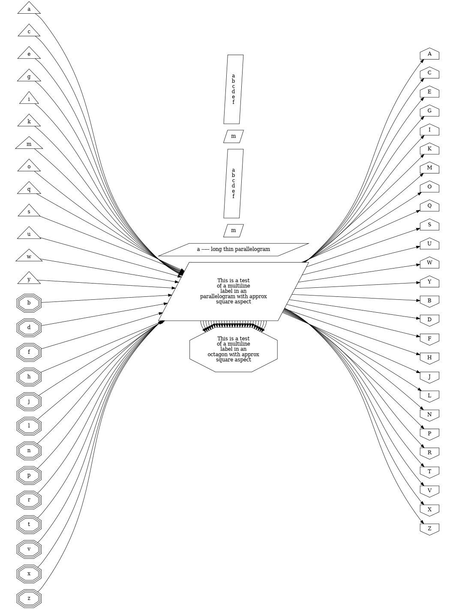

### 10. `pm2way.gv`
Source: [graphs/directed/pm2way.gv](https://github.com/mhansen/graphviz/blob/a03c5201b7aa2942ce994cb8d072abb3202bec2a/graphs/directed/pm2way.gv)

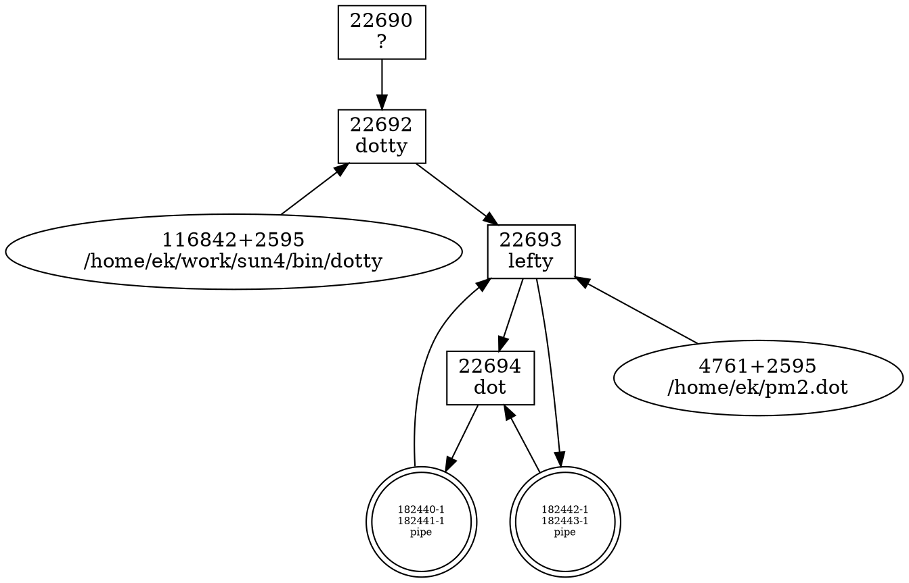

### 11. `pmpipe.gv`
Source: [graphs/directed/pmpipe.gv](https://github.com/mhansen/graphviz/blob/a03c5201b7aa2942ce994cb8d072abb3202bec2a/graphs/directed/pmpipe.gv)

```dot
digraph g {
graph [
];
node [
fontsize = "14"
fontname = "Times-Roman"
fontcolor = "black"
shape = "box"
color = "black"
width = "0.5"
];
edge [
fontsize = "14"
fontname = "Times-Roman"
fontcolor = "black"
color = "black"
];
"23296" [
label = "23296\n?"
pname = "?"
kind = "proc"
];
"182948-1" [
label = "182948-1\n182949-1\npipe"
fontsize = "7"
fname = "pipe"
shape = "doublecircle"
subkind = "pipe"
kind = "file"
];
"23310" [
label = "23310\ncat"
pname = "cat"
kind = "proc"
];
"182950-1" [
label = "182950-1\n182951-1\npipe"
fontsize = "7"
fname = "pipe"
shape = "doublecircle"
subkind = "pipe"
kind = "file"
];
"23311" [
label = "23311\ncat"
pname = "cat"
kind = "proc"
];
"182952-1" [
label = "182952-1\n182953-1\npipe"
fontsize = "7"
fname = "pipe"
shape = "doublecircle"
subkind = "pipe"
kind = "file"
];
"23312" [
label = "23312\ncat"
pname = "cat"
kind = "proc"
];
"182954-1" [
label = "182954-1\n182955-1\npipe"
fontsize = "7"
fname = "pipe"
shape = "doublecircle"
subkind = "pipe"
kind = "file"
];
"23313" [
label = "23313\ncat"
pname = "cat"
kind = "proc"
];
"79893+2568" [
label = "79893+2568\n/usr/share/lib/termcap"
fname = "/usr/share/lib/termcap"
shape = "ellipse"
kind = "file"
];
"85+2560" [
label = "85+2560\n?"
fname = "?"
shape = "ellipse"
kind = "file"
];
"23314" [
label = "23314\ncat"
pname = "cat"
kind = "proc"
];
"4151865284+0" [
label = "4151865284+0\n/tmp/termcap"
fname = "/tmp/termcap"
shape = "ellipse"
kind = "file"
];
"23296" -> "23310" [
fontsize = "14"
fontname = "Times-Roman"
fontcolor = "black"
color = "black"
];
"23296" -> "23311" [
fontsize = "14"
fontname = "Times-Roman"
fontcolor = "black"
color = "black"
];
"23311" -> "182948-1" [
fontsize = "14"
fontname = "Times-Roman"
fontcolor = "black"
dir = "back"
color = "black"
];
"23310" -> "182948-1" [
fontsize = "14"
fontname = "Times-Roman"
fontcolor = "black"
dir = "forward"
color = "black"
];
"23296" -> "23312" [
fontsize = "14"
fontname = "Times-Roman"
fontcolor = "black"
color = "black"
];
"23312" -> "182952-1" [
fontsize = "14"
fontname = "Times-Roman"
fontcolor = "black"
dir = "forward"
color = "black"
];
"23312" -> "182950-1" [
fontsize = "14"
fontname = "Times-Roman"
fontcolor = "black"
dir = "back"
color = "black"
];
"23296" -> "23313" [
fontsize = "14"
fontname = "Times-Roman"
fontcolor = "black"
color = "black"
];
"23313" -> "182954-1" [
fontsize = "14"
fontname = "Times-Roman"
fontcolor = "black"
dir = "forward"
color = "black"
];
"23311" -> "182950-1" [
fontsize = "14"
fontname = "Times-Roman"
fontcolor = "black"
dir = "forward"
color = "black"
];
"23310" -> "79893+2568" [
fontsize = "14"
fontname = "Times-Roman"
fontcolor = "black"
dir = "back"
color = "black"
];
"23296" -> "85+2560" [
fontsize = "14"
fontname = "Times-Roman"
fontcolor = "black"
dir = "both"
color = "black"
];
"23296" -> "23314" [
fontsize = "14"
fontname = "Times-Roman"
fontcolor = "black"
color = "black"
];
"23314" -> "85+2560" [
fontsize = "14"
fontname = "Times-Roman"
fontcolor = "black"
dir = "both"
color = "black"
];
"23314" -> "182954-1" [
fontsize = "14"
fontname = "Times-Roman"
fontcolor = "black"
dir = "back"
color = "black"
];
"23296" -> "85+2560" [
fontsize = "14"
fontname = "Times-Roman"
fontcolor = "black"
dir = "both"
color = "black"
];
"23314" -> "4151865284+0" [
fontsize = "14"
fontname = "Times-Roman"
fontcolor = "black"
dir = "forward"
color = "black"
];
"23313" -> "182952-1" [
fontsize = "14"
fontname = "Times-Roman"
fontcolor = "black"
dir = "back"
color = "black"
];
}
```

### 12. `triedds.gv`
Source: [graphs/directed/triedds.gv](https://github.com/mhansen/graphviz/blob/a03c5201b7aa2942ce994cb8d072abb3202bec2a/graphs/directed/triedds.gv)

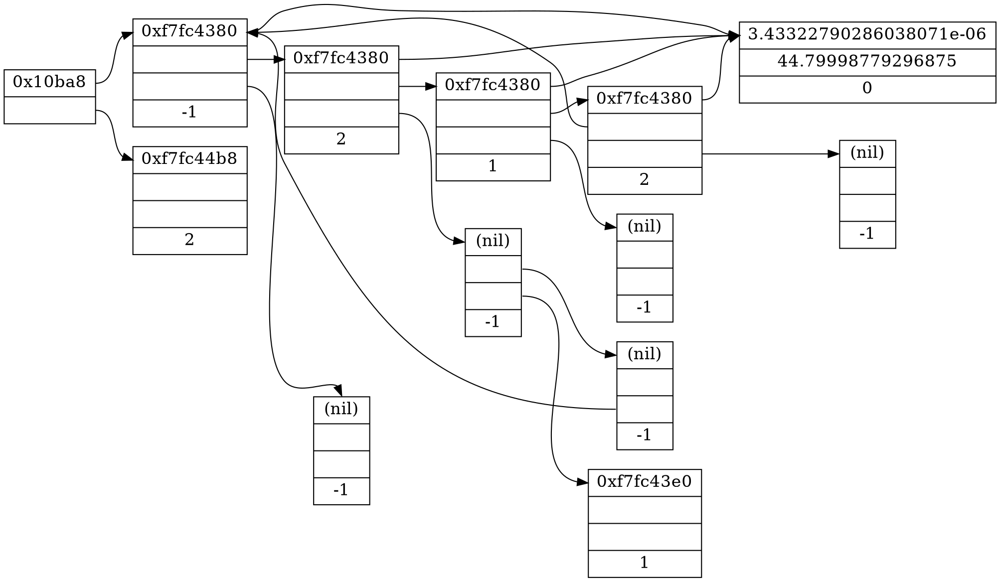

### 13. `unix.gv`
Source: [graphs/directed/unix.gv](https://github.com/mhansen/graphviz/blob/a03c5201b7aa2942ce994cb8d072abb3202bec2a/graphs/directed/unix.gv)

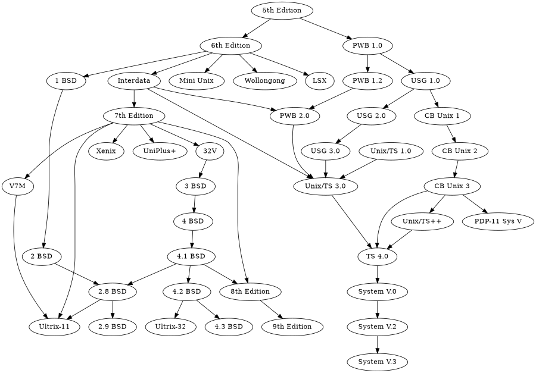

### 14. `unix2.gv`
Source: [graphs/directed/unix2.gv](https://github.com/mhansen/graphviz/blob/a03c5201b7aa2942ce994cb8d072abb3202bec2a/graphs/directed/unix2.gv)

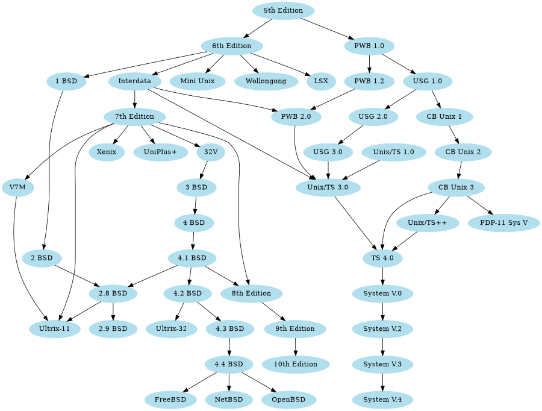

### 15. `viewfile.gv`
Source: [graphs/directed/viewfile.gv](https://github.com/mhansen/graphviz/blob/a03c5201b7aa2942ce994cb8d072abb3202bec2a/graphs/directed/viewfile.gv)

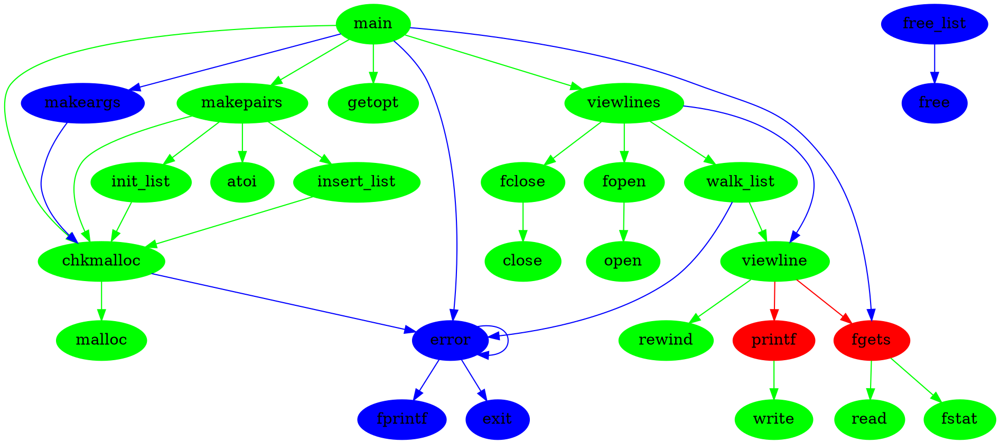

### 16. `switch.gv`
Source: [graphs/directed/switch.gv](https://github.com/mhansen/graphviz/blob/a03c5201b7aa2942ce994cb8d072abb3202bec2a/graphs/directed/switch.gv)

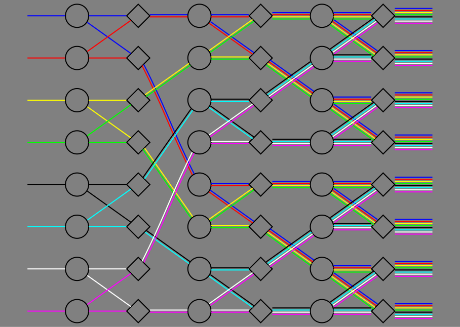
