# Graphviz DOT examples — 05 Edges, shapes, domain models, and undirected graphs

Arrowhead/edge variants, domain-specific directed examples, polygon/shape tests, and all undirected Graphviz examples.

## Documentation links

- [DOT language](https://graphviz.org/doc/info/lang.html)
- [Attributes](https://graphviz.org/docs/attrs/)
- [Node shapes](https://graphviz.org/doc/info/shapes.html)
- [Arrow shapes](https://graphviz.org/doc/info/arrows.html)
- [HTML-like labels](https://graphviz.org/doc/info/shapes.html#html)
- [Command-line tools/layout engines](https://graphviz.org/docs/layouts/)

## Examples

### 1. `arrows.gv`
Source: [graphs/directed/arrows.gv](https://github.com/mhansen/graphviz/blob/a03c5201b7aa2942ce994cb8d072abb3202bec2a/graphs/directed/arrows.gv)

```dot
digraph G {
	graph [rankdir=LR nodesep=0]
	node [shape=point label=""]
	edge [fontsize=10]
	_box -> box [arrowhead=box label=box]
	box -> boxbox [arrowhead=boxbox label=boxbox]
	_box -> lbox [arrowhead=lbox label=lbox]
	lbox -> lboxlbox [arrowhead=lboxlbox label=lboxlbox]
	_box -> rbox [arrowhead=rbox label=rbox]
	rbox -> rboxrbox [arrowhead=rboxrbox label=rboxrbox]
	_box -> olbox [arrowhead=olbox label=olbox]
	olbox -> olboxolbox [arrowhead=olboxolbox label=olboxolbox]
	_box -> orbox [arrowhead=orbox label=orbox]
	orbox -> orboxorbox [arrowhead=orboxorbox label=orboxorbox]
	_box -> obox [arrowhead=obox label=obox]
	obox -> oboxobox [arrowhead=oboxobox label=oboxobox]
	_crow -> crow [arrowhead=crow label=crow]
	crow -> crowcrow [arrowhead=crowcrow label=crowcrow]
	_crow -> lcrow [arrowhead=lcrow label=lcrow]
	lcrow -> lcrowlcrow [arrowhead=lcrowlcrow label=lcrowlcrow]
	_crow -> rcrow [arrowhead=rcrow label=rcrow]
	rcrow -> rcrowrcrow [arrowhead=rcrowrcrow label=rcrowrcrow]
	_diamond -> diamond [arrowhead=diamond label=diamond]
	diamond -> diamonddiamond [arrowhead=diamonddiamond label=diamonddiamond]
	_diamond -> ldiamond [arrowhead=ldiamond label=ldiamond]
	ldiamond -> ldiamondldiamond [arrowhead=ldiamondldiamond label=ldiamondldiamond]
	_diamond -> rdiamond [arrowhead=rdiamond label=rdiamond]
	rdiamond -> rdiamondrdiamond [arrowhead=rdiamondrdiamond label=rdiamondrdiamond]
	_diamond -> oldiamond [arrowhead=oldiamond label=oldiamond]
	oldiamond -> oldiamondoldiamond [arrowhead=oldiamondoldiamond label=oldiamondoldiamond]
	_diamond -> ordiamond [arrowhead=ordiamond label=ordiamond]
	ordiamond -> ordiamondordiamond [arrowhead=ordiamondordiamond label=ordiamondordiamond]
	_diamond -> odiamond [arrowhead=odiamond label=odiamond]
	odiamond -> odiamondodiamond [arrowhead=odiamondodiamond label=odiamondodiamond]
	_dot -> dot [arrowhead=dot label=dot]
	dot -> dotdot [arrowhead=dotdot label=dotdot]
	_dot -> odot [arrowhead=odot label=odot]
	odot -> odotodot [arrowhead=odotodot label=odotodot]
	_inv -> inv [arrowhead=inv label=inv]
	inv -> invinv [arrowhead=invinv label=invinv]
	_inv -> linv [arrowhead=linv label=linv]
	linv -> linvlinv [arrowhead=linvlinv label=linvlinv]
	_inv -> rinv [arrowhead=rinv label=rinv]
	rinv -> rinvrinv [arrowhead=rinvrinv label=rinvrinv]
	_inv -> olinv [arrowhead=olinv label=olinv]
	olinv -> olinvolinv [arrowhead=olinvolinv label=olinvolinv]
	_inv -> orinv [arrowhead=orinv label=orinv]
	orinv -> orinvorinv [arrowhead=orinvorinv label=orinvorinv]
	_inv -> oinv [arrowhead=oinv label=oinv]
	oinv -> oinvoinv [arrowhead=oinvoinv label=oinvoinv]
	_none -> none [arrowhead=none label=none]
	none -> nonenone [arrowhead=nonenone label=nonenone]
	_normal -> normal [arrowhead=normal label=normal]
	normal -> normalnormal [arrowhead=normalnormal label=normalnormal]
	_normal -> lnormal [arrowhead=lnormal label=lnormal]
	lnormal -> lnormallnormal [arrowhead=lnormallnormal label=lnormallnormal]
	_normal -> rnormal [arrowhead=rnormal label=rnormal]
	rnormal -> rnormalrnormal [arrowhead=rnormalrnormal label=rnormalrnormal]
	_normal -> olnormal [arrowhead=olnormal label=olnormal]
	olnormal -> olnormalolnormal [arrowhead=olnormalolnormal label=olnormalolnormal]
	_normal -> ornormal [arrowhead=ornormal label=ornormal]
	ornormal -> ornormalornormal [arrowhead=ornormalornormal label=ornormalornormal]
	_normal -> onormal [arrowhead=onormal label=onormal]
	onormal -> onormalonormal [arrowhead=onormalonormal label=onormalonormal]
	_tee -> tee [arrowhead=tee label=tee]
	tee -> teetee [arrowhead=teetee label=teetee]
	_tee -> ltee [arrowhead=ltee label=ltee]
	ltee -> lteeltee [arrowhead=lteeltee label=lteeltee]
	_tee -> rtee [arrowhead=rtee label=rtee]
	rtee -> rteertee [arrowhead=rteertee label=rteertee]
	_vee -> vee [arrowhead=vee label=vee]
	vee -> veevee [arrowhead=veevee label=veevee]
	_vee -> lvee [arrowhead=lvee label=lvee]
	lvee -> lveelvee [arrowhead=lveelvee label=lveelvee]
	_vee -> rvee [arrowhead=rvee label=rvee]
	rvee -> rveervee [arrowhead=rveervee label=rveervee]
	_curve -> curve [arrowhead=curve label=curve]
	curve -> curvecurve [arrowhead=curvecurve label=curvecurve]
	_curve -> lcurve [arrowhead=lcurve label=lcurve]
	lcurve -> lcurvelcurve [arrowhead=lcurvelcurve label=lcurvelcurve]
	_curve -> rcurve [arrowhead=rcurve label=rcurve]
	rcurve -> rcurvercurve [arrowhead=rcurvercurve label=rcurvercurve]
	_icurve -> icurve [arrowhead=icurve label=icurve]
	icurve -> icurveicurve [arrowhead=icurveicurve label=icurveicurve]
	_icurve -> licurve [arrowhead=licurve label=licurve]
	licurve -> licurvelicurve [arrowhead=licurvelicurve label=licurvelicurve]
	_icurve -> ricurve [arrowhead=ricurve label=ricurve]
	ricurve -> ricurvericurve [arrowhead=ricurvericurve label=ricurvericurve]
}
```

### 2. `awilliams.gv`
Source: [graphs/directed/awilliams.gv](https://github.com/mhansen/graphviz/blob/a03c5201b7aa2942ce994cb8d072abb3202bec2a/graphs/directed/awilliams.gv)

```dot
digraph pvn {
	ordering=out;

	node_1 -> node_2;
	node_1 [label="ID: 1\ntype: 48\nnbr out: 0\nnbr chi: 11"];
	node_2 [label="ID: 2\ntype: 8\nnbr out: 0\nnbr chi: 0"];
	node_1 -> node_3;
	node_3 [label="ID: 3\ntype: 1\nnbr out: 0\nnbr chi: 0"];
	node_1 -> node_4;
	node_4 [label="ID: 4\ntype: 6\nnbr out: 0\nnbr chi: 0"];
	node_1 -> node_5;
	node_5 [label="ID: 5\ntype: 14\nnbr out: 0\nnbr chi: 0"];
	node_1 -> node_6;
	node_6 [label="ID: 6\ntype: 14\nnbr out: 0\nnbr chi: 0"];
	node_1 -> node_7;
	node_7 [label="ID: 7\ntype: 49\nnbr out: 0\nnbr chi: 0"];
	node_7 -> node_8;
	node_8 [label="ID: 8\ntype: 45\nnbr out: 2\nnbr chi: 0"];
	node_8 -> node_9;
	node_9 [label="ID: 9\ntype: 48\nnbr out: 0\nnbr chi: 4"];
	node_9 -> node_10;
	node_10 [label="ID: 10\ntype: 8\nnbr out: 0\nnbr chi: 0"];
	node_9 -> node_11;
	node_11 [label="ID: 11\ntype: 1\nnbr out: 0\nnbr chi: 0"];
	node_9 -> node_12;
	node_12 [label="ID: 12\ntype: 5\nnbr out: 0\nnbr chi: 0"];
	node_9 -> node_13;
	node_13 [label="ID: 13\ntype: 16\nnbr out: 0\nnbr chi: 0"];
	node_8 -> node_14;
	node_14 [label="ID: 14\ntype: 39\nnbr out: 1\nnbr chi: 0"];
	node_14 -> node_15;
	node_15 [label="ID: 15\ntype: 55\nnbr out: 0\nnbr chi: 0"];
	node_15 -> node_16;
	node_16 [label="ID: 16\ntype: 48\nnbr out: 0\nnbr chi: 3"];
	node_16 -> node_17;
	node_17 [label="ID: 17\ntype: 1\nnbr out: 0\nnbr chi: 0"];
	node_16 -> node_18;
	node_18 [label="ID: 18\ntype: 6\nnbr out: 0\nnbr chi: 0"];
	node_16 -> node_19;
	node_19 [label="ID: 19\ntype: 45\nnbr out: 1\nnbr chi: 0"];
	node_19 -> node_20;
	node_20 [label="ID: 20\ntype: 48\nnbr out: 0\nnbr chi: 5"];
	node_20 -> node_21;
	node_21 [label="ID: 21\ntype: 38\nnbr out: 0\nnbr chi: 0"];
	node_20 -> node_22;
	node_22 [label="ID: 22\ntype: 8\nnbr out: 0\nnbr chi: 0"];
	node_20 -> node_23;
	node_23 [label="ID: 23\ntype: 1\nnbr out: 0\nnbr chi: 0"];
	node_20 -> node_24;
	node_24 [label="ID: 24\ntype: 5\nnbr out: 0\nnbr chi: 0"];
	node_20 -> node_25;
	node_25 [label="ID: 25\ntype: 16\nnbr out: 0\nnbr chi: 0"];
	node_19 -> node_26;
	node_26 [label="ID: 26\ntype: 41\nnbr out: 12\nnbr chi: 0"];
	node_26 -> node_27;
	node_27 [label="ID: 27\ntype: 48\nnbr out: 0\nnbr chi: 5"];
	node_27 -> node_28;
	node_28 [label="ID: 28\ntype: 38\nnbr out: 0\nnbr chi: 0"];
	node_27 -> node_29;
	node_29 [label="ID: 29\ntype: 8\nnbr out: 0\nnbr chi: 0"];
	node_27 -> node_30;
	node_30 [label="ID: 30\ntype: 1\nnbr out: 0\nnbr chi: 0"];
	node_27 -> node_31;
	node_31 [label="ID: 31\ntype: 5\nnbr out: 0\nnbr chi: 0"];
	node_27 -> node_32;
	node_32 [label="ID: 32\ntype: 16\nnbr out: 0\nnbr chi: 0"];
	node_26 -> node_27;
	node_26 -> node_27;
	node_26 -> node_27;
	node_26 -> node_27;
	node_26 -> node_27;
	node_26 -> node_27;
	node_26 -> node_27;
	node_26 -> node_27;
	node_26 -> node_27;
	node_26 -> node_27;
	node_26 -> node_27;
	node_26 -> node_33;
	node_33 [label="ID: 33\ntype: 48\nnbr out: 0\nnbr chi: 5"];
	node_33 -> node_34;
	node_34 [label="ID: 34\ntype: 38\nnbr out: 0\nnbr chi: 0"];
	node_33 -> node_35;
	node_35 [label="ID: 35\ntype: 14\nnbr out: 0\nnbr chi: 0"];
	node_33 -> node_36;
	node_36 [label="ID: 36\ntype: 14\nnbr out: 0\nnbr chi: 0"];
	node_33 -> node_37;
	node_37 [label="ID: 37\ntype: 20\nnbr out: 0\nnbr chi: 0"];
	node_33 -> node_38;
	node_38 [label="ID: 38\ntype: 16\nnbr out: 0\nnbr chi: 0"];
	node_15 -> node_39;
	node_39 [label="ID: 39\ntype: 45\nnbr out: 1\nnbr chi: 0"];
	node_39 -> node_40;
	node_40 [label="ID: 40\ntype: 16\nnbr out: 0\nnbr chi: 0"];
	node_39 -> node_41;
	node_41 [label="ID: 41\ntype: 48\nnbr out: 0\nnbr chi: 3"];
	node_41 -> node_42;
	node_42 [label="ID: 42\ntype: 14\nnbr out: 0\nnbr chi: 0"];
	node_41 -> node_43;
	node_43 [label="ID: 43\ntype: 1\nnbr out: 0\nnbr chi: 0"];
	node_41 -> node_44;
	node_44 [label="ID: 44\ntype: 6\nnbr out: 0\nnbr chi: 0"];
	node_15 -> node_45;
	node_45 [label="ID: 45\ntype: 48\nnbr out: 0\nnbr chi: 4"];
	node_45 -> node_46;
	node_46 [label="ID: 46\ntype: 14\nnbr out: 0\nnbr chi: 0"];
	node_45 -> node_47;
	node_47 [label="ID: 47\ntype: 45\nnbr out: 1\nnbr chi: 0"];
	node_47 -> node_48;
	node_48 [label="ID: 48\ntype: 14\nnbr out: 0\nnbr chi: 0"];
	node_47 -> node_49;
	node_49 [label="ID: 49\ntype: 14\nnbr out: 0\nnbr chi: 0"];
	node_45 -> node_50;
	node_50 [label="ID: 50\ntype: 14\nnbr out: 0\nnbr chi: 0"];
	node_45 -> node_51;
	node_51 [label="ID: 51\ntype: 45\nnbr out: 1\nnbr chi: 0"];
	node_51 -> node_52;
	node_52 [label="ID: 52\ntype: 45\nnbr out: 1\nnbr chi: 0"];
	node_52 -> node_53;
	node_53 [label="ID: 53\ntype: 54\nnbr out: 0\nnbr chi: 0"];
	node_52 -> node_54;
	node_54 [label="ID: 54\ntype: 16\nnbr out: 0\nnbr chi: 0"];
	node_51 -> node_55;
	node_55 [label="ID: 55\ntype: 48\nnbr out: 0\nnbr chi: 3"];
	node_55 -> node_56;
	node_56 [label="ID: 56\ntype: 14\nnbr out: 0\nnbr chi: 0"];
	node_55 -> node_57;
	node_57 [label="ID: 57\ntype: 1\nnbr out: 0\nnbr chi: 0"];
	node_55 -> node_58;
	node_58 [label="ID: 58\ntype: 6\nnbr out: 0\nnbr chi: 0"];
	node_15 -> node_59;
	node_59 [label="ID: 59\ntype: 48\nnbr out: 0\nnbr chi: 5"];
	node_59 -> node_60;
	node_60 [label="ID: 60\ntype: 38\nnbr out: 0\nnbr chi: 0"];
	node_59 -> node_61;
	node_61 [label="ID: 61\ntype: 8\nnbr out: 0\nnbr chi: 0"];
	node_59 -> node_62;
	node_62 [label="ID: 62\ntype: 1\nnbr out: 0\nnbr chi: 0"];
	node_59 -> node_63;
	node_63 [label="ID: 63\ntype: 5\nnbr out: 0\nnbr chi: 0"];
	node_59 -> node_64;
	node_64 [label="ID: 64\ntype: 16\nnbr out: 0\nnbr chi: 0"];
	node_15 -> node_65;
	node_65 [label="ID: 65\ntype: 48\nnbr out: 0\nnbr chi: 5"];
	node_65 -> node_66;
	node_66 [label="ID: 66\ntype: 38\nnbr out: 0\nnbr chi: 0"];
	node_65 -> node_67;
	node_67 [label="ID: 67\ntype: 14\nnbr out: 0\nnbr chi: 0"];
	node_65 -> node_68;
	node_68 [label="ID: 68\ntype: 14\nnbr out: 0\nnbr chi: 0"];
	node_65 -> node_69;
	node_69 [label="ID: 69\ntype: 20\nnbr out: 0\nnbr chi: 0"];
	node_65 -> node_70;
	node_70 [label="ID: 70\ntype: 16\nnbr out: 0\nnbr chi: 0"];
	node_14 -> node_71;
	node_71 [label="ID: 71\ntype: 45\nnbr out: 1\nnbr chi: 0"];
	node_71 -> node_72;
	node_72 [label="ID: 72\ntype: 16\nnbr out: 0\nnbr chi: 0"];
	node_71 -> node_73;
	node_73 [label="ID: 73\ntype: 48\nnbr out: 0\nnbr chi: 3"];
	node_73 -> node_74;
	node_74 [label="ID: 74\ntype: 14\nnbr out: 0\nnbr chi: 0"];
	node_73 -> node_75;
	node_75 [label="ID: 75\ntype: 1\nnbr out: 0\nnbr chi: 0"];
	node_73 -> node_76;
	node_76 [label="ID: 76\ntype: 6\nnbr out: 0\nnbr chi: 0"];
	node_8 -> node_77;
	node_77 [label="ID: 77\ntype: 45\nnbr out: 1\nnbr chi: 0"];
	node_77 -> node_78;
	node_78 [label="ID: 78\ntype: 16\nnbr out: 0\nnbr chi: 0"];
	node_77 -> node_79;
	node_79 [label="ID: 79\ntype: 48\nnbr out: 0\nnbr chi: 3"];
	node_79 -> node_80;
	node_80 [label="ID: 80\ntype: 14\nnbr out: 0\nnbr chi: 0"];
	node_79 -> node_81;
	node_81 [label="ID: 81\ntype: 1\nnbr out: 0\nnbr chi: 0"];
	node_79 -> node_82;
	node_82 [label="ID: 82\ntype: 6\nnbr out: 0\nnbr chi: 0"];
	node_1 -> node_83;
	node_83 [label="ID: 83\ntype: 38\nnbr out: 0\nnbr chi: 0"];
	node_1 -> node_84;
	node_84 [label="ID: 84\ntype: 8\nnbr out: 0\nnbr chi: 0"];
	node_1 -> node_85;
	node_85 [label="ID: 85\ntype: 1\nnbr out: 0\nnbr chi: 0"];
	node_1 -> node_86;
	node_86 [label="ID: 86\ntype: 5\nnbr out: 0\nnbr chi: 0"];
	node_1 -> node_87;
	node_87 [label="ID: 87\ntype: 16\nnbr out: 0\nnbr chi: 0"];
}
```

### 3. `biological.gv`
Source: [graphs/directed/biological.gv](https://github.com/mhansen/graphviz/blob/a03c5201b7aa2942ce994cb8d072abb3202bec2a/graphs/directed/biological.gv)

```dot
digraph g {
	rankdir=LR;

	node [shape=rpromoter colorscheme=rdbu5 color=1 style=filled fontcolor=3]; Hef1a; TRE; UAS; Hef1aLacOid;
	Hef1aLacOid [label="Hef1a-LacOid"];
	node [shape=rarrow colorscheme=rdbu5 color=5 style=filled fontcolor=3]; Gal4VP16; LacI; rtTA3; DeltamCherry;
	Gal4VP16 [label="Gal4-VP16"];	
	product [shape=oval style=filled colorscheme=rdbu5 color=2 label=""];
	repression [shape=oval label="LacI repression" fontcolor=black style=dotted];
	node [shape=oval style=filled colorscheme=rdbu5 color=4 fontcolor=5];
	combination [label="rtTA3 + Doxycycline"];
	LacIprotein [label="LacI"];
	rtTA3protein [label="rtTA3"];
	Gal4VP16protein [label="Gal4-VP16"];
	

	subgraph cluster_0 {
		colorscheme=rdbu5;
		color=3;
		node [colorscheme=rdbu5 fontcolor=3];
		Hef1a -> Gal4VP16 [arrowhead=none];
		Gal4VP16 -> UAS [arrowhead=none];
		UAS -> LacI [arrowhead=none];
		LacI -> Hef1aLacOid [arrowhead=none];
		Hef1aLacOid -> rtTA3 [arrowhead=none];
		rtTA3 -> TRE [arrowhead=none];
		TRE -> DeltamCherry [arrowhead=none]
	}
	
	Gal4VP16 -> Gal4VP16protein;
	Gal4VP16protein -> UAS;
	LacI -> LacIprotein;
	LacIprotein -> repression;
	repression -> Hef1aLacOid [arrowhead=tee];
	IPTG -> repression [arrowhead=tee];
	rtTA3 -> rtTA3protein;
	rtTA3protein -> combination;
	combination -> TRE;
	Doxycycline -> combination;
	DeltamCherry -> product;
	
	
		
}
```

### 4. `fig6.gv`
Source: [graphs/directed/fig6.gv](https://github.com/mhansen/graphviz/blob/a03c5201b7aa2942ce994cb8d072abb3202bec2a/graphs/directed/fig6.gv)

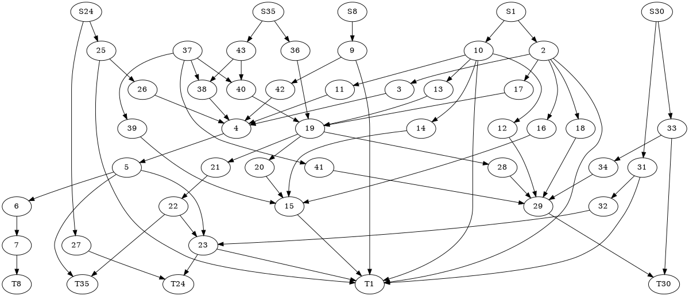

### 5. `honda-tokoro.gv`
Source: [graphs/directed/honda-tokoro.gv](https://github.com/mhansen/graphviz/blob/a03c5201b7aa2942ce994cb8d072abb3202bec2a/graphs/directed/honda-tokoro.gv)

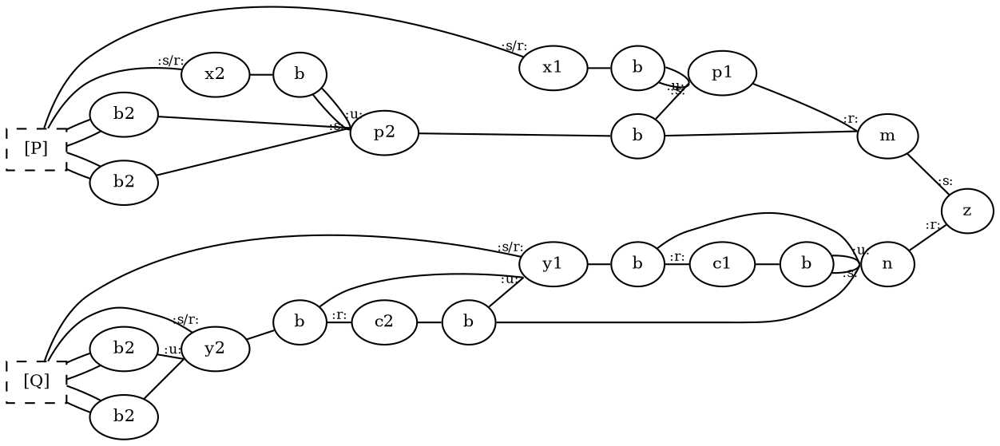

### 6. `oldarrows.gv`
Source: [graphs/directed/oldarrows.gv](https://github.com/mhansen/graphviz/blob/a03c5201b7aa2942ce994cb8d072abb3202bec2a/graphs/directed/oldarrows.gv)

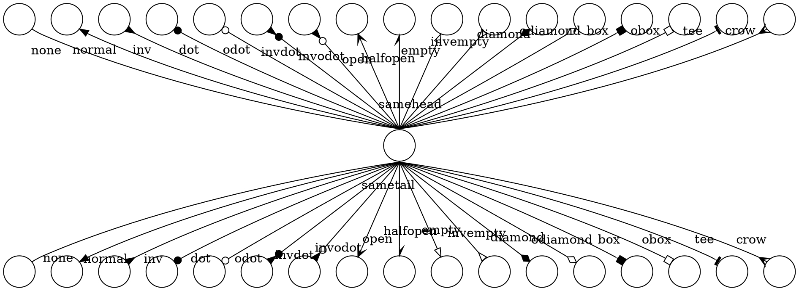

### 7. `polypoly.gv`
Source: [graphs/directed/polypoly.gv](https://github.com/mhansen/graphviz/blob/a03c5201b7aa2942ce994cb8d072abb3202bec2a/graphs/directed/polypoly.gv)

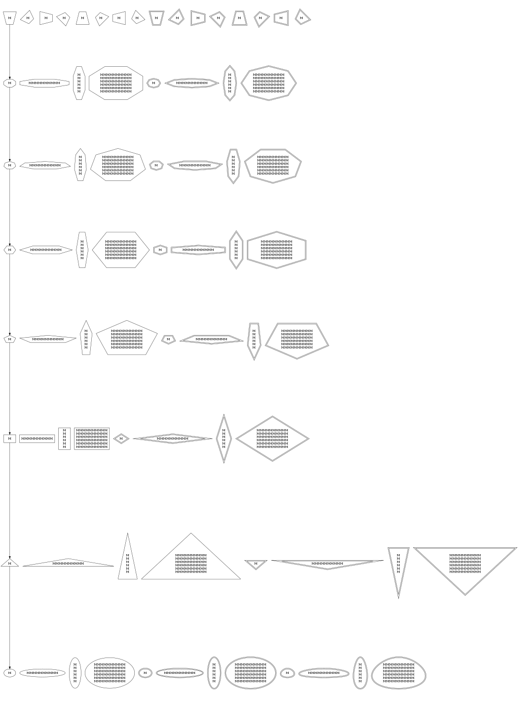

### 8. `ER.gv`
Source: [graphs/undirected/ER.gv](https://github.com/mhansen/graphviz/blob/a03c5201b7aa2942ce994cb8d072abb3202bec2a/graphs/undirected/ER.gv)

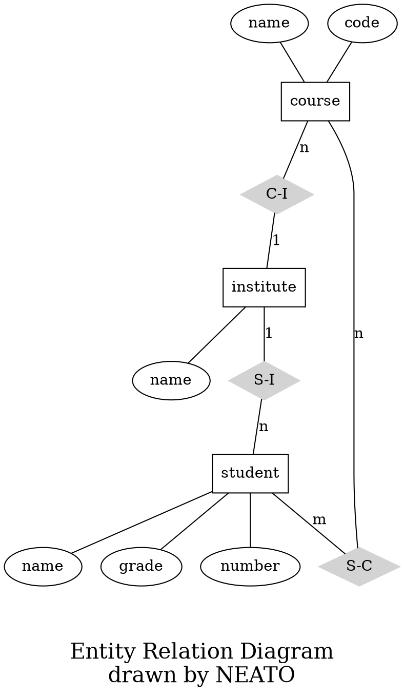

### 9. `Heawood.gv`
Source: [graphs/undirected/Heawood.gv](https://github.com/mhansen/graphviz/blob/a03c5201b7aa2942ce994cb8d072abb3202bec2a/graphs/undirected/Heawood.gv)

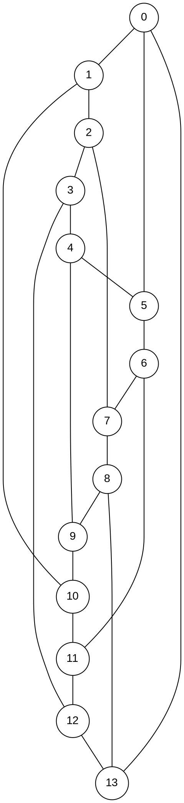

### 10. `Petersen.gv`
Source: [graphs/undirected/Petersen.gv](https://github.com/mhansen/graphviz/blob/a03c5201b7aa2942ce994cb8d072abb3202bec2a/graphs/undirected/Petersen.gv)

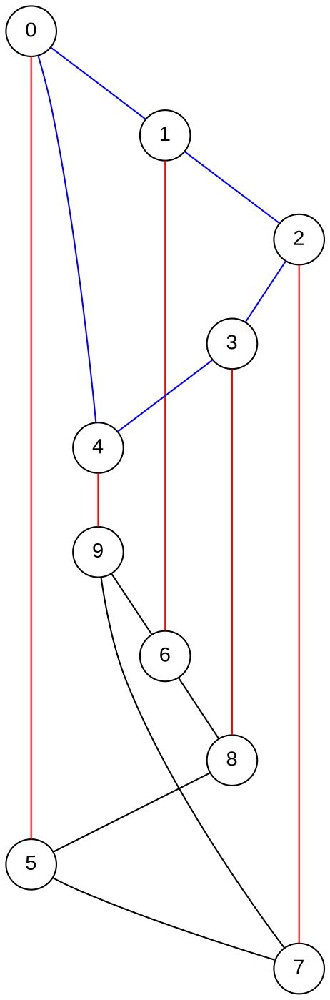

### 11. `ngk10_4.gv`
Source: [graphs/undirected/ngk10_4.gv](https://github.com/mhansen/graphviz/blob/a03c5201b7aa2942ce994cb8d072abb3202bec2a/graphs/undirected/ngk10_4.gv)

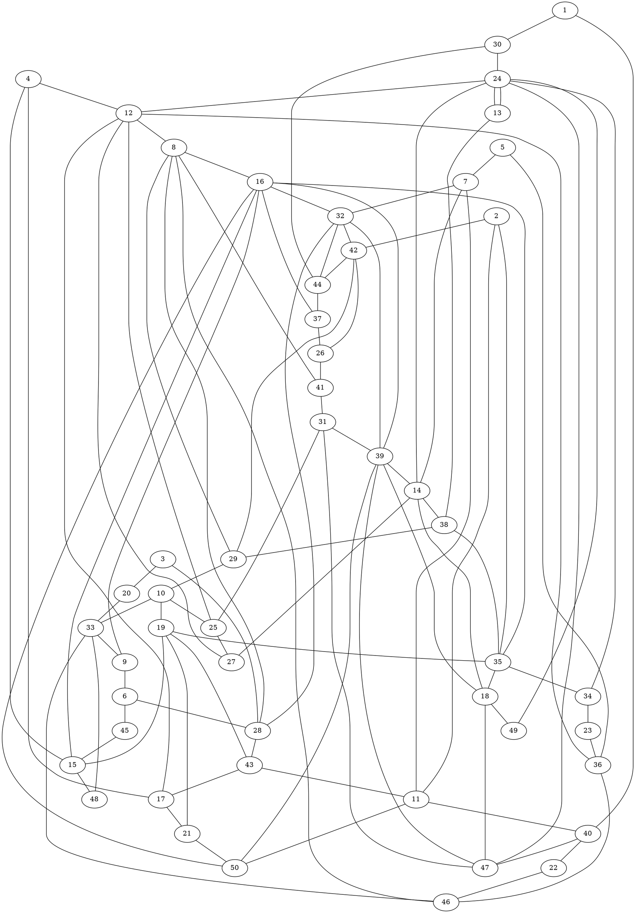

### 12. `process.gv`
Source: [graphs/undirected/process.gv](https://github.com/mhansen/graphviz/blob/a03c5201b7aa2942ce994cb8d072abb3202bec2a/graphs/undirected/process.gv)

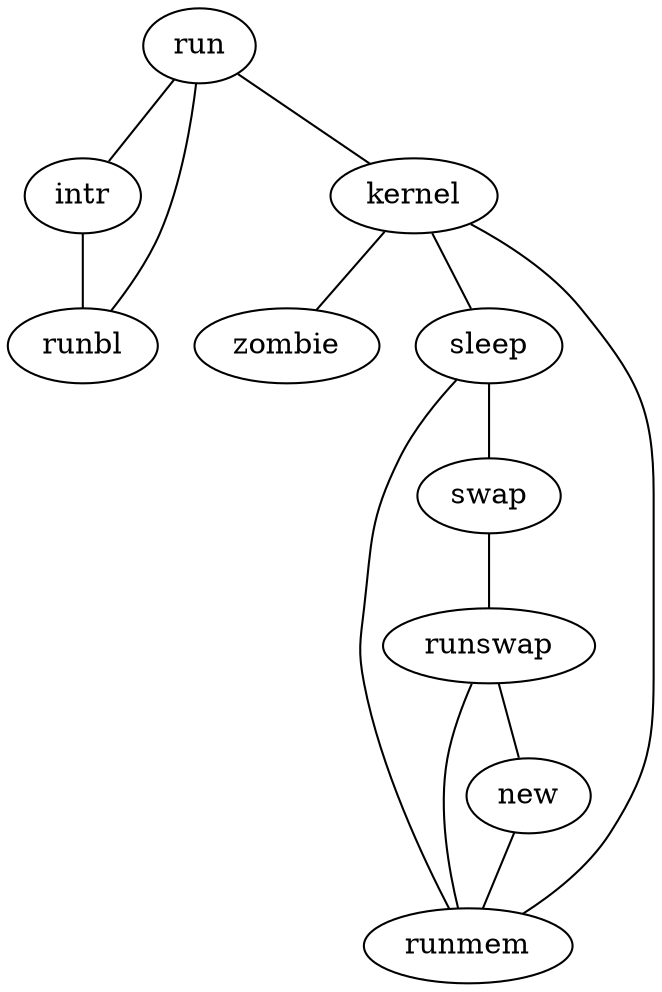
