# Mermaid Live Editor sample diagrams test corpus

This file collects the default sample diagrams available from Mermaid Live Editor into one Markdown document with fenced `mermaid` blocks. It is intended as a renderer/regression test corpus.

Source basis: Mermaid Live Editor builds its sample picker from `@mermaid-js/examples` and adds a ZenUML sample in the live-editor UI. This corpus includes the default example from each examples-package diagram plus the ZenUML live-editor extra.

> Note: Cynefin and the Railroad variants are present in the examples package but did not have stable Mermaid documentation pages in the current docs sidebar at the time this file was generated, so their links point to the upstream source examples instead.

## Index

| # | Diagram | Sample | Keyword | Documentation/source |
|---:|---|---|---|---|
| 1 | Flowchart | Basic Flowchart | `flowchart` | [link](https://mermaid.js.org/syntax/flowchart.html) |
| 2 | C4 Diagram | Internet Banking System Context | `C4Context` | [link](https://mermaid.js.org/syntax/c4.html) |
| 3 | Ishikawa Diagram | Ishikawa Diagram | `ishikawa-beta` | [link](https://mermaid.js.org/syntax/ishikawa.html) |
| 4 | Kanban Diagram | Kanban Diagram | `kanban` | [link](https://mermaid.js.org/syntax/kanban.html) |
| 5 | Class Diagram | Basic Class Inheritance | `classDiagram` | [link](https://mermaid.js.org/syntax/classDiagram.html) |
| 6 | Sequence Diagram | Basic Sequence | `sequenceDiagram` | [link](https://mermaid.js.org/syntax/sequenceDiagram.html) |
| 7 | Pie Chart | Basic Pie Chart | `pie` | [link](https://mermaid.js.org/syntax/pie.html) |
| 8 | User Journey Diagram | My Working Day | `journey` | [link](https://mermaid.js.org/syntax/userJourney.html) |
| 9 | Mindmap | Basic Mindmap | `mindmap` | [link](https://mermaid.js.org/syntax/mindmap.html) |
| 10 | Requirement Diagram | Basic Requirements | `requirementDiagram` | [link](https://mermaid.js.org/syntax/requirementDiagram.html) |
| 11 | Radar Diagram | Student Grades | `radar-beta` | [link](https://mermaid.js.org/syntax/radar.html) |
| 12 | State Diagram | Basic State Diagram | `stateDiagram-v2` | [link](https://mermaid.js.org/syntax/stateDiagram.html) |
| 13 | Entity Relationship Diagram | Basic ER Schema | `erDiagram` | [link](https://mermaid.js.org/syntax/entityRelationshipDiagram.html) |
| 14 | Git Graph | Basic Git Flow | `gitGraph` | [link](https://mermaid.js.org/syntax/gitgraph.html) |
| 15 | Architecture Diagram | Basic System Architecture | `architecture-beta` | [link](https://mermaid.js.org/syntax/architecture.html) |
| 16 | XY Chart | Sales Revenue | `xychart-beta` | [link](https://mermaid.js.org/syntax/xyChart.html) |
| 17 | Sankey Diagram | Energy Flow | `sankey-beta` | [link](https://mermaid.js.org/syntax/sankey.html) |
| 18 | Gantt Chart | Basic Project Timeline | `gantt` | [link](https://mermaid.js.org/syntax/gantt.html) |
| 19 | Timeline Diagram | Project Timeline | `timeline` | [link](https://mermaid.js.org/syntax/timeline.html) |
| 20 | Quadrant Chart | Product Positioning | `quadrantChart` | [link](https://mermaid.js.org/syntax/quadrantChart.html) |
| 21 | Packet Diagram | TCP Packet | `packet` | [link](https://mermaid.js.org/syntax/packet.html) |
| 22 | Block Diagram | Basic Block Layout | `block-beta` | [link](https://mermaid.js.org/syntax/block.html) |
| 23 | Treemap | Treemap | `treemap-beta` | [link](https://mermaid.js.org/syntax/treemap.html) |
| 24 | Event Modeling Diagram | Event Modeling | `eventmodeling` | [link](https://mermaid.js.org/syntax/eventmodeling.html) |
| 25 | Venn Diagram | Sales Revenue | `venn-beta` | [link](https://mermaid.js.org/syntax/venn.html) |
| 26 | TreeView | Basic TreeView | `treeView-beta` | [link](https://mermaid.js.org/syntax/treeView.html) |
| 27 | Wardley Maps | Tea Shop Value Chain | `wardley-beta` | [link](https://mermaid.js.org/syntax/wardley.html) |
| 28 | Cynefin Framework | Incident Response | `cynefin-beta` | [link](https://github.com/mermaid-js/mermaid/blob/2a51ae43bf33a58af1499d8ace27659bf7a2241f/packages/examples/src/examples/cynefin.ts) |
| 29 | Railroad Diagram (IR) | Expression Grammar | `railroad-diagram` | [link](https://github.com/mermaid-js/mermaid/blob/2a51ae43bf33a58af1499d8ace27659bf7a2241f/packages/examples/src/examples/railroad.ts) |
| 30 | Railroad Diagram (EBNF) | Expression Grammar | `railroad-ebnf` | [link](https://github.com/mermaid-js/mermaid/blob/2a51ae43bf33a58af1499d8ace27659bf7a2241f/packages/examples/src/examples/railroad-ebnf.ts) |
| 31 | Railroad Diagram (ABNF) | URI Scheme / Email Address | `railroad-abnf` | [link](https://github.com/mermaid-js/mermaid/blob/2a51ae43bf33a58af1499d8ace27659bf7a2241f/packages/examples/src/examples/railroad-abnf.ts) |
| 32 | Railroad Diagram (PEG) | Calculator Grammar | `railroad-peg` | [link](https://github.com/mermaid-js/mermaid/blob/2a51ae43bf33a58af1499d8ace27659bf7a2241f/packages/examples/src/examples/railroad-peg.ts) |
| 33 | ZenUML | Order Service | `zenuml` | [link](https://mermaid.js.org/syntax/zenuml.html) |

## 01. Flowchart

Sample: **Basic Flowchart**  
Keyword: `flowchart`  
Documentation/source: [Flowchart](https://mermaid.js.org/syntax/flowchart.html)

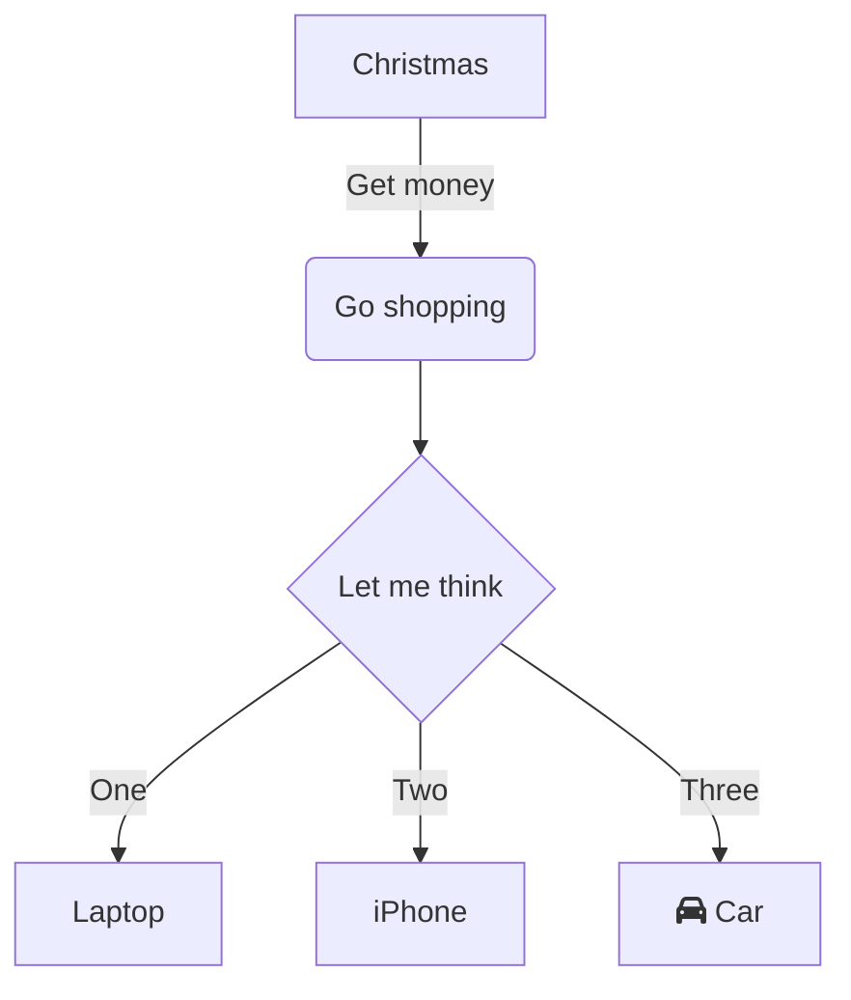
```mermaid
flowchart TD
    A[Christmas] -->|Get money| B(Go shopping)
    B --> C{Let me think}
    C -->|One| D[Laptop]
    C -->|Two| E[iPhone]
    C -->|Three| F[fa:fa-car Car]
```

## 02. C4 Diagram

Sample: **Internet Banking System Context**  
Keyword: `C4Context`  
Documentation/source: [C4 Diagram](https://mermaid.js.org/syntax/c4.html)

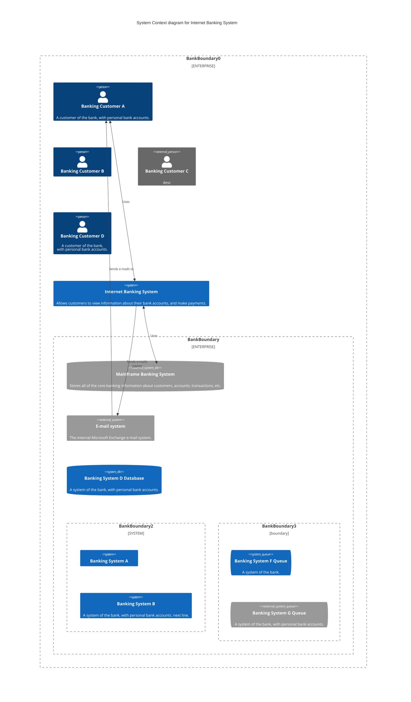
```mermaid
C4Context
    title System Context diagram for Internet Banking System
    Enterprise_Boundary(b0, "BankBoundary0") {
        Person(customerA, "Banking Customer A", "A customer of the bank, with personal bank accounts.")
        Person(customerB, "Banking Customer B")
        Person_Ext(customerC, "Banking Customer C", "desc")

        Person(customerD, "Banking Customer D", "A customer of the bank, <br/> with personal bank accounts.")

        System(SystemAA, "Internet Banking System", "Allows customers to view information about their bank accounts, and make payments.")

        Enterprise_Boundary(b1, "BankBoundary") {
            SystemDb_Ext(SystemE, "Mainframe Banking System", "Stores all of the core banking information about customers, accounts, transactions, etc.")

            System_Boundary(b2, "BankBoundary2") {
                System(SystemA, "Banking System A")
                System(SystemB, "Banking System B", "A system of the bank, with personal bank accounts. next line.")
            }

            System_Ext(SystemC, "E-mail system", "The internal Microsoft Exchange e-mail system.")
            SystemDb(SystemD, "Banking System D Database", "A system of the bank, with personal bank accounts.")

            Boundary(b3, "BankBoundary3", "boundary") {
                SystemQueue(SystemF, "Banking System F Queue", "A system of the bank.")
                SystemQueue_Ext(SystemG, "Banking System G Queue", "A system of the bank, with personal bank accounts.")
            }
        }
    }

    BiRel(customerA, SystemAA, "Uses")
    BiRel(SystemAA, SystemE, "Uses")
    Rel(SystemAA, SystemC, "Sends e-mails", "SMTP")
    Rel(SystemC, customerA, "Sends e-mails to")
```

## 03. Ishikawa Diagram

Sample: **Ishikawa Diagram**  
Keyword: `ishikawa-beta`  
Documentation/source: [Ishikawa Diagram](https://mermaid.js.org/syntax/ishikawa.html)

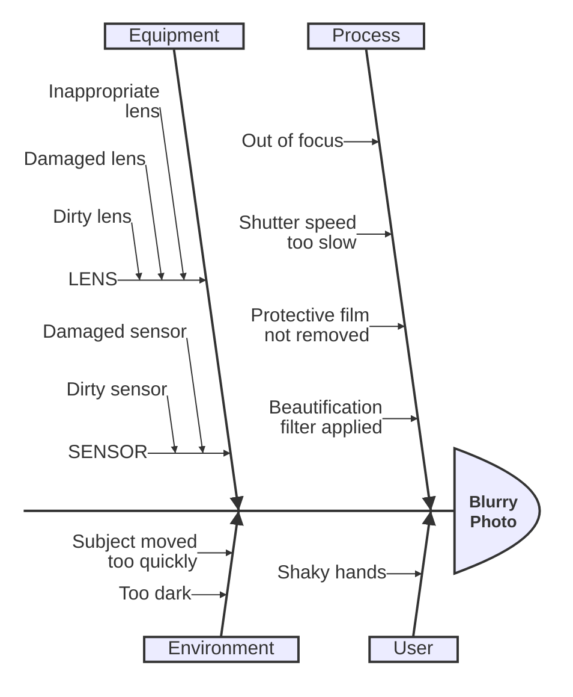
```mermaid
ishikawa-beta
    Blurry Photo
    Process
        Out of focus
        Shutter speed too slow
        Protective film not removed
        Beautification filter applied
    User
        Shaky hands
    Equipment
        LENS
            Inappropriate lens
            Damaged lens
            Dirty lens
        SENSOR
            Damaged sensor
            Dirty sensor
    Environment
        Subject moved too quickly
        Too dark
```

## 04. Kanban Diagram

Sample: **Kanban Diagram**  
Keyword: `kanban`  
Documentation/source: [Kanban Diagram](https://mermaid.js.org/syntax/kanban.html)

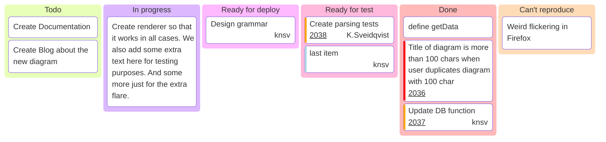
```mermaid
---
config:
  kanban:
    ticketBaseUrl: 'https://github.com/mermaid-js/mermaid/issues/#TICKET#'
---
kanban
  Todo
    [Create Documentation]
    docs[Create Blog about the new diagram]
  [In progress]
    id6[Create renderer so that it works in all cases. We also add some extra text here for testing purposes. And some more just for the extra flare.]
  id9[Ready for deploy]
    id8[Design grammar]@{ assigned: 'knsv' }
  id10[Ready for test]
    id4[Create parsing tests]@{ ticket: 2038, assigned: 'K.Sveidqvist', priority: 'High' }
    id66[last item]@{ priority: 'Very Low', assigned: 'knsv' }
  id11[Done]
    id5[define getData]
    id2[Title of diagram is more than 100 chars when user duplicates diagram with 100 char]@{ ticket: 2036, priority: 'Very High'}
    id3[Update DB function]@{ ticket: 2037, assigned: knsv, priority: 'High' }

  id12[Can't reproduce]
    id3[Weird flickering in Firefox]
```

## 05. Class Diagram

Sample: **Basic Class Inheritance**  
Keyword: `classDiagram`  
Documentation/source: [Class Diagram](https://mermaid.js.org/syntax/classDiagram.html)

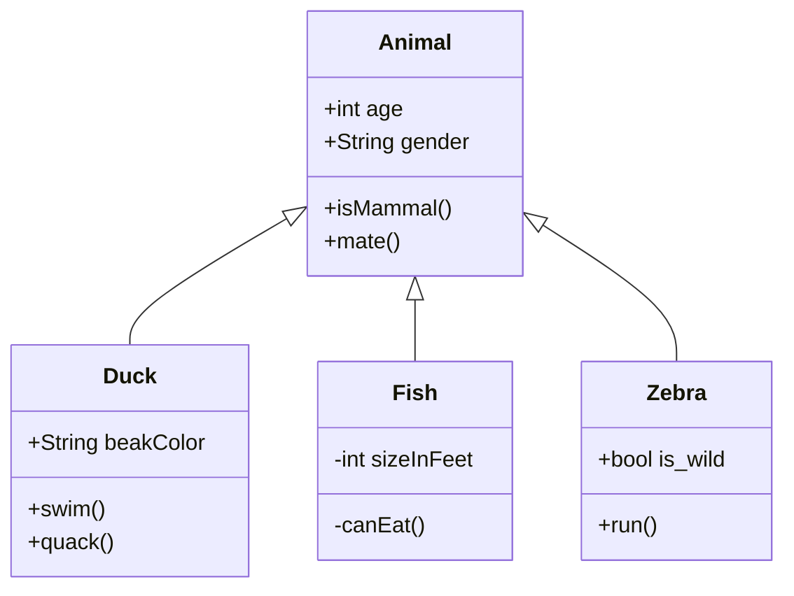
```mermaid
classDiagram
    Animal <|-- Duck
    Animal <|-- Fish
    Animal <|-- Zebra
    Animal : +int age
    Animal : +String gender
    Animal: +isMammal()
    Animal: +mate()
    class Duck{
      +String beakColor
      +swim()
      +quack()
    }
    class Fish{
      -int sizeInFeet
      -canEat()
    }
    class Zebra{
      +bool is_wild
      +run()
    }
```

## 06. Sequence Diagram

Sample: **Basic Sequence**  
Keyword: `sequenceDiagram`  
Documentation/source: [Sequence Diagram](https://mermaid.js.org/syntax/sequenceDiagram.html)

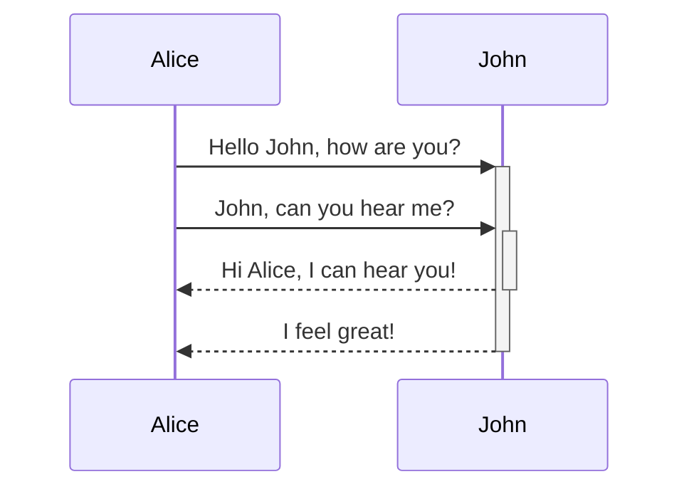
```mermaid
sequenceDiagram
    Alice->>+John: Hello John, how are you?
    Alice->>+John: John, can you hear me?
    John-->>-Alice: Hi Alice, I can hear you!
    John-->>-Alice: I feel great!
```

## 07. Pie Chart

Sample: **Basic Pie Chart**  
Keyword: `pie`  
Documentation/source: [Pie Chart](https://mermaid.js.org/syntax/pie.html)

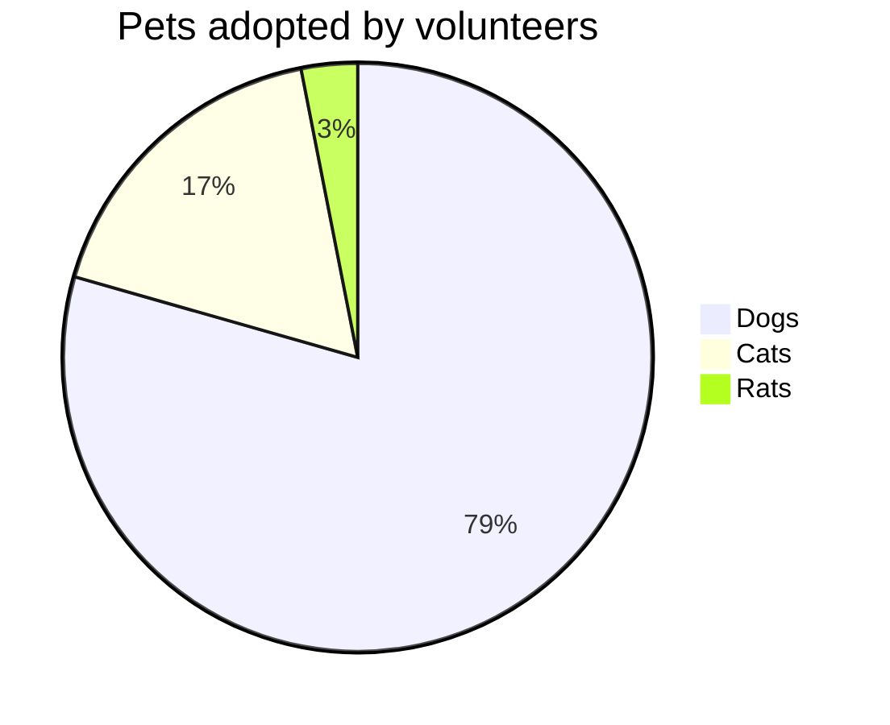
```mermaid
pie title Pets adopted by volunteers
    "Dogs" : 386
    "Cats" : 85
    "Rats" : 15
```

## 08. User Journey Diagram

Sample: **My Working Day**  
Keyword: `journey`  
Documentation/source: [User Journey Diagram](https://mermaid.js.org/syntax/userJourney.html)

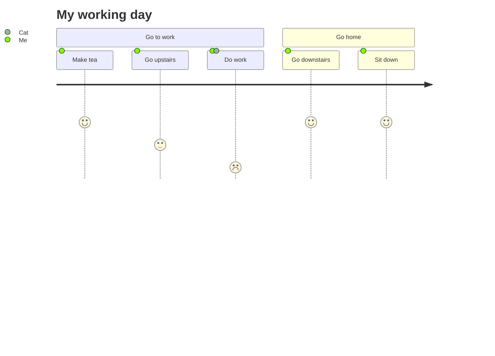
```mermaid
journey
    title My working day
    section Go to work
      Make tea: 5: Me
      Go upstairs: 3: Me
      Do work: 1: Me, Cat
    section Go home
      Go downstairs: 5: Me
      Sit down: 5: Me
```

## 09. Mindmap

Sample: **Basic Mindmap**  
Keyword: `mindmap`  
Documentation/source: [Mindmap](https://mermaid.js.org/syntax/mindmap.html)

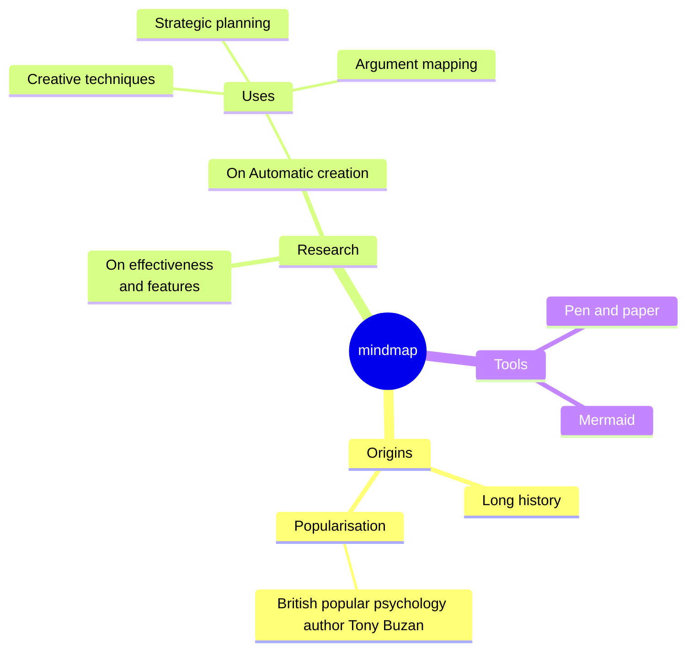
```mermaid
mindmap
  root((mindmap))
    Origins
      Long history
      ::icon(fa fa-book)
      Popularisation
        British popular psychology author Tony Buzan
    Research
      On effectiveness<br/>and features
      On Automatic creation
        Uses
            Creative techniques
            Strategic planning
            Argument mapping
    Tools
      Pen and paper
      Mermaid
```

## 10. Requirement Diagram

Sample: **Basic Requirements**  
Keyword: `requirementDiagram`  
Documentation/source: [Requirement Diagram](https://mermaid.js.org/syntax/requirementDiagram.html)

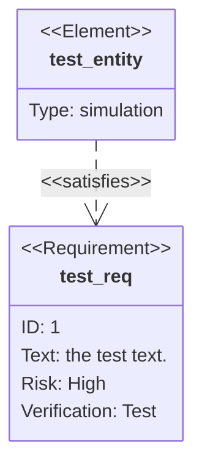
```mermaid
requirementDiagram

    requirement test_req {
    id: 1
    text: the test text.
    risk: high
    verifymethod: test
    }

    element test_entity {
    type: simulation
    }

    test_entity - satisfies -> test_req
```

## 11. Radar Diagram

Sample: **Student Grades**  
Keyword: `radar-beta`  
Documentation/source: [Radar Diagram](https://mermaid.js.org/syntax/radar.html)

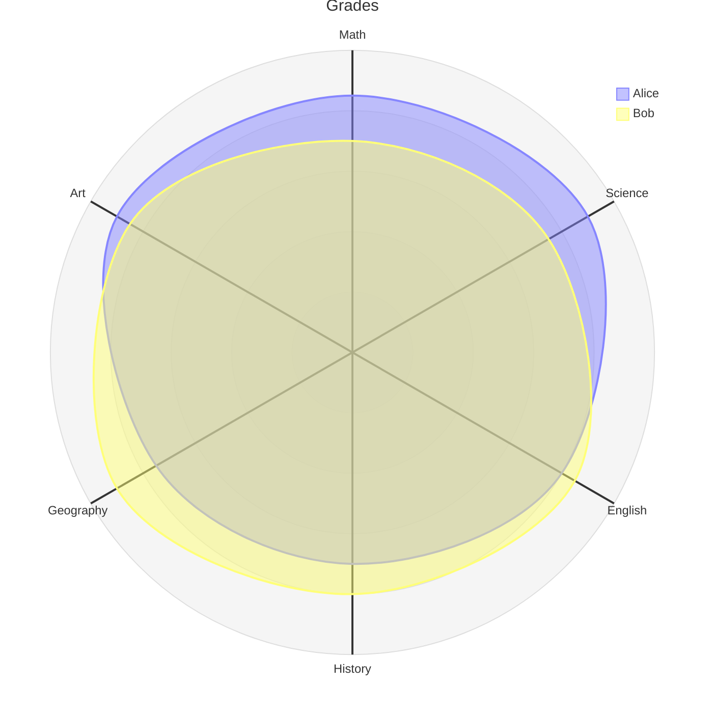
```mermaid
---
title: "Grades"
---
radar-beta
  axis m["Math"], s["Science"], e["English"]
  axis h["History"], g["Geography"], a["Art"]
  curve a["Alice"]{85, 90, 80, 70, 75, 90}
  curve b["Bob"]{70, 75, 85, 80, 90, 85}

  max 100
  min 0
```

## 12. State Diagram

Sample: **Basic State Diagram**  
Keyword: `stateDiagram-v2`  
Documentation/source: [State Diagram](https://mermaid.js.org/syntax/stateDiagram.html)

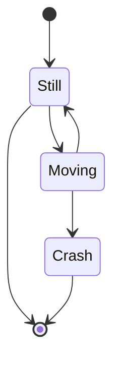
```mermaid
stateDiagram-v2
    [*] --> Still
    Still --> [*]
    Still --> Moving
    Moving --> Still
    Moving --> Crash
    Crash --> [*]
```

## 13. Entity Relationship Diagram

Sample: **Basic ER Schema**  
Keyword: `erDiagram`  
Documentation/source: [Entity Relationship Diagram](https://mermaid.js.org/syntax/entityRelationshipDiagram.html)

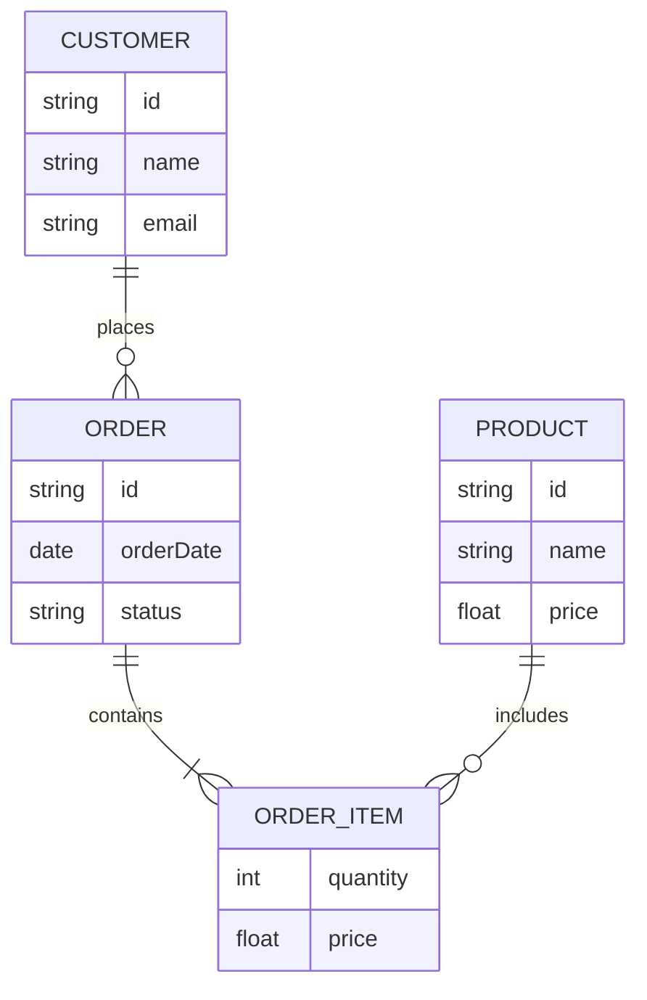
```mermaid
erDiagram
    CUSTOMER ||--o{ ORDER : places
    ORDER ||--|{ ORDER_ITEM : contains
    PRODUCT ||--o{ ORDER_ITEM : includes
    CUSTOMER {
        string id
        string name
        string email
    }
    ORDER {
        string id
        date orderDate
        string status
    }
    PRODUCT {
        string id
        string name
        float price
    }
    ORDER_ITEM {
        int quantity
        float price
    }
```

## 14. Git Graph

Sample: **Basic Git Flow**  
Keyword: `gitGraph`  
Documentation/source: [Git Graph](https://mermaid.js.org/syntax/gitgraph.html)

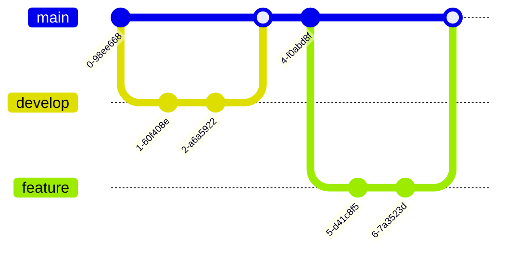
```mermaid
gitGraph
    commit
    branch develop
    checkout develop
    commit
    commit
    checkout main
    merge develop
    commit
    branch feature
    checkout feature
    commit
    commit
    checkout main
    merge feature
```

## 15. Architecture Diagram

Sample: **Basic System Architecture**  
Keyword: `architecture-beta`  
Documentation/source: [Architecture Diagram](https://mermaid.js.org/syntax/architecture.html)

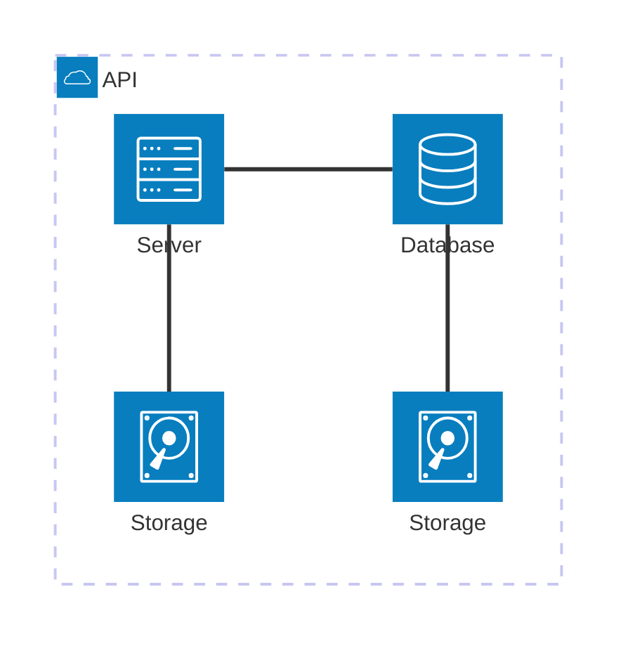
```mermaid
architecture-beta
    group api(cloud)[API]

    service db(database)[Database] in api
    service disk1(disk)[Storage] in api
    service disk2(disk)[Storage] in api
    service server(server)[Server] in api

    db:L -- R:server
    disk1:T -- B:server
    disk2:T -- B:db
```

## 16. XY Chart

Sample: **Sales Revenue**  
Keyword: `xychart-beta`  
Documentation/source: [XY Chart](https://mermaid.js.org/syntax/xyChart.html)

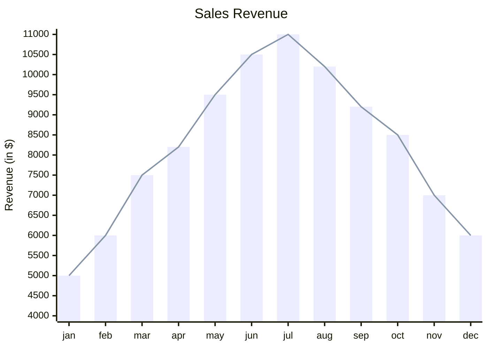
```mermaid
xychart-beta
    title "Sales Revenue"
    x-axis [jan, feb, mar, apr, may, jun, jul, aug, sep, oct, nov, dec]
    y-axis "Revenue (in $)" 4000 --> 11000
    bar [5000, 6000, 7500, 8200, 9500, 10500, 11000, 10200, 9200, 8500, 7000, 6000]
    line [5000, 6000, 7500, 8200, 9500, 10500, 11000, 10200, 9200, 8500, 7000, 6000]
```

## 17. Sankey Diagram

Sample: **Energy Flow**  
Keyword: `sankey-beta`  
Documentation/source: [Sankey Diagram](https://mermaid.js.org/syntax/sankey.html)

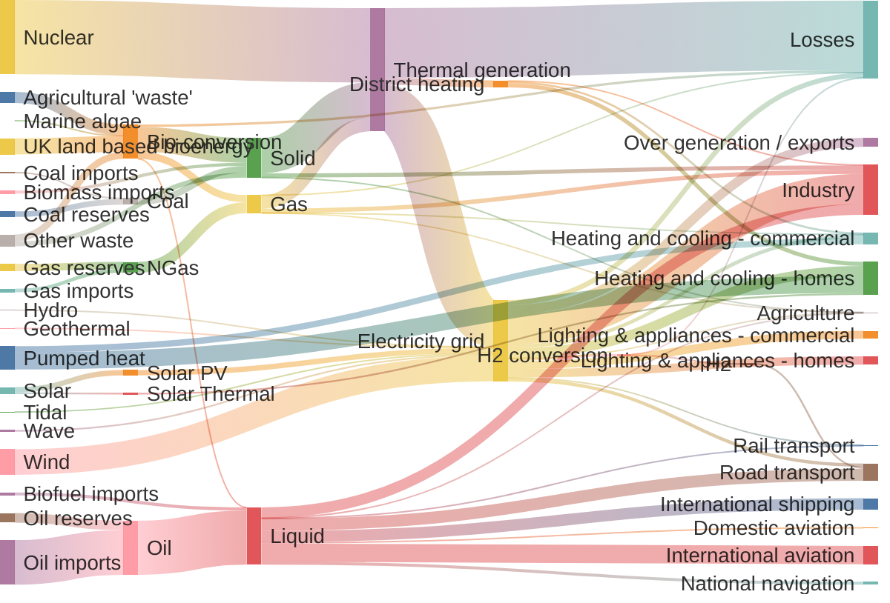
```mermaid
---
config:
  sankey:
    showValues: false
---
sankey-beta

Agricultural 'waste',Bio-conversion,124.729
Bio-conversion,Liquid,0.597
Bio-conversion,Losses,26.862
Bio-conversion,Solid,280.322
Bio-conversion,Gas,81.144
Biofuel imports,Liquid,35
Biomass imports,Solid,35
Coal imports,Coal,11.606
Coal reserves,Coal,63.965
Coal,Solid,75.571
District heating,Industry,10.639
District heating,Heating and cooling - commercial,22.505
District heating,Heating and cooling - homes,46.184
Electricity grid,Over generation / exports,104.453
Electricity grid,Heating and cooling - homes,113.726
Electricity grid,H2 conversion,27.14
Electricity grid,Industry,342.165
Electricity grid,Road transport,37.797
Electricity grid,Agriculture,4.412
Electricity grid,Heating and cooling - commercial,40.858
Electricity grid,Losses,56.691
Electricity grid,Rail transport,7.863
Electricity grid,Lighting & appliances - commercial,90.008
Electricity grid,Lighting & appliances - homes,93.494
Gas imports,NGas,40.719
Gas reserves,NGas,82.233
Gas,Heating and cooling - commercial,0.129
Gas,Losses,1.401
Gas,Thermal generation,151.891
Gas,Agriculture,2.096
Gas,Industry,48.58
Geothermal,Electricity grid,7.013
H2 conversion,H2,20.897
H2 conversion,Losses,6.242
H2,Road transport,20.897
Hydro,Electricity grid,6.995
Liquid,Industry,121.066
Liquid,International shipping,128.69
Liquid,Road transport,135.835
Liquid,Domestic aviation,14.458
Liquid,International aviation,206.267
Liquid,Agriculture,3.64
Liquid,National navigation,33.218
Liquid,Rail transport,4.413
Marine algae,Bio-conversion,4.375
NGas,Gas,122.952
Nuclear,Thermal generation,839.978
Oil imports,Oil,504.287
Oil reserves,Oil,107.703
Oil,Liquid,611.99
Other waste,Solid,56.587
Other waste,Bio-conversion,77.81
Pumped heat,Heating and cooling - homes,193.026
Pumped heat,Heating and cooling - commercial,70.672
Solar PV,Electricity grid,59.901
Solar Thermal,Heating and cooling - homes,19.263
Solar,Solar Thermal,19.263
Solar,Solar PV,59.901
Solid,Agriculture,0.882
Solid,Thermal generation,400.12
Solid,Industry,46.477
Thermal generation,Electricity grid,525.531
Thermal generation,Losses,787.129
Thermal generation,District heating,79.329
Tidal,Electricity grid,9.452
UK land based bioenergy,Bio-conversion,182.01
Wave,Electricity grid,19.013
Wind,Electricity grid,289.366
```

## 18. Gantt Chart

Sample: **Basic Project Timeline**  
Keyword: `gantt`  
Documentation/source: [Gantt Chart](https://mermaid.js.org/syntax/gantt.html)

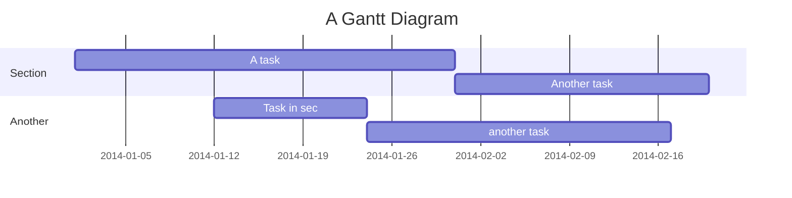
```mermaid
gantt
    title A Gantt Diagram
    dateFormat  YYYY-MM-DD
    section Section
    A task           :a1, 2014-01-01, 30d
    Another task     :after a1  , 20d
    section Another
    Task in sec      :2014-01-12  , 12d
    another task      : 24d
```

## 19. Timeline Diagram

Sample: **Project Timeline**  
Keyword: `timeline`  
Documentation/source: [Timeline Diagram](https://mermaid.js.org/syntax/timeline.html)

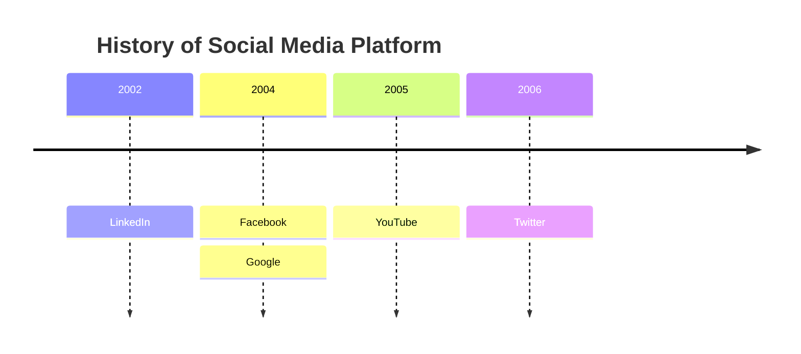
```mermaid
timeline
    title History of Social Media Platform
    2002 : LinkedIn
    2004 : Facebook
         : Google
    2005 : YouTube
    2006 : Twitter
```

## 20. Quadrant Chart

Sample: **Product Positioning**  
Keyword: `quadrantChart`  
Documentation/source: [Quadrant Chart](https://mermaid.js.org/syntax/quadrantChart.html)

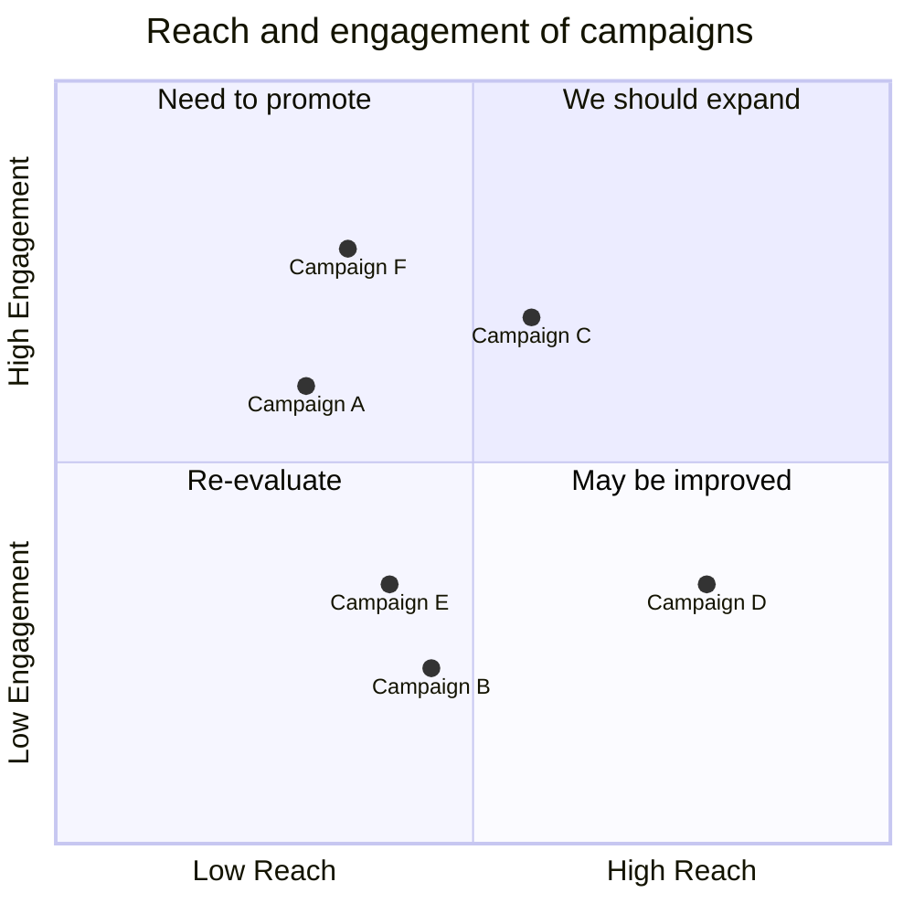
```mermaid
quadrantChart
    title Reach and engagement of campaigns
    x-axis Low Reach --> High Reach
    y-axis Low Engagement --> High Engagement
    quadrant-1 We should expand
    quadrant-2 Need to promote
    quadrant-3 Re-evaluate
    quadrant-4 May be improved
    Campaign A: [0.3, 0.6]
    Campaign B: [0.45, 0.23]
    Campaign C: [0.57, 0.69]
    Campaign D: [0.78, 0.34]
    Campaign E: [0.40, 0.34]
    Campaign F: [0.35, 0.78]
```

## 21. Packet Diagram

Sample: **TCP Packet**  
Keyword: `packet`  
Documentation/source: [Packet Diagram](https://mermaid.js.org/syntax/packet.html)

```mermaid
---
title: "TCP Packet"
---
packet
0-15: "Source Port"
16-31: "Destination Port"
32-63: "Sequence Number"
64-95: "Acknowledgment Number"
96-99: "Data Offset"
100-105: "Reserved"
106: "URG"
107: "ACK"
108: "PSH"
109: "RST"
110: "SYN"
111: "FIN"
112-127: "Window"
128-143: "Checksum"
144-159: "Urgent Pointer"
160-191: "(Options and Padding)"
192-255: "Data (variable length)"
```

## 22. Block Diagram

Sample: **Basic Block Layout**  
Keyword: `block-beta`  
Documentation/source: [Block Diagram](https://mermaid.js.org/syntax/block.html)

```mermaid
block-beta
columns 1
  db(("DB"))
  blockArrowId6<["&nbsp;&nbsp;&nbsp;"]>(down)
  block:ID
    A
    B["A wide one in the middle"]
    C
  end
  space
  D
  ID --> D
  C --> D
  style B fill:#969,stroke:#333,stroke-width:4px
```

## 23. Treemap

Sample: **Treemap**  
Keyword: `treemap-beta`  
Documentation/source: [Treemap](https://mermaid.js.org/syntax/treemap.html)

```mermaid
treemap-beta
"Section 1"
    "Leaf 1.1": 12
    "Section 1.2"
      "Leaf 1.2.1": 12
"Section 2"
    "Leaf 2.1": 20
    "Leaf 2.2": 25
```

## 24. Event Modeling Diagram

Sample: **Event Modeling**  
Keyword: `eventmodeling`  
Documentation/source: [Event Modeling Diagram](https://mermaid.js.org/syntax/eventmodeling.html)

```mermaid
eventmodeling

tf 01 ui CartUI
tf 02 cmd AddItem
tf 03 evt ItemAdded
tf 04 rmo CartItems ->> 03
tf 05 evt AccountingItemAdded
```

## 25. Venn Diagram

Sample: **Sales Revenue**  
Keyword: `venn-beta`  
Documentation/source: [Venn Diagram](https://mermaid.js.org/syntax/venn.html)

```mermaid
venn-beta
    title "Three overlapping sets"
    set A
    set B
    set C
    union A,B["AB"]
    union B,C["BC"]
    union A,C["AC"]
    union A,B,C["ABC"]
    style A,B fill:skyblue
    style B,C fill:orange
    style A,C fill:lightgreen
    style A,B,C fill:white, color:red
```

## 26. TreeView

Sample: **Basic TreeView**  
Keyword: `treeView-beta`  
Documentation/source: [TreeView](https://mermaid.js.org/syntax/treeView.html)

```mermaid
treeView-beta
            "docs"
                "build"
                "make.bat"
                "Makefile"
                "out"
                "source"
                    "build"
                    "static"
                        "_templates"
                        "div. Files"
```

## 27. Wardley Maps

Sample: **Tea Shop Value Chain**  
Keyword: `wardley-beta`  
Documentation/source: [Wardley Maps](https://mermaid.js.org/syntax/wardley.html)

```mermaid
wardley-beta
title Tea Shop
size [1100, 800]

anchor Business [0.95, 0.63]
anchor Public [0.95, 0.78]
component Cup of Tea [0.79, 0.61] label [19, -4]
component Cup [0.73, 0.78]
component Tea [0.63, 0.81]
component Hot Water [0.52, 0.80]
component Water [0.38, 0.82]
component Kettle [0.43, 0.35] label [-57, 4]
component Power [0.1, 0.7] label [-27, 20]

Business -> Cup of Tea
Public -> Cup of Tea
Cup of Tea -> Cup
Cup of Tea -> Tea
Cup of Tea -> Hot Water
Hot Water -> Water
Hot Water -> Kettle
Kettle -> Power

evolve Kettle 0.62
evolve Power 0.89

note "Standardising power allows Kettles to evolve faster" [0.30, 0.49]
note "Hot water is obvious and well known" [0.48, 0.80]
note "A generic note appeared" [0.23, 0.33]
```

## 28. Cynefin Framework

Sample: **Incident Response**  
Keyword: `cynefin-beta`  
Documentation/source: [Cynefin Framework](https://github.com/mermaid-js/mermaid/blob/2a51ae43bf33a58af1499d8ace27659bf7a2241f/packages/examples/src/examples/cynefin.ts)

```mermaid
cynefin-beta
  title Incident Response

  complex
    "Investigate root cause"
    "Run chaos experiment"

  complicated
    "Analyze performance data"
    "Expert review needed"

  clear
    "Restart service"
    "Apply known fix"

  chaotic
    "Page on-call immediately"

  confusion
    "Unknown failure mode"

  complex --> complicated : "Pattern identified"
  clear --> chaotic : "Complacency"
```

## 29. Railroad Diagram (IR)

Sample: **Expression Grammar**  
Keyword: `railroad-diagram`  
Documentation/source: [Railroad Diagram (IR)](https://github.com/mermaid-js/mermaid/blob/2a51ae43bf33a58af1499d8ace27659bf7a2241f/packages/examples/src/examples/railroad.ts)

```mermaid
railroad-diagram
    title Expression Grammar

    expression = sequence(
        nonterminal("term"),
        zeroOrMore(sequence(
            choice(terminal("+"), terminal("-")),
            nonterminal("term")
        ))
    ) ;
    term = sequence(
        nonterminal("factor"),
        zeroOrMore(sequence(
            choice(terminal("*"), terminal("/")),
            nonterminal("factor")
        ))
    ) ;
    factor = choice(
        nonterminal("number"),
        sequence(terminal("("), nonterminal("expression"), terminal(")"))
    ) ;
    number = oneOrMore(nonterminal("digit")) ;
    digit = choice(terminal("0"), terminal("1"), terminal("2"), terminal("3"), terminal("4"), terminal("5"), terminal("6"), terminal("7"), terminal("8"), terminal("9")) ;
```

## 30. Railroad Diagram (EBNF)

Sample: **Expression Grammar**  
Keyword: `railroad-ebnf`  
Documentation/source: [Railroad Diagram (EBNF)](https://github.com/mermaid-js/mermaid/blob/2a51ae43bf33a58af1499d8ace27659bf7a2241f/packages/examples/src/examples/railroad-ebnf.ts)

```mermaid
railroad-ebnf
    title Expression Grammar

    expression = term ( "+" term | "-" term )* ;
    term = factor ( "*" factor | "/" factor )* ;
    factor = number | "(" expression ")" ;
    number = digit+ ;
    digit = "0" | "1" | "2" | "3" | "4" | "5" | "6" | "7" | "8" | "9" ;
```

## 31. Railroad Diagram (ABNF)

Sample: **URI Scheme / Email Address**  
Keyword: `railroad-abnf`  
Documentation/source: [Railroad Diagram (ABNF)](https://github.com/mermaid-js/mermaid/blob/2a51ae43bf33a58af1499d8ace27659bf7a2241f/packages/examples/src/examples/railroad-abnf.ts)

```mermaid
railroad-abnf
    title Email Address

    address = local-part "@" domain ;
    local-part = 1*( ALPHA / DIGIT / "." / "-" ) ;
    domain = label *( "." label ) ;
    label = 1*( ALPHA / DIGIT / "-" ) ;
```

## 32. Railroad Diagram (PEG)

Sample: **Calculator Grammar**  
Keyword: `railroad-peg`  
Documentation/source: [Railroad Diagram (PEG)](https://github.com/mermaid-js/mermaid/blob/2a51ae43bf33a58af1499d8ace27659bf7a2241f/packages/examples/src/examples/railroad-peg.ts)

```mermaid
railroad-peg
    title Calculator Grammar

    Expression <- Term (("+" / "-") Term)* ;
    Term <- Factor (("*" / "/") Factor)* ;
    Factor <- Number / "(" Expression ")" ;
    Number <- Digit+ ;
    Digit <- "0" / "1" / "2" / "3" / "4" / "5" / "6" / "7" / "8" / "9" ;
```

## 33. ZenUML

Sample: **Order Service**  
Keyword: `zenuml`  
Documentation/source: [ZenUML](https://mermaid.js.org/syntax/zenuml.html)

```mermaid
zenuml
    title Order Service
    @Actor Client #FFEBE6
    @Boundary OrderController #0747A6
    @EC2 <<BFF>> OrderService #E3FCEF
    group BusinessService {
      @Lambda PurchaseService
      @AzureFunction InvoiceService
    }

    @Starter(Client)
    // `POST /orders`
    OrderController.post(payload) {
      OrderService.create(payload) {
        order = new Order(payload)
        if(order != null) {
          par {
            PurchaseService.createPO(order)
            InvoiceService.createInvoice(order)      
          }      
        }
      }
    }
```
