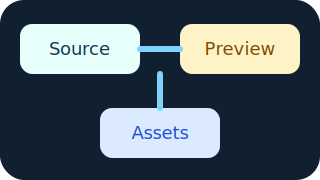
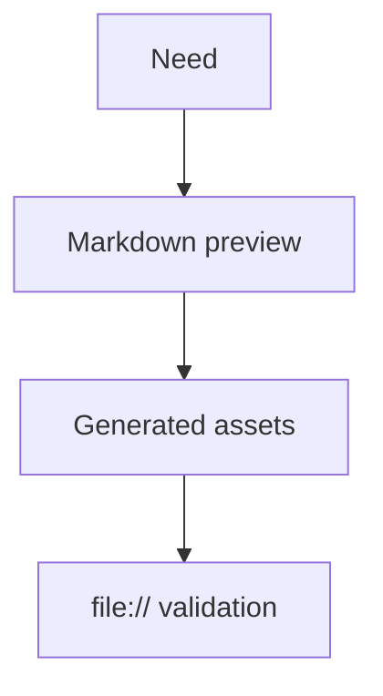

# Phase 4 Markdown Preview {#phase4-preview .hero}

```tf-md
%metadata {
  title: "Phase 4 Markdown Preview"
  profile: "tf-md"
  profileVersion: "0.1"
}

%style .hero {
  color: "#12324f"
  font-weight: "700"
}

%style .callout {
  border-left: "4px solid #1f8b7d"
  padding-left: "1rem"
}
```

This bundled example exercises the Phase 4 TF-MD baseline. {.callout}



## Mermaid example {.hero}



## Graphviz example


