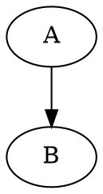
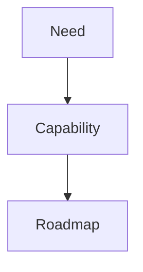

# TextForge Markdown Profile Specification

Status: draft  
Version: 0.1  
File type: Markdown profile / dialect specification

---

## 1. Purpose

The TextForge Markdown Profile, abbreviated here as **TF-MD**, defines a Markdown-compatible authoring profile for documents that combine ordinary prose with renderable, transformable, and model-aware fenced blocks.

The profile is intended to remain readable as normal Markdown while adding a small set of structured conventions for:

- reusable style references;
- explicit link anchors;
- document composition through includes;
- declaration of required processors, renderers, or profiles;
- repository references used to resolve included material;
- embedded blocks such as Mermaid, Graphviz DOT, SVG, ITM, and ITM publication blocks.

TF-MD is a Markdown dialect, not a complete application architecture. Runtime behavior such as sandboxing, network policy, credential policy, editor permissions, local storage, or deployment restrictions belongs to the host implementation, not to this profile.

---

## 2. Design principles

TF-MD follows these principles:

1. **Markdown first**  
   A TF-MD document should remain useful as ordinary Markdown wherever possible.

2. **Fenced blocks as extension boundary**  
   Complex extensions should appear in fenced blocks, rather than introducing many new inline syntaxes.

3. **Small inline surface**  
   Inline extensions are limited to style references and anchors.

4. **Declarative control blocks**  
   Document-level instructions are written in `tf-md` fenced blocks using directive syntax.

5. **ITM-compatible directive style**  
   TF-MD reuses the same general pattern as ITM directives: `%directive` followed by optional YAML-compatible structured data.

6. **Ordered document stream**  
   `tf-md` control blocks are processed in document order. Sequence matters.

7. **Host-neutral resolution**  
   The profile can declare what is required and where references may be resolved from, but the host decides how those repositories are actually accessed.

8. **Diagnostics-friendly**  
   Invalid directives, missing references, duplicate anchors, unsupported fenced blocks, and unresolved requirements should produce structured diagnostics.

---

## 3. Relationship to Markdown

TF-MD assumes a CommonMark-compatible Markdown base, optionally extended with widely used Markdown features such as tables and fenced code blocks.

A conforming TF-MD processor should preserve standard Markdown behavior unless a TF-MD extension explicitly applies.

The profile does not redefine ordinary Markdown syntax for:

- headings;
- paragraphs;
- emphasis;
- strong emphasis;
- inline code;
- fenced code blocks;
- lists;
- block quotes;
- links;
- images;
- tables, where supported by the chosen Markdown base;
- thematic breaks.

The exact base parser may be implementation-defined, but a processor should document whether it follows CommonMark, GitHub Flavored Markdown, markdown-it, Pandoc Markdown, Python-Markdown, or another base.

---

## 4. Document processing model

A TF-MD document is processed as an ordered stream.

Recommended processing stages:

1. Read the root Markdown file.
2. Scan the document in source order.
3. Identify `tf-md` control blocks.
4. Evaluate control directives in order.
5. Resolve `%include` directives at the point where they appear.
6. Process included Markdown files as if their contents appeared at the include location.
7. Parse the resolved Markdown stream.
8. Apply explicit anchors and style references.
9. Dispatch recognized fenced blocks to the relevant block processors.
10. Collect diagnostics.
11. Produce the requested output representation.

This profile distinguishes at least three possible output representations:

| Output | Meaning |
|---|---|
| Source document | The original Markdown text, preserving includes and directives. |
| Resolved Markdown | The Markdown document after includes and control directives have been processed. |
| Rendered output | A rendered representation such as HTML, SVG-rich HTML, PDF, or another publication format. |

The profile specifies source and resolved-document behavior. Rendered output behavior depends on the host implementation and available processors.

---

## 5. File extension and media type

Recommended file extensions:

| Extension | Meaning |
|---|---|
| `.md` | Ordinary Markdown or TF-MD-compatible Markdown. |
| `.tf.md` | Markdown document intentionally using TF-MD features. |
| `.tfmd` | Optional compact extension for TF-MD-specific tooling. |

The recommended extension for repository use is `.tf.md`, because it remains visibly Markdown-compatible while signalling that TF-MD features may be present.

---

## 6. Anchors and internal links

### 6.1 Ordinary internal links

Internal links use ordinary Markdown link syntax with a fragment target.

```md
See [Architecture](#architecture).
```

The target may be:

- an automatically generated heading anchor;
- an explicitly declared anchor;
- a renderer-provided anchor;
- a host-provided anchor.

### 6.2 Generated heading anchors

A processor may generate anchors for headings.

```md
## Architecture
```

A processor may expose this as:

```html
<h2 id="architecture">Architecture</h2>
```

Generated anchor algorithms are implementation-defined unless the host declares a specific algorithm.

Authors should use explicit anchors when stable references are important.

### 6.3 Explicit heading anchors

An explicit anchor may be declared on a heading using attribute-list style syntax.

```md
## Architecture {#architecture}
```

Rules:

- explicit anchors should be allowed on headings;
- anchor names must be unique in the resolved document;
- duplicate anchors should produce diagnostics;
- explicit anchors take precedence over generated anchors;
- anchor names should use a stable identifier syntax.

Recommended anchor identifier syntax:

```text
[A-Za-z][A-Za-z0-9_-]*
```

### 6.4 Inline anchors

This profile does not require general inline anchors in the initial version.

A future version may allow anchor spans, for example:

```md
[important concept]{#important-concept}
```

A processor that does not support inline anchors should produce a diagnostic if such syntax is used as an anchor declaration.

---

## 7. Style references

### 7.1 Style reference purpose

Style references allow Markdown authors to apply named presentation roles without embedding raw style declarations inline.

Style references are not semantic types. They are presentation class references.

### 7.2 Heading style references

```md
## Warning {.warning}
```

### 7.3 Paragraph style references

```md
This paragraph is important. {.important}
```

The style reference applies to the paragraph immediately preceding the attribute list marker.

### 7.4 Inline span style references

```md
This is a [keyword]{.keyword} in a sentence.
```

The style reference applies to the bracketed inline span.

### 7.5 Combined anchor and style reference

A heading may combine an explicit anchor and one or more style references.

```md
## Warning {#warning .warning .critical}
```

Rules:

- the `#anchor` item defines the anchor;
- `.style` items define style references;
- order does not change meaning;
- only one anchor may be declared;
- multiple style references may be declared.

### 7.6 Constraints

The minimal TF-MD profile supports only:

```text
#anchor-name
.style-name
```

It does not require support for arbitrary attributes such as:

```md
{key=value}
{style="color:red"}
{onclick="..."}
```

A processor may support additional attributes as an extension, but such support is outside the minimal TF-MD profile.

Recommended style name syntax:

```text
[A-Za-z][A-Za-z0-9_-]*
```

---

## 8. `tf-md` control blocks

### 8.1 Purpose

A `tf-md` fenced block contains TextForge Markdown directives.

The block is not rendered as ordinary document content. It controls document processing.

Example:

````md
```tf-md
%style .warning {
  color: "#a00000"
  font-weight: bold
}

%include ./sections/introduction.md
```
````

### 8.2 Fence names

The canonical fence info string is:

```text
tf-md
```

A processor may also accept these aliases:

```text
tfmd
textforge-md
textforge-markdown
```

The recommended emitted form is always `tf-md`.

### 8.3 Directive syntax

A directive begins with `%`.

General forms:

```text
%directive
%directive value
%directive value {
  key: value
}
%directive {
  key: value
}
```

Structured blocks use YAML-compatible syntax inside `{ ... }`.

A processor should preserve unknown directives where possible and report diagnostics according to its operating mode.

---

## 9. `%metadata`

### 9.1 Purpose

`%metadata` declares metadata for the document or the current processing stream.

Example:

````md
```tf-md
%metadata {
  title: "Capability roadmap"
  version: "0.3"
  profile: "tf-md"
  profileVersion: "0.1"
}
```
````

### 9.2 Scope

Metadata applies from the point where it appears unless the host implementation defines a document-wide merge model.

For simplicity, document-level metadata should normally appear near the beginning of the root document.

### 9.3 Recommended fields

| Field | Meaning |
|---|---|
| `title` | Human-readable document title. |
| `version` | Document version. |
| `profile` | Declared profile name, typically `tf-md`. |
| `profileVersion` | Version of this profile. |
| `description` | Short document description. |
| `author` | Optional author or owner text. |

Metadata is optional.

---

## 10. `%require`

### 10.1 Purpose

`%require` declares a capability needed to fully process, render, validate, or export the document.

Examples:

````md
```tf-md
%require tf-md ^0.1.0
%require mermaid ^10.0.0
%require graphviz.dot ^1.0.0
%require itm ^0.1.0
%require itm-pub ^0.1.0
```
````

### 10.2 Interpretation

A requirement does not load code by itself. It declares that the document expects a processor, renderer, parser, profile, package, or capability to be available.

The host implementation decides:

- whether a requirement is already satisfied;
- whether it can be resolved from repositories;
- whether the requirement is optional or mandatory;
- how version compatibility is evaluated.

### 10.3 Recommended version syntax

The recommended version constraint syntax follows common package manager conventions:

```text
^1.2.0
~1.2.0
>=1.2.0
1.2.0
```

A minimal implementation may treat the version string as opaque text and only report it in diagnostics.

### 10.4 Missing requirements

If a required capability is unavailable, a processor should emit a diagnostic.

Recommended severity:

| Situation | Severity |
|---|---|
| Missing capability needed for core parsing | error |
| Missing capability needed for rendering a block | warning or error, depending on output target |
| Missing capability needed only for optional enhancement | information or warning |

---

## 11. `%repository`

### 11.1 Purpose

`%repository` declares a named source from which includes, packages, profiles, or other references may be resolved.

Example:

````md
```tf-md
%repository shared {
  uri: "https://example.org/docs"
  kind: "markdown-library"
}

%repository local {
  uri: "./"
  kind: "workspace"
}
```
````

### 11.2 Short form

A short form may be used for simple cases:

````md
```tf-md
%repository shared https://example.org/docs
%repository local ./
```
````

This is equivalent to a repository declaration with at least a `uri` field.

### 11.3 Repository names

Repository names should use:

```text
[A-Za-z][A-Za-z0-9_-]*
```

### 11.4 Repository references

Repository-qualified references use:

```text
repositoryName:path/to/file.md
```

Example:

````md
```tf-md
%include shared:patterns/risk-section.md
```
````

The colon in a repository reference separates the repository name from the repository-local path.

### 11.5 Host responsibility

This profile declares repository syntax and reference resolution semantics.

It does not define:

- authentication;
- caching;
- network access;
- local storage;
- trust policy;
- repository authorization;
- offline packaging rules.

Those belong to the host implementation.

---

## 12. `%include`

### 12.1 Purpose

`%include` inserts another Markdown document into the current document stream.

Example:

````md
```tf-md
%include ./sections/introduction.md
%include ./sections/architecture.md
```
````

### 12.2 Resolution

Include targets may be:

| Form | Meaning |
|---|---|
| `./file.md` | Relative path reference. |
| `../file.md` | Parent-relative path reference, if supported by the host. |
| `repository:path/file.md` | Repository-qualified reference. |
| `/path/file.md` | Absolute logical path, if supported by the host. |

The host implementation defines which reference forms are valid.

### 12.3 Insertion semantics

An include is resolved at the point where the directive appears.

The included Markdown content is inserted into the document stream as if it appeared at that location.

Any `tf-md` blocks inside the included content are processed in order as part of the same stream.

### 12.4 Include scope

Stateful directives inside included content affect subsequent content after their point of insertion, unless a processor implements explicit scoping.

The default model is stream-based and stateful:

```text
root before include
included content
root after include
```

### 12.5 Circular includes

A processor should detect circular include chains.

Example:

```text
a.md includes b.md
b.md includes a.md
```

Circular includes should produce an error diagnostic.

### 12.6 Include metadata

An include may carry structured options.

Example:

````md
```tf-md
%include ./chapter.md {
  optional: false
  titleShift: 1
}
```
````

Recommended fields:

| Field | Meaning |
|---|---|
| `optional` | If true, missing include produces a warning instead of an error. |
| `titleShift` | Adjust heading levels in the included document by the given integer. |
| `select` | Include only a named fragment, if supported. |
| `as` | Assign a local alias or logical name to the included document. |

All include options are optional. A minimal implementation only needs the target path.

---

## 13. `%style`

### 13.1 Purpose

`%style` defines a reusable style referenced from Markdown using `.style-name`.

Example:

````md
```tf-md
%style .warning {
  color: "#a00000"
  font-weight: bold
}

%style .callout {
  border-left: "4px solid #3b73d9"
  padding-left: "1rem"
}
```
````

### 13.2 Selectors

The minimal selector form is:

```text
.style-name
```

A future or extended processor may support more specific selectors such as:

```text
heading.warning
paragraph.warning
span.warning
```

The minimal profile does not require selector specificity beyond named styles.

### 13.3 Style block syntax

Style blocks use YAML-compatible key/value syntax inside braces.

Example:

```text
%style .warning {
  color: "#a00000"
  font-weight: bold
}
```

Values may be strings, numbers, booleans, or lists, depending on the property.

### 13.4 Cascading

Styles are processed in document order.

If the same style name is defined more than once, later declarations may override earlier declarations.

Recommended merge behavior:

- later properties override earlier properties with the same key;
- properties not mentioned in the later declaration are preserved;
- a processor should be able to report the final computed style and the source locations that contributed to it.

Example:

````md
```tf-md
%style .warning {
  color: "#a00000"
  font-weight: bold
}

%style .warning {
  border-left: "4px solid #a00000"
}
```
````

Final style:

```yaml
color: "#a00000"
font-weight: bold
border-left: "4px solid #a00000"
```

### 13.5 Undefined style references

If a document uses a style reference that has not been defined, a processor should emit a diagnostic.

Example:

```md
This uses an undefined style. {.not-defined}
```

Recommended severity is warning, because a host or theme may supply the style externally.

### 13.6 Style names and external themes

A style reference may be resolved by:

- a `%style` directive in the current document stream;
- a `%style` directive in an included document;
- a style package declared through `%require`;
- a host theme;
- a renderer default.

A processor should document its resolution order.

---

## 14. Fenced block registry

### 14.1 Purpose

TF-MD treats fenced code blocks as the main extension mechanism.

A fenced block may be:

- ordinary literal code;
- parsed data;
- a renderable diagram;
- an embedded model;
- a publication directive;
- a TF-MD control block.

The fence info string identifies the block type.

### 14.2 General fenced block form

````md
```block-type
block content
```
````

A processor should preserve unknown fenced blocks as ordinary code blocks unless the output target requires diagnostics for unsupported block types.

### 14.3 Recommended core block types

| Fence info string | Meaning | Typical behavior |
|---|---|---|
| `tf-md` | TF-MD control directives | Process as directives; not rendered as content. |
| `mermaid` | Mermaid diagram | Render to diagram if Mermaid processor is available. |
| `dot` | Graphviz DOT diagram | Render to graph if DOT processor is available. |
| `graphviz` | Graphviz diagram | Alias or extended Graphviz processor. |
| `svg` | SVG source | Render or embed as SVG if supported. |
| `itm` | Indented Text Model source | Parse as ITM model block. |
| `itm-pub` | ITM publication/projection block | Render publication view from ITM content. |
| `json` | JSON data or code | Validate and display as JSON if supported. |
| `yaml` | YAML data or code | Validate and display as YAML if supported. |

The registry may be extended by the host implementation or by capabilities declared through `%require`.

---

## 15. Mermaid blocks

### 15.1 Syntax

````md

````

### 15.2 Requirement

A document may declare Mermaid support explicitly:

````md
```tf-md
%require mermaid ^10.0.0
```
````

### 15.3 Behavior

If Mermaid support is available, the block may be rendered as a diagram.

If unavailable, the block should remain visible as a code block and may produce a diagnostic.

---

## 16. Graphviz DOT blocks

### 16.1 Syntax

````md

````

or:

````md

````

### 16.2 Requirement

````md
```tf-md
%require graphviz.dot ^1.0.0
```
````

### 16.3 Behavior

If Graphviz support is available, the block may be rendered as a graph.

If unavailable, the block should remain visible as a code block and may produce a diagnostic.

---

## 17. SVG blocks

### 17.1 Syntax

````md
```svg
<svg viewBox="0 0 100 100">
  <circle cx="50" cy="50" r="40" />
</svg>
```
````

### 17.2 Requirement

````md
```tf-md
%require svg ^1.0.0
```
````

### 17.3 Behavior

If SVG support is available, the block may be rendered as an image or embedded vector graphic.

If unavailable, the block should remain visible as source text and may produce a diagnostic.

SVG processing details are host-defined.

---

## 18. ITM blocks

### 18.1 Syntax

````md
```itm
&risk [Risk] Payment failure #critical
  &cause [Cause] Payment provider unavailable
```
````

### 18.2 Requirement

````md
```tf-md
%require itm ^0.1.0
```
````

### 18.3 Behavior

An `itm` block contains an Indented Text Model fragment.

A processor with ITM support may:

- parse the model;
- produce diagnostics;
- expose the model to `itm-pub` blocks;
- render the model through available views;
- export the model as a separate artifact.

The relationship between multiple ITM blocks is implementation-defined unless the document declares a specific composition rule.

Recommended minimal behavior:

- each `itm` fenced block is parsed independently;
- each block may have a generated local block id;
- diagnostics refer to the Markdown source range of the block.

---

## 19. ITM publication blocks

### 19.1 Syntax

An `itm-pub` block declares a publication or projection over ITM content.

Example:

````md
```itm-pub
view: risk-summary
source: nearest
```
````

### 19.2 Requirement

````md
```tf-md
%require itm-pub ^0.1.0
```
````

### 19.3 Recommended fields

| Field | Meaning |
|---|---|
| `view` | Named view or viewpoint to render. |
| `source` | ITM source selection, such as `nearest`, `document`, or a named source. |
| `title` | Optional publication title. |
| `parameters` | Optional view parameters. |

### 19.4 Behavior

A processor with `itm-pub` support may render the selected ITM model or view inline in the Markdown output.

If the referenced model or view cannot be resolved, the processor should produce a diagnostic.

---

## 20. Block identifiers

A future version may allow fenced blocks to declare identifiers.

Possible syntax:

````md
```itm {#risk-model}
&risk [Risk] Payment failure
```
````

This profile does not require block identifiers in version 0.1.

Until block identifiers are standardized, processors may assign internal block ids for diagnostics and cross-reference purposes.

---

## 21. Ordered state and scoping

### 21.1 Default state model

The default TF-MD state model is ordered and stream-based.

A directive affects the document stream from the point where it appears.

Example:

````md
```tf-md
%style .early {
  color: "#a00000"
}
```

This paragraph may use `.early`. {.early}

```tf-md
%style .late {
  color: "#0000a0"
}
```

This paragraph may use `.late`. {.late}
````

### 21.2 Includes and state

Included files are processed at the point of inclusion.

State changes inside an included file affect following content in the resolved stream.

Example:

```text
root.md before include
included.md content and directives
root.md after include
```

### 21.3 Optional scoped includes

A future extension may allow scoped includes.

Example:

````md
```tf-md
%include ./chapter.md {
  scope: isolated
}
```
````

This is not required in version 0.1.

---

## 22. Diagnostics

A TF-MD processor should produce diagnostics where possible.

Recommended diagnostic fields:

```yaml
source: tf-md.processor
severity: warning
message: "Style '.warning' is referenced but not defined."
file: "document.tf.md"
line: 42
range:
  from: 1200
  to: 1220
directive: "%style"
blockType: "tf-md"
```

Recommended severities:

| Severity | Meaning |
|---|---|
| `error` | Processing cannot continue correctly. |
| `warning` | Processing can continue, but output may be incomplete or inconsistent. |
| `information` | Useful processing information. |
| `observation` | Non-blocking note or suggestion. |

Recommended diagnostics include:

| Case | Suggested severity |
|---|---|
| Invalid `tf-md` directive syntax | error |
| Unknown required capability | warning or error |
| Missing mandatory include | error |
| Missing optional include | warning |
| Circular include | error |
| Duplicate explicit anchor | error |
| Unsupported fenced block needed for selected output | warning or error |
| Undefined style reference | warning |
| Invalid style definition | error |
| Invalid repository reference | error |
| Missing repository declaration | error |
| Unresolved ITM publication source | error |
| Invalid ITM block | error or warning depending on strictness |

---

## 23. Conformance levels

### 23.1 Level 0: Markdown-compatible reader

A Level 0 processor treats all TF-MD-specific constructs as ordinary Markdown or code blocks.

It does not need to understand TF-MD.

### 23.2 Level 1: Anchors and style references

A Level 1 processor supports:

- explicit heading anchors;
- heading style references;
- paragraph style references;
- inline span style references.

### 23.3 Level 2: `tf-md` control blocks

A Level 2 processor supports:

- scanning `tf-md` blocks;
- `%metadata`;
- `%style`;
- diagnostics for invalid directives.

### 23.4 Level 3: Includes and repositories

A Level 3 processor supports:

- `%include`;
- `%repository`;
- repository-qualified references;
- circular include detection;
- resolved Markdown output.

### 23.5 Level 4: Requirements and block registry

A Level 4 processor supports:

- `%require`;
- fenced block capability matching;
- diagnostics for missing processors;
- a registry of block handlers.

### 23.6 Level 5: Model-aware Markdown

A Level 5 processor supports:

- `itm` blocks;
- `itm-pub` blocks;
- model diagnostics;
- publication views over embedded or included models.

---

## 24. Complete example

````md
# Capability Roadmap {#capability-roadmap}

```tf-md
%metadata {
  title: "Capability Roadmap"
  version: "0.1"
  profile: "tf-md"
  profileVersion: "0.1"
}

%require tf-md ^0.1.0
%require mermaid ^10.0.0
%require graphviz.dot ^1.0.0
%require itm ^0.1.0
%require itm-pub ^0.1.0

%repository shared {
  uri: "shared:"
  kind: "logical"
}

%style .warning {
  color: "#a00000"
  font-weight: bold
}

%style .callout {
  border-left: "4px solid #3b73d9"
  padding-left: "1rem"
}

%include ./sections/introduction.md
```

## Summary {.callout}

This document combines Markdown prose, diagrams, and model-aware publication blocks.

See [Model fragment](#model-fragment).



## Model fragment {#model-fragment}

```itm
&roadmap [Roadmap] Capability Roadmap #core
  &phase1 [Phase] Foundation
  &phase2 [Phase] Integrated authoring
```

```itm-pub
view: roadmap-summary
source: nearest
title: "Roadmap summary"
```

This paragraph contains a [styled keyword]{.warning}.
````

---

## 25. Syntax summary

### Explicit anchor

```md
## Heading {#heading-id}
```

### Heading style

```md
## Heading {.style-name}
```

### Combined heading anchor and style

```md
## Heading {#heading-id .style-name}
```

### Paragraph style

```md
Paragraph text. {.style-name}
```

### Inline style

```md
A [styled phrase]{.style-name}.
```

### Control block

````md
```tf-md
%directive value {
  key: value
}
```
````

### Include

````md
```tf-md
%include ./chapter.md
%include shared:chapter.md
```
````

### Repository

````md
```tf-md
%repository shared {
  uri: "https://example.org/docs"
  kind: "markdown-library"
}
```
````

### Requirement

````md
```tf-md
%require mermaid ^10.0.0
```
````

### Style definition

````md
```tf-md
%style .warning {
  color: "#a00000"
  font-weight: bold
}
```
````

---

## 26. Open issues for later versions

The following topics are intentionally left open:

1. Whether inline anchors should be part of the core profile.
2. Whether arbitrary key/value attributes should be allowed for inspector metadata.
3. Whether style selectors should support element-specific selectors.
4. Whether includes should support fragment selection.
5. Whether includes should support heading-level shifting as a core feature.
6. Whether fenced blocks should have standardized ids.
7. How multiple ITM blocks compose into a document-level model.
8. Whether `itm-pub` should reference the nearest model, all document models, or named model blocks by default.
9. Whether scoped state should be supported for includes or style blocks.
10. Whether a package mechanism should be added beyond `%require` and `%repository`.

---

## 27. Summary

TF-MD is a Markdown profile for documents that need more than prose but should remain plain-text, readable, and tool-independent.

Its core ideas are:

- ordinary Markdown remains the host language;
- fenced blocks define extension boundaries;
- `tf-md` blocks carry ordered control directives;
- `%include`, `%require`, and `%repository` provide ITM-like composition and capability declarations;
- styles are reusable named references, not arbitrary inline formatting;
- anchors are explicit when stable internal links are needed;
- diagrams and models live in typed fenced blocks such as `mermaid`, `dot`, `svg`, `itm`, and `itm-pub`;
- the profile defines syntax and document semantics, while runtime policy belongs to the host implementation.
