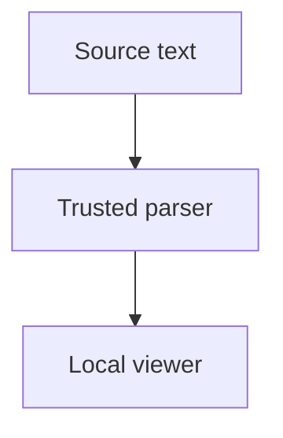
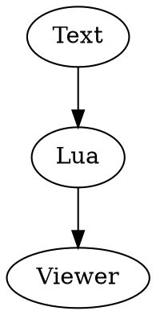

# Markdown Diagram And Math Sample

Inline math: $a^2 + b^2 = c^2$.

$$
E = mc^2
$$

```mermaid
graph TD
  A[Source text] --> B[Trusted parser]
  B --> C[Local viewer]
```

```dot
digraph G {
  Text -> Lua;
  Lua -> Viewer;
}
```
