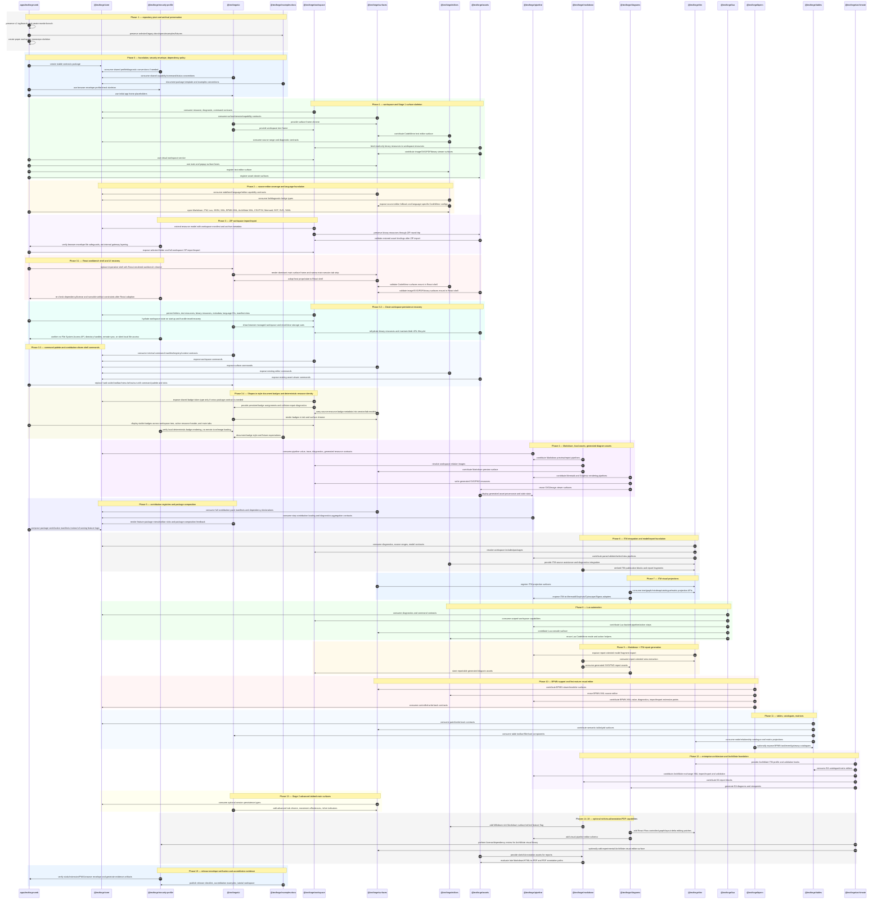

# TextForge Package Dependency Activity Diagram

Direction convention: `A ->> B` means **package A starts consuming or depending on package B** at that phase.

```mermaid
sequenceDiagram
  autonumber

  participant App as apps/textforge-web
  participant Core as @textforge/core
  participant Sec as @textforge/security-profile
  participant UI as @textforge/ui
  participant Docs as @textforge/examples-docs
  participant WS as @textforge/workspace
  participant Surf as @textforge/surfaces
  participant Edit as @textforge/editors
  participant Assets as @textforge/assets
  participant Pipe as @textforge/pipeline
  participant MD as @textforge/markdown
  participant Diag as @textforge/diagrams
  participant ITM as @textforge/itm
  participant Lua as @textforge/lua
  participant BPMN as @textforge/bpmn
  participant Tables as @textforge/tables
  participant Archi as @textforge/archimate

  rect rgb(245,245,245)
    Note over App,Docs: Phase -1 — repository pivot and archival preservation
    App->>App: preserve v1 tag/branch and create rewrite branch
    App->>Docs: preserve selected legacy docs/specs/examples/fixtures
    App->>App: create pnpm workspace monorepo skeleton
  end

  rect rgb(235,245,255)
    Note over App,Docs: Phase 0 — foundation, security envelope, dependency policy
    App->>Core: create stable contracts package
    Sec->>Core: consume shared profile/diagnostic conventions if needed
    UI->>Core: consume shared capability/command/status conventions
    Docs->>Core: document package template and examples conventions
    App->>Sec: use browser-envelope profile/check skeleton
    App->>UI: use initial app frame placeholders
  end

  rect rgb(240,255,240)
    Note over WS,Assets: Phase 1 — workspace and Stage 1 surface skeleton
    WS->>Core: consume resource, diagnostic, command contracts
    Surf->>Core: consume surface/session/capability contracts
    UI->>Surf: provide surface frame chrome
    UI->>WS: provide workspace tree frame
    Edit->>Surf: contribute CodeMirror text editor surface
    Edit->>Core: consume source range and diagnostic contracts
    Assets->>WS: bind read-only binary resources to workspace resources
    Assets->>Surf: contribute image/SVG/PDF/binary viewer surfaces
    App->>WS: use virtual workspace service
    App->>Surf: use main and popup surface hosts
    App->>Edit: register text editor surface
    App->>Assets: register asset viewer surfaces
  end

  rect rgb(255,250,235)
    Note over Core,Edit: Phase 2 — source-editor coverage and language foundation
    Surf->>Core: consume stabilized language/editor capability contracts
    Edit->>Core: consume lint/diagnostic bridge types
    Edit->>Surf: expose source editor fallback and language-specific CodeMirror configs
    App->>Edit: open Markdown, ITM, Lua, JSON, XML, BPMN XML, ArchiMate XML, CSV/TSV, Mermaid, DOT, SVG, YAML
  end

  rect rgb(250,245,255)
    Note over WS,Sec: Phase 3 — ZIP workspace import/export
    WS->>Core: extend resource model with workspace manifest and archive metadata
    WS->>Assets: preserve binary resources through ZIP round-trip
    Assets->>WS: validate restored asset bindings after ZIP import
    Sec->>App: verify browser-envelope file safeguards, not internal gateway layering
    App->>WS: expose selected-folder and full-workspace ZIP import/export
  end

  rect rgb(255,245,245)
    Note over App,Sec: Phase 3.1 — React workbench shell and UI recovery
    App->>UI: replace imperative shell with React-rendered workbench chrome
    UI->>Surf: render dominant main surface frame and narrow main-session tab strip
    Surf->>UI: adapt host props/state to React shell
    Edit->>Surf: validate CodeMirror surfaces mount in React shell
    Assets->>Surf: validate image/SVG/PDF/binary surfaces mount in React shell
    Sec->>App: re-check dependency/license and runnable-artifact constraints after React adoption
  end

  rect rgb(235,255,250)
    Note over WS,Assets: Phase 3.2 — Dexie workspace persistence recovery
    WS->>Core: persist folders, text resources, binary resources, metadata, language IDs, manifest data
    App->>WS: hydrate workspace state on startup and handle reset/recovery
    UI->>WS: show browser-managed workspace and reset/clear-storage cues
    Assets->>WS: rehydrate binary resources and maintain blob URL lifecycle
    Sec->>App: confirm no File System Access API, directory handles, remote sync, or silent local file access
  end

  rect rgb(245,250,255)
    Note over Core,App: Phase 3.3 — command palette and contribution-driven shell commands
    UI->>Core: consume minimal command manifest/registry/context contracts
    WS->>Core: expose workspace commands
    Surf->>Core: expose surface commands
    Edit->>Core: expose existing editor commands
    Assets->>Core: expose existing asset viewer commands
    App->>UI: replace hard-coded toolbar/menu behaviour with command palette and slots
  end


  rect rgb(250,250,235)
    Note over WS,UI: Phase 3.4 — Shapez.io-style document badges and deterministic resource identity
    WS->>Core: expose shared badge token type only if cross-package contract is needed
    WS->>UI: provide persisted badge assignments and collision-repair diagnostics
    Surf->>WS: carry source-resource badge metadata into session/tab models
    UI->>Surf: render badges in tab and surface chrome
    App->>WS: display stable badges across workspace tree, active resource header, and main tabs
    Sec->>UI: verify local deterministic badge rendering, no remote icon/image loading
    Docs->>UI: document badge style and fixture expectations
  end

  rect rgb(250,240,255)
    Note over Pipe,Diag: Phase 4 — Markdown, local assets, generated diagram assets
    Pipe->>Core: consume pipeline value, trace, diagnostics, generated resource contracts
    MD->>Pipe: contribute Markdown preview/report pipelines
    MD->>WS: resolve workspace-relative images
    MD->>Surf: contribute Markdown preview surface
    Diag->>Pipe: contribute Mermaid and Graphviz rendering pipelines
    Diag->>WS: write generated SVG/PNG resources
    Diag->>Assets: reuse SVG/image viewer surfaces
    Assets->>Pipe: display generated asset provenance and stale state
  end

  rect rgb(240,240,255)
    Note over Core,UI: Phase 5 — contribution registries and package composition
    Surf->>Core: consume full contribution-pack manifests and dependency declarations
    Pipe->>Core: consume step contribution loading and diagnostics aggregation contracts
    UI->>Core: render feature-package menu/toolbar slots and package-composition feedback
    App->>Core: compose package contribution manifests instead of owning feature logic
  end

  rect rgb(245,245,245)
    Note over ITM,MD: Phase 6 — ITM integration and model/report foundation
    ITM->>Core: consume diagnostics, source ranges, model contracts
    ITM->>WS: resolve workspace includes/packages
    ITM->>Pipe: contribute parse/validate/select/view pipelines
    Edit->>ITM: provide ITM source assistance and diagnostics integration
    MD->>ITM: embed ITM publication blocks and report fragments
  end

  rect rgb(235,245,255)
    Note over ITM,Diag: Phase 7 — ITM visual projections
    Surf->>ITM: register ITM projection surfaces
    Diag->>ITM: consume tree/graph/mindmap/catalogue/matrix projection APIs
    Diag->>Pipe: expose ITM-to-Mermaid/Graphviz/Cytoscape/Sigma adapters
  end

  rect rgb(240,255,240)
    Note over Lua,Edit: Phase 8 — Lua automation
    Lua->>Core: consume diagnostics and command contracts
    Lua->>WS: consume scoped workspace capabilities
    Lua->>Pipe: contribute Lua-backed pipeline/action steps
    Lua->>Surf: contribute Lua console surface
    Lua->>Edit: reuse Lua CodeMirror mode and action helpers
  end

  rect rgb(255,250,235)
    Note over MD,ITM: Phase 9 — Markdown + ITM report generation
    ITM->>Pipe: expose report-oriented model fragment export
    MD->>ITM: consume report-oriented view extraction
    MD->>Diag: consume generated SVG/PNG report assets
    Diag->>WS: store reportable generated diagram assets
  end

  rect rgb(255,245,245)
    Note over BPMN,Surf: Phase 10 — BPMN support and first mature visual editor
    BPMN->>Surf: contribute BPMN viewer/modeler surfaces
    BPMN->>Edit: reuse BPMN XML source editor
    BPMN->>Pipe: contribute BPMN XML value, diagnostics, import/export extension points
    BPMN->>Core: consume controlled write-back contracts
  end

  rect rgb(245,250,255)
    Note over Tables,BPMN: Phase 11 — tables, catalogues, matrices
    Tables->>Core: consume patch/write-back contracts
    Tables->>Surf: contribute semantic table/grid surfaces
    Tables->>UI: consume table toolbar/filter/sort components
    Tables->>ITM: consume node/relationship catalogue and matrix projections
    BPMN->>Tables: optionally expose BPMN task/event/gateway catalogues
  end

  rect rgb(250,245,255)
    Note over Archi,MD: Phase 12 — enterprise architecture and ArchiMate foundation
    Archi->>ITM: provide ArchiMate ITM profile and validation hooks
    Archi->>Tables: consume EA catalogue/matrix editors
    Archi->>Pipe: contribute ArchiMate exchange XML import/export and validation
    Archi->>MD: contribute EA report blocks
    Archi->>Diag: generate EA diagrams and viewpoints
  end

  rect rgb(255,255,240)
    Note over Surf,UI: Phase 13 — Stage 2 advanced tabbed main surfaces
    Surf->>Core: consume optional session persistence types
    UI->>Surf: add advanced tab chrome, movement affordances, richer indicators
  end

  rect rgb(245,245,245)
    Note over MD,Diag: Phases 14–18 — optional rich/visual/annotation/PDF capabilities
    MD->>Edit: add Milkdown rich Markdown surface behind feature flag
    Diag->>ITM: add React Flow controlled graph/layout-delta editing patches
    Diag->>Pipe: add visual pipeline editor schema
    Archi->>Sec: perform license/dependency review for ArchiMate visual library
    Archi->>Surf: optionally add experimental ArchiMate visual editor surface
    Assets->>MD: provide sketch/annotation assets for reports
    MD->>Assets: evaluate late Markdown/HTML-to-PDF and PDF annotation paths
  end

  rect rgb(235,245,255)
    Note over Sec,Docs: Phase 19 — release-envelope verification and accreditation evidence
    Sec->>App: verify static/extension/PWA browser envelope and generate evidence artifacts
    Docs->>Sec: publish release checklist, accreditation examples, tutorial workspace
  end
```
