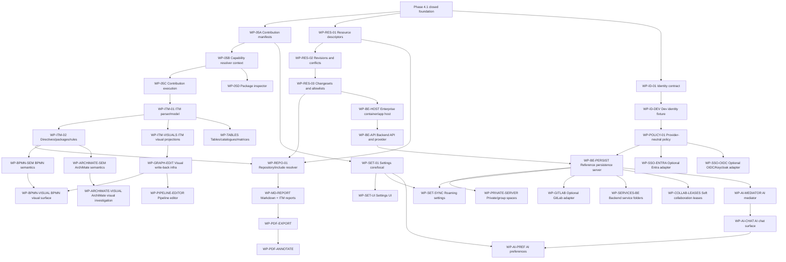

# Workpackage Dependency Map — V17 Starter

**Status:** Initial map for reassessment; use `workpackage-register.md` as the current source of status.

## Core graph

## Dependency interpretation

- `WP-SSO-ENTRA` is downstream of the provider-neutral policy engine. It is not upstream of backend persistence, private/group spaces, settings sync, leases, GitLab, or AI development.
- `WP-ID-DEV` is the local development bridge that keeps backend work testable without enterprise infrastructure.
- `WP-RELEASE-GATE` is intentionally not shown as a terminal node only. It should be run whenever a selected release slice needs evidence.
