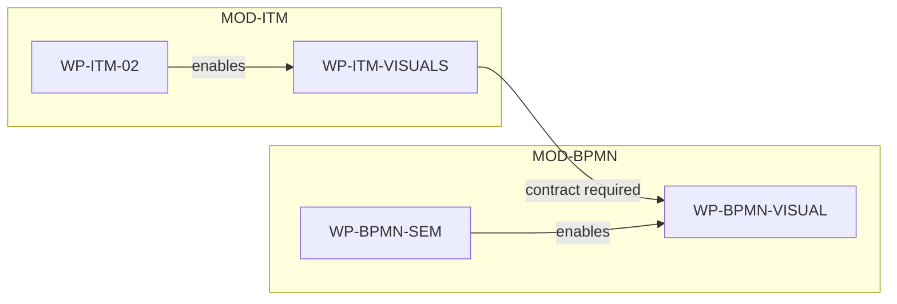

# Attachment G — Dependency map conventions

## Purpose

The dependency map shows the allowed implementation order between workpackages.

It is not a release plan, status dashboard, architecture diagram, or historical phase diagram.

## Source of truth

Generated from:

```text
roadmap-state.yaml
```

Do not manually edit generated dependency maps except during experiments.

## Node level

Each node represents one workpackage.

Modules appear only as subgraphs/groups.

## Edge meaning

```text
A --> B
```

means:

```text
B depends on A
```

In other words: A must be available before B can be completed.

## Edge labels

Use labels only when dependency type matters:

```text
A -->|enables| B
A -->|contract required| B
A -->|validation required| B
A -->|optional| B
A -->|blocks| B
```

## Edge types

| Edge label | Meaning |
|---|---|
| `enables` | normal implementation dependency |
| `contract required` | interface/schema/API must exist first |
| `validation required` | evidence from source WP is required |
| `optional` | helpful but not mandatory |
| `blocks` | known blocker |

## Node styling categories

| Category | Meaning |
|---|---|
| `implemented` | done in code |
| `validated` | done and evidence accepted |
| `ready` | implementable now |
| `blocked` | cannot proceed |
| `deferred` | intentionally delayed |
| `candidate` | not fully defined |

## Mermaid convention



## Map variants

```text
views/dependency-map-full.md
views/dependency-map-next.md
views/dependency-map-release-<release-id>.md
```

## Rules

- No phase labels.
- No historical source labels.
- No long prose inside nodes.
- No duplicate dependency semantics outside `roadmap-state.yaml`.
- Every displayed WP must exist in `roadmap-state.yaml`.
- Every dependency edge must come from `depends_on` or `enables`.
