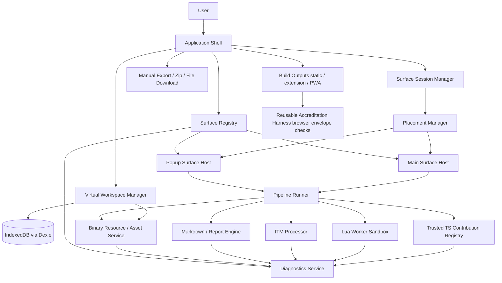
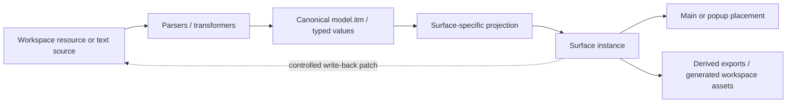
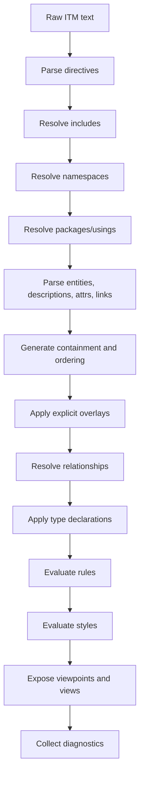
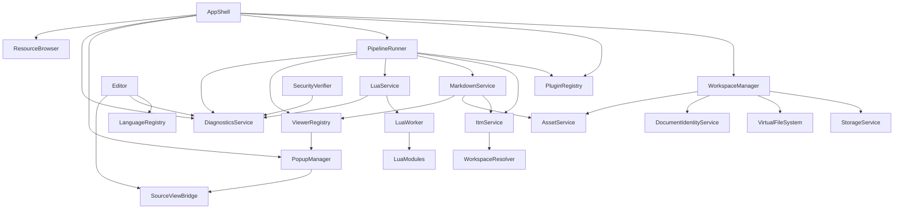

# TextForge Rebuild Whitepaper

**Version:** 13  
**Purpose:** Standalone architecture blueprint for rebuilding TextForge from scratch as a React-based, local-first, text-first, secure browser workbench. The design centers on an application-private virtual workspace, ITM as the canonical structural model, explicit pipelines, restricted Lua automation, binary workspace resources, Markdown/report generation, enterprise architecture and ArchiMate support, browser-envelope accreditation, and a Surface-based UI where editors, rich editors, structured editors, viewers, consoles, inspectors, and generated previews are peers.

This document is self-contained and states the target architecture directly.

---

## 1. Executive summary

TextForge should be rebuilt as a **React-based, local-first, text-first structured-text workbench**. Its central promise is that plain text remains the canonical source while diagrams, graphs, rendered Markdown, BPMN views, enterprise architecture views, ArchiMate views, SVGs, PNGs, images, reference PDFs, tables, reports, and transformed outputs remain derived, inspectable, and disposable artifacts. The UI should be a workbench of interchangeable surfaces, not a CodeMirror-only editor with secondary popup viewers. Editing must remain source-first: richer visual and structured editors are valuable, but only when they have an explicit and testable write-back contract to the canonical text, model, XML, CSV, or workspace resource they edit.

The rebuild should not start as a generic web IDE. It should start as a deterministic local document workbench with four pillars:

1. **A virtual workspace** backed by IndexedDB, with explicit manual upload/download as the only file boundary.
2. **A canonical ITM object model** used as the internal structural representation for trees, graphs, diagrams, views, report fragments, and model-driven transformations.
3. **A pipeline-based contribution architecture** where trusted internal TypeScript contributions parse, transform, render, validate, and export content.
4. **A restricted Lua automation layer** for user-defined transformations and actions, replacing unsafe user-provided JavaScript plugins.
5. **A reusable browser-envelope accreditation profile** that demonstrates TextForge is packaged with the expected browser safeguards: no unapproved network egress, no remote code loading, no privileged local filesystem APIs, no broad extension permissions, and no unsafe service-worker escape path.

The recommended rebuild should use React as the UI foundation and reuse proven libraries where they do not compromise the product model:

| Area | Selected component |
|---|---|
| UI runtime | React 19.x + TypeScript |
| Workbench surface model | custom SurfaceRegistry, SurfaceSessionManager, and PlacementManager |
| Build tool | Vite React TypeScript app |
| Source editor | CodeMirror 6 |
| Editable surface model | custom SurfaceContribution capabilities including source, rich, table, diagram, model, console, and controlled write-back surfaces |
| Rich Markdown editor | Milkdown as preferred open-source candidate, introduced only after round-trip tests; MDXEditor only after dependency audit |
| Semantic table/matrix editing | TanStack Table by default; AG Grid Community only if spreadsheet-like UX is needed and Enterprise packages are excluded |
| Controlled graph/diagram editing | React Flow for later pipeline, flowchart, and small graph editing with explicit patch generation |
| Sketch/annotation resources | Excalidraw for open-source baseline sketch and annotation surfaces |
| Workspace tree UI | React Arborist |
| IndexedDB persistence | Dexie.js |
| Read-only image resources | native browser image rendering through workspace blob URLs |
| Read-only PDF resources | PDF.js or browser-native PDF embed, with PDF.js preferred for consistent local viewing |
| Zip import/export | fflate |
| Markdown preview | markdown-it |
| Markdown/report AST pipeline | unified / remark / rehype |
| Markdown local asset resolution | workspace asset resolver producing scoped blob URLs |
| Mermaid diagrams | Mermaid |
| Graphviz rendering | Viz.js or equivalent local Graphviz WASM |
| SVG to PNG export | browser canvas rasterization, with canvg considered only if native SVG image rasterization is insufficient |
| Graph viewer | Cytoscape.js |
| Large graph viewer | Sigma.js + Graphology |
| Mind map viewer | jsMind |
| BPMN viewer/modeler | bpmn-js + bpmn-moddle, with visible-attribution/license acceptance and controlled XML write-back |
| Enterprise architecture / ArchiMate | ITM ArchiMate profiles, ArchiMate exchange XML import/export transformers, and generated graph/SVG/matrix surfaces |
| Future visual graph editing | React Flow, behind controlled write-back only |
| Lua runtime | Fengari |
| Lua console | xterm.js, optional but aligned with the intended product direction |
| Popovers/menus | Floating UI, with Radix UI/shadcn-style primitives where useful |
| Main/popup surface hosting | custom SurfaceHost components |
| Panels/layout | react-resizable-panels, initially constrained to simple shell panels |
| Drag/drop outside tree | dnd-kit, introduced when tabbed surfaces arrive |
| Tabular inspectors and editors | TanStack Table where semantic table state is needed; AG Grid Community as an optional spreadsheet-like editor |
| App state | Zustand or small custom stores, not Redux by default |
| PDF generation from Markdown HTML | late-stage browser-local export path; start with print-optimized HTML and evaluate client-side PDF generation only after core report pipeline is stable |
| Accreditation harness | reusable scripts checking CSP, manifests, service workers, remote assets, and forbidden browser APIs |

The key custom components should be: virtual workspace model, ITM integration, pipeline runner, diagnostics model, source/view bridge, report generation orchestration, Lua sandbox policy, controlled write-back, and a reusable browser-envelope accreditation configuration/harness.

---

## 2. Product doctrine

The rebuild should preserve the following invariants.

```text
1. Text is canonical.
2. The workspace is virtual and local.
3. ITM is the canonical structural object model.
4. Viewers are projections, not source owners.
5. Pipelines are explicit, traceable, and diagnosable.
6. User automation is Lua, not JavaScript.
7. No network, no server, no telemetry, no silent filesystem access in the accredited local profile.
8. Diagnostics are universal and first-class.
9. Source/view links are first-class.
10. Reports are generated from Markdown + ITM, not hand-maintained derived artifacts.
11. Enterprise architecture and ArchiMate are profile-driven model workflows over ITM, not separate opaque diagram stores.
12. Binary resources are workspace assets: viewable and referenceable, but not silently linked to the local filesystem.
13. Editors and viewers are both surfaces; placement is independent from capability.
14. Rich, visual, and structured editors are subordinate to canonical source resources.
15. No non-source editor is accepted without a declared write-back contract, unsupported-construct policy, round-trip tests, and source-editor fallback.
16. Dependencies must remain compatible with an open-source TextForge distribution.
```

These invariants should be treated as architectural tests. A new feature that violates one of them should be rejected or redesigned.


---

## 3. System context

TextForge is intended to run as:

1. a local/static web app where feasible;
2. a packaged browser extension;
3. optionally, a PWA-like local web app if served from a controlled origin.

All accredited local targets must preserve the same security claim:

> TextForge cannot silently access or modify user-visible local files. Local files, including images and reference PDFs, enter through explicit user upload/import or ZIP import. Local files leave through explicit user download/export, ZIP export, copy, or print. The accredited local profile performs no unapproved network access and loads no remote code, remote plugins, or CDN assets.

This is stronger than “offline-capable.” It is a deliberate accreditation posture.

The security claim should be understood as a **browser-envelope claim**, not a proof of every internal implementation detail. The accreditation harness should verify that the browser and deployment safeguards are present and correctly configured. The browser then enforces the core boundary through CSP, extension permissions, service-worker restrictions, same-origin packaging, and the absence of privileged filesystem APIs.

TextForge-specific architectural discipline remains important, but it should not be confused with reusable accreditation. For example, TextForge should still use a `WorkspaceStorageGateway`, `FileGateway`, and `ExportGateway` because they make the code easier to reason about. However, the reusable accreditation harness should not attempt to prove that only those gateway modules ever touch IndexedDB or user-mediated file input. IndexedDB and ordinary file input are allowed browser capabilities inside the app. The accreditation boundary is about preventing unapproved network egress, remote code loading, broad extension permissions, service-worker escape paths, and privileged silent filesystem access.

### 3.1 Browser-envelope accreditation profile

The default TextForge target should conform to a reusable profile similar to:

```yaml
profile: local-only-manual-file-workspace-webapp
network:
  mode: none
remoteCode:
  scripts: forbidden
  plugins: forbidden
  cdnRuntimeAssets: forbidden
localFiles:
  silentRead: forbidden
  silentWrite: forbidden
  fileSystemAccessApi: forbidden
  directoryHandles: forbidden
  persistentFileHandles: forbidden
  manualFileInput: allowed
  manualDownloadExport: allowed
  zipImportExport: allowed
workspace:
  applicationPrivateWorkspace: allowed
  persistence: indexedDB
  liveLocalDirectoryMirror: forbidden
extension:
  broadHostPermissions: forbidden
  fileAccess: forbidden
  nativeMessaging: forbidden
pwa:
  serviceWorkerArbitraryProxy: forbidden
```

This profile is intentionally application-independent. It can apply to TextForge, another local Markdown tool, a PDF utility, a modelling workbench, or a browser-based document processor.

### 3.2 What the accreditation harness should verify

The reusable harness should check the deployment envelope:

- CSP for the static/PWA target;
- extension manifest permissions for the extension target;
- PWA manifest and service-worker pattern for the PWA target;
- final built HTML and bundles for remote scripts, remote workers, remote imports, CDN assets, and external origins;
- final artifacts for forbidden privileged local filesystem APIs such as `showOpenFilePicker`, `showSaveFilePicker`, `showDirectoryPicker`, `FileSystemFileHandle`, and `FileSystemDirectoryHandle`;
- absence of broad extension permissions such as `<all_urls>`, `file://` access, or `nativeMessaging`;
- no service-worker code that acts as an arbitrary network proxy;
- no runtime network policy that contradicts the declared profile.

The harness should not become a TextForge architecture verifier. It should not need to know the TextForge workspace model, ITM processor, viewer registry, Lua module layout, or whether all storage writes pass through a particular class. Those checks can exist as ordinary project tests, but they are not the reusable accreditation core.

### 3.3 Internal architecture rules versus accreditation rules

The distinction should be explicit:

| Concern | Belongs to | Example |
|---|---|---|
| Browser-enforced no-network posture | Accreditation harness | CSP `connect-src 'none'`, no external origins, no WebSocket to remote host |
| No privileged local filesystem authority | Accreditation harness | no File System Access API, no directory handles, no extension `file://` access |
| No remote code loading | Accreditation harness | no remote scripts, workers, modules, or CDN runtime dependencies |
| Workspace maintainability | TextForge architecture | use `WorkspaceManager` and Dexie consistently |
| Gateway discipline | TextForge architecture | route imports through `FileGateway` for clarity |
| ITM correctness | TextForge tests | parser/resolver/serializer tests |
| Lua API quality | TextForge tests | capability tests for `tf.*` APIs |

This keeps the accreditation harness reusable across applications and prevents it from becoming an overfitted static-analysis project.

---

## 4. Target architecture overview

The Surface model changes the center of gravity of the runtime architecture. The application should not be built around the assumption that the main pane is always CodeMirror and that every viewer is a popup. Instead, TextForge should be built around a **Surface Workbench**.

A **surface** is any interactive or read-only work area that can be hosted by the application shell. CodeMirror is one surface. A Markdown preview is another. An image viewer, PDF viewer, ITM graph, BPMN diagram, Lua console, diagnostics table, and generated report preview are also surfaces.

Placement is separate from identity:

```text
Resource or pipeline output -> Surface contribution -> Surface session -> Placement
```

Initial placements should be deliberately simple:

```text
Stage 1 target:
  one main surface area
  optional popup placement for any surface that supports it

Stage 2 target, later:
  tabbed main surface group
  editors and viewers as peer tabs

Future after Stage 2:
  split panes
  saved layouts
  detached browser windows
```

### 4.1 Runtime architecture



The accreditation harness is intentionally shown outside the runtime application. It verifies the packaging and browser security envelope. It is not an internal runtime service and should not be coupled to TextForge-specific domain modules.

### 4.2 Source, model, surface, and export

The important separation is now between **source**, **model**, **surface**, **placement**, and **export**.



This keeps the text/model source-of-truth doctrine intact while allowing rendered artifacts to become first-class work surfaces.

### 4.3 Resource surfaces and derived surfaces

Two surface classes should be distinguished.

**Resource surfaces** open a workspace resource directly:

```text
.itm      -> CodeMirror editor / ITM tree / ITM graph / ITM inspector
.md       -> CodeMirror editor / Markdown preview / report preview
.svg      -> SVG viewer / CodeMirror XML source view
.png      -> image viewer
.pdf      -> read-only PDF viewer
.lua      -> CodeMirror editor / Lua runner / Lua console
.bpmn     -> CodeMirror XML editor / BPMN viewer
```

**Derived surfaces** are generated from a source resource or a pipeline:

```text
Markdown rendered HTML
ITM dependency graph
Mermaid rendered SVG
Graphviz rendered SVG
Report preview
Diagnostics summary
Generated PNG preview
Generated SVG preview
```

Derived surfaces must carry provenance: source resources, source versions, pipeline ID, generated asset ID if any, and stale/current state.

---

## 5. Selected reusable components and rationale

### 5.1 React 19 and Vite as the UI foundation

**Decision:** Use React 19.x with TypeScript and Vite.

**Rationale:**

- compatibility and coding-agent support matter more than minimum bundle size;
- React is the default target for most reusable UI components and examples;
- React Arborist, React Flow, react-resizable-panels, dnd-kit, TanStack Table, Radix/shadcn-style primitives, and many testing examples are React-first;
- the app is local-first, so a moderately larger bundle is acceptable if runtime behavior remains offline and auditable.

**Non-goal:** Do not adopt server-first React patterns. TextForge should remain a static browser application. React Server Components, Next.js server routes, telemetry, hosted services, and runtime network dependencies are out of scope for the accredited local build.

Recommended baseline:

```text
React 19.x
TypeScript
Vite React TypeScript template
Vitest
Playwright
ESLint
Prettier or equivalent formatting
```


### 5.2 Surface workbench architecture

**Decision:** Introduce a custom Surface abstraction rather than treating CodeMirror as the only main work area and viewers as popup-only components.

**Rationale:**

- TextForge is a workbench over mixed resources, not only a text editor.
- Read-only images, reference PDFs, rendered reports, ITM graphs, BPMN diagrams, and generated SVG/PNG previews often deserve to be the main surface.
- Editors and viewers should share window chrome, provenance, stale-state, source navigation, export, refresh, and placement controls.
- A common Surface interface makes future tabbed and split-pane layouts possible without rewriting every viewer.

Recommended initial target:

```text
Stage 1: one main surface + optional popup placement
Stage 2: tabbed main surface group, added later in the roadmap
Future: split panes, saved layouts, detached windows
```

Use custom TextForge types for `SurfaceContribution`, `SurfaceSession`, `SurfacePlacement`, and `SurfaceCapability`. Do not over-adopt a complete IDE layout framework early.

### 5.3 Editable surfaces and controlled write-back

**Decision:** Treat editors as Surface contributions with editing capabilities, not as a separate UI class that bypasses the workbench model.

A surface may be read-only, source-editing, rich-text-editing, table-editing, diagram-editing, model-editing, annotation-editing, or hybrid. Placement remains independent: an editor can appear in the main surface, a popup, and later a tab.

The critical rule is that every non-source editor must declare its write-back contract before it is accepted into TextForge. The contract must identify:

- the canonical resource format it edits;
- the operations it supports;
- constructs it cannot preserve;
- how edits are represented as a patch or regenerated canonical source;
- the fallback source editor;
- the required round-trip tests.

This protects the spirit of TextForge: visual convenience is allowed, but canonical text and explicit resources remain the authority.

Recommended contribution shape:

```ts
export interface EditableSurfaceContribution<TInput = SurfaceInput>
  extends SurfaceContribution<TInput> {
  editKind:
    | "source"
    | "rich-markdown"
    | "table"
    | "diagram"
    | "model"
    | "annotation"
    | "hybrid";

  canonicalFormat:
    | "text"
    | "markdown"
    | "itm"
    | "bpmn-xml"
    | "archimate-exchange-xml"
    | "csv"
    | "tsv"
    | "json"
    | "xml"
    | "svg"
    | "workspace-resource";

  supportedOperations: string[];
  unsupportedConstructPolicy: "preserve" | "diagnose" | "block" | "lossy-with-confirmation";
  sourceFallbackSurfaceId: string;

  previewPatch?(session: SurfaceSession): Promise<CanonicalPatch>;
  applyPatch?(session: SurfaceSession): Promise<WorkspaceUpdate>;
  getRoundTripTestSpec?(): RoundTripTestSpec;
}
```

The initial implementation should not attempt to deliver all rich and visual editors. It should make CodeMirror universal, add mature standalone editors where they are isolated and valuable, and defer more fragile rich/visual editing until the text pipeline foundation is solid.

### 5.4 Editor library selection and maturity posture

TextForge should prefer mature, open-source-compatible editor libraries that either preserve source directly or expose a controlled data model suitable for patch generation.

| Editing need | Selected approach | Maturity / licensing posture | Roadmap posture |
|---|---|---|---|
| Source editing for all text formats | CodeMirror 6 | Mature, MIT | Foundational and early |
| BPMN visual editing | bpmn-js modeler | Mature domain library, custom bpmn.io license requiring visible attribution | Early standalone visual editor, with explicit XML write-back |
| Semantic tables and matrices | TanStack Table | Mature, open-source-compatible, headless | Medium-term; preferred for model catalogues and matrices |
| Spreadsheet-like grid editing | AG Grid Community | MIT Community edition; Enterprise packages excluded | Optional medium-term if richer grid UX is needed |
| Generic graph/pipeline editing | React Flow | Mature, MIT | Later; controlled patch-based graph editing |
| Rich Markdown editing | Milkdown preferred; MDXEditor only after dependency audit | Milkdown is open-source-compatible; MDXEditor must be audited | Later; optional and round-trip gated |
| Sketch and annotation resources | Excalidraw | MIT | Later; standalone workspace resource editor |
| ArchiMate visual editing | archimate-js investigation; React Flow fallback | MIT candidate but lower maturity than bpmn-js | Late investigation after EA model foundation |
| PDF viewing | PDF.js | Mature, Apache-2.0 | Early read-only resource surface |
| PDF annotation/editing | PDF.js plus custom annotation layer | Custom late-stage work | Late |
| SVG editing | CodeMirror source editor first; full visual SVG editing deferred | Avoids scope explosion | Source-first only initially |

Libraries that are not open-source-compatible, require commercial production keys, or impose non-commercial/source-available-only terms should not enter the default TextForge baseline.

### 5.5 Open-source dependency licensing gate

TextForge should include a dependency policy from the beginning. The policy should be used for all editor, viewer, pipeline, and UI dependencies.

Allowed by default:

```text
MIT
BSD-2-Clause
BSD-3-Clause
Apache-2.0
ISC
```

Allowed only with explicit review:

```text
MPL-2.0
LGPL
custom attribution licenses, such as the bpmn.io license
licenses with branding or notice requirements
```

Rejected by default:

```text
commercial-only
non-commercial-only
production-license-key required
source-available but non-OSI
licenses that prevent normal open-source redistribution
copyleft dependencies that unexpectedly constrain the whole TextForge distribution
```

Practical baseline decisions:

- use TanStack Table and possibly AG Grid Community instead of Handsontable;
- use Excalidraw instead of tldraw for the open-source baseline;
- use Milkdown before MDXEditor unless MDXEditor and its dependency tree pass audit;
- accept bpmn-js only if TextForge is comfortable preserving required visible attribution;
- audit ArchiMate visual editing dependencies before selecting them as baseline.

### 5.6 CodeMirror 6 for editing

**Decision:** Preserve CodeMirror 6.

**Rationale:**

- modular extension model;
- good fit for custom languages and DSLs;
- supports linting, folding, decorations, diagnostics, and source ranges;
- lighter and more composable than Monaco;
- already aligned with TextForge’s text-first model.

**Do not use Monaco by default.** Monaco is excellent for a browser IDE, but TextForge is not primarily a clone of VS Code. It is a structured-text workbench with custom model and viewer pipelines.

### 5.7 React Arborist for workspace explorer

**Decision:** Use React Arborist as the virtual workspace tree UI.

**Rationale:**

- tree virtualization;
- file-explorer-like UX;
- drag/drop support;
- rename/select/open patterns;
- allows TextForge to own the underlying workspace model.

React Arborist must be treated as a **view component only**. It must not own persistence, paths, language IDs, include resolution, document identity, or security decisions.

Recommended adapter model:

```ts
export interface WorkspaceTreeNode {
  id: string;
  kind: "folder" | "file";
  name: string;
  parentId: string | null;
  path: string;
  documentId?: string;
  children?: WorkspaceTreeNode[];
}
```

### 5.8 Dexie.js for IndexedDB

**Decision:** Use Dexie.js for persistence.

**Rationale:**

- more maintainable than direct IndexedDB for multi-store workspace state;
- supports versioned schemas and migrations;
- useful for documents, folders, pipeline preferences, Lua scripts, resource metadata, and persisted UI state.

Minimum stores:

```ts
export interface TextForgeDbSchema {
  documents: PersistedDocument;
  workspaceNodes: PersistedWorkspaceNode;
  settings: PersistedSetting;
  pluginPreferences: PersistedPluginPreferences;
  luaScripts: PersistedLuaScript;
  recentViews: PersistedViewState;
}
```

### 5.9 fflate for zip import/export

**Decision:** Use fflate.

**Rationale:**

- small and fast;
- browser-compatible;
- supports folder/workspace import/export through explicit user action;
- avoids requiring File System Access API.

Required use cases:

- import zip into current folder;
- import zip as new workspace;
- export selected folder;
- export workspace root;
- preserve relative paths;
- reject dangerous paths such as `../`, absolute paths, drive roots, or hidden system paths when appropriate.

### 5.10 markdown-it plus unified/remark/rehype

**Decision:** Use both, for different jobs.

```text
Interactive preview: markdown-it
Report/document pipeline: unified + remark + rehype
```

**Rationale:**

- markdown-it is fast and practical for preview;
- unified/remark/rehype is better for AST-level document transformation;
- ITM-in-Markdown report generation needs structural extraction and reconstruction, not just HTML preview.


### 5.11 Binary resources, image assets, and PDF viewing

**Decision:** Treat binary resources as first-class workspace files, but keep them read-only unless a specific transformer generates a new derived artifact.

Required binary resource classes:

```text
Images: PNG, JPEG, GIF, WebP, SVG
Reference documents: PDF
Generated diagram assets: SVG and PNG
Future generated report assets: HTML and possibly PDF
```

**Image resources** should use native browser image rendering through object URLs or blob URLs created from workspace content. Markdown image references should resolve through the workspace resolver, not through direct network fetches.

**PDF resources** should be viewable as read-only reference documents. Use PDF.js if consistent local rendering, page navigation, zoom, and text layer/search are needed. Browser-native PDF embedding is acceptable as an early fallback, but PDF.js is the better long-term fit for a controlled local workbench.

**Generated SVG and PNG assets** should be stored in the workspace as derived files. SVG is the preferred canonical generated diagram asset. PNG should be produced by local rasterization when users need bitmap output for reports, presentations, or downstream tools.

**Markdown-to-PDF generation** should be treated as a late-stage capability. The first reliable path should be print-optimized HTML. Direct browser-local PDF generation from complex Markdown HTML should be introduced only after the core Markdown/report pipeline is stable, because pagination, fonts, diagram scaling, SVG handling, page breaks, and cross-browser fidelity are difficult.

Rationale:

- Markdown projects need local image references.
- ITM and diagram pipelines need a place to store generated SVG/PNG artifacts.
- Reference PDFs are common workspace inputs even when they are not edited.
- The virtual workspace should support mixed text and binary project folders.
- PDF generation is valuable, but should not delay the core text/model/report architecture.

### 5.12 Cytoscape.js, Sigma.js/Graphology, jsMind

**Decision:** Preserve multiple model viewers.

```text
ITM -> Cytoscape.js      rich interactive graph
ITM -> Sigma/Graphology  large graph exploration
ITM -> jsMind            mind map
ITM -> Tree viewer       hierarchy/source navigation
```

**Rationale:**

No single graph/mindmap library covers all use cases well. TextForge should allow the same ITM source to be projected into multiple derived views.

### 5.13 bpmn-js and bpmn-moddle

**Decision:** Use bpmn-js for BPMN rendering and future controlled editing.

**Rationale:**

- BPMN XML is complex;
- rebuilding BPMN visualization is wasteful;
- bpmn-moddle provides BPMN XML parsing/serialization;
- bpmn-js provides the rendering/modeling surface.

TextForge must still preserve the source-of-truth rule:

```text
BPMN XML source -> bpmn-js viewer/modeler -> reviewed write-back patch -> XML source
```

### 5.14 Enterprise architecture and ArchiMate support

**Decision:** Add enterprise architecture and ArchiMate as first-class model workflows, parallel to BPMN support.

**Rationale:**

- TextForge should support enterprise architecture repositories and views, not only generic graph rendering.
- ArchiMate is a structured enterprise architecture language with concepts, relationships, viewpoints, and exchange needs that should be handled through explicit ITM profiles and validation.
- The canonical authoring and transformation layer should remain ITM. ArchiMate support should therefore be implemented as a profile, transformation, validation, and viewpoint package over ITM, not as a separate hidden repository format.
- The app should support practical interchange with enterprise architecture tools through the Open Group ArchiMate Model Exchange File Format, while still allowing lightweight text-first ArchiMate-style authoring in ITM.

Required capabilities:

```text
ITM ArchiMate profile
  entity types, relationship types, constraints, viewpoints, styles

ArchiMate exchange import
  ArchiMate exchange XML -> ITM model package

ArchiMate exchange export
  ITM ArchiMate model/package -> ArchiMate exchange XML

ArchiMate validation
  allowed concept/relationship combinations
  required fields where applicable
  unresolved references
  view/model consistency

Enterprise architecture surfaces
  ArchiMate model explorer
  ArchiMate view renderer
  layer/aspect matrix
  relationship matrix
  dependency/impact graph
  capability/application/technology landscape views

Report integration
  generated EA views, matrices, catalogues, and traceability tables embedded into Markdown reports
```

Recommended version strategy:

```text
Use profile packages, not hardcoded assumptions.
Provide a current ArchiMate profile as the default.
Allow additional compatibility profiles where enterprise tools still use earlier ArchiMate versions.
Keep the exchange transformer version-aware.
```

The important architectural principle is the same as for BPMN: external standards are supported through explicit profile and transformation layers, while TextForge keeps text and ITM as the inspectable source layer wherever practical.

### 5.15 Fengari for Lua

**Decision:** Use Fengari as Lua VM only.

**Rationale:**

- browser-compatible Lua execution;
- good basis for the Lua pivot;
- allows user-defined transformations without user-provided JavaScript.

TextForge must own the sandbox policy, worker isolation, module whitelist, limits, bridge API, and diagnostics.

---

## 6. Core modules

### 6.1 Application shell

Responsibilities:

- initialize services;
- host layout;
- host top-level menus/actions;
- coordinate editor, workspace, popups, diagnostics, plugins, and resource browser;
- remain thin.

Suggested folder:

```text
src/app/
  App.tsx
  AppShell.tsx
  useAppServices.ts
  useWorkspacePersistence.ts
  usePipelineActions.ts
  usePopupManager.ts
  useSourceSelectionBridge.ts
  useAttentionState.ts
```

The rebuild should explicitly prevent `App.tsx` becoming the central orchestration module.

### 6.2 Workspace manager

Responsibilities:

- own documents;
- own folders;
- own virtual paths;
- own tabs;
- own current document;
- track dirty/current/stale state;
- increment document version on all content, filename, language, metadata, and identity changes;
- provide include resolution for ITM and Markdown/report pipelines;
- persist through Dexie.

Interfaces:

```ts
export interface TextDocument {
  id: string;
  fileName: string;
  languageId: string;
  text: string;
  version: number;
  dirty: boolean;
  identity: DocumentIdentity;
  folderPath?: string;
  createdAt: string;
  updatedAt: string;
}

export interface WorkspaceNode {
  id: string;
  kind: "folder" | "file";
  name: string;
  parentId: string | null;
  path: string;
  documentId?: string;
  createdAt: string;
  updatedAt: string;
}

export interface WorkspaceManager {
  listDocuments(): TextDocument[];
  getDocument(id: string): TextDocument | undefined;
  createDocument(input: CreateDocumentInput): TextDocument;
  updateText(id: string, text: string): TextDocument;
  updateLanguage(id: string, languageId: string): TextDocument;
  renameDocument(id: string, fileName: string): TextDocument;
  moveNode(nodeId: string, newParentId: string | null, newName?: string): void;
  deleteNode(nodeId: string): void;
  resolveVirtualPath(path: string, fromDocumentId?: string): TextDocument | undefined;
}
```

### 6.3 Virtual file system

The virtual file system is not a filesystem API wrapper. It is an application model.

Responsibilities:

- normalize workspace paths;
- prevent path traversal;
- support folder import/export;
- support folder rename/move/delete;
- maintain stable document IDs independent of display path;
- expose read-only resolver functions to parser/report pipelines;
- prevent direct local filesystem persistence.

Forbidden:

- File System Access API;
- directory handles;
- automatic sync to local folders;
- silent file writes;
- network repository resolution unless explicitly introduced in a separately accredited mode.

### 6.4 Storage service

Responsibilities:

- Dexie schema definition;
- migrations;
- workspace load/save;
- localStorage fallback only for emergency/minimal state;
- backup/export state;
- uniqueness repair for document identities/badges after restore or batch upload.

Suggested Dexie schema:

```ts
class TextForgeDb extends Dexie {
  documents!: Table<PersistedDocument, string>;
  workspaceNodes!: Table<PersistedWorkspaceNode, string>;
  settings!: Table<PersistedSetting, string>;
  pluginPreferences!: Table<PersistedPluginPreferences, string>;
  luaScripts!: Table<PersistedLuaScript, string>;
  recentViews!: Table<PersistedViewState, string>;
}
```


### 6.5 Binary resource and asset service

TextForge should support workspace files that are not editable text documents. These files are still part of the virtual workspace and can participate in Markdown, reports, generated assets, and reference workflows.

Responsibilities:

- store binary content through the workspace storage layer;
- classify binary resources by media type and extension;
- create scoped object URLs/blob URLs for viewers;
- revoke object URLs when no longer needed;
- expose images to Markdown rendering through workspace-relative paths;
- expose PDFs to a read-only PDF viewer;
- store generated SVG and PNG artifacts into workspace folders;
- mark generated artifacts as derived from source documents/pipelines;
- keep binary resources out of CodeMirror editor tabs unless explicitly opened as source/text.

Suggested interfaces:

```ts
export type WorkspaceResourceKind =
  | "text"
  | "image"
  | "svg"
  | "pdf"
  | "binary"
  | "generated";

export interface WorkspaceResource {
  id: string;
  path: string;
  kind: WorkspaceResourceKind;
  mediaType: string;
  size: number;
  role: "source" | "asset" | "reference" | "generated";
  derivedFrom?: string[];
  generatedBy?: string;
  contentRef: string;
}

export interface AssetService {
  getObjectUrl(resourceId: string): Promise<string>;
  revokeObjectUrl(resourceId: string): void;
  resolveWorkspaceAsset(fromPath: string, href: string): Promise<WorkspaceResource | null>;
  writeGeneratedAsset(input: {
    path: string;
    mediaType: string;
    bytes: Uint8Array | Blob;
    derivedFrom: string[];
    generatedBy: string;
  }): Promise<WorkspaceResource>;
}
```

Important distinction:

```text
Editable text document: opened in CodeMirror and changed by the user.
Read-only binary resource: stored in workspace, previewed, referenced, exported, or used by pipelines.
Generated artifact: derived from a source/pipeline and stored in workspace as an output.
```

This distinction should be visible in the UI and in diagnostics.

### 6.6 Language registry

Responsibilities:

- identify language from filename/content/user choice;
- expose CodeMirror language extensions;
- expose lint providers;
- expose available pipelines;
- maintain language hierarchy.

Language IDs should include at least:

```text
text
markdown
itm
lua
json
xml
bpmn-xml
csv
tsv
mermaid
graphviz-dot
svg
html
javascript
python
```


Resource classifications should include non-text files:

```text
image.png / image.jpeg / image.webp / image.gif -> resource.image
image.svg -> resource.svg, with optional source-text view
.pdf -> resource.pdf
unknown binary -> resource.binary
generated diagram SVG -> resource.svg + role=generated
generated raster image -> resource.image + role=generated
```

Binary resources should normally open in viewers, not in CodeMirror. SVG may have both a rendered viewer and a source-text editor mode because SVG is XML text.

### 6.7 Plugin and contribution registry

Internal TypeScript contributions should remain trusted and packaged.

Contribution kinds:

```ts
export type ContributionKind =
  | "language"
  | "editorExtension"
  | "linter"
  | "parser"
  | "transformer"
  | "viewer"
  | "exporter"
  | "pipeline"
  | "diagnosticsProvider"
  | "luaBridge";
```

Pipeline conflicts must be errors, not override points.

```ts
export interface RegisteredPipeline {
  pipeline: PipelineContribution;
  pluginId: string;
  enabled: boolean;
  disabledReason?: "user" | "conflict";
  conflictWith?: Array<{
    pluginId: string;
    pipelineId: string;
    pipelineName: string;
  }>;
}
```

Registry API:

```ts
export interface PluginRegistry {
  registerManifest(manifest: PluginManifest): PluginRegistrationResult;
  loadPlugin(pluginId: string): Promise<void>;
  listPipelinesForLanguage(languageId: string): PipelineContribution[];
  listRegisteredPipelines(): RegisteredPipeline[];
  setPipelineEnabled(pluginId: string, pipelineId: string, enabled: boolean): void;
  listPluginDiagnostics(): Diagnostic[];
  hasUnacknowledgedPluginDiagnostics(): boolean;
}
```

### 6.8 Pipeline runner

Responsibilities:

- execute ordered steps;
- connect contributions by ID;
- collect trace;
- collect diagnostics;
- expose intermediate values;
- allow intermediate results to open as editable documents;
- distinguish viewer, exporter, transformer, linter, and write-back steps.

Pipeline value model:

```ts
export type PipelineValueKind =
  | "text"
  | "html"
  | "svg"
  | "json"
  | "table"
  | "itm-document"
  | "graph-projection"
  | "tree-projection"
  | "bpmn-xml"
  | "diagnostics"
  | "viewer-result";

export interface PipelineValue<T = unknown> {
  kind: PipelineValueKind;
  value: T;
  mediaType?: string;
  languageId?: string;
  sourceDocumentId?: string;
  sourceVersion?: number;
  sourceMap?: SourceMapIndex;
  diagnostics?: Diagnostic[];
}
```

Trace model:

```ts
export interface PipelineTraceStep {
  stepId: string;
  contributionId: string;
  inputKind: PipelineValueKind;
  outputKind: PipelineValueKind;
  startedAt: string;
  finishedAt: string;
  diagnostics: Diagnostic[];
  serializablePreview?: string;
}
```

### 6.9 ITM integration module

The ITM module is one of the highest-risk and highest-value parts.

Responsibilities:

- call `@textforge/itm` for parsing/resolution;
- provide TextForge workspace resolver functions;
- map ITM diagnostics into TextForge diagnostics;
- expose ITM document value to pipelines;
- project ITM to viewer-specific forms;
- serialize ITM where supported;
- support strict/tolerant modes.

TextForge-side include resolver:

```ts
export function createWorkspaceItmResolver(workspace: WorkspaceManager): ItmIncludeResolver {
  return {
    async resolveInclude(request) {
      const doc = workspace.resolveVirtualPath(request.target, request.fromUri);
      if (!doc) return undefined;
      return {
        uri: doc.fileName,
        text: doc.text,
        metadata: {
          documentId: doc.id,
          languageId: doc.languageId,
          version: doc.version
        }
      };
    }
  };
}
```

ITM processing sequence:



### 6.10 Enterprise architecture and ArchiMate module

Enterprise architecture support should be implemented as a profile-driven model package on top of ITM. It should not be a single monolithic viewer.

Responsibilities:

- provide one or more ArchiMate ITM profile packages;
- define ArchiMate element types, relationship types, layers, aspects, and viewpoints;
- validate ArchiMate relationship constraints and view consistency;
- import ArchiMate exchange XML into an ITM model package;
- export compatible ITM ArchiMate models to ArchiMate exchange XML where possible;
- generate enterprise architecture catalogues, matrices, impact graphs, dependency graphs, and viewpoint diagrams;
- expose EA/ArchiMate surfaces through the common Surface registry;
- integrate generated EA outputs into Markdown/report pipelines;
- preserve provenance between imported exchange files, ITM entities, generated views, and exported artifacts.

Suggested files:

```text
src/ea/
  archimateProfile.ts
  archimateTypes.ts
  archimateRelationshipRules.ts
  archimateViewpoints.ts
  archimateStyles.ts
  archimateExchangeImport.ts
  archimateExchangeExport.ts
  archimateDiagnostics.ts
  archimateCatalogues.ts
  archimateMatrices.ts
  archimateReportBlocks.ts
```

Suggested profile/resource files:

```text
resources/profiles/archimate/
  archimate-profile.itm
  archimate-relationships.itm
  archimate-viewpoints.itm
  archimate-styles.itm
  archimate-validation-rules.itm
  archimate-report-templates.md
```

The import pipeline should be explicit:

```text
ArchiMate exchange XML
  -> parse XML
  -> validate exchange structure
  -> map elements/relationships/views to ITM
  -> preserve source IDs and documentation
  -> emit ITM model package + diagnostics
```

The export pipeline should also be explicit:

```text
ITM ArchiMate model package
  -> validate ArchiMate profile conformance
  -> map ITM elements/relationships/views to exchange XML
  -> emit exchange XML + diagnostics
```

Export should be conservative. If TextForge has ITM content that cannot be faithfully represented in the selected ArchiMate exchange profile, it should preserve the ITM source and emit diagnostics rather than pretending the export is lossless.

Recommended ITM authoring pattern:

```itm
%using archimate_profile

&customer [archimate::BusinessActor] Customer
&online_sales [archimate::BusinessProcess] Online Sales
&crm [archimate::ApplicationComponent] CRM Platform
&customer_data [archimate::DataObject] Customer Data

&online_sales !overlay
@archimate::serves:customer
@archimate::accesses:customer_data
@archimate::served_by:crm
```

The exact relationship names should be defined by the ArchiMate profile package rather than scattered across application code.

Enterprise architecture outputs should include:

```text
Capability maps
Application landscapes
Business/application/technology layer views
Motivation-to-implementation traceability
Application dependency graphs
Interface and data-flow views
Relationship matrices
Element catalogues
Architecture decision and gap reports
```

These outputs can be rendered as surfaces, exported as SVG/PNG/HTML/CSV where appropriate, and embedded into Markdown reports.

### 6.11 Surface registry

The Surface registry replaces the older viewer-only registry concept. It registers any UI contribution that can occupy a workbench surface: editors, viewers, inspectors, consoles, diagnostics views, report previews, and generated asset previews.

Responsibilities:

- register surface contributions;
- choose compatible surfaces for workspace resources and pipeline outputs;
- expose common surface capabilities;
- avoid central `viewers.tsx` or `openEditor.tsx` branching;
- support both main-surface and popup placement;
- allow the same resource to be opened through different surfaces.

Core interface:

```ts
export type SurfaceKind =
  | "editor"
  | "viewer"
  | "inspector"
  | "console"
  | "diagnostics"
  | "report";

export type SurfaceCapability =
  | "edit-text"
  | "edit-rich-text"
  | "edit-table"
  | "edit-diagram"
  | "edit-model"
  | "edit-annotation"
  | "controlled-write-back"
  | "read-only"
  | "refresh"
  | "export"
  | "save-generated-resource"
  | "source-navigation"
  | "selection-sync"
  | "search"
  | "zoom"
  | "print"
  | "write-back";

export type SurfacePlacementKind = "main" | "popup" | "tab" | "split" | "detached";

export interface SurfaceContribution<TInput = SurfaceInput> {
  id: string;
  label: string;
  kind: SurfaceKind;
  capabilities: SurfaceCapability[];
  canOpen(input: TInput, context: SurfaceOpenContext): boolean;
  create(input: TInput, context: SurfaceCreateContext): SurfaceInstance;
}

export interface SurfaceInstance {
  id: string;
  contributionId: string;
  title: string;
  kind: SurfaceKind;
  capabilities: SurfaceCapability[];
  sourceBinding?: SourceBinding;
  provenance?: SurfaceProvenance;
  render(context: SurfaceRenderContext): React.ReactNode;
}
```

The registry should support a command such as:

```text
Open With...
  CodeMirror Text Editor
  Markdown Preview
  ITM Graph
  ITM Inspector
  Image Viewer
  PDF Viewer
  SVG Viewer
```

### 6.12 Editor registry as part of the Surface registry

Do not create a separate editor subsystem that bypasses Surface lifecycle, placement, provenance, or diagnostics. Instead, define editor contributions as a specialized subset of Surface contributions.

Editor contributions should be grouped by risk and maturity:

| Editor class | Examples | Default posture |
|---|---|---|
| Source editors | ITM, Markdown, Lua, XML, JSON, Mermaid, DOT, SVG, CSV text | early, default, low risk |
| Standalone domain editors | BPMN modeler | early when mature and isolated |
| Structured editors | CSV grid, catalogues, matrices, ITM property forms | medium-term |
| Rich text editors | rich Markdown/report editing | later, round-trip gated |
| Visual graph editors | pipelines, flowcharts, small model graphs | later, patch-gated |
| Canvas/annotation editors | sketches, image annotation | later, resource-oriented |

A controlled editor must never silently replace the canonical source. The accepted pattern is:

```text
Open canonical resource
  -> create editor session
  -> edit temporary/editor-native state
  -> preview patch or regenerated canonical source
  -> user applies or discards
  -> workspace resource version increments
  -> diagnostics and derived surfaces refresh
```

For pure source editors, CodeMirror edits the canonical text directly because the canonical source is already visible and editable. For rich/visual/structured editors, the patch boundary must be explicit.


### 6.13 Surface session manager

The Surface Session Manager tracks open surface instances independently from their placement.

Responsibilities:

- open surfaces for resources or pipeline results;
- track title, dirty state, stale state, source binding, and provenance;
- keep editor/viewer state separate from workspace file identity;
- close, refresh, pin, and restore surfaces;
- support moving a surface between main and popup placement;
- prepare for later tabbed main surface groups.

Suggested model:

```ts
export type SurfaceInput =
  | { kind: "workspace-resource"; resourceId: string; preferredSurfaceId?: string }
  | { kind: "pipeline-result"; resultId: string; preferredSurfaceId?: string }
  | { kind: "diagnostics"; scope?: DiagnosticScope }
  | { kind: "lua-console" };

export interface SurfaceSession {
  id: string;
  contributionId: string;
  input: SurfaceInput;
  placement: SurfacePlacement;
  title: string;
  dirty?: boolean;
  stale?: boolean;
  active: boolean;
  createdAt: string;
  updatedAt: string;
}

export interface SurfaceProvenance {
  sourceResourceIds: string[];
  sourceVersions: Record<string, number>;
  pipelineId?: string;
  generatedResourceId?: string;
  stale: boolean;
}
```

A derived surface should become stale when any source resource version changes. A generated resource surface should also show the generated artifact path and source pipeline.

### 6.14 Placement manager and hosts

The Placement Manager decides where a surface appears. This is intentionally separate from the surface contribution itself.

Stage 1 placements:

```ts
export type SurfacePlacement =
  | { kind: "main" }
  | { kind: "popup"; popupId: string };
```

Stage 2 later adds:

```ts
export type SurfacePlacement =
  | { kind: "main" }
  | { kind: "popup"; popupId: string }
  | { kind: "tab"; groupId: string; tabId: string };
```

Future expansions may add splits and detached windows, but those should not be part of the first implementation target.

Shared chrome requirements:

```text
title
resource path or source binding
stale/current badge
dirty marker where relevant
refresh
open source / reveal source
open with...
move to main
open as popup
export/download where supported
close
```

Hosts:

```text
MainSurfaceHost     primary work area, initially one active surface
PopupSurfaceHost    floating viewer/editor/inspector windows
Future TabHost      tabbed main surface group
Future SplitHost    split-pane workbench surfaces
```

The existing popup concept becomes one placement option. Popups should remain useful for quick previews, generated diagrams, and secondary references, but they should no longer be the only way viewers appear.

### 6.15 Initial built-in surface contributions

The initial surface list should include both editors and viewers.

```text
CodeMirrorTextEditorSurface     editable text resources
MarkdownPreviewSurface          rendered Markdown preview
ReportPreviewSurface            Markdown + ITM report preview
SourceViewerSurface             read-only source or pipeline intermediate
TableViewerSurface              CSV/TSV/table outputs
SvgViewerSurface                rendered SVG and generated SVG assets
ImageViewerSurface              PNG/JPEG/GIF/WebP assets
PdfViewerSurface                read-only PDF references
BinaryInfoSurface               fallback for unsupported binary files
ItmInspectorSurface             parsed ITM structure and diagnostics
ItmTreeSurface                  hierarchy projection
ItmMindmapSurface               jsMind projection
ItmGraphSurface                 Cytoscape projection
ItmLargeGraphSurface            Sigma/Graphology projection
BpmnViewerSurface               BPMN XML rendering
ArchiMateModelExplorerSurface   EA model tree/catalogue view
ArchiMateViewSurface            ArchiMate viewpoint rendering
ArchiMateMatrixSurface          relationship/layer/aspect matrices
EaImpactGraphSurface            dependency and impact graphs
EaCatalogueSurface              element catalogues and portfolio tables
LuaConsoleSurface               Lua execution console
DiagnosticsSurface              grouped diagnostics table
```

Required read-only resource behavior:

```text
Image resources open read-only with zoom, fit, copy path, export/download, and reveal in workspace.
SVG resources open rendered, with optional source mode and export/store as SVG or PNG.
PDF resources open read-only with page navigation, zoom, and search if PDF.js is used.
Unsupported binaries open in BinaryInfoSurface, not CodeMirror.
Generated SVG/PNG resources show provenance and stale/current state where possible.
```

### 6.16 Source/view bridge

Responsibilities:

- map source ranges to model elements;
- map model elements to visual nodes/edges;
- support visual click to source;
- support editor cursor to viewer selection;
- support source-aware diagnostics;
- support Markdown embedded diagram/code block mapping;
- work across both main and popup placements.

Core types:

```ts
export interface SourceRange {
  documentId: string;
  version: number;
  from: number;
  to: number;
  line?: number;
  column?: number;
}

export interface ModelElementRef {
  modelKind: "itm-node" | "itm-relationship" | "directive" | "markdown-block" | "bpmn-element" | "svg-element";
  id: string;
}

export interface SourceMapIndex {
  byElement: Map<string, SourceRange[]>;
  byRange: Array<{ range: SourceRange; element: ModelElementRef }>;
}

export interface SourceBinding {
  resourceId: string;
  version: number;
  range?: SourceRange;
  element?: ModelElementRef;
}
```

### 6.17 Diagnostics service

Diagnostics should be universal.

```ts
export type DiagnosticSeverity = "error" | "warning" | "information" | "observation";

export interface Diagnostic {
  id: string;
  source: string;
  severity: DiagnosticSeverity;
  message: string;
  documentId?: string;
  range?: SourceRange;
  nodeId?: string;
  relationshipId?: string;
  ruleId?: string;
  pipelineId?: string;
  pipelineStep?: string;
  pluginId?: string;
  createdAt: string;
  acknowledged?: boolean;
}
```

Sources:

- parser;
- ITM resolver;
- Markdown/report engine;
- Lua runtime;
- pipeline runner;
- plugin registry;
- viewer renderer;
- exporter;
- security checker;
- workspace importer.

### 6.18 Markdown preview and report engine

Two paths should coexist.

#### Preview path

```text
Markdown source -> markdown-it -> HTML viewer
```

Supports:

- syntax highlighting;
- Mermaid fences;
- Graphviz/DOT fences;
- KaTeX;
- SVG popout/export;
- source-aware embedded blocks.

#### Report path

```text
Markdown source
  -> remark AST
  -> extract ITM blocks
  -> resolve/import model cells
  -> run ITM viewpoints
  -> generate sections/tables/diagrams/annexes
  -> rehype/HTML or Markdown output
```

This report path is central to the “ITM becomes the source for report generation through embedding into Markdown” concept. The same path should support enterprise architecture publication: ArchiMate views, application catalogues, capability maps, relationship matrices, dependency graphs, and architecture traceability tables can be generated from ITM profile-conformant models and embedded into Markdown reports.

Recommended embedded block patterns:

````markdown
```itm name=core-model
&capability [Capability] Deployable C2
  &function [Function] Plan operation
```

```itm-pub view=capability-map import=core-model
%view capability_map
{
  viewpoint: dependency_graph
}
```
````

Key rules:

- Markdown is the narrative envelope;
- ITM blocks are semantic model sources;
- rendered diagrams/tables are derived;
- duplicate named model blocks should be rejected unless the syntax explicitly defines overlays/imports;
- block order should not create hidden semantics except inside a single publishing cell that explicitly imports conflicting inputs.


#### Local image and asset resolution

Markdown rendering must resolve relative image paths through the virtual workspace.

Example:

```markdown


```

Resolution rule:

```text
Markdown file path + relative href -> WorkspaceReferenceResolver -> AssetService -> scoped object URL -> rendered HTML
```

Requirements:

- resolve relative image references from the Markdown file location;
- support workspace images imported manually or via ZIP;
- support generated SVG/PNG assets stored in workspace;
- block or mark unresolved local references with diagnostics;
- block remote image URLs under the default local-only profile unless a future profile explicitly allows them;
- avoid leaking absolute local paths into rendered HTML or exported workspace artifacts.

#### Diagram asset generation

Generated diagrams should be saveable into the workspace.

Examples:

```text
Markdown Mermaid block -> generated/diagram-001.svg
Markdown Graphviz block -> generated/dependency-view.svg
ITM viewpoint -> generated/capability-map.svg
Generated SVG -> generated/capability-map.png
```

SVG export should preserve the generated vector output. PNG export should rasterize locally, normally by loading the SVG into an image/canvas pipeline and writing the resulting PNG blob back to the workspace or offering it through explicit download/export.

#### Late-stage Markdown-to-PDF generation

PDF generation from rendered Markdown HTML should be a late capability. It should not block Markdown preview, image embedding, report generation, or SVG/PNG asset export.

Recommended staged approach:

1. produce print-optimized HTML and CSS;
2. support browser print/save-as-PDF as a user-mediated output path;
3. evaluate client-side PDF generation only after report HTML is stable;
4. store generated PDF into the workspace only if the client-side output is reliable enough;
5. keep PDF generation behind a feature flag until pagination, diagrams, images, fonts, page breaks, and cross-browser fidelity are acceptable.

### 6.19 Lua runtime service

Responsibilities:

- run Lua snippets/documents/selections;
- discover named Lua actions;
- expose safe `tf.*` modules;
- run in Worker where possible;
- enforce limits;
- return structured diagnostics and outputs;
- integrate with pipeline/action surface.

Suggested files:

```text
src/lua/
  luaRuntime.ts
  luaBridge.ts
  luaWorker.ts
  luaModules.ts
  luaTransformService.ts
  luaScriptRegistry.ts
  luaActionRegistry.ts
  luaConsoleService.ts
  libs/
    tf.lua
    tf_tree.lua
    tf_graph.lua
    tf_table.lua
    tf_itm.lua
    tf_markdown.lua
```

Lua safety rules:

```text
No DOM.
No browser globals.
No fetch/XMLHttpRequest/WebSocket.
No localStorage/indexedDB access from Lua.
No io/os/debug libraries.
No unrestricted package searchers.
No loadfile/dofile.
No user-controlled dynamic import.
No filesystem.
No network.
```

### 6.20 Reusable accreditation harness

The security accreditation harness should be a **reusable browser-envelope checker**, not a TextForge-specific architectural static analyzer.

Purpose:

- verify that the delivered app remains inside the approved secure local-first deployment profile;
- check the safeguards that the browser or extension platform enforces;
- produce an accreditation evidence package that can be reused for similar local-first web applications;
- avoid coupling the harness to TextForge internals such as ITM, Lua action names, viewer implementations, or the exact workspace class structure.

The harness should check:

```text
Deployment envelope:
  CSP for static/PWA targets
  extension manifest permissions
  PWA manifest
  service-worker pattern
  final HTML entry points
  final JavaScript bundles
  final worker bundles

Network and remote code posture:
  no external runtime script URLs
  no remote module imports
  no remote workers
  no CDN runtime assets
  no unapproved external origins
  connect-src none, or only the explicitly approved origin for non-local profiles

Local filesystem authority:
  no File System Access API
  no showOpenFilePicker
  no showSaveFilePicker
  no showDirectoryPicker
  no FileSystemFileHandle
  no FileSystemDirectoryHandle
  no extension file:// access
  no nativeMessaging
  no broad host permissions

Service-worker posture:
  no arbitrary fetch proxy
  no remote importScripts
  no cache population from unapproved origins
  no service-worker weakening of the declared network profile
```

The harness should **not** check:

```text
Whether only WorkspaceStorageGateway touches IndexedDB.
Whether only FileGateway uses ordinary user-mediated file input.
Whether every TextForge module follows ideal layering.
Whether all ITM references are semantically correct.
Whether each viewer uses the preferred internal adapter.
Whether Lua APIs are pleasant or well-designed.
```

Those are important engineering and test concerns, but they are not the reusable accreditation boundary. IndexedDB is an allowed browser storage mechanism for the application-private workspace. Ordinary user-mediated file input is allowed. The accreditation claim is that TextForge does not gain silent local filesystem authority or unapproved network/remote-code authority.

Suggested files:

```text
tools/accreditation/
  profile.schema.json
  profiles/
    local-only-manual-file-workspace-webapp.yml
    one-backend-manual-file-workspace-webapp.yml
  check.ts
  checks/
    checkCsp.ts
    checkStaticHtml.ts
    checkFinalBundles.ts
    checkExtensionManifest.ts
    checkPwaManifest.ts
    checkServiceWorker.ts
    checkForbiddenBrowserApis.ts
    checkRemoteAssets.ts
    checkExternalOrigins.ts
  reports/
    writeAccreditationReport.ts
```

Recommended npm scripts:

```json
{
  "scripts": {
    "verify:envelope": "tsx tools/accreditation/check.ts --profile security/security-profile.yml --target dist",
    "verify:release": "npm run test && npm run build && npm run verify:envelope"
  }
}
```

The harness may include lightweight source checks as a convenience, but its authoritative role should be artifact and deployment-envelope verification. A release should be assessed against what the browser will actually load: final HTML, final JavaScript bundles, extension manifest, PWA manifest, service worker, and CSP.

### 6.21 Resource browser

Responsibilities:

- expose bundled docs/examples;
- preview resources;
- open resources as editable copies;
- copy resource text;
- render Markdown resources directly;
- include manual test plans and future-feature docs.

Resource groups:

```text
README
User manual
Security whitepapers
ITM specification
Lua scripting tutorial
Lua console tutorial
Markdown examples
Mermaid examples
Graphviz examples
ITM examples
BPMN examples
Enterprise architecture examples
ArchiMate profile examples
ArchiMate exchange import/export examples
Manual test plan
Future features
```

### 6.22 Export/import subsystem

Responsibilities:

- explicit user-triggered import;
- explicit user-triggered export;
- zip import/export;
- SVG export;
- PNG export from SVG;
- generated SVG/PNG asset storage into workspace;
- image/reference-PDF export as workspace files or ZIP entries;
- HTML export;
- Markdown export;
- report export;
- late-stage Markdown HTML to PDF export;
- ArchiMate exchange XML import/export;
- EA catalogues/matrices export as CSV/HTML where appropriate;
- open intermediate as editable document when the intermediate is text;
- open generated binary outputs as read-only workspace resources.

Security rules:

- never export automatically;
- never overwrite local files silently;
- never sync to a local folder;
- never preserve absolute host paths in zip exports;
- sanitize zip paths on import.

---

## 7. UI requirements

The UI should be a **React workbench of surfaces**, not an editor with popup-only viewers. Components should be selected for good TypeScript types, documented examples, accessibility where practical, and predictable testability. Bundle size is secondary to maintainability, agentic implementation reliability, and integration confidence.

Recommended React UI support stack:

```text
React Arborist        workspace tree
MainSurfaceHost       custom primary surface container
PopupSurfaceHost      custom floating surface container
Floating UI / Radix   menus, popovers, dialogs
react-resizable-panels shell-level panes, not full IDE splits at first
dnd-kit               later tab dragging and custom drag/drop outside workspace tree
TanStack Table        complex inspectors and diagnostics tables
React Flow            future controlled visual graph editing only
Zustand/custom stores app state slices
```

### 7.1 Security-visible workspace boundary

The UI should make the workspace boundary understandable without turning security into noise. TextForge should say, in user-facing wording, that workspace files are stored inside the browser-managed TextForge workspace and that exporting is required to create a copy outside the app.

Required UI cues:

- workspace root clearly labelled as an application workspace, not a live local folder;
- import actions labelled as manual import/open/ZIP import;
- export actions labelled as manual download/export/ZIP export;
- optional warning that clearing browser storage may remove workspace contents;
- generated artifacts visually distinguishable from source files where practical;
- no UI implication that TextForge is synchronizing a real local directory.

This is a product requirement, not an accreditation-harness static-analysis requirement.

### 7.2 Stage 1 main layout

Stage 1 should be the first implementation target. It should support one main surface and optional popup surfaces. The main surface may be CodeMirror, a viewer, a diagnostics surface, a report preview, or a binary-resource surface.

```text
+--------------------------------------------------------------------------------+
| Top bar: New | Open | Import Zip | Export | Actions | Surface | Diagnostics     |
+----------------------+---------------------------------------------------------+
| Workspace Explorer   | Main Surface Host                                       |
|                      |   CodeMirror editor OR Markdown preview OR ITM graph    |
| folders/files        |   OR Image/PDF/SVG/BPMN/report/diagnostics surface      |
| resources shortcut   |                                                         |
+----------------------+---------------------------------------------------------+
| Status bar: resource | surface | version | dirty/stale | diagnostics | profile   |
+--------------------------------------------------------------------------------+
```

Important Stage 1 rules:

```text
Double-clicking a text file may open CodeMirror in the main surface.
Double-clicking an image/PDF/SVG may open the matching read-only viewer in the main surface.
Pipeline previews may open in the main surface or as popup.
A surface can be moved between main and popup if supported.
The main surface is not synonymous with CodeMirror.
```

### 7.3 Stage 2 target: tabbed main surfaces

Stage 2 is the target workbench model, but it should be implemented later in the roadmap after the basic surface abstraction is stable.

Stage 2 adds a tabbed main surface group where editors and viewers are peers:

```text
+--------------------------------------------------------------------------------+
| Top bar                                                                         |
+----------------------+---------------------------------------------------------+
| Workspace Explorer   | Tabs: [model.itm] [Graph View] [Report Preview] [PDF]   |
|                      +---------------------------------------------------------+
|                      | Active surface                                          |
+----------------------+---------------------------------------------------------+
| Status / diagnostics summary                                                    |
+--------------------------------------------------------------------------------+
```

Tab requirements:

- surface icon or type marker;
- resource/file name or derived view title;
- dirty marker for editable resources;
- stale marker for derived surfaces;
- close button;
- optional pinned state;
- `Open With...`;
- `Move to popup`;
- later tab reorder via dnd-kit.

Stage 2 should not introduce full split-pane complexity yet. It should simply allow multiple surfaces in the main area.

### 7.4 Future layout expansions

After Stage 2, the following can be considered:

```text
Stage 3: split panes, open to side, bottom diagnostics/console panel
Stage 4: saved layouts and workspace layout restoration
Stage 5: detached browser windows or multi-monitor workflows
```

These are intentionally future expansions. The rebuild should design the Surface interfaces so they are possible, but should not require them for the first rebuild.

### 7.5 Workspace explorer UI

Use React Arborist for:

- folders/files;
- expand/collapse;
- rename;
- drag/drop move;
- context menu;
- multi-select if needed;
- open on click/double click;
- dirty indicators;
- generated/stale indicators;
- language/resource icons;
- document badges.

Required context menu actions:

```text
New File
New Folder
Rename
Duplicate
Move
Delete
Import Files
Import Zip Here
Export Folder as Zip
Download File
Open With...
Open in Main Surface
Open as Popup
Copy Path
```

### 7.6 Binary resource UI

The workspace explorer should show read-only binary resources distinctly from editable text files.

Required UI behavior:

```text
Image file double-click      -> open ImageViewerSurface, preferably in main surface
SVG double-click             -> open SvgViewerSurface, with optional source mode
PDF double-click             -> open PdfViewerSurface
Unsupported binary file      -> open BinaryInfoSurface
Generated SVG/PNG            -> show generated/provenance marker
Markdown unresolved image    -> diagnostic plus broken-reference marker in preview
```

Surface toolbar requirements:

```text
Images/SVGs: zoom, fit, copy path, export/download, reveal in workspace
SVGs: export as SVG, rasterize/store as PNG
PDFs: page navigation, zoom, search if supported, download/export, reveal in workspace
Generated assets: show source pipeline and stale/current state
```

The UI should avoid suggesting that PDFs and raster images are editable source files. They are workspace resources, references, or generated artifacts.

### 7.7 Surface chrome

All surfaces should share a common outer chrome where practical.

Common controls:

```text
Title / resource path / view title
Surface type
Dirty marker
Stale/current marker
Refresh, if derived
Open source / reveal in workspace
Open With...
Move to main
Open as popup
Export/download, if supported
Search, if supported
Zoom/Fit, if supported
Close
```

The chrome should adapt to capability flags. For example, a PDF surface shows page/zoom controls, while a CodeMirror surface shows editor actions and a generated report surface shows refresh/export/print controls.

### 7.8 Diagnostics UI

Diagnostics should be available both as a popup and as a main surface.

Diagnostics button should indicate attention when any of these exist:

- document diagnostics;
- plugin conflicts;
- security verification failures;
- pipeline failures;
- Lua runtime errors;
- workspace import warnings.

Diagnostics view should support grouping by:

```text
Document
Severity
Source
Pipeline
Plugin
Security check
```

### 7.9 Plugin manager UI

The plugin manager can initially be a popup or dialog, but should later be usable as a main surface if it grows.

Must show:

- packaged plugins;
- loaded/failed status;
- contribution list;
- surface contributions;
- pipelines;
- enabled/disabled pipeline state;
- conflicts;
- user override selection;
- persisted preferences.

Pipeline conflicts must be visible and resolvable by the user.

### 7.10 Lua console UI

The Lua console should be a surface, not a special case. It can open in the main area or popup.

Can use xterm.js if a terminal-like interaction is desired.

Required actions:

- run current Lua document;
- run selection;
- run snippet;
- list actions;
- inspect last result;
- open last result as document or surface;
- show diagnostics.

---

## 8. Relationships between modules



---


## 9. Repository pivot and preservation strategy

TextForge should keep its existing repository name and Git history while moving to the modular rebuild. The pivot should be explicit, reversible, and easy for coding agents to understand.

The recommended approach is:

```text
1. Preserve the current implementation with tag `textforge-v1-final`.
2. Preserve the same point with archival branch `archive/v1-current`.
3. Create `rewrite/v2-monorepo` for the modular greenfield rebuild.
4. Preserve selected historical docs, specifications, examples, fixtures, whitepapers, tests, and attribution material.
5. Remove old implementation files from the rewrite branch after preservation.
6. Add the pnpm workspace skeleton and package folders.
7. Make one clear pivot commit before feature work begins.
```

This avoids a separate `TextForge2` repository while avoiding a confusing side-by-side codebase. The old implementation remains available through normal Git history, the archival branch, and the final tag. The new implementation receives a clean workspace, clean dependency tree, and clean package boundaries.

The detailed coding-agent procedure is maintained as a separate instruction in the document set: `roadmap/02_repository_pivot_instruction.md`.

## 10. Package-oriented implementation roadmap

The implementation roadmap is deliberately separated from this main architecture paper. The architecture should remain stable while the implementation plan can be refined package by package.

TextForge should be implemented as a **single Git repository using pnpm workspaces**, with a small number of independently extensible npm packages. The package split exists to avoid locking the whole codebase every time a feature changes while still allowing one coding agent to perform cross-package changes in one branch. Stable contracts are placed in the center; feature packages contribute surfaces, pipelines, diagnostics, editor capabilities, and examples through explicit manifests. Git submodules are not part of the initial rebuild strategy.

The repository model is:

```text
one Git repository
pnpm workspaces
one npm package per major capability
package-scoped commits
Changesets for package-level versioning
TypeScript project references for build boundaries
Turborepo or Nx for task orchestration
```

The package families are:

| Package | Role |
|---|---|
| `@textforge/core` | Shared contracts, diagnostics, capabilities, manifests, ranges, resource references, commands, and value types. |
| `@textforge/workspace` | Virtual workspace, text/binary resources, folders, persistence, ZIP import/export, provenance, and reference resolution. |
| `@textforge/surfaces` | Surface registry, sessions, placement, main/popup hosts, open-with behaviour, source binding, and stale state. |
| `@textforge/pipeline` | Pipeline registry, runner, trace, intermediate values, generated resources, diagnostics, and controlled write-back contracts. |
| `@textforge/itm` | ITM parser, serializer, resolver, selectors, styles, views, profiles, validation, projections, and report/model integration. |
| `@textforge/security-profile` | Reusable browser-envelope accreditation profile, CSP/manifest/service-worker checks, remote asset checks, privileged browser API checks, and license policy. |
| `@textforge/ui` | Shared React UI primitives, surface chrome, dialogs, commands, menus, status badges, and accessibility wrappers. |
| `@textforge/editors` | CodeMirror source editors, language modes, lint bridge, source navigation hooks, and low-risk authoring helpers. |
| `@textforge/assets` | Read-only image/SVG/PDF/binary surfaces, blob URLs, asset picker, provenance display, and export helpers. |
| `@textforge/markdown` | Markdown preview, report pipeline, local image resolution, embedded diagrams, embedded ITM blocks, and print-oriented HTML. |
| `@textforge/diagrams` | Mermaid, Graphviz, SVG generation, SVG-to-PNG rasterization, generated diagram resources, and later React Flow adapters. |
| `@textforge/lua` | Fengari worker, sandbox, `tf.*` bridge, Lua editor/console surfaces, action discovery, and Lua pipeline steps. |
| `@textforge/bpmn` | BPMN XML support, bpmn-js viewer/modeler surfaces, controlled XML write-back, diagnostics, and optional ITM mapping. |
| `@textforge/tables` | TanStack Table surfaces, CSV/TSV grid editing, catalogues, matrices, and validation issue tables. |
| `@textforge/archimate` | ArchiMate ITM profile, exchange XML import/export, validation, viewpoints, EA catalogues, matrices, and report blocks. |
| `@textforge/examples-docs` | Bundled docs, examples, sample workspaces, fixtures, tutorials, and resource-browser content. |

The full package-aware roadmap and repository strategy are provided as companion implementation documents:

```text
roadmap/AGENTS_START_HERE.md
roadmap/00_package_aware_roadmap.md
roadmap/01_repository_and_package_strategy.md
roadmap/02_repository_pivot_instruction.md
roadmap/RAPID.md
```

Each package also has its own companion document describing when it is created, when it is updated, which interfaces it owns, which dependencies it may take, which tests it must provide, and which milestones affect it.

The roadmap rule is:

```text
Every milestone updates only the packages that own the relevant contracts or features.
Feature packages contribute through manifests; they should not require changes to unrelated packages.
Breaking changes in core, workspace, surfaces, or pipeline must be treated as architecture-level events.
```


### 10.1 Agent execution governance and roadmap folder

The repository must contain a `roadmap/` folder that acts as the operational control room for coding agents. The folder is not archival documentation only; it is working implementation guidance that must evolve with the repository.

The initial roadmap folder should contain at least:

```text
roadmap/
  AGENTS_START_HERE.md
  00_package_aware_roadmap.md
  01_repository_and_package_strategy.md
  02_repository_pivot_instruction.md
  RAPID.md
```

The document set provides versioned source copies of these files. During repository setup, the agent should copy or adapt them into the repository using stable non-versioned names so future agents can find them quickly.

Every agent run must start by reading:

```text
roadmap/AGENTS_START_HERE.md
roadmap/RAPID.md
roadmap/00_package_aware_roadmap.md
```

The agent must then determine the current milestone, inspect the repository state, and continue with the next useful step. It should not assume that the roadmap is still fully correct merely because it exists. After each milestone, the agent must review the roadmap and package instructions, update them if the implementation has revealed a better path, and include those instruction updates in the same commit as the implementation work.

The minimum agent discipline is:

```text
Commit after every milestone.
Commit more frequently when a change is logically complete or risky.
Include roadmap/RAPID.md updates in milestone commits.
Record key choices, assumptions, deviations, blockers, and clarifications.
Make explicit low-risk assumptions and continue.
Stop and ask for clarification when the assumption would materially change architecture, security, licensing, package boundaries, or canonical source formats.
```

`roadmap/RAPID.md` is the single log for risks, actions, progress, issues, and decisions. Its historical entries are append-only. Agents must not edit or delete previous entries; corrections, supersessions, and changed decisions must be added as new rows linked to the earlier row. The only editable part is the current-status block at the top of the file. The table columns are always:

```text
ID | Type | Milestone | Status | Entry | Owner | Updated | Links
```

This makes the plan itself auditable. A future agent should be able to inspect Git history, read the roadmap folder, and understand what was done, why it was done, what was deferred, and what should happen next.


## 11. Testing strategy

### 11.1 Unit tests

Required:

- workspace path normalization;
- document versioning;
- Dexie migrations;
- zip path sanitizer;
- plugin conflict handling;
- pipeline runner sequencing;
- diagnostics merge/grouping;
- ITM resolver adapter;
- Markdown block extraction;
- Lua bridge serialization;
- source range mapping.

### 11.2 Parser/model tests

Required:

- ITM include resolution from workspace;
- missing include diagnostics;
- circular include diagnostics;
- duplicate ID / overlay behavior;
- namespaces with `::` and typed links with `:`;
- multiline directives;
- descriptions and attribute blocks;
- selectors;
- styles;
- view/viewpoint deltas;
- ArchiMate profile validation fixtures;
- ArchiMate exchange import/export fixtures;
- lossy ArchiMate export diagnostics.

### 11.3 UI tests

Required:

- create/rename/delete/move in workspace tree;
- tab reorder;
- stale popup state;
- diagnostics attention indicators;
- plugin conflict UI;
- viewer popup controls;
- Markdown embedded diagram popout;
- source/view click navigation;
- ArchiMate model explorer and matrix surfaces;
- EA view generation and stale-state handling.

### 11.4 Security and accreditation tests

Security tests should be split into two groups.

#### 11.4.1 Reusable accreditation-envelope checks

These are application-independent checks that can be reused across secure local-first web apps:

```text
CSP/static target:
  no unapproved connect-src
  no remote scripts/modules/workers
  no CDN runtime assets
  no object/embed escape path

Extension target:
  no broad host permissions
  no <all_urls>
  no file:// access
  no nativeMessaging
  no arbitrary content script injection

PWA target:
  service worker is same-origin constrained
  no arbitrary fetch proxy
  no remote importScripts
  no unapproved external cache population

Built artifacts:
  no showOpenFilePicker
  no showSaveFilePicker
  no showDirectoryPicker
  no FileSystemFileHandle
  no FileSystemDirectoryHandle
  no remote code-loading patterns
  no external origins inconsistent with the declared profile
```

These checks support accreditation because they verify browser-enforced safeguards and privileged browser API absence.

#### 11.4.2 TextForge project security tests

These are ordinary project tests. They are useful, but they should not be confused with the reusable accreditation harness:

```text
Lua cannot access DOM/network/filesystem/browser globals.
Lua cannot use forbidden libraries such as io/os/debug/loadfile/dofile.
Zip import rejects path traversal and absolute paths.
Workspace import/export roundtrips preserve virtual paths.
Markdown/SVG rendering does not execute active content unexpectedly.
Reference resolution stays inside the virtual workspace for local-only profiles.
```

The distinction matters. The reusable harness verifies the accredited browser envelope. TextForge tests verify that TextForge's own features are implemented well.

### 11.5 Golden-output tests

Required:

- Markdown preview fixtures;
- Markdown image-reference fixtures;
- generated SVG fixtures;
- generated PNG smoke fixtures where stable;
- print-optimized HTML report fixtures;
- ITM parse fixtures;
- ITM-to-graph fixtures;
- ITM-to-report fixtures;
- Graphviz/Mermaid SVG smoke fixtures;
- BPMN XML render smoke fixtures;
- ArchiMate exchange import/export fixtures;
- ArchiMate matrix/catalogue fixtures;
- EA report block fixtures;
- zip import/export roundtrip fixtures.

---

## 12. Files and documents to preserve, migrate, or recreate

The rebuild should maintain the following source-of-truth documents or their updated equivalents.

### 12.1 Product and architecture documents

| File | Preserve as | Reason |
|---|---|---|
| `README.md` | top-level product README | Captures current user-facing scope, local-first posture, supported formats, Lua pivot, resource browser, and build targets. |
| `Still to do.md` | backlog / migration checklist | Identifies unfinished items that must not be lost. |
| `textforge_update_implementation_guide.md` | implementation guidance | Contains concrete decisions on plugin conflicts, ITM dependency, renderer registry, versioning, and no-network checks. |
| `textforge_lua_pivot_whitepaper.md` | security and scripting architecture | Defines the Lua pivot and sandbox posture. |
| `textforge_itm_single_object_model_whitepaper.md` | canonical model architecture | Defines ITM as the single structural object model. |
| secure webapp accreditation whitepaper | accreditation/security rationale | Defines the security claim, especially no network and no silent local file access/modification. |
| workspace/security rationale with virtual workspace update | workspace rationale | Defines IndexedDB workspace, folder zip import/export, and no File System Access API. |

### 12.2 Format specifications

| File | Preserve as | Reason |
|---|---|---|
| `indented_text_model_format_description_updated.md` | ITM specification | Required canonical model spec. |
| `docs/itm-tree-style-support.md` | viewer style support reference | Required if tree styles are preserved. |
| `docs/itm-mindmap-style-support.md` | viewer style support reference | Required for mindmap styling. |
| `docs/itm-graph-style-support.md` | viewer style support reference | Required for graph styling. |

### 12.3 User-facing resources

| File/group | Preserve as | Reason |
|---|---|---|
| User manual | bundled resource | Required for offline documentation. |
| Lua scripting tutorial | bundled resource | Required for user automation. |
| Lua console tutorial | new bundled resource | Missing/needed. |
| Manual test plan | bundled resource | Should be maintained. |
| Future features docs | bundled resource | Should be maintained. |
| Markdown examples | bundled examples | Needed for preview/report workflows. |
| Mermaid examples | bundled examples | Needed for diagram rendering. |
| Graphviz examples | bundled examples | Needed for DOT workflows. |
| ITM examples | bundled examples | Needed for model workflows. |
| BPMN examples | bundled examples | Needed for BPMN workflows. |
| Enterprise architecture examples | bundled examples | Needed for EA workflows. |
| ArchiMate profile examples | bundled examples | Needed for ArchiMate modelling workflows. |
| ArchiMate exchange import/export examples | bundled examples | Needed to validate interoperability workflows. |
| Editor round-trip fixtures | bundled/test resource | Required for Markdown, BPMN, tables, Mermaid, and future visual editors. |
| Dependency licensing policy | repository policy document | Required to keep TextForge open-source-compatible. |

### 12.4 Code assets to preserve conceptually

Even in a full rewrite, preserve these conceptual assets:

| Existing or intended asset | Preserve concept |
|---|---|
| CodeMirror setup | editor extension model, language switching, lint surface |
| popup host | source-aware, stale-aware viewer windows |
| plugin registry | trusted contribution registry, but with conflict-safe pipeline registration |
| pipeline trace | inspectable intermediate values |
| Lua runtime | restricted Fengari-based user automation |
| resource browser | bundled local documentation and examples |
| Shapez-style document badges | deterministic document identity, with tests and uniqueness repair |
| Enterprise architecture and ArchiMate profile assets | ArchiMate profile, validation, viewpoints, styles, import/export mappings |
| ITM viewers | tree, mindmap, Cytoscape, Sigma, inspector |
| Markdown embedded artifact rendering | Mermaid, Graphviz, KaTeX, code highlighting, local image resolution, SVG popout/export, PNG storage |
| security verification scripts | extend into browser no-network smoke and accreditation checks |

---

### 12.5 Security whitepaper integration notes

When maintaining this rebuild document, preserve the distinction from the secure webapp accreditation whitepaper:

- the application-private workspace is allowed and can be persisted in IndexedDB;
- the workspace is not a live local filesystem mirror;
- local file exchange is manual import/export, including ZIP import/export for folders and workspace root;
- the File System Access API, persistent handles, real directory handles, broad extension permissions, native messaging, and remote code loading remain forbidden in the accredited local profile;
- the accreditation harness verifies browser-enforced safeguards and deployment artifacts;
- the harness should remain reusable across apps and should not attempt to prove every internal TextForge gateway or layering rule.

## 13. Coding-agent implementation guidance

Coding agents must treat the `roadmap/` folder as the authoritative working instruction area. Before making changes, an agent must read `roadmap/AGENTS_START_HERE.md`, the RAPID log, and the current roadmap. After each milestone, it must update the RAPID log and any roadmap documents that no longer match implementation reality.

### 13.1 General rules for the coding agent

1. Do not introduce app-code network access.
2. Do not introduce File System Access API.
3. Do not introduce user-provided JavaScript plugin execution.
4. Do not make viewers own canonical models.
5. Do not silently override duplicate pipeline IDs.
6. Do not mutate source from visual viewers without explicit write-back review.
7. Do not create a central viewer god module.
8. Do not parse ITM locally if `@textforge/itm` should own the behavior.
9. Do not store derived outputs as hidden source of truth.
10. Do not add dependencies that require remote assets at runtime.
11. Do not implement enterprise architecture or ArchiMate as opaque diagram-only data; keep profiles, validation, import/export, and generated views explicit.
12. Do not add rich, visual, table, or model editors without an explicit write-back contract and source-editor fallback.
13. Do not add dependencies that violate the open-source dependency policy.
14. Do not make rich Markdown editing the default until round-trip tests pass.
15. Do not use React Flow as a large-graph viewer; use it only for controlled editing surfaces.

### 13.2 Preferred folder structure

```text
src/
  app/
  workspace/
  storage/
  security/
  domain/
  languages/
  plugins/
  pipelines/
  itm/
  markdown/
  lua/
  viewers/
  resources/
  export/
  tests/
```

### 13.3 First implementation milestone

A useful first coding-agent milestone is:

```text
Milestone 1: Local workspace editor skeleton

Scope:
- App shell
- CodeMirror editor
- React Arborist workspace explorer
- Dexie persistence
- create/rename/delete/move documents and folders
- document versions
- manual file import/download
- no-network/no-filesystem-access scan

Out of scope:
- ITM parser
- Lua
- Markdown diagrams
- graph viewers
- BPMN
```

This provides the base on which all model and viewer work can be added.

### 13.4 Second implementation milestone

```text
Milestone 2: Pipeline and viewer foundation

Scope:
- Plugin registry
- Pipeline runner
- Pipeline trace
- Viewer registry
- Popup host
- HTML/SVG/source/table viewers
- diagnostics service
- plugin conflict handling
```

### 13.5 Third implementation milestone

```text
Milestone 3: ITM and Markdown foundation

Scope:
- @textforge/itm integration
- workspace include resolver
- ITM diagnostics
- ITM inspector/tree views
- markdown-it preview
- Mermaid/Graphviz/KaTeX fenced blocks
```

### 13.6 Fourth implementation milestone

```text
Milestone 4: Advanced structured workflows

Scope:
- ITM graph/mindmap viewers
- source/view bridge
- Lua runtime
- Markdown + ITM report generation
- BPMN viewer
- enterprise architecture / ArchiMate profile foundation
```

### 13.7 Fifth implementation milestone

```text
Milestone 5: Accreditation hardening

Scope:
- exhaustive Lua security tests
- browser no-network smoke
- extension CSP verification
- build artifact scan
- zip import/export hardening
- manual accreditation package
```

---


### 13.8 Binary-resource and export completeness requirements

The Surface-based workbench architecture must not remove the resource and export requirements. The following items remain mandatory:

```text
Read-only binary workspace resources are first-class workspace files.
Images can be imported, viewed, embedded in Markdown, and resolved through workspace-relative paths.
Reference PDFs can be imported and opened read-only.
SVG resources can be viewed rendered and optionally opened as source text.
Generated diagrams can be stored into the workspace as SVG.
Generated SVG can be rasterized locally to PNG and stored into the workspace or explicitly exported.
Generated assets carry provenance and stale/current state where practical.
Markdown preview resolves local images through the workspace resolver, not network fetches.
Remote image references are blocked or diagnosed in the local-only profile.
Unsupported binaries open in an information surface rather than CodeMirror.
Markdown HTML-to-PDF remains late-stage and must not block the core report pipeline.
Print-optimized HTML is the first reliable report-output path.
```

The Surface architecture strengthens these requirements because images, SVGs, PDFs, and generated report previews become peer surfaces rather than popup-only side effects.

## 14. Definition of done

The rebuild is successful when:

1. A user can maintain a multi-folder virtual workspace entirely in the browser.
2. The workspace persists in IndexedDB and can be manually imported/exported as zip.
3. No feature silently reads or writes local files.
4. No application code uses network APIs.
5. CodeMirror is available as the primary text-editing surface, but viewers and editors share the common Surface model.
6. Pipelines are explicit, traceable, and conflict-safe.
7. ITM is the canonical structural model for tree/graph/report workflows.
8. Markdown can render local diagrams, math, code, and workspace-local images.
9. Markdown can embed/import ITM blocks for report generation.
10. Enterprise architecture and ArchiMate models can be authored through ITM profiles, validated, rendered as views/matrices/catalogues, and exchanged through a version-aware exchange XML path where practical.
11. Images and reference PDFs can be stored and previewed as read-only workspace resources.
11. Generated SVG and PNG diagram assets can be stored back into the workspace.
12. Markdown-to-PDF has a documented late-stage path and is not required for the core MVP.
10. Lua automation works without exposing browser, DOM, network, or filesystem APIs.
11. Viewer popups are stale-aware and source-aware.
12. Diagnostics are common across parsers, plugins, pipelines, viewers, Lua, workspace, and security checks.
13. Reusable browser-envelope accreditation verification is part of the release check path.
14. The app runs as a static local build and as a browser extension under the same security posture.

---

### 14.1 Editor-specific definition of done

An editor contribution is done only when:

1. it is registered as a Surface contribution;
2. it declares whether it is source, rich-text, table, diagram, model, annotation, or hybrid;
3. it declares the canonical resource format it edits;
4. it has a source-editor fallback;
5. it defines supported edit operations and unsupported constructs;
6. it produces a patch, regenerated canonical source, or explicit workspace update;
7. it increments workspace resource versions correctly;
8. it refreshes diagnostics and stale derived surfaces;
9. it has round-trip tests appropriate to its format;
10. its dependencies pass the open-source licensing gate.

## 15. Final architectural position

The rebuilt TextForge should be deliberately narrow in its security claim, React-based in its implementation posture, and deliberately broad in its structured-text usefulness.

It should not claim to protect users from every malicious transformation. A Lua script or built-in transformation can still damage the text the user chooses to process. The stronger and more defensible claim is:

> TextForge runs inside a browser-enforced local-first security envelope: no unapproved network egress, no remote code loading, no privileged silent local filesystem access, an application-private workspace, and manual user-mediated file import/export. The reusable accreditation harness verifies that envelope rather than attempting to prove all internal implementation layering.

That claim is compatible with powerful local authoring, binary workspace resources, local image embedding, generated SVG/PNG assets, model transformation, enterprise architecture modelling, ArchiMate viewpoints, graph visualization, Markdown publishing, Lua automation, and controlled visual editing.

The result is not just an editor. It is a local, inspectable, accreditation-friendly workbench for text-based digital engineering artifacts, including enterprise architecture and process-modelling assets, where richer editors exist to forge canonical text and model resources rather than replace them.
