# Dependency Map Full

> Generated from `roadmap-state.yaml`. Do not edit manually.

Planning order follows `docs/architecture/value-oriented-implementation-sequence-2026-06-07.md` via `value_oriented_planning_sequence` in `roadmap-state.yaml`.

```mermaid
graph TD
  WP_05A["WP-05A"] --> WP_05B["WP-05B"]
  WP_05A["WP-05A"] --> WP_05C["WP-05C"]
  WP_05B["WP-05B"] --> WP_05C["WP-05C"]
  WP_05A["WP-05A"] --> WP_05D["WP-05D"]
  WP_05B["WP-05B"] --> WP_05D["WP-05D"]
  WP_BPMN_SEM["WP-BPMN-SEM"] --> WP_BPMN_DI_01["WP-BPMN-DI-01"]
  WP_BPMN_VISUAL_A["WP-BPMN-VISUAL-A"] --> WP_BPMN_DI_01["WP-BPMN-DI-01"]
  WP_ITM_02["WP-ITM-02"] --> WP_BPMN_SEM["WP-BPMN-SEM"]
  WP_BPMN_SEM["WP-BPMN-SEM"] --> WP_BPMN_VISUAL_A["WP-BPMN-VISUAL-A"]
  WP_BPMN_DI_01["WP-BPMN-DI-01"] --> WP_BPMN_VISUAL_B["WP-BPMN-VISUAL-B"]
  WP_BPMN_SEM["WP-BPMN-SEM"] --> WP_BPMN_VISUAL_B["WP-BPMN-VISUAL-B"]
  WP_BPMN_VISUAL_A["WP-BPMN-VISUAL-A"] --> WP_BPMN_VISUAL_B["WP-BPMN-VISUAL-B"]
  WP_ITM_VRESOLVE_01["WP-ITM-VRESOLVE-01"] --> WP_BPMN_VISUAL_B["WP-BPMN-VISUAL-B"]
  WP_RENDER_CYTOSCAPE["WP-RENDER-CYTOSCAPE"] --> WP_BPMN_VISUAL_B["WP-BPMN-VISUAL-B"]
  WP_05A["WP-05A"] --> WP_ITM_01["WP-ITM-01"]
  WP_05B["WP-05B"] --> WP_ITM_02["WP-ITM-02"]
  WP_ITM_01["WP-ITM-01"] --> WP_ITM_02["WP-ITM-02"]
  WP_ITM_01["WP-ITM-01"] --> WP_ITM_03["WP-ITM-03"]
  WP_ITM_02["WP-ITM-02"] --> WP_ITM_03["WP-ITM-03"]
  WP_05C["WP-05C"] --> WP_ITM_VISUALS["WP-ITM-VISUALS"]
  WP_ITM_01["WP-ITM-01"] --> WP_ITM_VISUALS["WP-ITM-VISUALS"]
  WP_ITM_02["WP-ITM-02"] --> WP_ITM_VRESOLVE_01["WP-ITM-VRESOLVE-01"]
  WP_ITM_VISUALS["WP-ITM-VISUALS"] --> WP_ITM_VRESOLVE_01["WP-ITM-VRESOLVE-01"]
  WP_REPO_01["WP-REPO-01"] --> WP_ITM_VRESOLVE_01["WP-ITM-VRESOLVE-01"]
  WP_VITM_01["WP-VITM-01"] --> WP_ITM_VRESOLVE_01["WP-ITM-VRESOLVE-01"]
  WP_05C["WP-05C"] --> WP_ITM_VTARGET_01["WP-ITM-VTARGET-01"]
  WP_ITM_VISUALS["WP-ITM-VISUALS"] --> WP_ITM_VTARGET_01["WP-ITM-VTARGET-01"]
  WP_VITM_01["WP-VITM-01"] --> WP_ITM_VTARGET_01["WP-ITM-VTARGET-01"]
  WP_05C["WP-05C"] --> WP_LUA["WP-LUA"]
  WP_LUA["WP-LUA"] --> WP_LUA_POWER_SESSION["WP-LUA-POWER-SESSION"]
  WP_LUA["WP-LUA"] --> WP_LUA_VIRTUAL_HOST_01["WP-LUA-VIRTUAL-HOST-01"]
  WP_LUA_POWER_SESSION["WP-LUA-POWER-SESSION"] --> WP_LUA_VIRTUAL_HOST_01["WP-LUA-VIRTUAL-HOST-01"]
  WP_ITM_VRESOLVE_01["WP-ITM-VRESOLVE-01"] --> WP_RENDER_CYTOSCAPE["WP-RENDER-CYTOSCAPE"]
  WP_VITM_01["WP-VITM-01"] --> WP_RENDER_CYTOSCAPE["WP-RENDER-CYTOSCAPE"]
  WP_ITM_VRESOLVE_01["WP-ITM-VRESOLVE-01"] --> WP_RENDER_JSMIND["WP-RENDER-JSMIND"]
  WP_VITM_01["WP-VITM-01"] --> WP_RENDER_JSMIND["WP-RENDER-JSMIND"]
  WP_ITM_VRESOLVE_01["WP-ITM-VRESOLVE-01"] --> WP_RENDER_SIGMA["WP-RENDER-SIGMA"]
  WP_RENDER_CYTOSCAPE["WP-RENDER-CYTOSCAPE"] --> WP_RENDER_SIGMA["WP-RENDER-SIGMA"]
  WP_VITM_01["WP-VITM-01"] --> WP_RENDER_SIGMA["WP-RENDER-SIGMA"]
  WP_ITM_01["WP-ITM-01"] --> WP_REPO_01["WP-REPO-01"]
  WP_RES_01["WP-RES-01"] --> WP_REPO_01["WP-REPO-01"]
  WP_ITM_01["WP-ITM-01"] --> WP_VITM_01["WP-VITM-01"]
  WP_ITM_02["WP-ITM-02"] --> WP_VITM_01["WP-VITM-01"]
  WP_ITM_01["WP-ITM-01"] --> WP_MD_REPORT["WP-MD-REPORT"]
  WP_REPO_01["WP-REPO-01"] --> WP_MD_REPORT["WP-MD-REPORT"]
  WP_ITM_VRESOLVE_01["WP-ITM-VRESOLVE-01"] --> WP_ITM_PUB_VISUAL_01["WP-ITM-PUB-VISUAL-01"]
  WP_MD_REPORT["WP-MD-REPORT"] --> WP_ITM_PUB_VISUAL_01["WP-ITM-PUB-VISUAL-01"]
  WP_MD_REPORT["WP-MD-REPORT"] --> WP_MD_RICH["WP-MD-RICH"]
  WP_05A["WP-05A"] --> WP_EA_VIEWER_01["WP-EA-VIEWER-01"]
  WP_05B["WP-05B"] --> WP_EA_VIEWER_01["WP-EA-VIEWER-01"]
  WP_05C["WP-05C"] --> WP_EA_VIEWER_01["WP-EA-VIEWER-01"]
  WP_RES_01["WP-RES-01"] --> WP_EA_VIEWER_01["WP-EA-VIEWER-01"]
  WP_BPMN_SEM["WP-BPMN-SEM"] --> WP_TABLES["WP-TABLES"]
  WP_ITM_01["WP-ITM-01"] --> WP_TABLES["WP-TABLES"]
  WP_TABLES["WP-TABLES"] --> WP_TABLES_02["WP-TABLES-02"]
  WP_ITM_02["WP-ITM-02"] --> WP_ITM_04["WP-ITM-04"]
  WP_ITM_03["WP-ITM-03"] --> WP_ITM_04["WP-ITM-04"]
  WP_ITM_03["WP-ITM-03"] --> WP_ITM_05["WP-ITM-05"]
  WP_MD_REPORT["WP-MD-REPORT"] --> WP_ITM_05["WP-ITM-05"]
  WP_ITM_PUB_VISUAL_01["WP-ITM-PUB-VISUAL-01"] --> WP_ITM_05["WP-ITM-05"]
  WP_ITM_04["WP-ITM-04"] --> WP_ITM_05["WP-ITM-05"]
  WP_ITM_VRESOLVE_01["WP-ITM-VRESOLVE-01"] --> WP_ITM_REACT_FLOW_DAGRE_01["WP-ITM-REACT-FLOW-DAGRE-01"]
  WP_VITM_01["WP-VITM-01"] --> WP_ITM_REACT_FLOW_DAGRE_01["WP-ITM-REACT-FLOW-DAGRE-01"]
  WP_ITM_05["WP-ITM-05"] --> WP_ITM_REACT_FLOW_DAGRE_01["WP-ITM-REACT-FLOW-DAGRE-01"]
  WP_ROADMAP_CLEANUP["WP-ROADMAP-CLEANUP"] --> WP_API_DOCS_01["WP-API-DOCS-01"]
  WP_API_DOCS_01["WP-API-DOCS-01"] --> WP_API_GOV_01["WP-API-GOV-01"]
  WP_05A["WP-05A"] --> WP_SET_01["WP-SET-01"]
  WP_05A["WP-05A"] --> WP_SET_UI["WP-SET-UI"]
  WP_SET_01["WP-SET-01"] --> WP_SET_UI["WP-SET-UI"]
  WP_RES_01["WP-RES-01"] --> WP_RES_02["WP-RES-02"]
  WP_05B["WP-05B"] --> WP_RES_03["WP-RES-03"]
  WP_RES_02["WP-RES-02"] --> WP_RES_03["WP-RES-03"]
  WP_05C["WP-05C"] --> WP_SERVICES_LOCAL["WP-SERVICES-LOCAL"]
  WP_RES_01["WP-RES-01"] --> WP_SERVICES_LOCAL["WP-SERVICES-LOCAL"]
  WP_05A["WP-05A"] --> WP_SURFACES_ADV["WP-SURFACES-ADV"]
  WP_SET_UI["WP-SET-UI"] --> WP_SURFACES_ADV["WP-SURFACES-ADV"]
  WP_REPO_01["WP-REPO-01"] --> WP_LINK_INDEX["WP-LINK-INDEX"]
  WP_RES_01["WP-RES-01"] --> WP_LINK_INDEX["WP-LINK-INDEX"]
  WP_SURFACES_ADV["WP-SURFACES-ADV"] --> WP_DOC_GRAPH["WP-DOC-GRAPH"]
  WP_LINK_INDEX["WP-LINK-INDEX"] --> WP_DOC_GRAPH["WP-DOC-GRAPH"]
  WP_RES_01["WP-RES-01"] --> WP_CANVAS["WP-CANVAS"]
  WP_SURFACES_ADV["WP-SURFACES-ADV"] --> WP_CANVAS["WP-CANVAS"]
  WP_LINK_INDEX["WP-LINK-INDEX"] --> WP_CANVAS["WP-CANVAS"]
  WP_RES_01["WP-RES-01"] --> WP_SKETCH["WP-SKETCH"]
  WP_RES_02["WP-RES-02"] --> WP_COMMENTS_SIDECAR["WP-COMMENTS-SIDECAR"]
  WP_LINK_INDEX["WP-LINK-INDEX"] --> WP_COMMENTS_SIDECAR["WP-COMMENTS-SIDECAR"]
  WP_RES_03["WP-RES-03"] --> WP_CHANGE_PROPOSALS["WP-CHANGE-PROPOSALS"]
  WP_COMMENTS_SIDECAR["WP-COMMENTS-SIDECAR"] --> WP_CHANGE_PROPOSALS["WP-CHANGE-PROPOSALS"]
  WP_MD_REPORT["WP-MD-REPORT"] --> WP_PDF_EXPORT["WP-PDF-EXPORT"]
  WP_SKETCH["WP-SKETCH"] --> WP_PDF_ANNOTATE["WP-PDF-ANNOTATE"]
  WP_PDF_EXPORT["WP-PDF-EXPORT"] --> WP_PDF_ANNOTATE["WP-PDF-ANNOTATE"]
  WP_ITM_VRESOLVE_01["WP-ITM-VRESOLVE-01"] --> WP_ITM_EXPLORATION_01["WP-ITM-EXPLORATION-01"]
  WP_TABLES["WP-TABLES"] --> WP_ITM_EXPLORATION_01["WP-ITM-EXPLORATION-01"]
  WP_ITM_04["WP-ITM-04"] --> WP_ITM_EXPLORATION_01["WP-ITM-EXPLORATION-01"]
  WP_ITM_05["WP-ITM-05"] --> WP_ITM_EXPLORATION_01["WP-ITM-EXPLORATION-01"]
  WP_SURFACES_ADV["WP-SURFACES-ADV"] --> WP_ITM_EXPLORATION_01["WP-ITM-EXPLORATION-01"]
  WP_05A["WP-05A"] --> WP_AI_LOCAL_01["WP-AI-LOCAL-01"]
  WP_SET_01["WP-SET-01"] --> WP_AI_LOCAL_01["WP-AI-LOCAL-01"]
  WP_SET_UI["WP-SET-UI"] --> WP_AI_LOCAL_01["WP-AI-LOCAL-01"]
  WP_05C["WP-05C"] --> WP_AI_LOCAL_COMMANDS["WP-AI-LOCAL-COMMANDS"]
  WP_AI_LOCAL_01["WP-AI-LOCAL-01"] --> WP_AI_LOCAL_COMMANDS["WP-AI-LOCAL-COMMANDS"]
  WP_MD_REPORT["WP-MD-REPORT"] --> WP_AI_MD_ASSIST["WP-AI-MD-ASSIST"]
  WP_AI_LOCAL_01["WP-AI-LOCAL-01"] --> WP_AI_MD_ASSIST["WP-AI-MD-ASSIST"]
  WP_ITM_02["WP-ITM-02"] --> WP_AI_ITM_REVIEW["WP-AI-ITM-REVIEW"]
  WP_ITM_03["WP-ITM-03"] --> WP_AI_ITM_REVIEW["WP-AI-ITM-REVIEW"]
  WP_ITM_04["WP-ITM-04"] --> WP_AI_ITM_REVIEW["WP-AI-ITM-REVIEW"]
  WP_AI_LOCAL_01["WP-AI-LOCAL-01"] --> WP_AI_ITM_REVIEW["WP-AI-ITM-REVIEW"]
  WP_RES_01["WP-RES-01"] --> WP_AI_SEARCH_01["WP-AI-SEARCH-01"]
  WP_LINK_INDEX["WP-LINK-INDEX"] --> WP_AI_SEARCH_01["WP-AI-SEARCH-01"]
  WP_AI_LOCAL_01["WP-AI-LOCAL-01"] --> WP_AI_SEARCH_01["WP-AI-SEARCH-01"]
  WP_SERVICES_LOCAL["WP-SERVICES-LOCAL"] --> WP_AI_EMBED_01["WP-AI-EMBED-01"]
  WP_LINK_INDEX["WP-LINK-INDEX"] --> WP_AI_EMBED_01["WP-AI-EMBED-01"]
  WP_AI_SEARCH_01["WP-AI-SEARCH-01"] --> WP_AI_EMBED_01["WP-AI-EMBED-01"]
  WP_VITM_01["WP-VITM-01"] --> WP_GRAPH_EDIT_VITM["WP-GRAPH-EDIT-VITM"]
  WP_RES_03["WP-RES-03"] --> WP_GRAPH_EDIT_VITM["WP-GRAPH-EDIT-VITM"]
  WP_ITM_VRESOLVE_01["WP-ITM-VRESOLVE-01"] --> WP_VITM_VDELTA_01["WP-VITM-VDELTA-01"]
  WP_GRAPH_EDIT_VITM["WP-GRAPH-EDIT-VITM"] --> WP_VITM_VDELTA_01["WP-VITM-VDELTA-01"]
  WP_ITM_VRESOLVE_01["WP-ITM-VRESOLVE-01"] --> WP_VITM_LIVE_SYNC_01["WP-VITM-LIVE-SYNC-01"]
  WP_VITM_VDELTA_01["WP-VITM-VDELTA-01"] --> WP_VITM_LIVE_SYNC_01["WP-VITM-LIVE-SYNC-01"]
  WP_BPMN_VISUAL_B["WP-BPMN-VISUAL-B"] --> WP_BPMN_VISUAL_C["WP-BPMN-VISUAL-C"]
  WP_RES_03["WP-RES-03"] --> WP_BPMN_VISUAL_C["WP-BPMN-VISUAL-C"]
  WP_GRAPH_EDIT_VITM["WP-GRAPH-EDIT-VITM"] --> WP_BPMN_VISUAL_C["WP-BPMN-VISUAL-C"]
  WP_ITM_02["WP-ITM-02"] --> WP_ARCHIMATE_SEM["WP-ARCHIMATE-SEM"]
  WP_RENDER_CYTOSCAPE["WP-RENDER-CYTOSCAPE"] --> WP_ARCHIMATE_VISUAL["WP-ARCHIMATE-VISUAL"]
  WP_RENDER_SIGMA["WP-RENDER-SIGMA"] --> WP_ARCHIMATE_VISUAL["WP-ARCHIMATE-VISUAL"]
  WP_GRAPH_EDIT_VITM["WP-GRAPH-EDIT-VITM"] --> WP_ARCHIMATE_VISUAL["WP-ARCHIMATE-VISUAL"]
  WP_ARCHIMATE_SEM["WP-ARCHIMATE-SEM"] --> WP_ARCHIMATE_VISUAL["WP-ARCHIMATE-VISUAL"]
  WP_ID_01["WP-ID-01"] --> WP_ID_DEV["WP-ID-DEV"]
  WP_RES_03["WP-RES-03"] --> WP_BE_API["WP-BE-API"]
  WP_BE_HOST["WP-BE-HOST"] --> WP_BE_API["WP-BE-API"]
  WP_ID_01["WP-ID-01"] --> WP_POLICY_01["WP-POLICY-01"]
  WP_ID_DEV["WP-ID-DEV"] --> WP_POLICY_01["WP-POLICY-01"]
  WP_BE_HOST["WP-BE-HOST"] --> WP_POLICY_01["WP-POLICY-01"]
  WP_BE_PERSIST["WP-BE-PERSIST"] --> WP_POLICY_01["WP-POLICY-01"]
  WP_ID_DEV["WP-ID-DEV"] --> WP_BE_PERSIST["WP-BE-PERSIST"]
  WP_BE_API["WP-BE-API"] --> WP_BE_PERSIST["WP-BE-PERSIST"]
  WP_POLICY_01["WP-POLICY-01"] --> WP_BE_PERSIST["WP-BE-PERSIST"]
  WP_RES_01["WP-RES-01"] --> WP_PRIVATE_CONTRACT["WP-PRIVATE-CONTRACT"]
  WP_ID_01["WP-ID-01"] --> WP_PRIVATE_CONTRACT["WP-PRIVATE-CONTRACT"]
  WP_POLICY_01["WP-POLICY-01"] --> WP_PRIVATE_SERVER["WP-PRIVATE-SERVER"]
  WP_BE_PERSIST["WP-BE-PERSIST"] --> WP_PRIVATE_SERVER["WP-PRIVATE-SERVER"]
  WP_PRIVATE_CONTRACT["WP-PRIVATE-CONTRACT"] --> WP_PRIVATE_SERVER["WP-PRIVATE-SERVER"]
  WP_RES_03["WP-RES-03"] --> WP_GITLAB["WP-GITLAB"]
  WP_POLICY_01["WP-POLICY-01"] --> WP_GITLAB["WP-GITLAB"]
  WP_BE_PERSIST["WP-BE-PERSIST"] --> WP_GITLAB["WP-GITLAB"]
  WP_SERVICES_LOCAL["WP-SERVICES-LOCAL"] --> WP_SERVICES_BE["WP-SERVICES-BE"]
  WP_POLICY_01["WP-POLICY-01"] --> WP_SERVICES_BE["WP-SERVICES-BE"]
  WP_BE_PERSIST["WP-BE-PERSIST"] --> WP_SERVICES_BE["WP-SERVICES-BE"]
  WP_RES_02["WP-RES-02"] --> WP_COLLAB_LEASES["WP-COLLAB-LEASES"]
  WP_POLICY_01["WP-POLICY-01"] --> WP_COLLAB_LEASES["WP-COLLAB-LEASES"]
  WP_BE_PERSIST["WP-BE-PERSIST"] --> WP_COLLAB_LEASES["WP-COLLAB-LEASES"]
  WP_SET_01["WP-SET-01"] --> WP_SET_SYNC["WP-SET-SYNC"]
  WP_POLICY_01["WP-POLICY-01"] --> WP_SET_SYNC["WP-SET-SYNC"]
  WP_BE_PERSIST["WP-BE-PERSIST"] --> WP_SET_SYNC["WP-SET-SYNC"]
  WP_POLICY_01["WP-POLICY-01"] --> WP_AI_MEDIATOR["WP-AI-MEDIATOR"]
  WP_BE_PERSIST["WP-BE-PERSIST"] --> WP_AI_MEDIATOR["WP-AI-MEDIATOR"]
  WP_AI_MEDIATOR["WP-AI-MEDIATOR"] --> WP_AI_CHAT["WP-AI-CHAT"]
  WP_SET_01["WP-SET-01"] --> WP_AI_PREF["WP-AI-PREF"]
  WP_SET_UI["WP-SET-UI"] --> WP_AI_PREF["WP-AI-PREF"]
  WP_AI_CHAT["WP-AI-CHAT"] --> WP_AI_PREF["WP-AI-PREF"]
  WP_ID_01["WP-ID-01"] --> WP_SSO_ENTRA["WP-SSO-ENTRA"]
  WP_BE_HOST["WP-BE-HOST"] --> WP_SSO_ENTRA["WP-SSO-ENTRA"]
  WP_POLICY_01["WP-POLICY-01"] --> WP_SSO_ENTRA["WP-SSO-ENTRA"]
  WP_ID_01["WP-ID-01"] --> WP_SSO_OIDC["WP-SSO-OIDC"]
  WP_POLICY_01["WP-POLICY-01"] --> WP_SSO_OIDC["WP-SSO-OIDC"]
  WP_ID_01["WP-ID-01"] --> WP_SSO_SAML["WP-SSO-SAML"]
  WP_POLICY_01["WP-POLICY-01"] --> WP_SSO_SAML["WP-SSO-SAML"]
  WP_ID_01["WP-ID-01"] --> WP_SSO_KEYCLOAK["WP-SSO-KEYCLOAK"]
  WP_POLICY_01["WP-POLICY-01"] --> WP_SSO_KEYCLOAK["WP-SSO-KEYCLOAK"]
  WP_RES_03["WP-RES-03"] --> WP_REPO_SHAREPOINT["WP-REPO-SHAREPOINT"]
  WP_POLICY_01["WP-POLICY-01"] --> WP_REPO_SHAREPOINT["WP-REPO-SHAREPOINT"]
  WP_BE_PERSIST["WP-BE-PERSIST"] --> WP_REPO_SHAREPOINT["WP-REPO-SHAREPOINT"]
  WP_05C["WP-05C"] --> WP_PIPELINE_EDITOR["WP-PIPELINE-EDITOR"]
  WP_VITM_01["WP-VITM-01"] --> WP_VITM_TRANSLATORS["WP-VITM-TRANSLATORS"]
  WP_GRAPH_EDIT_VITM["WP-GRAPH-EDIT-VITM"] --> WP_PIPELINE_EDITOR["WP-PIPELINE-EDITOR"]
```

