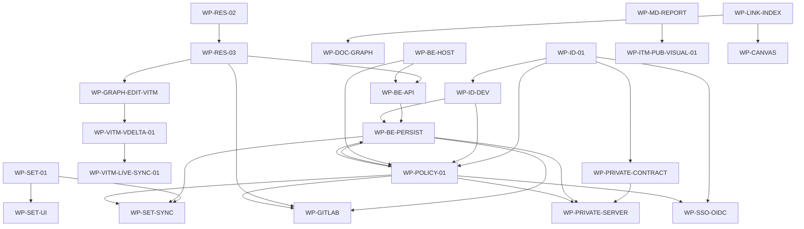

# Dependency Map Next

> Generated from `roadmap-state.yaml`. Do not edit manually.

```mermaid
graph TD
  WP_RES_02["WP-RES-02"] --> WP_RES_03["WP-RES-03"]
  WP_LINK_INDEX["WP-LINK-INDEX"] --> WP_DOC_GRAPH["WP-DOC-GRAPH"]
  WP_ID_01["WP-ID-01"] --> WP_ID_DEV["WP-ID-DEV"]
  WP_ID_01["WP-ID-01"] --> WP_POLICY_01["WP-POLICY-01"]
  WP_ID_DEV["WP-ID-DEV"] --> WP_POLICY_01["WP-POLICY-01"]
  WP_BE_HOST["WP-BE-HOST"] --> WP_POLICY_01["WP-POLICY-01"]
  WP_BE_PERSIST["WP-BE-PERSIST"] --> WP_POLICY_01["WP-POLICY-01"]
  WP_ID_01["WP-ID-01"] --> WP_SSO_OIDC["WP-SSO-OIDC"]
  WP_POLICY_01["WP-POLICY-01"] --> WP_SSO_OIDC["WP-SSO-OIDC"]
  WP_MD_REPORT["WP-MD-REPORT"] --> WP_ITM_PUB_VISUAL_01["WP-ITM-PUB-VISUAL-01"]
  WP_GRAPH_EDIT_VITM["WP-GRAPH-EDIT-VITM"] --> WP_VITM_VDELTA_01["WP-VITM-VDELTA-01"]
  WP_VITM_VDELTA_01["WP-VITM-VDELTA-01"] --> WP_VITM_LIVE_SYNC_01["WP-VITM-LIVE-SYNC-01"]
  WP_RES_03["WP-RES-03"] --> WP_GRAPH_EDIT_VITM["WP-GRAPH-EDIT-VITM"]
  WP_SET_01["WP-SET-01"] --> WP_SET_UI["WP-SET-UI"]
  WP_LINK_INDEX["WP-LINK-INDEX"] --> WP_CANVAS["WP-CANVAS"]
  WP_ID_01["WP-ID-01"] --> WP_PRIVATE_CONTRACT["WP-PRIVATE-CONTRACT"]
  WP_RES_03["WP-RES-03"] --> WP_BE_API["WP-BE-API"]
  WP_BE_HOST["WP-BE-HOST"] --> WP_BE_API["WP-BE-API"]
  WP_BE_API["WP-BE-API"] --> WP_BE_PERSIST["WP-BE-PERSIST"]
  WP_ID_DEV["WP-ID-DEV"] --> WP_BE_PERSIST["WP-BE-PERSIST"]
  WP_POLICY_01["WP-POLICY-01"] --> WP_BE_PERSIST["WP-BE-PERSIST"]
  WP_PRIVATE_CONTRACT["WP-PRIVATE-CONTRACT"] --> WP_PRIVATE_SERVER["WP-PRIVATE-SERVER"]
  WP_BE_PERSIST["WP-BE-PERSIST"] --> WP_PRIVATE_SERVER["WP-PRIVATE-SERVER"]
  WP_POLICY_01["WP-POLICY-01"] --> WP_PRIVATE_SERVER["WP-PRIVATE-SERVER"]
  WP_SET_01["WP-SET-01"] --> WP_SET_SYNC["WP-SET-SYNC"]
  WP_BE_PERSIST["WP-BE-PERSIST"] --> WP_SET_SYNC["WP-SET-SYNC"]
  WP_POLICY_01["WP-POLICY-01"] --> WP_SET_SYNC["WP-SET-SYNC"]
  WP_BE_PERSIST["WP-BE-PERSIST"] --> WP_GITLAB["WP-GITLAB"]
  WP_RES_03["WP-RES-03"] --> WP_GITLAB["WP-GITLAB"]
  WP_POLICY_01["WP-POLICY-01"] --> WP_GITLAB["WP-GITLAB"]
```
