# V18 Workpackage Dependency Map

```mermaid
flowchart TD
  F[Foundation history\nPhases -1 to 4.1] --> WP05A[WP-05A\nContribution manifest and registry]
  WP05A --> WP05B[WP-05B\nCapability activation and resolver context]
  WP05B --> WP05C[WP-05C\nContribution execution integration]
  WP05B --> WP05D[WP-05D\nMinimal package/capability inspector]
  F --> SET01[WP-SET-01\nUser settings core]
  F --> ITM01[WP-ITM-01\nITM parser/model foundation]
  WP05C --> LUA[WP-LUA\nLua automation]

  F --> RES01[WP-RES-01\nProvider-aware resource descriptors]
  RES01 --> RES02[WP-RES-02\nRevisions/conflict diagnostics]
  RES02 --> RES03[WP-RES-03\nChangesets/provider allowlists]
  RES01 --> REPO01[WP-REPO-01\nRepository/include resolver]
  ITM01 --> ITM02[WP-ITM-02\nITM directives/packages/validation]
  ITM01 --> REPO01
  REPO01 --> MDREPORT[WP-MD-REPORT\nMarkdown + ITM reports]

  F --> ID01[WP-ID-01\nIdentity contract]
  ID01 --> IDDEV[WP-ID-DEV\nDevelopment identity fixture]
  IDDEV --> POLICY[WP-POLICY-01\nProvider-neutral policy engine]
  RES03 --> BEAPI[WP-BE-API\nBackend API contract/provider]
  BEHOST[WP-BE-HOST\nEnterprise container/app host] --> BEAPI
  BEAPI --> BEPERSIST[WP-BE-PERSIST\nReference persistence server]
  POLICY --> BEPERSIST

  POLICY --> SSOENTRA[WP-SSO-ENTRA\nMicrosoft Entra adapter]
  POLICY --> SSOOIDC[WP-SSO-OIDC\nGeneric OIDC/Keycloak adapter]
  POLICY --> SSOSAML[WP-SSO-SAML\nSAML adapter]

  BEPERSIST --> PRIVATE[WP-PRIVATE-SERVER\nPrivate/group spaces]
  BEPERSIST --> SETSYNC[WP-SET-SYNC\nRoaming settings]
  BEPERSIST --> GITLAB[WP-GITLAB\nGitLab adapter]
  BEPERSIST --> SERVICESBE[WP-SERVICES-BE\nBackend service folders]
  BEPERSIST --> LEASES[WP-COLLAB-LEASES\nAdvisory leases]
  BEPERSIST --> AIMED[WP-AI-MEDIATOR\nAI mediator]
  AIMED --> AICHAT[WP-AI-CHAT\nAI chat surface]
  AICHAT --> AIPREF[WP-AI-PREF\nAI settings]

  ITM02 --> BPMNSEM[WP-BPMN-SEM\nBPMN semantic profile]
  BPMNSEM --> BPMNVIS[WP-BPMN-VISUAL\nBPMN visual surface]
  ITM02 --> ARCHSEM[WP-ARCHIMATE-SEM\nArchiMate semantic profile]
  ARCHSEM --> ARCHVIS[WP-ARCHIMATE-VISUAL\nArchiMate visual investigation]
  ITM01 --> TABLES[WP-TABLES\nTables/catalogues/matrices]
  ITM01 --> ITMVIS[WP-ITM-VISUALS\nITM visual projections]
  WP05C --> ITMVIS
  ITMVIS --> GRAPHEDIT[WP-GRAPH-EDIT\nControlled visual write-back]
  GRAPHEDIT --> PIPEEDITOR[WP-PIPELINE-EDITOR\nPipeline/diagram editor surfaces]
  WP05C --> PIPEEDITOR

  MDREPORT --> PDFEXPORT[WP-PDF-EXPORT\nPDF generation/export]
  PDFEXPORT --> PDFANN[WP-PDF-ANNOTATE\nPDF annotation]
  RES01 --> SKETCH[WP-SKETCH\nSketch/annotation resources]
  SKETCH --> PDFANN

  WP05A --> RELEASE[WP-RELEASE-GATE\nRecurring release/accreditation gate]
  RES03 --> RELEASE
  BEPERSIST --> RELEASE
  MDREPORT --> RELEASE

  classDef done fill:#2e7d32,stroke:#1b5e20,color:#ffffff,stroke-width:2px;
  classDef startable fill:#1565c0,stroke:#0d47a1,color:#ffffff,stroke-width:2px;

  class F,WP05A,WP05B,WP05C done;
  class WP05D,SET01,RES01,ID01,ITM01 startable;

  linkStyle 3 stroke:#1565c0,stroke-width:2px;
  linkStyle 4 stroke:#1565c0,stroke-width:2px;
  linkStyle 5 stroke:#1565c0,stroke-width:2px;
  linkStyle 7 stroke:#1565c0,stroke-width:2px;
  linkStyle 14 stroke:#1565c0,stroke-width:2px;
```

## Reading rule

The graph shows dependency direction only. It is not a mandatory calendar sequence. Optional adapters should be scheduled only when a release profile needs them.

## Status coloring guidance

- Green nodes are completed or validated workpackages in the current roadmap baseline.
- Blue nodes can be started now according to current status/dependency posture.
- Blue edges indicate a direct dependency path from completed work to a startable node.
- Nodes without explicit styling are not currently startable or not yet marked as completed.
