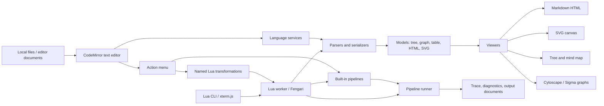
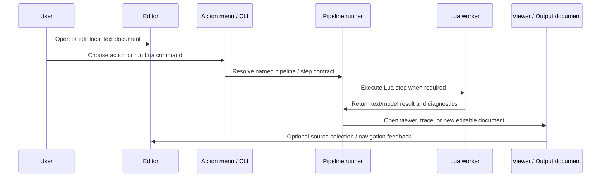

# TextForge Executive Summary

## Purpose and positioning

TextForge is a local-first, text-first workbench for editing, visualising, and transforming structured text. It is designed for users who want the flexibility of plain text, the clarity of visual diagrams, and the repeatability of programmable data transformations without introducing a server, cloud service, or network dependency.

The application focuses on a deliberately constrained but powerful domain: Markdown, indented trees, graphs, diagrams, tables, and structured text pipelines. It treats text as the primary source of truth. Visualisations, rendered documents, graph views, SVG outputs, and transformed documents are derived from source text and can be regenerated at any time. This keeps the editing model simple, auditable, and portable: the user owns files, understands the source format, and can move content between tools without being locked into a proprietary workspace.

TextForge is not a general IDE and not a full modelling repository. It is a lightweight client-side workbench for document-centric thinking: notes, specifications, diagrams, lightweight models, graph-shaped knowledge, Markdown publications, and repeatable transformations between text formats. It is especially suited to users who work with technical documentation, architecture notes, requirement structures, Mermaid/Graphviz diagrams, ITM models, tables, and local analysis workflows.

## What the application does

At its core, TextForge provides a multi-document editor with a set of local actions that can parse, transform, preview, visualise, and export the active document. Documents can be opened from local files or drag-and-drop, edited in CodeMirror, assigned a language, and acted on through a consistent action menu. Each open document receives a compact one-layer Shapez-style identity badge, making it easier to distinguish files across editor tabs, viewer popups, and transformation traces.

The application supports text editing for Markdown, ITM, Lua, JSON, XML, BPMN 2.0 XML, CSV/TSV, Mermaid, Graphviz DOT, JavaScript, Python, and other structured text languages. CodeMirror provides syntax-aware editing, and ITM has dedicated support for indentation, directives, styles, views, ids, links, tags, and attributes. Lua is also a first-class editable language, because user transformations are written as Lua scripts rather than uploaded JavaScript plugins.

TextForge includes viewers for rendered Markdown HTML, SVG, trees, mind maps, tables, BPMN diagrams, Cytoscape graphs, Sigma/Graphology graphs, and highlighted source. Markdown rendering supports diagrams and technical writing features, including inline or fenced Mermaid, Graphviz, and KaTeX blocks. Viewer popups can be searched, zoomed, refreshed, exported, detached into snapshot windows, and arranged with built-in layout controls. The SVG viewer behaves like an infinite canvas, matching the graph viewers' pan/zoom style rather than acting as a static image pane.

Transformation workflows are handled through pipelines. A pipeline takes a document or model as input, applies one or more named steps, and produces text, a model, HTML, SVG, BPMN, or a viewer result. Standard pipelines are shipped with the application, while user-defined transformations are written in Lua. Stored Lua transformations can be named and surfaced transparently in the same action menu as built-in actions. The user can also run immediate Lua commands through an embedded CLI powered by xterm.js, allowing quick experiments, manual downselection, and ad-hoc composition of multiple transformation steps.

## Fundamental design choices

The first fundamental choice is that **text remains the source of truth**. The editor does not hide the underlying document behind a proprietary object database. A graph, tree, mind map, diagram, or rendered HTML page is a view of text, not a replacement for it. This makes TextForge suitable for version control, file exchange, plain-text backup, and inspection by external tools.

The second choice is that **all execution is local**. TextForge runs fully in the browser or browser-extension context, with no back-end and no network activity. This is a security and trust decision as much as an architectural one. Users can work with sensitive documents without sending content to a server. The application may use bundled dependencies such as Mermaid, Graphviz/Viz.js, Cytoscape, Sigma, markdown-it, KaTeX, and Fengari, but these are shipped with the application and executed locally.

The third choice is that **user extensibility is sandboxed through Lua, not uploaded JavaScript**. The internal codebase can still use modular JavaScript plugins for lazy loading and maintainability, but that mechanism is not the user-facing extension model. User scripts run in a dedicated Lua worker, using a fresh Lua state per stored pipeline execution. The Lua environment exposes curated TextForge services: parsers, serializers, current document access, model manipulation helpers, named pipeline steps, and console helpers. It does not expose unrestricted browser APIs.

The fourth choice is that **heavy parsing, rendering, and visualisation remain in trusted TypeScript/JavaScript code**. Lua is used for transformation logic, orchestration, filtering, mapping, and domain-specific scripting. Expensive or security-sensitive capabilities such as parsing Markdown/ITM/Graphviz/Mermaid, rendering SVG, manipulating graph models, or opening editor documents are exposed through controlled host functions. This keeps Lua scripts expressive while preserving performance and architectural boundaries.

The fifth choice is that **pipelines are explicit and inspectable**. A transformation is not just a hidden button that changes text. It has named steps, input/output contracts, traceable intermediate values, diagnostics, and optional outputs that can be opened as documents. This makes the system suitable for iterative development and for explaining how a result was produced.

## High-level architecture

The application is divided into a trusted host layer and a user scripting layer. The trusted host layer contains the editor, workspace manager, language registry, built-in parsers, serializers, viewers, diagnostics service, internal plugin registry, and pipeline runner. This layer is implemented in TypeScript/JavaScript and bundled with the application.

The user scripting layer is implemented with Lua through Fengari. Lua scripts run in a worker to avoid blocking the UI. Each stored transformation pipeline receives a fresh Lua state to avoid accidental cross-run contamination. The host replaces Lua's normal `require` and `package` mechanisms with a local in-memory module registry that preserves the familiar Lua module contract as much as possible while preventing network or filesystem access. Curated Lua libraries are shipped with the application and can be imported by user scripts. The runtime also enforces limits for wall time, instruction count, output volume, recursion depth, and generated model/table size.

## User workflow

A typical user starts by opening one or more local files. The editor infers or allows selection of the language, and the action menu shows the transformations and viewers available for that document type. For Markdown, the user can render a rich HTML preview with diagrams and KaTeX. For ITM, the user can view the document as a tree, mind map, Cytoscape graph, Sigma graph, or editor skeleton surface. For Mermaid and Graphviz, the user can render SVG or convert between intermediate text/model forms. For JSON, XML, CSV, and BPMN, the user can open built-in tree, table, BPMN, or SVG views without leaving the main workbench model.

For more advanced work, the user writes Lua scripts. A Lua script can parse the active document, inspect tables or graph metadata, filter nodes and edges, invoke built-in transformation steps by name, compose multiple steps manually, and open the final output as a new document. Stored scripts can be registered as named actions so they appear alongside built-in pipelines. Immediate Lua commands can be run from the CLI for quick experiments or one-off transformations.

The result is a practical workflow for text-centric modelling: source text is edited directly; structured models are generated on demand; visualisations help the user understand and navigate the content; Lua scripts provide repeatable transformations; and outputs can always be inspected, exported, or opened back into the editor.

## Motivation and benefits

TextForge is motivated by a gap between plain text editors, Markdown previewers, diagram tools, and modelling repositories. Plain text editors are portable but usually lack integrated visualisation and transformation. Diagram tools are visual but often lock the user into a canvas or proprietary format. Modelling repositories are powerful but heavy, server-oriented, and difficult to adapt for small local workflows. TextForge aims to occupy the middle ground: local, transparent, programmable, visual, and file-based.

The local-only model is particularly important. It keeps the application suitable for sensitive content, disconnected work, browser-extension deployment, and environments where server-side installation is not possible. It also simplifies operational ownership: the application is a static bundle, not a service.

The Lua pivot improves the security and usability of extensibility. Uploaded JavaScript plugins are powerful but difficult to sandbox safely because JavaScript is the browser's native execution language. Lua provides a smaller interpreted environment where TextForge can decide exactly which host functions exist. This allows users to customise pipelines without giving them unrestricted access to the browser runtime.

The visualisation layer makes structured text approachable. Markdown becomes a rich technical document format with diagrams and math. ITM becomes a lightweight model-first text authoring format. Mermaid and Graphviz become interchangeable rendering targets. Tables can be inspected and transformed. Graphs can be explored interactively through Cytoscape and Sigma. The same source can support multiple projections, views, and outputs.

## Operating principles

TextForge should remain compact, understandable, and conservative in what it exposes. New capabilities should reinforce the core model rather than turn the application into a generic browser IDE. In particular:

- text remains primary;
- every transformation should be traceable;
- user scripts run in Lua, not arbitrary JavaScript;
- execution is local and worker-isolated;
- bundled examples and documentation are available inside the app;
- automated and manual regression tests protect the supported workflows;
- future visual editing features are tracked explicitly rather than added opportunistically.

The long-term direction is a reliable local workbench for structured text and lightweight visual modelling. It should feel simple for normal document editing, powerful for technical users who need transformations, and safe enough to run entirely offline with no back-end and no network activity.
