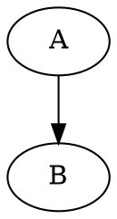

# TextForge Lua Pivot Whitepaper — Updated Implementation Guidance

## Local-only text-first editor with visualization and safe Lua transformation scripting

**Target app focus**

TextForge should be positioned and implemented as:

> A text-first editor with visualization for specifically Markdown, trees and graphs, and data transformation in Lua using embedded libraries, all running locally on the client, with no back-end or network activity whatsoever.

This whitepaper explains how to pivot from the current user-uploaded JavaScript plugin model to a safer Lua-based transformation model while preserving the existing internal plugin architecture for lazy loading, modularity, viewers, parsers, serializers, and pipelines.

---

## 1. Executive summary

The current TextForge architecture already has the right internal shape: languages, transformers, viewers, editors, linters, and pipelines are registered as plugin contributions and lazy-loaded as needed. That architecture should stay.

The pivot is not to remove plugins internally. The pivot is to stop exposing JavaScript plugin upload as the user extension mechanism.

Instead:

- TextForge keeps internal TypeScript/JavaScript plugins as trusted application modules.
- Users upload, write, edit, and run Lua scripts/snippets.
- Lua scripts operate on text, ASTs, tree models, graph models, table models, and diagnostics through a narrow host API.
- Built-in JavaScript parsers and serializers remain responsible for parsing and rendering.
- Lua is used for transformation logic, automation, and composition of pipelines.
- Curated Lua libraries are bundled with the application and imported by user scripts through an in-memory module system.
- A Lua Console / command-line popup allows quick interactive commands and manual pipeline execution.
- No user-provided JavaScript is executed.
- No back-end, network calls, remote imports, telemetry, or server-side processing are allowed.

This gives the application a strong security boundary while retaining user-programmable data transformation.

---

## 2. Current baseline to preserve

### 2.1 Existing dependency and module base

The current project is a Vite/Preact/TypeScript application with dependencies including CodeMirror, markdown-it, Mermaid, Viz.js, Cytoscape, Graphology, jsMind, Sigma, and internal viewer/parser plugins.

The existing dependency base already includes:

- `markdown-it`
- `mermaid`
- `@viz-js/viz`
- `cytoscape`
- `graphology`
- `jsmind`
- `sigma`
- CodeMirror language packages

Source reference: `package.json` in `NevynIt/TextForge`.

### 2.2 Existing internal plugin model

The internal plugin registry already supports:

- `transformer`
- `viewer`
- `editor`
- `linter`
- pipeline contributions
- lazy manifest loading
- contribution ID resolution
- pipeline lookup per language

This should remain the internal modularity mechanism.

The user-facing plugin upload should be replaced or hidden, but the internal registry should continue to coordinate trusted application modules.

### 2.3 Current user-uploaded JavaScript risk

Current custom plugins are self-contained JavaScript files that call `registerTextForgePlugin(plugin)`. This is convenient, but it means user-provided JavaScript executes in the browser application context.

That is exactly the capability to remove from the user-facing extension model.

The current upload machinery may be retained temporarily for developer builds, but it should be disabled or hidden in production/user builds.

---

## 3. Target architecture

### 3.1 Trusted layers

TextForge should be split conceptually into five layers.

```text
Application shell
  CodeMirror editor
  popups
  workspace
  command routing
  local storage

Trusted internal plugins
  parsers
  serializers
  viewers
  linters
  built-in pipeline contributions

Lua runtime service
  Fengari state creation
  worker isolation
  instruction/time limits
  in-memory module loader
  marshaling JS <-> Lua
  host API whitelist

Lua script registry and console
  saved user transforms
  named Lua actions
  quick command execution
  manual pipeline composition
  uploaded script execution

User Lua scripts/snippets
  transformation logic only
  no browser access
  no network
  no DOM
  no eval
  no JS global object
```

The trusted internal plugin system remains an implementation detail. The user sees:

- built-in actions,
- built-in viewers,
- bundled examples,
- Lua scripts/snippets,
- Lua libraries,
- a Lua Console for immediate commands and manual pipeline execution.

### 3.2 Main data flow

```text
source text
  -> trusted JS parser
  -> AST / TreeModel / GraphModel / TableModel
  -> Lua transformation script
  -> validated model or text output
  -> trusted JS serializer
  -> editable text document or viewer result
```

Lua should not parse complex formats itself unless a bundled Lua library is specifically designed for that purpose. The default rule is:

- JavaScript parses and serializes.
- Lua transforms and composes.
- JavaScript validates and renders.

### 3.3 Example transformation flow

```text
Markdown document
  -> trusted markdown parser creates Markdown AST / outline / embedded diagram list
  -> Lua script filters headings and generates a graph model
  -> trusted JS serializer emits ITT, Mermaid, Graphviz DOT, JSON, or a viewer model
  -> editor opens the result as a new editable document
```

### 3.4 Lua Console / immediate command UI

Add a popup that behaves like a local command-line interface for the Lua interpreter.

Suggested name:

```text
Lua Console
```

Purpose:

- run quick Lua commands against the active document;
- run the current `.lua` document;
- run a selected block of Lua from the editor;
- run a saved Lua transform by name;
- call built-in transformation steps by name;
- manually downselect, inspect, or apply a more complex pipeline;
- print intermediate models and diagnostics;
- open a result as a new editor document.

This is not a system shell. It is an in-app Lua command surface backed by the same sandboxed Lua runtime as stored transformation pipelines.

Example console commands:

```lua
local itt = input:parse_itt()
print(#itt.nodes)
```

```lua
local graph = tf.pipeline.run("itt-to-graph", input)
return tf.pipeline.run("open-as-document", tf.emit_json(graph))
```

```lua
return tf.actions.run("Normalize ITT ids", input)
```

Console features:

- command history;
- clear output;
- run active document;
- run selected editor text;
- run saved script;
- inspect current pipeline value;
- copy output;
- open returned text/model serialization as a new document.

Execution must still happen inside the Lua worker and must use the same instruction and time limits.

### 3.5 Frontend Lua CLI

The frontend Lua CLI should use **xterm.js** as its terminal UI component rather than implementing a custom console. xterm.js is a mature browser terminal component used by tools such as VS Code, and provides the required terminal behaviours out of the box: keyboard input, scrollback, ANSI output, theming, Unicode/IME support, resizing, and optional addons such as fit and search. The recommended dependencies are `@xterm/xterm`, `@xterm/addon-fit`, and `@xterm/addon-search`.

xterm.js should be treated only as the UI surface, not as a bridge to a real shell. TextForge should not use `node-pty`, websocket attach mechanisms, server-backed shells, or any network-connected terminal backend. Instead, CLI input should be parsed by a small local TextForge command dispatcher, which sends execution requests to the Lua worker. The Lua worker then runs immediate commands, stored scripts, or named transformation pipelines, and streams textual output back to xterm.js.

The CLI should expose the same conceptual operations as the normal action menu. For example, the user should be able to run quick Lua expressions, invoke a stored Lua script by name, call a named transformation step, compose several steps manually, and open the resulting text/model output as a new editor document. Example commands could include `run("itt-to-graph")`, `run_script("Downselect Requirements")`, `pipeline("parse-itt", "filter:risks", "to-mermaid")`, and `open(run("markdown-to-html"))`.

jQuery Terminal is a possible alternative because it is designed for building command-line interpreters in web applications and includes command history, tab completion, nested command trees, shortcuts, and exception display. However, xterm.js is the preferred option for TextForge because it avoids introducing jQuery into the Preact/Vite codebase and better matches the desired terminal-like interaction model while keeping execution fully local, sandboxed, and worker-isolated.


---

## 4. Dependencies to add

### 4.1 Required Lua dependency

Add Fengari as the Lua runtime:

```bash
npm install fengari
```

Recommended package entry:

```json
"dependencies": {
  "fengari": "^0.x"
}
```

Use the actual current version selected by `npm install` and commit the lockfile.

Fengari is appropriate because it is a Lua VM written in JavaScript ES6 for Node and the browser. It includes a Lua parser, virtual machine, and base libraries, and implements Lua 5.3 semantics.

### 4.2 Dependency to avoid by default

Do **not** expose `fengari-interop` to user Lua scripts by default.

`fengari-interop` is useful for JS/Lua bridging, but its purpose is broad interop, including calling JavaScript functions from Lua and exposing JavaScript objects to Lua. That is too permissive for the security goal.

If `fengari-interop` is ever added, it should be used only internally, and only behind a restricted adapter that exposes curated functions. The user should never receive `js.global`, `window`, `document`, `fetch`, `XMLHttpRequest`, `localStorage`, or arbitrary object access.

### 4.3 CodeMirror Lua language support

Add Lua as a first-class editor language.

Recommended dependency:

```bash
npm install @codemirror/legacy-modes
```

Then register Lua through the legacy stream language mode, unless a better maintained native CodeMirror 6 Lua language package is selected later.

Implementation sketch:

```ts
import { StreamLanguage } from "@codemirror/language";
import { lua } from "@codemirror/legacy-modes/mode/lua";

const luaLanguage = StreamLanguage.define(lua);
```

Register language metadata:

```ts
{
  id: "text.lua",
  name: "Lua",
  parentId: "text.plain",
  extensions: [".lua"],
  mediaType: "text/x-lua"
}
```

Add Lua support to:

- language registry;
- file extension detection;
- syntax highlighting viewer;
- examples resource browser;
- Lua Script Manager.

### 4.4 Markdown rendering enhancement dependencies

For the Markdown HTML viewer improvements, focus on KaTeX for LaTeX/math support.

Recommended dependencies:

```bash
npm install katex highlight.js dompurify
```

Rationale:

- `katex`: local, fast math rendering for inline and block math.
- `highlight.js`: broad syntax highlighting for Markdown code blocks.
- `dompurify`: optional/surgical sanitization for untrusted raw HTML in Markdown, not a blanket sanitizer for every internal model/output.

Do not prioritize MathJax initially. Full LaTeX document rendering, TikZ, or other non-KaTeX LaTeX extensions are out of scope for the first implementation pass.

### 4.5 Optional future dependency for compressed bundled docs/examples

If bundled documentation/examples become large, consider:

```bash
npm install fflate
```

Use compression only for docs/examples/resource packs, not for core application data models or normal workspace content.

Prefer first:

- lazy chunks with `import.meta.glob`,
- separate resource modules,
- compression only for large example/documentation packs.

Do not add compression prematurely.

---

## 5. Lua runtime service

Create a new trusted internal module set:

```text
src/lua/luaRuntime.ts
src/lua/luaBridge.ts
src/lua/luaModules.ts
src/lua/luaTransformService.ts
src/lua/luaScriptRegistry.ts
src/lua/luaActionRegistry.ts
src/lua/luaConsoleService.ts
src/lua/luaWorker.ts
src/lua/libs/*.lua
```

### 5.1 Worker isolation

Lua execution must happen in a dedicated Web Worker.

Reasons:

- infinite loops must not block the UI;
- expensive transformations must not freeze CodeMirror or viewers;
- worker termination provides a hard timeout fallback;
- the Lua runtime can be initialized and discarded independently from the application shell.

Recommended execution pattern:

```text
main thread
  -> sends LuaRunRequest to worker
  -> starts wall-clock timeout
  -> receives LuaRunResult or LuaRunError
  -> terminates worker on hard timeout
```

Worker policy:

- no network APIs exposed through the Lua bridge;
- no user-controlled dynamic import;
- no browser DOM access;
- no shared mutable JS application objects passed into Lua;
- all inputs copied/serialized across the worker boundary.

### 5.2 Runtime creation

Create a fresh Lua state per run of stored transformation pipelines.

Default policy:

```text
one Lua worker run request
  -> create fresh Lua state
  -> load selected standard libraries
  -> install TextForge require/package replacement
  -> install TextForge host API
  -> load bundled module registry
  -> run script
  -> validate result
  -> return result
  -> discard state
```

This should be true for saved transformations exposed in the action menu.

For the Lua Console, each command may also use a fresh state by default. Later, an explicit “session mode” may be added, but the first implementation should favor predictable isolation over stateful convenience.

### 5.3 Standard libraries

Do not call `luaL_openlibs` blindly.

Open only safe libraries:

- base, but remove dangerous functions if present;
- string;
- table;
- math;
- utf8;
- coroutine only if needed.

Avoid or disable:

- `io`
- `os`
- default `package` searchers
- `debug` library exposed to user code
- `loadfile`
- `dofile`
- unrestricted `load` if bytecode/string compilation policy is strict

Important: Fengari’s browser `require`/`package` behavior can try synchronous XHR. That is incompatible with the no-network design.

Therefore, replace `require` and `package` with TextForge-controlled equivalents that preserve as much of the Lua contract as practical while resolving only in-memory bundled modules and stored user Lua modules.

### 5.4 Replacement `require` / `package` contract

Implement a custom Lua module system with familiar Lua behavior.

Expose:

```lua
require(name)
package.loaded
package.preload
package.searchers
package.path
package.config
```

But constrain them:

- `package.path` is informational or limited to virtual module names;
- `package.searchers` contains only TextForge in-memory searchers;
- no filesystem searcher;
- no XHR/network searcher;
- no JS dynamic import searcher;
- no native library loader;
- no `package.loadlib`.

Expected behavior:

```lua
local tree = require "tf.tree"
```

Resolution order:

1. `package.loaded[name]` if already loaded;
2. `package.preload[name]` for built-in and user-registered modules;
3. TextForge bundled library registry;
4. TextForge saved user library registry;
5. error with a Lua-like module-not-found message.

Error example:

```text
module 'socket' not found:
  no TextForge bundled module 'socket'
  no user Lua module 'socket'
```

This gives users familiar Lua module semantics without network or filesystem access.

### 5.5 Instruction and time limits

Lua scripts can still loop forever. Add two layers of protection:

1. **Instruction hook** using Fengari/Lua hook support.
2. **Worker hard timeout** where the main thread terminates the worker if the run exceeds the configured time.

Recommended defaults:

```text
maxInstructions: 1,000,000
maxWallTimeMs: 500
maxOutputBytes: 2 MB
maxModelNodes: 20,000
maxModelEdges: 50,000
maxTableCells: 500,000
maxRecursionDepth: 200
```

Expose these as internal constants first. Later, add advanced settings.

### 5.6 Error reporting

Lua errors should become TextForge diagnostics:

```ts
{
  source: "lua-runtime",
  severity: "error",
  message: "Lua error: ...",
  languageId: "text.lua",
  range: optionalSourceRange
}
```

Where possible, map Lua stack trace line numbers to the uploaded snippet/source document.

---

## 6. Lua module and action system

### 6.1 Embedded libraries

Bundle curated Lua libraries as raw text:

```text
src/lua/libs/tf/init.lua
src/lua/libs/tf/tree.lua
src/lua/libs/tf/graph.lua
src/lua/libs/tf/table.lua
src/lua/libs/tf/stringx.lua
src/lua/libs/tf/itt.lua
src/lua/libs/tf/markdown.lua
src/lua/libs/tf/pipeline.lua
src/lua/libs/tf/actions.lua
src/lua/libs/tf/console.lua
```

Load them through the custom module registry:

```ts
const modules = {
  "tf": rawTfInit,
  "tf.tree": rawTfTree,
  "tf.graph": rawTfGraph,
  "tf.table": rawTfTable,
  "tf.stringx": rawTfStringx,
  "tf.itt": rawTfItt,
  "tf.markdown": rawTfMarkdown,
  "tf.pipeline": rawTfPipeline,
  "tf.actions": rawTfActions,
  "tf.console": rawTfConsole
};
```

Install a Lua `require` that resolves only keys in this registry and in the user’s locally stored Lua module registry.

Unknown module behavior:

```text
error: module '<name>' is not bundled with TextForge and is not registered as a local user Lua module
```

Do not fall back to network, filesystem, XHR, dynamic import, or package paths.

### 6.2 User script model: named Lua actions

A user Lua file should be able to declare one or more named actions/functions. Those actions must appear to the user in the same action list that currently shows built-in transformation pipelines.

The key requirement is:

> User-provided Lua transforms should feel like normal TextForge actions, with a name, input contract, output contract, category, and optional description.

Do not rely primarily on YAML front matter. Instead, expose metadata as Lua objects created by the file. YAML-like comments may still be supported as a fallback for imported legacy snippets.

Preferred Lua format:

```lua
local tree = require "tf.tree"

return {
  actions = {
    {
      id = "uppercase-itt-labels",
      name = "Uppercase ITT labels",
      category = "Lua Transform",
      input = "text.indented-tree",
      output = "text.indented-tree",
      description = "Uppercases every node label and emits ITT.",
      run = function(input)
        local model = input:parse_itt()
        tree.walk(model, function(node)
          node.label = string.upper(node.label)
        end)
        return input:emit_itt(model)
      end
    }
  }
}
```

A single-file shortcut should also be supported:

```lua
return {
  id = "extract-headings-as-itt",
  name = "Extract headings as ITT",
  category = "Lua Transform",
  input = "text.markdown",
  output = "text.indented-tree",
  run = function(input)
    local md = input:parse_markdown()
    local tree = require("tf.markdown").headings_to_tree(md)
    return input:emit_itt(tree)
  end
}
```

For very small snippets, support a returned function or global `transform(input)` only as a fallback:

```lua
return function(input)
  return input:emit_text("text.plain", string.upper(input.text))
end
```

Fallback metadata if omitted:

```text
name: file base name
id: sanitized file base name
input: text.*
output: text.plain
category: Lua Transform
description: empty
```

### 6.3 Lua actions in the normal action list

Saved Lua actions should be materialized as synthetic action/pipeline contributions at runtime.

Suggested internal type:

```ts
interface LuaActionDefinition {
  id: string;
  name: string;
  input: string | string[];
  output: string;
  category: string;
  description?: string;
  sourceDocumentId?: string;
  sourceFileName?: string;
  moduleName?: string;
  actionName?: string;
  source: string;
}
```

The action dropdown should show:

```text
Lua: Extract headings as ITT
Lua: Convert table to graph
Lua: Normalize ITT ids
```

The user should not need to understand that these are synthetic contributions. They should behave like built-in actions.

### 6.4 Lua can call actions and pipeline steps by name

Lua should be able to call existing transformation steps and user Lua actions by name, while respecting input/output type contracts.

This is needed for manual composition and complex workflows.

Suggested Lua API:

```lua
local pipeline = require "tf.pipeline"
local actions = require "tf.actions"

local treeValue = pipeline.run("itt-to-tree", input)
local graphValue = pipeline.run("itt-to-graph", treeValue)
local filtered = actions.run("Filter graph to selected tags", graphValue)
return pipeline.run("graph-to-json", filtered)
```

Important rules:

- `pipeline.run(stepOrPipelineId, value)` may call built-in trusted transformations or registered Lua actions.
- The runtime must verify that the provided value type matches the step’s declared input contract.
- The runtime must verify that the returned value matches the declared output contract.
- Calls must remain local to the worker/request.
- Recursive calls must be limited to avoid infinite pipelines.
- A Lua action should be able to call another Lua action, but recursion depth and instruction limits still apply.

This is essentially the programmatic version of the normal TextForge action menu.

### 6.5 Script registration workflow

User-facing workflow:

1. User opens or creates a `.lua` file.
2. User clicks `Register Lua Action(s)`.
3. TextForge executes only the metadata/declaration extraction in a safe Lua state.
4. TextForge validates action definitions.
5. Valid actions appear in the action dropdown for matching languages.
6. User runs the action like any built-in transform.

If a Lua file returns multiple actions, all should be listed.

### 6.6 Lua Console workflow

The Lua Console should be able to run:

- one-line commands;
- multi-line snippets;
- current Lua document;
- selected Lua text;
- named Lua action;
- named built-in pipeline step;
- named composed pipeline.

The console should expose the active editor document as `input`.

Example:

```lua
local g = input:parse_itt():to_graph()
print("nodes", #g.nodes)
return input:emit_json(g)
```

If the command returns a `PipelineValue`, the console should offer:

- preview result;
- open as new document;
- continue pipeline;
- copy JSON/debug representation.

---

## 7. Host API exposed to Lua

### 7.1 Principle

Expose capabilities, not objects.

Do not expose raw JS objects. Expose small functions and immutable or copied data tables.

### 7.2 Suggested Lua API

```lua
input.text              -- source text if available
input.languageId        -- source language id
input.fileName          -- source file name
input.documentId        -- opaque id

input:parse_itt()       -- returns tree model table
input:parse_markdown()  -- returns markdown AST or outline model
input:parse_mermaid()   -- returns diagram model where supported
input:parse_dot()       -- returns graph model
input:parse_csv()       -- returns table model

input:emit_text(languageId, text)
input:emit_itt(tree)
input:emit_markdown(astOrText)
input:emit_mermaid(graphOrTree)
input:emit_dot(graph)
input:emit_json(value)
input:emit_graph(graph)
input:emit_tree(tree)
input:diagnostic(severity, message, range)
```

Pipeline/action access:

```lua
tf.pipeline.run(id, value)
tf.actions.run(nameOrId, value)
tf.actions.list()
tf.pipeline.list()
```

Console-specific helpers:

```lua
print(...)
tf.console.inspect(value)
tf.console.open(value, optionalFileName)
```

### 7.3 Parser and serializer bridge

Host functions should call existing trusted JS modules:

```text
parseIndentedTree
indentedTreeToGraph
parseDelimited
markdown parser
Mermaid parser/renderer
Graphviz parser/renderer
serializers for ITT, Markdown, Mermaid, DOT, JSON
```

The JS side owns format correctness. Lua receives plain data tables.

### 7.4 Validation after Lua returns

Every Lua return value must be validated before use.

Validation should check:

- allowed `kind`,
- valid `languageId`,
- maximum output size,
- tree node shape,
- graph node/edge shape,
- table shape,
- no cycles in tree models,
- edge endpoints resolve,
- no functions/userdata returned,
- no prototype-like keys when converted back to JS,
- diagnostics shape,
- declared output type matches actual output type.

Invalid returns should become diagnostics and pipeline failure messages, not application crashes.

---

## 8. Pipeline integration

### 8.1 Keep internal pipelines

Trusted internal plugins should continue to define pipelines such as:

```text
ITT -> Tree Viewer
ITT -> Cytoscape Graph Viewer
Markdown -> HTML Viewer
Mermaid -> SVG Viewer
Graphviz DOT -> SVG Viewer
```

### 8.2 Add Lua action contributions internally

Create a trusted internal `lua-core` plugin that owns Lua execution and registers Lua-backed action contributions.

A single generic contribution is not enough for the UI, because each user script has its own name/input/output. Use a `LuaScriptRegistry` / `LuaActionRegistry` that converts saved Lua action definitions into runtime pipeline/action contributions.

Suggested shape:

```ts
interface LuaScriptDefinition {
  id: string;
  name: string;
  input: string | string[];
  output: string;
  category: string;
  source: string;
  fileName?: string;
  trustedLibraryIds?: string[];
}
```

The script registry exposes synthetic pipeline actions such as:

```text
Lua: Extract headings as ITT
Lua: Convert table to graph
Lua: Normalize ITT ids
```

### 8.3 Composed Lua pipelines

A Lua action may be a full pipeline orchestrator, not just a leaf transformer.

Example:

```lua
return {
  id = "markdown-to-filtered-graph-json",
  name = "Markdown headings to filtered graph JSON",
  input = "text.markdown",
  output = "text.json",
  category = "Lua Pipeline",
  run = function(input)
    local outline = tf.pipeline.run("markdown-to-outline", input)
    local graph = tf.pipeline.run("outline-to-graph", outline)
    local filtered = tf.actions.run("Keep only important nodes", graph)
    return tf.pipeline.run("graph-to-json", filtered)
  end
}
```

This requires a clear internal contract:

```ts
runPipelineStepOrAction(id: string, value: PipelineValue): Promise<PipelineValue>
```

The call dispatcher must enforce type compatibility and must prevent uncontrolled recursion.

### 8.4 Fresh Lua state per stored transformation pipeline

Stored transformation pipelines and saved Lua actions should run in a fresh Lua state each time.

Reasoning:

- predictable results;
- no hidden cross-run state;
- less memory leakage risk;
- easier security reasoning;
- easier timeout cleanup.

If caching is needed later, cache only trusted compiled/bundled module text or JS parser results, not user Lua state.

### 8.5 Open result as editable document

Add an official terminal action for conversion results:

```text
Open pipeline text result as new document
```

This is important for Lua transformations. Users expect transformed text to become editable, not only visible in a trace popup.

Implementation options:

1. Add a `kind: "document"` pipeline value.
2. Add a terminal result type: `{ kind: "open-document", languageId, text, fileName }`.
3. Add a built-in viewer/editor contribution that opens text results into a new document.

Recommended approach:

```ts
export type PipelineValue =
  | existing values
  | { kind: "document"; languageId: string; text: string; fileName?: string; diagnostics?: Diagnostic[] };
```

Then App handles `document` results by creating a new workspace document.

---

## 9. Security model

### 9.1 Non-negotiable constraints

The app must run locally on the client with:

- no back-end,
- no network calls,
- no remote imports,
- no telemetry,
- no uploaded JavaScript execution,
- no arbitrary browser API exposure to user code.

### 9.2 Browser security headers/build checks, including WASM

Keep or strengthen the existing security verification scripts.

Recommended CSP for hosted builds:

```text
default-src 'self';
script-src 'self';
worker-src 'self' blob:;
connect-src 'none';
img-src 'self' data: blob:;
style-src 'self' 'unsafe-inline';
font-src 'self' data:;
object-src 'none';
base-uri 'none';
form-action 'none';
```

However, TextForge currently uses Graphviz/Viz.js, which may require WebAssembly execution. Therefore, the CSP/build verification must explicitly test the actual built app and the actual browser targets.

If WASM requires `wasm-unsafe-eval` or equivalent in some environments, document the trade-off clearly:

```text
script-src 'self' 'wasm-unsafe-eval';
```

This is still different from allowing arbitrary JavaScript `eval` for user code. The requirement is:

- trusted bundled WASM may execute if needed for built-in features;
- user-provided JavaScript must not execute;
- Lua user code still runs through the interpreter in a worker;
- no network capability is exposed.

For a pure static local file build, CSP enforcement may vary by environment, so do not rely only on CSP. The Lua bridge itself must not expose network capabilities.

### 9.3 Remove or gate user JavaScript plugin upload

Production mode:

- hide “Upload plugin” from the plugin manager,
- replace it with “Open Lua script” / “Add Lua transform” / “Lua Console”,
- keep internal plugin manager only for loading/unloading trusted packaged modules if desired.

Developer mode:

- optional `ENABLE_JS_PLUGIN_UPLOAD=true`,
- explicit warning banner,
- not included in normal distribution.

### 9.4 No `fengari-interop` global access

Do not expose the `js` library to user scripts.

Do not allow:

```lua
local js = require "js"
js.global:fetch(...)
```

The only bridge should be the curated `tf` API.

### 9.5 URL and sanitization policy

Do not strip URLs from data models, table values, node metadata, edge metadata, Markdown content, or generated HTML simply because they are URLs.

TextForge is a text and data transformation editor. Many legitimate use cases require URLs:

- hyperlinks in Markdown;
- SVG namespace URLs;
- diagram metadata;
- graph node attributes;
- edge attributes;
- table cells;
- generated documentation;
- local object links or references.

The trusted TypeScript/JavaScript view layer is responsible for deciding how to render those values safely. Data should generally be preserved.

Therefore, do **not** apply DOMPurify or URL stripping indiscriminately at every pipeline step.

Recommended policy:

1. Preserve data values during parsing, Lua transformation, and serialization unless the target format explicitly requires escaping.
2. Escape text when inserting it into HTML text nodes or attributes.
3. Sanitize only user-authored raw HTML fragments that are inserted as HTML.
4. Treat trusted internally generated SVG/HTML differently from untrusted raw HTML blocks.
5. If DOMPurify is used for SVG, configure it deliberately to preserve required SVG namespaces and attributes.
6. Do not remove `xmlns="http://www.w3.org/2000/svg"`, `xlink`, viewBox, paths, or other required SVG structure.
7. Disable scripts and event-handler attributes in rendered HTML/SVG.
8. Do not auto-fetch external resources referenced by URLs.

DOMPurify still has a place, but it should be used surgically:

- raw HTML embedded in Markdown;
- imported HTML snippets;
- pasted/generated HTML if the source is not trusted;
- defensive cleanup before rendering into `innerHTML`.

DOMPurify should not be used as a generic transformation sanitizer for all text/model outputs.

---

## 10. Suggested file structure

```text
src/lua/
  luaRuntime.ts
  luaBridge.ts
  luaTransformService.ts
  luaScriptRegistry.ts
  luaActionRegistry.ts
  luaConsoleService.ts
  luaLimits.ts
  luaTypes.ts
  luaWorker.ts
  modules.ts
  libs/
    tf.lua
    tf_tree.lua
    tf_graph.lua
    tf_table.lua
    tf_stringx.lua
    tf_itt.lua
    tf_markdown.lua
    tf_pipeline.lua
    tf_actions.lua
    tf_console.lua

src/plugins/
  luaCore.ts

src/resources/
  docs/
    README.md
    lua-scripting.md
    lua-console.md
    examples.md
    manual-test-plan.md
    future-features.md
  examples/
    markdown-headings-to-itt.lua
    itt-normalize-ids.lua
    csv-to-graph.lua
    graph-filter.lua
    mermaid-to-itt.lua

src/components/
  ResourceBrowserPopup.tsx
  LuaScriptManagerPopup.tsx
  LuaConsolePopup.tsx
```

---

## 11. Migration plan

### Phase 1 — Preserve current behavior, add Lua foundation

- Add `fengari`.
- Add Lua CodeMirror support as `text.lua`.
- Add `luaWorker.ts` and worker-based execution.
- Add `luaRuntime.ts` with safe selected libraries.
- Add instruction/time limits.
- Replace default `require`/`package` with TextForge in-memory equivalents.
- Add simple Lua transform runner.
- Add one bundled example script.
- Add tests proving no network APIs are reachable from Lua.

### Phase 2 — Replace user plugin upload UI

- Hide JavaScript plugin upload in production.
- Add Lua Script Manager popup.
- Add Lua Console popup.
- Allow opening `.lua` files as normal text documents.
- Add “Register Lua Action(s)” action.
- Store Lua snippets/actions in local workspace settings/local storage.
- Show Lua transforms as normal actions in the action dropdown.

### Phase 3 — Expose parsers/serializers and action composition

- Expose ITT parse/emit.
- Expose Markdown outline/AST parse.
- Expose CSV parse/emit.
- Expose GraphModel utilities.
- Expose Mermaid/DOT conversion only through trusted JS functions.
- Allow Lua to call built-in transformation steps by ID/name.
- Allow Lua to call user Lua actions by ID/name.
- Enforce input/output contracts for all Lua-composed calls.

### Phase 4 — Bundle docs/examples

- Add Resource Browser popup.
- Bundle docs and examples.
- Use compression only for large docs/examples packs if needed.
- Allow opening a copy of any bundled resource in the editor.
- Add README and tutorial updates.
- Add manual test plan and procedure document.
- Add future features document.

### Phase 5 — Harden and polish

- Add output validation for all Lua return types.
- Add better diagnostics.
- Add source/view selection bridge.
- Add Markdown embedded diagram toolbar and SVG popout integration.
- Add viewer interaction improvements.
- Keep deferred items tracked in `future-features.md`.

---

# 12. Fixes and enhancements found during testing

The following items should be implemented alongside or immediately after the Lua pivot.

---

## 12.1 Markdown HTML fold/unfold is not actually hiding content

### Problem

Current behavior changes the heading icon and text color, but the section below remains visible.

### Likely cause

The HTML viewer enhances headings after injecting HTML. The fold state is probably only applied to the heading element, not to the sibling content nodes belonging to that section.

### Required behavior

When a heading is folded, all content after that heading must be hidden until the next heading of the same or higher level.

Example:

```html
<h2>A</h2>
<p>hide when A is folded</p>
<h3>A.1</h3>
<p>also hide when A is folded</p>
<h2>B</h2>
<p>not hidden when A is folded</p>
```

### Implementation guidance

Add a section collection function:

```ts
function headingSectionNodes(heading: HTMLElement): HTMLElement[] {
  const level = headingLevel(heading);
  const nodes: HTMLElement[] = [];
  let current = heading.nextElementSibling as HTMLElement | null;
  while (current) {
    if (isHeading(current) && headingLevel(current) <= level) {
      break;
    }
    nodes.push(current);
    current = current.nextElementSibling as HTMLElement | null;
  }
  return nodes;
}
```

On toggle:

```ts
function setHeadingCollapsed(heading: HTMLElement, collapsed: boolean): void {
  heading.dataset.collapsed = collapsed ? "true" : "false";
  heading.classList.toggle("html-heading-collapsed", collapsed);
  for (const node of headingSectionNodes(heading)) {
    node.hidden = collapsed;
    node.classList.toggle("html-section-hidden", collapsed);
  }
}
```

`Fold all` and `Unfold all` should call this on every enhanced heading.

### Acceptance criteria

- Clicking a heading folds/unfolds its section.
- Fold all hides all foldable content below headings.
- Unfold all restores all content.
- Search should either ignore hidden folded content or unfold the active match; choose one and document it.

---

## 12.2 Window layout hover menu disappears too quickly

### Problem

The window layout hover menu closes immediately on mouse leave, making it hard to use.

### Current implementation pattern

`WindowQuadrantMenu` uses immediate `onMouseLeave={() => setOpen(false)}`.

### Implementation guidance

Add a close delay.

```ts
const closeTimer = useRef<number | undefined>();

function openMenu(): void {
  window.clearTimeout(closeTimer.current);
  setOpen(true);
}

function scheduleClose(): void {
  window.clearTimeout(closeTimer.current);
  closeTimer.current = window.setTimeout(() => setOpen(false), 350);
}
```

Use:

```tsx
onMouseEnter={openMenu}
onMouseLeave={scheduleClose}
onFocusIn={openMenu}
onFocusOut={... scheduleClose ...}
```

Clear timer on unmount.

### Acceptance criteria

- Menu remains available long enough to move from button to panel.
- Menu still closes when pointer/focus leaves for about 300–400 ms.

---

## 12.3 ITT multiline directives should be generalized

### Problem

Multiline `%style` and `%view` directives break editor syntax highlighting, and multiline `%view` is not correctly parsed.

### Current issue

The parser has special handling for `%style` multiline blocks, `%include` single-line handling, and ignores unknown `%` directives. This is too narrow.

### Required behavior

All `%` directives may optionally end with a multiline `{ ... }` block.

Examples:

```itt
%style [risk] {
  fill: #ffe8e8;
  stroke: #cc3333;
}

%view risks {
  include: [risk]
  include: ->[mitigated-by]
  exclude: {status=closed}
}

%unknown custom-directive {
  anything: here
}
```

Unknown directives should be ignored semantically, but must be consumed correctly so their body is not parsed as tree nodes and does not break highlighting/folding.

### Implementation guidance

Replace style-specific block collection with generic directive collection:

```ts
interface IttDirectiveBlock {
  name: string;
  head: string;
  body: string;
  raw: string;
  startLine: number;
  endLine: number;
  closed: boolean;
}
```

Parser logic:

```text
if trimmed starts with "%":
  collect directive line/block
  switch directive.name:
    style -> parse style
    view -> parse view
    include -> parse include
    default -> ignore, maybe diagnostic only in strict mode
  continue
```

Brace balance should be aware enough to avoid ending early on nested braces in view selectors such as `{status=closed}`. A simple balance still works if the scanner counts all braces correctly.

### Acceptance criteria

- Multiline `%style` works.
- Multiline `%view` works.
- Unknown multiline `%foo { ... }` is ignored and does not create nodes.
- Syntax highlighting treats the entire directive block as directive content.
- Folding can fold directive blocks.

---

## 12.4 ITT CodeMirror folding and fold/unfold all editor buttons

### Requirement

Add fold/unfold support to the CodeMirror language description for ITT, behaving like Python indentation folding.

### Implementation guidance

Create a CodeMirror fold service for `text.indented-tree`:

- fold an indented node over all descendants;
- fold multiline `%... { ... }` directive blocks;
- fold `|` detail blocks where consecutive detail lines follow a node.

Use `foldService` from `@codemirror/language` and indentation scanning over the document lines.

Add editor-level buttons:

- Fold all
- Unfold all

These can call CodeMirror commands:

```ts
import { foldAll, unfoldAll } from "@codemirror/language";
```

The App should pass a command ref or command bus into `CodeEditor` so toolbar buttons can dispatch CodeMirror commands against the active editor.

### Acceptance criteria

- ITT tree branches fold in the editor gutter/keyboard commands.
- Multiline directives fold.
- Detail blocks fold.
- Toolbar fold/unfold all works on the active document.

---

## 12.5 SVG viewer pan/zoom should behave like an infinite canvas

### Problem

The SVG viewer supports pan/zoom, but it does not feel like the graph viewers.

### Required behavior

- Pointer-wheel zoom around cursor location.
- Smooth panning.
- Fit to content.
- Center content.
- Large virtual canvas feel.
- Same popup/export behavior as other viewers.

### Implementation guidance

Refactor `SvgView` view state:

```ts
interface SvgCamera {
  scale: number;
  x: number;
  y: number;
}
```

On wheel:

```ts
function zoomAt(clientX, clientY, delta): void {
  const rect = frame.getBoundingClientRect();
  const px = clientX - rect.left;
  const py = clientY - rect.top;
  const nextScale = clamp(scale * Math.exp(-delta * 0.001), 0.05, 20);
  const worldX = (px - x) / scale;
  const worldY = (py - y) / scale;
  setCamera({
    scale: nextScale,
    x: px - worldX * nextScale,
    y: py - worldY * nextScale
  });
}
```

Use transform:

```css
.svg-stage {
  transform-origin: 0 0;
  transform: translate(var(--x), var(--y)) scale(var(--scale));
}
```

### Acceptance criteria

- Zoom centers on cursor.
- SVG can be panned beyond viewport boundaries.
- Reset/Fit returns the whole diagram into view.
- Pop-out SVG viewer uses the same behavior.

---

## 12.6 Bundle docs and examples in the distribution

### Requirement

The distribution should include documentation and examples. Add a popup similar to Plugins and Trace that lets users open a copy of any bundled document/example in the editor.

### Implementation guidance

Add `ResourceBrowserPopup` with sections:

```text
Documentation
Examples
Lua scripts
ITT examples
Markdown examples
Mermaid examples
Graphviz examples
Manual test procedures
Future feature notes
```

Resources should be bundled as raw strings:

```ts
const docs = import.meta.glob("../resources/docs/**/*.md", { query: "?raw", import: "default" });
const examples = import.meta.glob("../resources/examples/**/*", { query: "?raw", import: "default" });
```

Actions:

- Preview resource
- Open copy in editor
- Copy text

Suggested document naming:

```text
examples/itt/full-feature-example.itt
examples/lua/markdown-headings-to-itt.lua
examples/markdown/diagrams-and-math.md
examples/mermaid/flowchart-samples.mmd
docs/manual-test-plan.md
docs/future-features.md
```

### Compression guidance

Use compression only for examples and documentation resource packs, and only if they become large enough to justify it.

Do not compress:

- active workspace documents;
- normal pipeline values;
- internal runtime models;
- user data in local storage unless a separate storage migration is designed.

Preferred sequence:

1. Use lazy-loading via separate chunks.
2. Split examples/docs into packs.
3. Compress only large docs/examples packs.
4. Keep an uncompressed manifest for names, descriptions, language IDs, and estimated sizes.

If compression is needed, use `fflate` or browser `DecompressionStream` where available.

### Acceptance criteria

- Docs/examples are available offline.
- Opening a resource creates a new dirty document copy.
- No network request is made.
- Compression, if used, applies only to docs/examples packs.

---

## 12.7 Markdown HTML viewer: inline diagrams, KaTeX math, and syntax highlighting

### Requirement

Add support for rendering inline/block Mermaid, Graphviz, KaTeX math, and syntax highlighting in the Markdown HTML viewer.

The embedded diagram UI should be inspired by `ThisIs-Developer/Markdown-Viewer`, especially:

- diagram toolbar,
- copy/download buttons,
- SVG/PNG export,
- pop-out diagram view,
- pan/zoom.

Where possible, pop out diagrams into TextForge’s own SVG viewer rather than a separate one-off implementation.

### Supported Markdown forms

````markdown





Inline math: $a^2 + b^2 = c^2$

Block math:

$$
E = mc^2
$$
````

### Implementation guidance

Markdown rendering should produce placeholder containers first:

```html
<div class="tf-embedded-artifact" data-artifact-kind="mermaid" data-artifact-id="...">
  <div class="tf-artifact-toolbar">...</div>
  <div class="tf-artifact-body"></div>
</div>
```

Then a post-render enhancement pass renders diagrams locally:

- Mermaid fences -> Mermaid SVG string.
- DOT/Graphviz fences -> Viz.js SVG string.
- Math -> KaTeX HTML.
- Code fences -> highlighted HTML.

Buttons:

- Copy source
- Copy SVG, where applicable
- Download SVG
- Download PNG, generated from SVG canvas conversion
- Pop out into SVG viewer
- Reset pan/zoom

### Security guidance

Use local libraries only.

Do not fetch remote images or fonts while rendering Markdown.

Do not strip URL text or link data from the document. Instead:

- preserve URL values as text/data;
- render links as normal links only where the user explicitly authored links;
- avoid automatically following or fetching URLs;
- escape text inserted into HTML;
- sanitize only raw user-authored HTML fragments inserted via `innerHTML`;
- configure SVG cleanup to preserve required SVG namespaces and structural attributes;
- remove scripts and event-handler attributes from raw HTML/SVG.

DOMPurify can be used, but not as a blanket sanitizer at every pipeline step.

### Acceptance criteria

- Mermaid diagrams render inside Markdown preview.
- Graphviz diagrams render inside Markdown preview.
- KaTeX renders inline and block math locally.
- Code blocks are highlighted.
- Each SVG diagram can be popped out into the TextForge SVG viewer.
- Export buttons work offline.
- URLs in source data are preserved unless the target renderer has a specific, documented reason to escape or disable them.

---

## 12.8 Mindmap edge labels and cross-link geometry

### Requirement

Improve mindmap usability:

- Allow users to drag cross-link edge labels to avoid overlaps.
- Store label offset relative to the midpoint between the two connected nodes.
- Make cross-links start/end from node bounding boxes rather than node centers.
- Explicitly defer node dragging for now.

### Implementation guidance for edge labels

Render cross-links in an SVG overlay above the jsMind canvas.

For each edge:

```text
source center -> target center
intersect line with source bounding box
intersect line with target bounding box
edge start = source intersection
edge end = target intersection
midpoint = average(start, end)
label position = midpoint + stored label offset
```

Store label offset in viewer state:

```ts
interface EdgeLabelLayout {
  edgeId: string;
  dx: number;
  dy: number;
}
```

When nodes move due to layout or folding, recompute midpoint and apply the same offset.

### Bounding box intersection

Implement:

```ts
function lineBoxIntersection(from: Point, to: Point, box: DOMRect): Point
```

Calculate direction from center to center, then intersect with the rectangle boundary.

### Explicit deferral of node dragging

Defer mindmap node dragging.

Reason:

- jsMind controls layout;
- node dragging may fight the library;
- storing relative-to-parent positions requires a broader layout persistence model;
- write-back to ITT should not be rushed.

Track this in a maintained future features document:

```text
src/resources/docs/future-features.md
```

Future node dragging design notes:

- use explicit viewer layout overrides;
- move a subtree together;
- store node position relative to parent;
- recompute children positions when parent moves;
- treat source write-back as a later feature;
- potential ITT storage later: `&api API work {x: 32, y: -12}` where `x` and `y` are relative to parent for tree/mindmap layouts.

### Acceptance criteria

- Cross-link edges visually touch node borders, not centers.
- Edge labels can be dragged.
- Label offsets survive zoom/pan/fold/refresh during the viewer session.
- Node dragging is not implemented in this phase and is documented in `future-features.md`.

---

## 12.9 Source/view selection bridge

### Requirement

Users should be able to navigate between source text and visual artifacts.

Required interactions:

- Ctrl-click a node or edge in a viewer -> select/reveal the source text that created it.
- Cursor/selection in source text -> highlight corresponding object in supported viewers.

Supported viewers:

- Cytoscape graph viewer
- Sigma graph viewer
- Tree viewer
- Mindmap viewer, where practical
- Markdown embedded diagrams later, where source ranges are known

### Current foundation

Models already include optional `sourceRange` on tree nodes, graph nodes, and graph edges. This should become the standard bridge mechanism.

### Implementation guidance

Add an app-level selection bridge:

```ts
interface VisualSelection {
  documentId: string;
  documentVersion: number;
  sourceRange?: SourceRange;
  visualKind: "node" | "edge" | "heading" | "diagram";
  visualId: string;
  viewerPopupId?: string;
}
```

Extend `ViewerContent` props:

```ts
onSelectSourceRange?: (range: SourceRange) => void;
sourceSelection?: SourceRange;
```

Viewer behavior:

- On Ctrl-click, call `onSelectSourceRange(element.sourceRange)`.
- On source selection update, add highlight class to matching visual element.

Editor behavior:

- App receives source selection/cursor from CodeMirror.
- App asks the latest parsed model or selection index which element contains the cursor.
- App sends visual selection to open viewer popups for the same document/version.

### Parser requirements

Improve parsers so edges have source ranges too.

For ITT:

- node `sourceRange`: whole node line.
- link `sourceRange`: exact `@target` or `@type:target` span where feasible.
- hierarchy edge `sourceRange`: child line or indentation range.

For Markdown:

- heading range.
- fenced diagram range.
- code block range.

For Mermaid/DOT:

- node and edge range where parser supports it;
- otherwise range of diagram block.

### Acceptance criteria

- Ctrl-click on Cytoscape node selects the ITT line.
- Ctrl-click on Cytoscape edge selects the link text if available, otherwise the originating line.
- Ctrl-click on tree node selects the source line.
- Moving cursor in editor highlights the matching node/edge in open viewers.

---

## 12.10 README update

### Requirement

Update the README to explain the app clearly and reference the similarity/inspiration from `ThisIs-Developer/Markdown-Viewer`, especially for Markdown rendering and embedded diagram UX.

### Suggested README positioning

```markdown
# TextForge

TextForge is a local-first, text-first workbench for editing, visualizing, and transforming structured text.

It focuses on Markdown, indented trees, graphs, diagrams, and local data transformation. The app runs entirely in the browser/client with no back-end and no network activity. Text remains the primary source of truth; visualizations and generated artifacts are derived from editable text.

## Core ideas

- Text-first editing
- Local-only execution
- No server-side processing
- Markdown, ITT, Mermaid, Graphviz DOT, CSV, JSON, XML, and graph/tree views
- Safe Lua-based transformation scripts using bundled libraries
- Trusted internal plugins for lazy-loaded viewers, parsers, and renderers
- User scripts run in a restricted Lua sandbox, not as JavaScript plugins
- Lua Console for quick commands and manual pipeline execution

## Markdown viewer reference

The Markdown HTML viewer intentionally overlaps with ideas from [ThisIs-Developer/Markdown-Viewer](https://github.com/ThisIs-Developer/Markdown-Viewer), especially live Markdown rendering, local diagram rendering, math support, export tools, and embedded diagram controls. TextForge adapts those ideas into a broader text workbench with ITT, graph, tree, and Lua transformation workflows.
```

---

## 12.11 Manual test plan and procedure document

### Requirement

Create and maintain a manual test plan and procedure document in the code base, in addition to automated tests.

Suggested file:

```text
src/resources/docs/manual-test-plan.md
```

Purpose:

- allow the user to manually verify no major regression occurred;
- cover visual behavior that automated tests may not catch;
- provide repeatable smoke tests before releases;
- validate local-only/no-network behavior in the browser;
- validate examples and bundled resources.

### Suggested structure

```markdown
# TextForge Manual Test Plan

## Environment
- Browser
- Build type
- Date
- Tester

## Smoke tests
- Open app
- Create document
- Open file
- Save/download file
- Rename document
- Switch language

## Markdown tests
- Headings render
- Fold/unfold headings hides content
- Mermaid fenced block renders
- Graphviz fenced block renders
- KaTeX inline/block math renders
- Diagram toolbar buttons work
- Pop-out to SVG viewer works

## ITT tests
- Full feature ITT example parses
- Tree viewer opens
- Mindmap viewer opens
- Cytoscape viewer opens
- Sigma viewer opens
- Multiline %style works
- Multiline %view works
- Unknown multiline directive is ignored
- ITT editor folding works

## Lua tests
- Lua document syntax highlighting works
- Lua Console opens
- Quick command runs
- Active document input is available
- Saved Lua action appears in action list
- Lua action can call built-in pipeline step
- Lua action can call another Lua action
- Infinite loop times out without blocking UI

## Viewer tests
- SVG viewer pans and zooms around cursor
- Cytoscape selection works
- Sigma selection works
- Source/view Ctrl-click selection works
- Mindmap edge labels can be dragged

## Security/local-only checks
- App works offline after load
- No network requests during normal operation
- Lua cannot require js/socket/io/os execution
- JavaScript plugin upload hidden in production

## Resource browser tests
- Documentation opens as copy
- Examples open as copy
- No network request is made
```

### Acceptance criteria

- Manual test plan is bundled and accessible from Resource Browser.
- Release procedure references it.
- Automated tests remain mandatory; manual tests complement them.

---

## 12.12 Future features document

### Requirement

Maintain a future features document in the code base.

Suggested file:

```text
src/resources/docs/future-features.md
```

Initial entries:

- mindmap node dragging with relative-to-parent position storage;
- ITT write-back for viewer layout adjustments;
- persistent edge label offsets;
- richer Markdown embedded artifact controls;
- stateful Lua Console sessions;
- user-defined Lua libraries with dependency declarations;
- optional compressed example packs;
- broader AST-level Markdown editing;
- diagram round-trip support where feasible.

Acceptance criteria:

- Deferred features are captured rather than lost.
- The document is available from Resource Browser.
- Items include status, rationale, and implementation notes.

---

# 13. Testing and verification

## 13.1 Security tests

Add tests proving Lua cannot access:

```text
window
document
fetch
XMLHttpRequest
WebSocket
localStorage
indexedDB
importScripts
Function
eval
```

Lua scripts should fail if they attempt:

```lua
require "js"
require "socket"
require "io"
os.execute("...")
```

## 13.2 Timeout tests

Test infinite loops:

```lua
while true do end
```

Expected result:

```text
Lua execution exceeded instruction/time limit.
```

The UI must remain responsive.

## 13.3 Model validation tests

Test invalid Lua returns:

```lua
return function(input)
  return { kind = "model.graph", data = { nodes = "bad" } }
end
```

Expected result: diagnostic, not crash.

## 13.4 Pipeline/action composition tests

Test Lua calling a built-in transformation step:

```lua
return {
  id = "test-call-itt-to-graph",
  name = "Test call ITT to graph",
  input = "text.indented-tree",
  output = "model.graph",
  run = function(input)
    return tf.pipeline.run("itt-to-graph", input)
  end
}
```

Test Lua calling another Lua action:

```lua
local result = tf.actions.run("Normalize ITT ids", input)
return tf.actions.run("Extract links", result)
```

Expected results:

- input/output contracts are enforced;
- recursion limits are enforced;
- errors become diagnostics;
- no UI freeze.

## 13.5 No-network build verification

Extend existing security verification to scan built output and runtime behavior for likely network-capable patterns in user-facing paths:

```text
fetch(
XMLHttpRequest
WebSocket
EventSource
navigator.sendBeacon
import("http
https://
```

Trusted dependencies may contain strings, so this test needs allowlists, but user scripting paths should be clean.

Also add a browser-level manual test using DevTools network panel:

- load app;
- disconnect network;
- run Markdown viewer;
- run Mermaid/Graphviz viewers;
- run Lua transforms;
- open examples/docs;
- verify no failed network attempts are required for normal functionality.

## 13.6 Manual test plan

Maintain the manual test procedure described in section 12.11. This is required in addition to automated tests.

---

# 14. Prioritized implementation backlog

## Priority 1 — Architectural pivot

1. Add Fengari.
2. Add Lua CodeMirror language support.
3. Add Lua runtime service in a worker.
4. Add strict TextForge `require`/`package` replacement.
5. Add execution limits and worker hard timeout.
6. Hide JavaScript plugin upload in production.
7. Add Lua Script Manager.
8. Add Lua Console.
9. Add ITT parse/emit bridge.
10. Add open-result-as-document terminal behavior.

## Priority 2 — Lua actions and composition

1. Support Lua files returning named action objects.
2. Show saved Lua actions in the normal action dropdown.
3. Allow Lua to call built-in transformation steps by name.
4. Allow Lua to call user Lua actions by name.
5. Enforce input/output type contracts.
6. Add recursion/depth limits for composed pipelines.

## Priority 3 — Critical UX fixes

1. Fix Markdown HTML fold/unfold.
2. Add delayed close to window layout hover menu.
3. Generalize ITT multiline `%` directive parsing.
4. Add ITT CodeMirror folding and editor fold/unfold all.
5. Improve SVG viewer pan/zoom.

## Priority 4 — Documentation and bundled examples

1. Bundle docs/examples.
2. Add Resource Browser popup.
3. Update README.
4. Add Lua scripting tutorial.
5. Add Lua Console tutorial.
6. Add example transformation scripts.
7. Add manual test plan.
8. Add future features document.

## Priority 5 — Markdown embedded artifact experience

1. Add Mermaid fenced block rendering inside Markdown viewer.
2. Add Graphviz fenced block rendering.
3. Add KaTeX inline/block math rendering.
4. Add syntax highlighting.
5. Add embedded artifact toolbar.
6. Add pop-out into SVG viewer.
7. Apply surgical sanitization only where needed.

## Priority 6 — Advanced visual interaction

1. Mindmap edge label dragging.
2. Cross-link edge endpoint intersection with node bounding boxes.
3. Source/view selection bridge.
4. Editor-to-view highlight bridge.
5. Defer mindmap node dragging and track it in `future-features.md`.

---

# 15. Final implementation principle

The key design decision is:

```text
User extensibility is Lua.
Application extensibility is trusted internal TypeScript/JavaScript plugins.
Text remains the source of truth.
Visuals and generated artifacts are derived, inspectable, and reproducible.
Everything runs locally.
Nothing calls the network.
```

This pivot keeps TextForge powerful while making its security story much easier to explain and enforce.

---

# References

- TextForge `package.json`: https://github.com/NevynIt/TextForge/blob/main/package.json
- TextForge plugin development docs: https://github.com/NevynIt/TextForge/blob/main/docs/plugin-development.md
- TextForge plugin registry: https://github.com/NevynIt/TextForge/blob/main/src/core/pluginRegistry.ts
- TextForge domain types: https://github.com/NevynIt/TextForge/blob/main/src/domain/types.ts
- TextForge ITT parser: https://github.com/NevynIt/TextForge/blob/main/src/parsers/itt.ts
- TextForge viewer core: https://github.com/NevynIt/TextForge/blob/main/src/plugins/viewerCore.ts
- TextForge popup host: https://github.com/NevynIt/TextForge/blob/main/src/components/PopupHost.tsx
- TextForge viewer components: https://github.com/NevynIt/TextForge/blob/main/src/components/viewers.tsx
- Fengari: https://github.com/fengari-lua/fengari
- Fengari interop: https://github.com/fengari-lua/fengari-interop
- Markdown-Viewer reference: https://github.com/ThisIs-Developer/Markdown-Viewer
